# Modeling Systems with Processes and Basic Entity Flow {#ch4}

**[LEARNING OBJECTIVES]{.smallcaps}**

By the end of this chapter, students should be able to:

-   Gain a deeper understanding of the application of attributes and variables within models

-   Understand what expressions are and how they can be applied within models

-   Understand when ROUTE, STATION, and SEQUENCE modules can be used and apply them effectively for simple network modeling situations

-   To be able to understand and model shared resources

-   To be able to understand and model the duplication and batching of entities

Recall from Chapter \@ref(ch2) that a process is a sequence of activities experienced by entities as they move through a system.  Activities represent tasks that take time and may require resources.  We saw in Chapter \@ref(ch3) how to expand on process modeling by building a model of a STEM mixer.  In that modeling, there were a number of activities (getting the name tag, wandering around, visiting with recruiters) that were modeled with basic modeling constructs such as SEIZE, DELAY, RELEASE.  In addition, we saw how to use the DECIDE and LABEL modules to direct the flow of entities within a model.  Chapter \@ref(ch3) also introduced the common statistical quantities produced by simulation models and provided an overview for how to plan for the execution of the model by determining the size of the sample for the experiments. In this chapter, the basic modeling concepts of Chapter \@ref(ch2) and \@ref(ch3) will be expanded on to allow you to model situations involving the movement of entities within a system.  Specifically, we will introduce, through an expanded version of the STEM mixer, the notion of modeling locations in the physical world where processing occurs.  This will be based on the use of the STATION module.  Then, we will be able to model movement between locations (stations) via the transfer of entities by the ROUTE module.  These modules will essentially replace the LABEL and GOTO LABEL modules of Chapter \@ref(ch3).  Some additional animation elements will also be introduced.  Finally, in additional models, we will see how to model processes that occur in parallel and how to share resources between activities. We will start with the enhanced STEM Career Mixer example.

## Enhancing the STEM Career Mixer Example {#ch4:RevisedJFE}

In Chapter \@ref(ch3), we discussed the implementation of an Arena model for the
STEM Career Fair Mixer of Example \@ref(exm:exSTEMCareerFair). In this section, we are going to
embellish the system to add a few modeling issues that will make the
model a bit more realistic. This will also allow for the introduction of
the following new Arena modules.

-   EXPRESSION

-   ROUTE

-   STATION

-   STORAGE

-   STORE

-   UNSTORE

We will also re-examine how the CREATE module works and see how to
collect additional performance metrics. Finally, we will learn how to
control the underlying random number streams used when generating random
variables within Arena.

The following issues will be addressed in the new model.

-   In reality, those students that wander around before deciding to
    visit the recruiters actually visit the conversation area associated
    with the mixer. The organizer of the event has asked alumni to
    volunteer to be available within the conversation area to chat with
    students and discuss their career development. After all, it is a
    mixer. The organizer of the mixer would like to plan for the size of
    the conversation area.

-   The STEM Fair is scheduled for 6 hours; however, currently, the
    simulation simply ends "abruptly" at 6 hours. How should we handle
    those students that are attending the mixer when the mixer ends? In
    this section, we will model a more realistic approach to ending the
    mixer and handling the students in progress.

<!-- -   Currently, there is no animation for the students walking and -->
<!--     conversing. In addition, the animation for the recruiting stations -->
<!--     currently uses the default Arena flow chart animation. The organizer -->
<!--     of the mixer would like a better animation for the model. -->

After discussing with the STEM Fair organizer, the following additional
facts were discovered. Generally, near the end of the scheduled mixer
time, an announcement is made to everyone in the facility through the
public address (PA) system that the mixer will be ending soon. For the
purposes of this modeling enhancement, we can assume that the
announcement goes out 15 minutes before the end of the mixer. At that
time, we can assume the following:

-   The doors to the mixture are closed to new arrivals. In other words,
    a closed sign goes up so that no new students are admitted to the
    mixer.

-   Any students that were chatting within the conversation area finish
    up their conversations and then head for the exit, without visiting
    the recruiting stations.

-   Any student walking to the name tag area, the conversation area or
    to the recruiting area proceed to the exit.

-   Any students already at the recruiting stations, either in line
    waiting, or talking with the recruiter are allowed to finish up
    their visit and then depart the mixer.

Based on additional observations and discussion with the STEM mixer
organizer, the following changes can be assumed:

-   Because the distances between the stations in the hall are now
    important an enhanced drawing of the system has been made that
    better illustrates the standard layout that has been used in the
    past for the mixer. The distances shown in the drawing are rough
    estimates.

-   New data suggest that 60% of the arriving students do not visit the
    conversation area, but instead go directly to the recruiting area to
    pick one of the two recruiting stations to visit, with equal
    probability.

-   The remaining 40% of students will first visit the conversation
    area. The time spent within the conversation area is a little less
    than previously noted to exclude the time spent walking. The
    conversation time is triangularly distribution with a minimum of 10
    minutes, a most likely value of 15 minutes, and a maximum value of
    30 minutes. After having their conversations, 90% of the students
    decide to visit one of the two recruiting stations. The other 10%
    are too tired or timid and decide to leave.

-   The speed of people walking can vary greatly, but prior data
    suggests that for short distances within and around buildings,
    people walk between 1 mile per hour and 3 miles per hour, with a
    most likely time of 2 miles per hour, triangularly distributed.

After further conversations with students who have attended past mixers,
it was discovered that there really isn't a preference for visiting one
of the recruiters first. Instead, after arriving to the recruiting area,
students decide to visit the recruiter that has the least number of
people (waiting and interacting with the recruiters). If both recruiter
locations have the same total number of students, then the students show
no preference between the two recruiters. After visiting the first
recruiter, if they have already spent more than 45 minutes at the STEM
fair, they decide to depart; otherwise, they visit the recruiter that
they have not yet visited. After visiting both, they depart.

Because of these changes to the modeling assumptions, the STEM organizer
would like to better understand the following aspects of potential
system performance.

-   When the PA announcement occurs, how many students on average are:

    -   In the conversation area

    -   Attending the MalWart recruiting station

    -   Attending the JHBunt recruiting station

-   How long after the 6-hour scheduled time does the mixer actually
    end? That is, since all students are permitted to finish up what
    they are currently doing when the PA announcement occurs, how long
    does it take for the hall to be completely empty?

-   How many students, on average, are in the conversation area?

-   The probability that a student departs because they have already
    spent more than 45 minutes at the mixer after visiting their first
    recruiting station.

-   For students that do not visit the conversation area, what is the
    probability that their system time is less than 30 minutes?

Given this new description there are two major modeling issues that need
to be addressed:

1)  how to close the mixer and

2)  modeling and visualizing the walking.

### Turning Off a CREATE Module {#ch4:RevisedJFE:TurnOffCreate}

In order to better model the closing of the mixer, we need to understand
how to turn off a CREATE module. As shown in Figure \@ref(fig:ch4JFECreateModule), the CREATE
module has a field labeled "Max Arrivals". For every CREATE module there
is an internal variable that counts how many creation events have
occurred. During the simulation, this variable is automatically compared
to the current value of the field labeled "Max Arrivals" and if the internal variable
becomes greater than or equal to the current value of the field "Max Arrivals" then the CREATE module stops its creation process. For
example, suppose that the value of Max Arrivals was 10. Then, only 10
creation events will occur. 

By using a variable, say vMaxNumArrivals,
the user can specify how many arrivals there should be. When you want to
turn off the CREATE module just set the value of vMaxNumArrivals to 0.
So, to close the door for the STEM mixer we will use another CREATE
module that will cause the value of vMaxNumArrivals to be set to zero,
at time 345 minutes (i.e. 15 minutes before the end of the mixer). This
will also facilitate the collection of the additional performance
measures.

<div class="figure" style="text-align: center">

<p class="caption">(\#fig:ch4JFECreateModule)Example CREATE module</p>
</div>

### Modeling Walking Time {#ch4:RevisedJFE:ModelingWalking}

To model the walking within the mixer, we need to translate the distance
travelled into time. Since we are told the typical velocity for walking
within a building for a person, we can randomly generate the velocity
associated with a walking trip. Then, if we know the distance to walk,
we can determine the time via the following relationship, where $v$ is
the speed (velocity), $d$ is the distance, and $t$ is the time.

$$v = \frac{d}{t}$$

Thus, we can randomly generate the value of $v$, and use the
relationship to determine the time taken.

$$t = \frac{d}{v}$$

We know that the speed of people walking is triangularly distributed
with a minimum of 1 mile per hour, a mode of 2 miles per hour, and a
maximum of 3 miles per hour. This translates into a minimum of 88 feet
per minute, a mode of 176 feet per minute, and a maximum of 264 feet per
minute. Thus, we represent the speed as a random variable, Speed \~
TRIA(88, 176, 264) feet per minute and if we know the distance to
travel, we can compute the time.

We have the following distances between the major locations of the
system:

-   Entrance to Name Tags, 20 feet

-   Name Tags to Conversation Area, 30 feet

-   Name Tags to Recruiting Area (either JHBunt or MalMart), 80 feet

-   Name Tags to Exit, 140 feet

-   Conversation Area to Recruiting Area (either JHBunt or MalMart), 50
    feet

-   Conversation Area to Exit, 110 feet

-   Recruiting Area (either JHBunt or MalMart) to Exit, 60 feet

For simplicity, we assume that the distance between the JHBunt and
MalWart recruiting locations within the recruiting area can be ignored.

### Using Expressions within an Arena Model {#ch4:RevisedJFE:Expressions}

Within Arena mathematical expressions may be formed using combinations
of integers, constants, attributes, variables, or random distributions.
Conditional statements may also be used. Conditional expressions are
evaluated as numerical expressions; a true condition is assigned a value
of 1, and a false condition is assigned a value of 0. We have already
used many expressions within the example models. Suppose we have some
distribution (e.g. walking speed distribution) that we need to use in
many places within the model. That is, we will need to enter the
mathematical expression in many different fields within different
modules within the model. Now suppose, after about a month of using the
model, we decide that the expression needs to be updated because of some
new data. Since the mathematical expression is used throughout the
model, we need to find it everywhere that it is used. Of course, we
could use the search and find capability associated with the Arena
environment to make the edits; however, a much better approach is to use
the EXPRESSION module found on the Advanced Process panel.

The EXPRESSION module permits the definition of a named expression.
Then, the name of the expression can be used throughout the model,
similar to how variables and attributes are used. The EXPRESSION module
defines expressions and their associated values. An expression can
contain any Arena-supported expression logic, including real values,
Arena distributions, Arena or user-defined system variables, and
combinations of these. Expressions can be single elements or one- or
two-dimensional arrays. By defining and naming an expression, you can
use that name throughout your model. Then, if there is an update of the
expression, you need only edit the expression within the EXPRESSION
module to change it everywhere that it is used in the model. Expressions
are extremely useful, especially arrayed expressions. We will use an
expression defined within the EXPRESSION module to represent the speed
distribution within the new implementation of the model. As a naming
convention, I append the letter "e" to the beginning of any of my
expressions. For example, we will use the name "eWalkingSpeedRV" to
represent the walking speed within the new implementation. By appending
the letter "e" to the name of your expressions, you will know that it is
a defined expression when you see it used within various modules.

### Introducing the STATION, ROUTE, STORAGE, and SET Modules {#ch4:RevisedJFE:NewModules}

Because the model stakeholders desire improved animation, we will also
need to introduce some new Arena constructs: STATION, ROUTE, and
STORAGE. 

STATION

:   The STATION module represents a named location to which entities can
    be transferred. Initially, one can think of stations as the label
    part of the Go To -- Label construct found in standard programming
    languages; however, stations are more powerful than a simple label.
    Stations can be placed in sets and held within sequences. Stations
    are also necessary for mapping model logic transfers to a physical
    (spatial) representation of the world.

ROUTE

:   The ROUTE module causes an entering entity to be transferred to a
    station with a possible time delay that accompanies the transfer.
    The entity leaves the route module and after the specified time
    delay reappears in the model at the specified station.

The STATION module is found on the Advanced Transfer panel. See
Figure \@ref(fig:fig1StationModule) for the edit by dialog view of the STATION module. For our current purposes, we can think of a STATION module as a fancy label. A
STATION denotes a location within the model to and from which entity
instances can be transferred. Stations work very much like labels;
however, special entity transfer modules are needed to send the entities
to and from stations. Those modules are found on the Advanced Transfer
panel, one of which is the ROUTE module, as shown in Figure \@ref(fig:fig2RouteModule). For our current purposes, a ROUTE module can be thought of as a Goto Label
module, where we specify a station as the destination rather than a
named label. ROUTE modules allow for the specification of a time delay
associated with the transfer from the current location to the
destination. The nice thing about this is that there are convenient
animation constructs available for showing the entities as they
experience the transfer delay. We will use this capability to show the
people walking between the areas within the STEM mixer. The other
modules associated with the Advanced Transfer panel will be discussed in
Chapter \@ref(ch7).

<div class="figure" style="text-align: center">

<p class="caption">(\#fig:fig1StationModule)The STATION module</p>
</div>

<div class="figure" style="text-align: center">

<p class="caption">(\#fig:fig2RouteModule)The ROUTE module</p>
</div>

Finally, we will use the STORAGE module found on the Advanced Process
panel to model the conversation areas associated with the STEM mixer.
Figure \@ref(fig:fig3StorageModule) shows the STORAGE module as a data definition module on the
Advanced Process panel. The STORAGE module is also a named location
within the model. The STORAGE module simply creates and defines a
storage that can be used within the model. The primary purpose of a
storage is for animation; however, every storage has a special variable
accessed through the function, NSTO(Storage Name), that returns the
current number of entities associated with the storage. To place an
entity in a storage, we use the STORE module and to take an entity out
of storage, we use the UNSTORE module. The STORE and UNSTORE modules are
also found on the Advanced Process Panel as illustrated in Figures \@ref(fig:fig4StoreModule)
and \@ref(fig:fig5UnstoreModule). The STORE module automatically increments the number of entities
in the associated storage by one and the UNSTORE module automatically
decrements the number of entities in the associated storage by one.
Thus, the variable, NSTO(Storage Name) can be used to collect statistics
on the number of entities associated with the storage at any time. The
nice thing about storages is that animated storages can be associated with the storage in order to display the entities currently in the storage during the animation. This capability could be use to show the students that are in the conversation area. In fact, a storage can be useful in animating the time that an entity is in the time delayed state.

<div class="figure" style="text-align: center">

<p class="caption">(\#fig:fig3StorageModule)The STORAGE module</p>
</div>

<div class="figure" style="text-align: center">
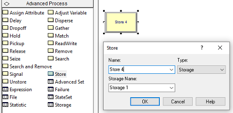
<p class="caption">(\#fig:fig4StoreModule)The STORE module</p>
</div>

<div class="figure" style="text-align: center">

<p class="caption">(\#fig:fig5UnstoreModule)The UNSTORE module</p>
</div>

The last new modeling construct that we will use within the
implementation of the enhanced STEM Career Fair Mixer model is that of
sets. Sets represent a set of similar elements held in an indexed list.
Sets are an incredibly useful construct for implementing many useful
modeling situations, especially the random selection of elements from
the list. We will demonstrate the use of set by introducing tally sets
(sets that hold tally statistics) and a station set (a set that holds a
list of station). In the case of the station set, we will randomly
select a station from the set and then send an entity to the station.

\FloatBarrier

### Controlling Randomness by Specifying Stream Numbers

Random number generators in computer simulation languages come with a default set of streams that divide a sequence of random numbers into independent sets (or sequences). The streams are only independent if you do not use up all the random numbers within the subsequence. These streams allow the randomness associated with a simulation to be controlled. During the simulation, you can associate a specific stream with specific random processes in the model. This has the advantage of allowing you to check if the random numbers are causing significant differences in the outputs. In addition, this allows the random numbers used across alternative simulations to be better synchronized.

Now a common question using simulation languages such as Arena can be answered. That is, *“If the simulation is using random numbers, why to I get the same results each time I run my program?”* The corollary to this question is, *“If I want to get different random results each time I run my program, how do I do it?”* The answer to the first question is that the underlying random number generator is starting with the same seed each time you run your program. Thus, your program will use the same pseudo random numbers today as it did yesterday and the day before, etc. The answer to the corollary question is that you must tell the random number generator to use a different seed (or alternatively a different stream) if you want different invocations of the program to produce different results. The latter is not necessarily a desirable goal. For example, when developing your simulation programs, it is desirable to have repeatable results so that you can know that your program is working correctly.

Since a random number stream is a sub-sequence of pseudo-random numbers that
start at particular place with a larger sequence of pseudo-random
numbers, it is useful to have a starting point for the sequence. The starting point of a sequence of pseudo-random numbers is
called the seed. A seed allows us to pick a particular stream. Having
multiple streams is useful to assign different streams to different
sources of randomness within a model. This facilitates the control of
the use of pseudo-random numbers when performing experiments. Every
distribution in Arena has an extra *optional* parameter for the stream.
For example, EXPO(mean, stream\#), LOGN(mean, sd, stream\#), DISC( cp1,
v1, cp2, v2, \...., 1.0, vn, stream\#), where stream\# is some integer
representing the stream you want to use for that distribution. Arena
associates an integer number, 1, 2, 3, etc. with the seed associated
with a particular random number stream. For all intents and purposes, we
can assume that each stream produces independent random numbers.

\BeginKnitrBlock{rmdnote}<div class="rmdnote">A random number stream is a sub-sequence of pseudo-random numbers that start at particular place with a larger sequence of pseudo-random numbers. The starting point of a sequence of pseudo-random numbers is called the *seed*. A seed allows us to pick a particular stream. Having multiple streams is useful to assign different streams to different sources of randomness within a model. Streams can be further divided into sub-streams.  This facilitates the control of the use of pseudo-random numbers when performing experiments.</div>\EndKnitrBlock{rmdnote}

To specify the stream in the CREATE module, use the \"Expression\"
option for the type and then specify the distribution, e.g. EXPO(mean,
2). Use the expression option to specify the exact required expression.
To control the stream associated with a DECIDE, use the DISC() function
to assign an attribute, and then use a DECIDE module to check that
attribute. For example:

```
// 40% chance for path 1, 60% chance for path 2, using stream 9
ASSIGN: myFlag = DISC(0.4, 1, 1.0, 2, 9)
DECIDE: If myFlag == 1, 
   go to path 1
Else 
   goto path 2
```
To prepare the STEM Mixer model for better control of the underlying
randomness due to random number generation, the following stream
assignments should be made.

-   Arrival process, stream 1

-   Name tag activity, stream 2

-   Choice to visit conversation area, stream 3

-   Choice between conversation areas, stream 4

-   Conversation time, stream 5

-   Deciding to visit recruiters after visiting conversation area, stream 6

-   Choice between MalMart and JHBunt, stream 7

-   MalMart interaction time, stream 8

-   JHBunt interaction time, stream 9

-   Walking speed, stream 10

Using streams to control the randomness will allow us to better implement a variance reduction technique called common random numbers when we make comparisons between system configurations. This will be discussed in Section \@ref(ch4:StatIssuesTwoSystems).

\BeginKnitrBlock{rmdnote}<div class="rmdnote">If the simulation uses the same underlying pseudo-random numbers, **how come my simulation results are sometimes unexpectedly different?**. 
Sometimes by changing the order of modules you change the sequence of random numbers that are assigned to various things that happen in the model (e.g. entity attribute, service times, paths taken, etc.).  Now, the result can sometimes be radically different if different random numbers are used for different purposes. By using streams dedicated to different random processes, you reduce this possibility and increase the likelihood that two models that have different configurations will have differences due to the change and not due to the random numbers used.</div>\EndKnitrBlock{rmdnote}

Further details about how to generate random numbers and random variates are provided in Appendix \@ref(app:rnrv). The next section presents the pseudo-code for the revised STEM Mixer example.

### Pseudo-code for the Revised STEM Mixer Example

Now we are ready to update the pseudo-code from Chapter \@ref(ch3) to address the
previously discussed enhancements. The first thing to do is to define in
the pseudo-code the modeling constructs that we will utilize. For this
situation, we will define six new variables. The variable vClosed will
be used to indicate that the mixer is closed. Then, we will have two new
variables to keep track of how many students are visiting the MalWart
and JHBunt recruiters, vNumAtMalWart and vNumAtJHBunt. Finally, we have
three variables relate to the closing of the mixer: vMaxNumArrivals (to
shut off the CREATE module), vWarningTime (to represent the time
interval to the end of the mixer) and vMixerTimeLength (to represent the
total time available for the mixer). These variables are defined in the
following pseudo-code.

```
// Model Definition Pseudo-Code
ATTRIBUTES:
myType // represents the type of the student (1= recruiters first, 2 =
conversation first, 3 = timid).
myArrivalTime // the time that the student arrived to the mixer
myFirstRecruiter // the recruiter visited first
myNumVisits // the number of recruiters visited

VARIABLES:
vNumInSys // represents the number of students attending the mixer at any time t
vClosed = 0// represents that the STEM fair has closed its doors, 1 = closed, 0 = open
vNumAtJHBunt // number of students visiting JHBunt recruiters
vNumAtMalWart // number of students visiting MalWart recruiters
vMaxNumArrivals = 10000// used to control creation of students
vWarningTime = 15 // minutes, used to control when to close the STEM Mixer
vMixerTimeLength = 360 minutes

EXPRESSIONS:
eDoorClosingTime = vMixerTimeLength - vWarningTime
eWalkingSpeedRV = TRIA(88, 176, 264, 10)
eEntranceToNameTagsTimeRV = 20.0/eWalkingSpeedRV
eNameTagsToConverseAreaTimeRV = 30.0/eWalkingSpeedRV
eNameTagsToRecruitingAreaTimeRV = 80.0/eWalkingSpeedRV
eNameTagsToExitTimeRV = 140.0/eWalkingSpeedRV
eConverseAreaToRecruitingAreaTimeRV = 50.0/eWalkingSpeedRV
eConverseAreaToExitTimeRV = 110.0/eWalkingSpeedRV
eRecruitingAreaToExitTimeRV = 60.0/eWalkingSpeedRV

RESOURCES:
rMalWartRecruiters, 2 // the MalWart recruiters with capacity 2
rJHBuntRecruiters, 3 // the JHBunt recruiters with capacity 3

STORAGES:
stoConversationArea //use to show students in the conversation area

STATIONS:
staEntrance // the entrance to the mixer
staNameTag // the location to get name tags
staConverseArea // the area for holding conversations
staRecruitingArea // the area for visiting recruiters
staJHBunt // the JHBunt recruiting location
staMalWart // the MalMart recruiting location
staExit // the location to exit the mixer

SETS:
RecruiterStationSet (staJHBunt, staMarWart) // hold stations for picking between stations
SystemTimeSet(Type1SysTime, Type2SysTime, Type3SysTime) // to more easily collect statistics
```

In addition to variables, we have defined nine expressions, eight of
which are related to the walking and time taken for movement between
locations. A STORAGE has been defined to track the number of students in
the conversation area and seven stations have been defined to represent
locations. Finally, two sets are defined. The RecruiterStationSet holds
the stations representing the JHBunt recruiting location and the MalWart
recruiting location. The SystemTimeSet is a tally set that holds the
tally statistical variables for collecting statistics by type of
student. Now, we are ready to represent the model logic.

```
// Creating the Students
CREATE vMaxNumArrivals of students every EXPO(2,1) minutes with the
first arriving at time EXPO(2,1)
STATION staEntrance
BEGIN ASSIGN
   myArrivalTime = TNOW
   vNumInSys = vNumInSys + 1
END ASSIGN
ROUTE to staNameTag, time = eEntranceToNameTagsTimeRV
```

The logic for creating the students for the mixer is very similar to
what was done in Chapter \@ref(ch3). The changes include having a variable,
vMaxNumArrivals, to use to turn off the CREATE module and using a
STATION to represent the entrance to the mixer. At the station, we
assign the arrival time of the student for statistical collection and
increment the number of students attending the mixer. Then, we use a
ROUTE module to send the student to the name tag area using the time
expression for modeling the walking from the entrance to the name tag
area.

```
// Getting a Name Tag
STATION staNameTag
DECIDE IF vClosed == 1
   ROUTE to staExit, time = eNameTagsToExitTimeRV
END DECIDE
DELAY UNIF(15,45, 2) seconds to get name tag
ASSIGN myType = DISC(0.60, 1, 1.0, 2, 3) // 1 = recruiting only, 2 = conversation area
DECIDE If myType == 1 // recruiting station only student
   ROUTE to staRecruitingArea, time = eNameTagsToRecruitingAreaTimeRV
ELSE // myType = 2, conversation first student
   ROUTE to staConverseArea, time = eNameTagsToConverseAreaTimeRV
END DECIDE
```

The logic for getting a name tag has been updated to include sending
students that were headed to the name tag area to the exit if the mixer
closing warning occurred during their walk to the name tag area.  Notice the specification of the stream number in the UNIF() distribution representing the time to get a name tag.  Then, a DISC() distribution is use to determine the type of student and then the student is sent to the
appropriate area via ROUTE modules. The pseudo-code for the conversation area, has the same check for closing during the walk to the location. Then,
we see the use of the STORE and UNSTORE constructs to track how many
students are in the conversation area during the delay for the conversation. Sending the students to the exit or to recruiting is used by assigning their type and then using a DECIDE to send them to the appropriate station.

```
// Visiting the Conversation Area
STATION staConverseArea
DECIDE IF vClosed == 1
   ROUTE to staExit, time = eConverseAreaToExitTimeRV
END DECIDE
STORE stoConversationArea
DELAY TRIA(10, 15, 30, 5) minutes for conversation
UNSTORE stoConversationArea
ASSIGN myType = DISC(0.9, 2, 1.0, 3, 6)
DECIDE If myType == 2 // recruiting station student
   ROUTE to staRecruitingArea, time = eConverseAreaToRecruitingAreaTimeRV
ELSE // myType = 3, timid student
   ROUTE to staExit, time = eConverseAreaToExitTimeRV
END DECIDE
```

After arriving to the recruiting area, we check if the mixer has closed
and if so, send the student to the exit. Then, the logic checks the
variables used to keep track of the number of students visiting JHBunt
and MalWart are checked to determined which recruiter to visit. Notice
the use of the DISC() distribution function in the case of ties. An
attribute, myFirstRecruiter, is used to hold the choice, and then the
appropriate station is selected from the recruiter station set based on
the attribute. The use of a randomly assigned attribute to index into a
set is a very useful pattern. Besides indexing into a set, this same
idea can be used to randomly pick a value from an array or an
expression.

```
// Visiting the Recruiting Area
STATION: staRecruitingArea
DECIDE IF vClosed == 1
   ROUTE to staExit, time = eRecruitingAreaToExitTimeRV
END DECIDE
DECIDE IF vNumAtJHBunt == vNumAtMalWart
   ASSIGN myFirstRecruiter = DISC(0.5, 1, 1.0, 2,7)
ELSE IF vNumAtJHBunt < vNumAtMalWart
   ASSIGN myFirstRecruiter = 1
ELSE
   ASSIGN myFirstRecruiter = 2
ENDIF
ROUTE with 0 delay, to RecruiterStationSet(myFirstRecruiter)
```

The pseudo-code for attending the MalWart or JHBunt recruiting stations is
essentially the same. First we increment the number of students that are
visiting and then process the students at the station.

```
// Attending MalWart
STATION: staMalWart
ASSIGN vNumAtMalWart = vNumAtMalWart + 1
SEIZE 1 MalWart recruiter
DELAY for EXPO(3,8) minutes for interaction
RELEASE 1 MalWart recruiter
ASSIGN vNumAtMalWart = vNumAtMalWart - 1
ASSIGN myNumVisits = myNumVisits + 1
DECIDE IF (myNumVisits == 1) AND (TNOW - myArrivalTime) > 45
   ASSIGN my45MinuteFlag = 1
   ROUTE to staExit, time = eRecruitingAreaToExitTimeRV
ELSE IF myNumVisits == 2
   ROUTE to staExit, time = eRecruitingAreaToExitTimeRV
ELSE
   ROUTE with 0 delay to staJHBunt
END DECIDE
```

The logic for determining which recruiter is visited next is interesting. Using an
attribute, myNumVisits, allows us to determine if one or both recruiters
have been visited. In the case of only one visit, we can determine
whether or not the student has been at the mixer more than 45 minutes.
If so, an attribute is used as an indicator variable to denote this
event for later statistical processing. If both stations have been
visited, then the student exits the mixer. If only one recruiter has
been visited, then the student is sent to the opposite recruiter.

```
// Attending JHBunt
STATION: staJHBunt
ASSIGN vNumAtJHBunt = vNumAtJHBunt + 1
SEIZE 1 JHBunt recruiter
DELAY for EXPO(6,9) minutes for interaction
RELEASE 1 JHBunt recruiter
ASSIGN vNumAtJHBunt = vNumAtJHBunt - 1
ASSIGN myNumVisits = myNumVisits + 1
DECIDE IF (myNumVisits == 1) AND (TNOW -- myArrivalTime) > 45
   ASSIGN my45MinuteFlag = 1
   ROUTE to staExit, time = eRecruitingAreaToExitTimeRV
ELSE IF myNumVisits == 2
   ROUTE to staExit, time = eRecruitingAreaToExitTimeRV
ELSE
   ROUTE with 0 delay to staMalWart
END DECIDE
```

The exit area is primarily used to collect statistics on departing
students. There are three updates to note. First, we can collect
statistics on the probability that the students that do not visit the
conversation have a system time that is less than or equal to 30
minutes. We use an expression (mySysTime \<= 30) to collect on a logical
indicator of this event. Secondly, we used a tally set to record the
system times by student type (myType). Lastly, we director record on the
indicator attribute, my45MinuteFlag, to collect the probability that the
student exited after visiting only one recruiter because they had
already been at the mixer for more than 45 minutes.

```
// Exiting and Collecting Statistics
STATION: staExit
ASSIGN: vNumInSys = vNumInSys - 1
ASSIGN: mySysTime = TNOW -- myArrivalTime
DECIDE IF myType == 1 // no conversation students
   RECORD (mySysTime <= 30)
END DECIDE
RECORD mySysTime, as System Time regardless of type
RECORD mySystTime, using SystemTimeSet by myType
RECORD my45MinuteFlag
DISPOSE
```

Now we have to model the closing of the STEM Mixer. As previously
mentioned, we can do this by creating a logical entity that is used to
turn off the CREATE module governing the creation of the students. We
create one entity at the door closing time and close the door by
changing the global variable, vClosed. In addition, we collect
observation based statistics via RECORD statement that records the
values of the variables *at this particular instance in time*. These are
observation based statistics, *not* time persistent, because we are
observing the random value at a particular instance of time (not over
time).

```
// Model Pseudo-Code Listing for Closing the Mixer
CREATE 1 entity, at time eDoorClosingTime
ASSIGN vMaxNumArrivals = 0
ASSIGN vClosed = 1
RECORD Expressions // observe variables at door closing time
   NSTO(stoConversationArea)
   vNumAtMalWart
   vNumAtJHBunt
   vNumInSys
END RECORD
DISPOSE
```
Now that all the pseudo-code is specified, implementing the model in Arena is very straight-forward.  We implement these ideas in the next section.

### Implementing the Revised STEM Mixer Model in Arena

To implement this model within Arena, we can follow the pseudo-code
starting with the model definitions. Figure \@ref(fig:ch4JFEAttributeModule) and \@ref(fig:ch4JFEAVariableModule) show the revised
attributes and variables for the Arena model.  It is best practice to define your modeling constructs first before using them in the Arena flow chart area.  This allows you to select the construct from drop-down boxes or from within the expression builder rather than directly typing in the construct.  This reduces the number of typos and other syntax errors.

<div class="figure" style="text-align: center">

<p class="caption">(\#fig:ch4JFEAttributeModule)Defining the attributes for the revised STEM Mixer example</p>
</div>

<div class="figure" style="text-align: center">

<p class="caption">(\#fig:ch4JFEAVariableModule)Defining the variables for the revised STEM Mixer example</p>
</div>

Notice how the comments section of the spreadsheet view of the ATTRIBUTE
and VARIABLE modules provides an easy way to specify to the modeler the
purpose and use of the attribute or variable. In Figure \@ref(fig:ch4JFEExpressionModule), we see the
definitions of the expressions used throughout the model. The EXPRESSION
module also allows for a comment to indicate information about the
expression. In the figure, we see the eEntranceToNameTagsTimeRV
expression that implements the distance (20 feet) divided by the walking
speed expression. All of the routing time distributions were defined in
terms of eWalkingSpeedRV. Thus, if the distribution changes, it need
only be edit in a single expression. Figure \@ref(fig:ch4JFEStationData) presents the station data
and Figure \@ref(fig:ch4JFEStationSet) shows the definition of a set to hold the two recruiting
stations. The set definition module available on the Advanced Process panel was used to define the recruiting station set.

<div class="figure" style="text-align: center">

<p class="caption">(\#fig:ch4JFEExpressionModule)Defining the expressions for the revised STEM Mixer example</p>
</div>

<div class="figure" style="text-align: center">

<p class="caption">(\#fig:ch4JFEStationData)Defining the stations for the revised STEM Mixer example</p>
</div>

<div class="figure" style="text-align: center">

<p class="caption">(\#fig:ch4JFEStationSet)Defining the station set for the revised STEM Mixer example</p>
</div>

To implement the flow chart modules, we can start with the creation of
the students and the logical entity to shut off the creation of students
at the appropriate time.

<div class="figure" style="text-align: center">

<p class="caption">(\#fig:ch4JFECreate)Creating the students and closing the doors</p>
</div>

<div class="figure" style="text-align: center">

<p class="caption">(\#fig:ch4JFECreateModules)Data for CREATE modules</p>
</div>

Figure \@ref(fig:ch4JFECreate) shows the flow chart modules for creating the students and the
door closing entity, which map almost directly to the pseudo-code
listings. Figure \@ref(fig:ch4JFECreateModules) shows the data view of the CREATE modules. Notice
the use of the stream number in specifying the mean time between
arrivals of the students and the use of the variable, vMaxArrivals, in
the "Max Arrivals" field. The expression, eDoorClosingTime, is used to
specify the time of the first creation for the door closing entity.  Why use an expression for this time?  As noted in Figure \@ref(fig:ch4JFEExpressionModule), the eDoorClosingTime expression is computed from the two variables, vWarningTime and vMixerTimeLength.  Defining these as parameters to the model facilitates their use when performing experiments.  This is also good model building practice.  To the extent possible define parameters as variables or expressions.  Do not embedded magic numbers (undocumented constants) within the text fields of the dialog boxes.
After being created, the students go to the name tag are as illustrated
in Figure \@ref(fig:ch4JFENameTagModules). As noted in the pseudo-code, first we check if the mixer
closed during the time that it took for the entity to get to the name
tag area. If the mixer has not closed, the student decides whether or
not to directly visit the recruiting area or the conversation area.

<div class="figure" style="text-align: center">

<p class="caption">(\#fig:ch4JFENameTagModules)Name tag station and modules</p>
</div>

<div class="figure" style="text-align: center">

<p class="caption">(\#fig:ch4JFEConversationModules)Conversation area station and modules</p>
</div>

Those students that first go to the conversation area proceed to the
logic illustrated in Figure \@ref(fig:ch4JFEConversationModules). The other students go directly to the
logic shown in Figure \@ref(fig:ch4JFERecruitingAreaModules). Notice the use of the STORE and UNSTORE
modules in Figure \@ref(fig:ch4JFERecruitingAreaModules).

<div class="figure" style="text-align: center">

<p class="caption">(\#fig:ch4JFERecruitingAreaModules)Recruiting area station and modules</p>
</div>

Figure \@ref(fig:ch4JFERecruitingAreaModules) shows the use of the DECIDE module to implement the logic
associated with determining which recruiter is visited first. If there
is a tie between the two recruiters, one of stations associated with the
recruiters is randomly selected; otherwise, the station with the lower
number of students is selected. Figure \@ref(fig:ch4JFERouteModules) shows the data view for all
of the ROUTE modules in the model. Notice that the already discussed
expressions are used in each of the ROUTE modules. In addition, the
ROUTE module defined on line 11 implements the random selection of the
station to visit by using the MEMBER() function. The Arena MEMBER(set
name, set index) function will return the member of the set indicated by
the index of the set member. In this case, the RecruiterStationSet is
indexed into by the attribute myFirstRecruiter, which was assigned
previously in one of the ASSIGN modules of Figure \@ref(fig:ch4JFERecruitingAreaModules).

<div class="figure" style="text-align: center">

<p class="caption">(\#fig:ch4JFERouteModules)Data view for ROUTE modules</p>
</div>

<div class="figure" style="text-align: center">

<p class="caption">(\#fig:ch4JFERecruitingStations)JHBunt and MalWart recruiting station modules</p>
</div>

After selecting the recruiter to visit first, the students will go to
either of the two stations shown in Figure \@ref(fig:ch4JFERecruitingStations). The logic associated
with both stations is essentially the same. First the number of students
at the recruiter is incremented, the student enters the recruiting
process, and then the number of students at the recruiter is
decremented. The entries for the two PROCESS modules show in Figure \@ref(fig:ch4JFERecruitingStations)
are shown in Figure \@ref(fig:ch4JFEProcessModules). Finally, an N-way by condition is used to
implement the DECIDE logic for exiting or visiting the other recruiter.
Notice that the distributions associated with the delay have been
updated to utilize the required stream numbers.

<div class="figure" style="text-align: center">

<p class="caption">(\#fig:ch4JFEProcessModules)STEM Mixer PROCESS modules</p>
</div>

<div class="figure" style="text-align: center">

<p class="caption">(\#fig:ch4JFEExitModules)STEM Mixer exit station modules</p>
</div>

After visiting the recruiter area, the students will depart. Figure \@ref(fig:ch4JFEExitModules)
shows the layout of the modules to collect statistics on departing
students. This logic has been simplified, as compared to, what was
presented in Chapter \@ref(ch3) because of the use of tally sets. Figure x15
shows that a record can be defined that can collect statistics on the
system time by type of student. This option is implemented by checking
the "Record in Set" option for the RECORD module, designating the set
containing the created tally variables, and defining the attribute that
can be used to select the correct member from the set via the "Set
Index" field.

<div class="figure" style="text-align: center">

<p class="caption">(\#fig:ch4JFERecordTallySet)Recording the system times with a tally set</p>
</div>

Running the model for 30 replications, we achieve the results shown in
Figure \@ref(fig:ch4JFEClosingStatistics) and Figure \@ref(fig:ch4JFESystemTimes).

<div class="figure" style="text-align: center">

<p class="caption">(\#fig:ch4JFEClosingStatistics)Results for closing statistics</p>
</div>

<div class="figure" style="text-align: center">

<p class="caption">(\#fig:ch4JFESystemTimes)Results for system times by student type</p>
</div>

Figure \@ref(fig:ch4JFESystemTimes) shows the system times for the different types of students. A
type 1 student goes directly to the recruiting area. A type 2 student
first visits the conversation area before visiting the recruiting area.
A type 3 student first visits the conversation area and then decides to
directly depart the mixer. Figure \@ref(fig:ch4JFEClosingStatistics) shows that there are on average about 15.7 students in the system when the closing starts.  The probability that type 1 students spend less than 30 minutes attending the fair is about 77 percent on average.

In this section, we learned about the Arena elements: EXPRESSION, ROUTE, STATION, STORAGE, STORE, and UNSTORE. In particular, we saw how we can define expressions and use them throughout the model and represent the simple transfer of entities between locations with a time delay.  In the next section, we build on some prior concepts, especially attributes, variables, and expressions to see how these concepts can be put to use within Arena.  So far, our examples have shown situations where entities flow essentially forward through the model, perhaps taking different paths. In the next section, we illustrate how entities can be used to loop through Arena modules to implement coding logic. In addition, we see how arrays can facilitate model building and additional methods for organizing the modules within the flow chart area.

\FloatBarrier

## Example: Iterative Looping, Expressions, and Sub-models {#ch4:IterativeLooping}

In this example, we will work with attributes, variables, and expressions. The model will also introduce modules that facilitate iterative looping (while loops) that you would see in general purpose programming languages. In addition, we will see how Arena facilitates the use of arrays to hold variable values and expressions. The main purpose of this model is to illustrate how to use these programming constructs within an Arena model.

The model introduced in this section will use the following modules:

-   CREATE Two instances of this module will be used to have two
    different arrival processes into the model.

-   ASSIGN This module will be used to assign values to variables and
    attributes.

-   WHILE & ENDWHILE These modules will be used to loop the entities
    until a condition is true.

-   DECIDE This module will also be used to loop entities until a
    condition is true

-   PROCESS This module will be used to simulate simple time delays in
    the model.

-   DISPOSE This module will be use to dispose of the entities that were
    created.

-   VARIABLES This data module will be used to define variables and
    arrays for the model.

-   EXPRESSIONS This data module will be used to define named expression
    to be used within the model.

-   Sub-models are areas of the model window that contain modules that
    have been aggregated into one module.

This example is based partly on Arena's SMARTS file 183. The final model will
look something like that shown in Figure \@ref(fig:ch4IterativeLooping).

<div class="figure" style="text-align: center">
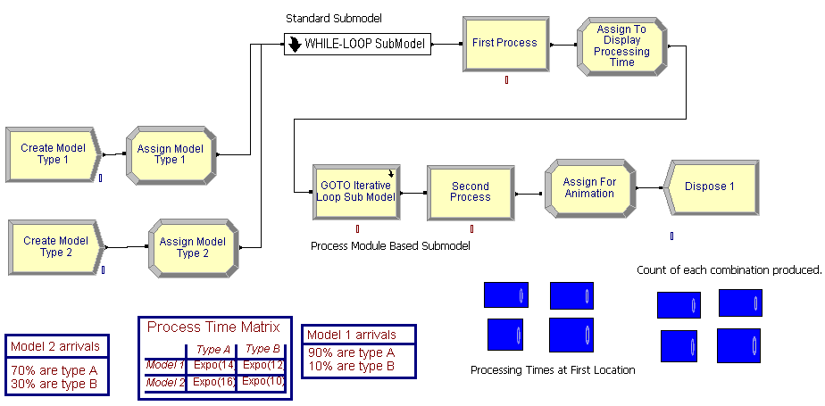
<p class="caption">(\#fig:ch4IterativeLooping)Completed model for iterative looping example</p>
</div>

This system produces products. The products have different model
configurations (model 1 and 2) that are being produced within a small
manufacturing system. Model 1 arrives according to a Poisson process
with a mean rate of 1 model every 12 minutes. The second model type also
arrives according to a Poisson arrival process but with a mean arrival
rate of 1 arrival every 22 minutes. Furthermore, within a model
configuration, there are two types of products produced, type A and type B.

Table \@ref(tab:IterLoopData) shows the data for this example. In the table, 90% of model
configuration 1 is of type A. In addition, the base process time for
type A's for model configuration 1 is exponentially distributed with a
mean of 14 minutes. Clearly, the base process time for the products
depends on the model configuration and the type of product A or B. The
actual processing time is the *sum of 10 random draws* from the base
distribution. Processing occurs at two identical sequential locations.
After the processing is complete, the product leaves the system.

::: {#tab:IterLoopData}
  Model        Mean Rate        Type A(%, process time)   Type B(%, process time)
  ------- -------------------- ------------------------- -------------------------
  1        1 every 12 minutes    90%, expo(14) minutes     10%, expo(12) minutes
  2        1 every 22 minutes    70%, expo(16) minutes     30%, expo(10) minutes

  Table:(\#tab:IterLoopData) Data for the iterative looping example
:::

When building this model, we will display the final processing time for
each product at each of the two locations and display a count of the
number of each configuration and type that was produced.

#### Building the Model {#ch4s6sb3sub1}

Following the basic modeling recipe, consider the question: *What are
the entities?* By definition, entities are things that flow through the
system. They are transient. They are created and disposed. For this
situations, the products are produced by the system. The products flow
through the system. These are definite candidates for entities. In this
problem, there are actually four types of entities: Two main types Model
1 and Model 2, which are further classified into product type A or
product type B. Now, consider how to represent the entity types. This can be done in two ways 1) by using the ENTITY module to define an entity type or 2) by using user defined
attributes. Either method can be used in this situation, but by using
user defined attributes, we can more easily facilitate some of the
answers to some of the other modeling recipe questions.

Now, it is time to address the question: *What are the attributes of the
entities?* This question is partly answered already by the decision to
use user defined attributes to distinguish between the types of
entities. Let's define two attributes, *myModel* and *myType* to
represent the classification by model and by product type for the
entities. For example, if *myModel* = 1 then the entity is of type model
configuration 1. To continue addressing the required attributes, you
need to consider the answers to:

-   What data do the entities need as they move through the model? Can
    they carry the data with them as they move or can the information be
    shared across entities?

-   What data belongs to the system as a whole?

The answer to the first question is that the parts need their processing
times. The answer to the second question can have multiple answers, but
for this model, the distributions associated with the processing times
need to be known and this information doesn't change within the model.
This should be a hint that it can be stored globally. In addition, the
processing time needs to be determined based on different distributions
at each of the two locations.

While you might first think of using variables to represent the
processing time at each location, you will soon realize that there is a
problem with this approach. Assume that a variable holds the processing
time for the entity that is currently processing at location 1. While
that entity is processing, another entity can come along and over write
the variable. This is clearly a problem. The better approach is to
realize that the entities can carry their processing times with them
after the processing times have been computed. This should push you
toward the use of an attribute to hold the processing time. Let's decide
to have an attribute called *myProcessingTime* that can be used to hold
the computed processing time for the entity before it begins processing.
If data is not to be carried by the entities, but it still needs to be
accessed, then this is a hint that it belongs to the system as a whole.
In this case, the processing time distributions need to be accessed by
any potential entity.

How can the entities be created? The problem description gives
information about two Poisson arrival processes. While there are other
ways to proceed, the most straightforward approach is to use a CREATE
module for each arrival process. If this is done, one CREATE module will
create the entities having model configuration 1 and the other CREATE
module will create the entities having model configuration 2. How do you
assign data to the entities? An ASSIGN module can be used for this task,
but more importantly, the model configuration, the product type, and the
processing time all will need to be assigned. In particular, the product
type can be randomly assigned according to a given distribution based on
the model configuration. In addition, the processing time is the sum of
10 draws from the processing time distribution. Thus, a way to compute
the final processing time for the entity before it starts processing
must be determined.

The following pseudo-code for the example is as follows. First, we define the attributes, variables and expressions.  For variables, we see something new.  We have defined a 2-dimensional variable called vMTCount that will be used to count the number of parts of each model and type combination that are produced.  This 2-dimensional variable can be used just like in other programming languages.  Similarly, we define a 2-dimensional *expression*.  Just like was illustrated in the last example, an expression can hold any valid Arena expression; however, in this case, we have defined an arrayed expression from which we can look up the appropriate distribution associated with a particular model and product type combination. This is an extremely useful method to store information.

```
// Model Definition Pseudo-Code
ATTRIBUTES:
myType // represents the type of product, 1 = type A, 2 = type B
myModel // represents the type of model, 1 = Model Type 1, 2 = Model Type 2
myProcessingTime // holds the total processing time based on the model/product type
VARIABLES:
vCounter = 0 // used to count the number of iterations in a loop
vNumIterations = 10 // represents the total number of iterations in a loop
vMTCount: 2-D Array, rows = 2 (model type), columns = 2 (product type)
  vMTCount(1,1) = 0, vMCount(1,2) = 0
  vMTCount(2,1) = 0, vMCount(2,2) = 0
vPTLocation1: 2-D Array, rows = 2 (model type), columns = 2 (product type)
  vPTLocation1(1,1) = 0, vPTLocation1(1,2) = 0
  vPTLocation1(2,1) = 0, vPTLocation1(2,2) = 0
vPTLocation2: 2-D Array, rows = 2 (model type), columns = 2 (product type)
  vPTLocation2(1,1) = 0, vPTLocation2(1,2) = 0
  vPTLocation2(2,1) = 0, vPTLocation2(2,2) = 0

EXPRESSIONS:
// represents the processing time distribution for model and product type combinations
ePTIme: 2-D Array, rows = 2 (model type), columns = 2 (product type)
  ePTime(1,1) = EXPO(14), ePTime(1,2) = EXPO(12)
  ePTime(2,1) = EXPO(16), ePTime(2,2) = EXPO(10)
```

After defining the constructs to use, we can then outline the processes within pseudo-code.  We start with the creation of the two types of model configurations and the assignment of the product types.  After creation the entities will have their model and type assigned.
Then, they will proceed for processing. Prior to processing at the first
station, the processing time is determined. In the pseudo-code, a
WHILE-ENDWHILE construct is used to sum up the processing time. After
the processing time has been determined, the entity delays for the
processing time. After the processing is done at the first station, the
processing time for the second station is computed. Here the processing time
is determined in an iterative fashion by using a go to construct coupled
with an if statement. After the processing time has been determined, the
entity again delays for the processing before being disposed.

```
CREATE 10 entities with TBA EXPO(12) 
ASSIGN model 1 attributes 
  myModel = 1
  myType = DISC(.9,1,1,2)
END ASSIGN
GOTO label A 

CREATE 10 entities with TBA EXPO(22)
ASSIGN model 2 attributes 
   myModel = 2 
   myType = DISC(.7,1,1,2)
END ASSIGN
GOTO label A

Label A: determine the processing time for first station 
BEGIN ASSIGN //initialize the loop
  vCounter = 1 
  vNumIterations = 10
  myProcessingTime = 0
END ASSIGN
WHILE (vCounter <= vNumIterations)
  BEGIN ASSIGN
    // sum up the processing time by model and product type
    myProcessingTime = myProcessingTime + ePTime(myModel, myType)
    vCounter=vCounter + 1 //increment the counter
  END ASSIGN
ENDWHILE
DELAY for myProcessingTime
BEGIN ASSIGN //initialize the loop for second station
  vCounter = 0 
  vNumIterations = 10
  myProcessingTime = 0
END ASSIGN
Label B:
BEGIN ASSIGN
  // sum up the processing time by model and product type
  myProcessingTime = myProcessingTime + ePTime(myModel, myType)
  vCounter=vCounter + 1 //increment the counter
END ASSIGN
DECIDE IF (vCounter <= vNumIterations)
  GOTO Label B
END DECIDE
DELAY for myProcessingTime
DISPOSE
```

The model will follow the outline presented within the pseudo-code. To
support the modeling within the environment, you must first define a
number of variables and other data.

#### VARIABLE Module {#ch4s6sb3sub2}

Begin by defining the variables to be used in the model. Open the
environment and define following variables using the VARIABLE module as shown in Figure \@ref(fig:ch4IterativeLoopingVariables).

-   `vCounter` used to count the number of times the entity goes through
    the WHILE-ENDWHILE loop, a scalar variable. This WHILE-ENDWHILE loop
    will be used to compute the processing time at each location.

-   `vNumIterations` used to indicate the total number of times to go
    through the WHILE-ENDWHILE loop, a scalar variable. This should be
    initialized to the value 10.

-   `vMTCount` used to assist with counting and displaying the number of
    entities of each model/type combination, a 2-dimensional variable (2
    rows, 2 columns)

-   `vPTLocation1` used to assist with displaying the processing time of
    each model/type combination, a 2-dimensional variable (2 rows, 2
    columns)

-   `vPTLocation2` used to assist with displaying the processing time of
    each model/type combination, a 2-dimensional variable (2 rows, 2
    columns)

<div class="figure" style="text-align: center">
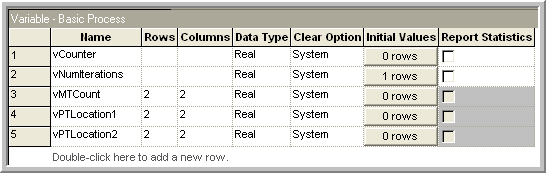
<p class="caption">(\#fig:ch4IterativeLoopingVariables)Variable definitions for iterative looping example</p>
</div>

The example specifies that there is a different distribution for each
model/product type combination. Thus, we need to be able to store these
distributions. A distribution is considered a mathematical
expression. A list of distributions is found in Table \@ref(tab:ArenaDistributions) in
Appendix \@ref(app:ArenaOFD). In the table, the function name is given
along with the parameters required by the function. The `Stream` parameter
indicates an optional parameter which helps in controlling the
randomness of the distribution. In addition to using distributions in
expressions, you can use logical constructs and mathematical operators
to build expressions. Table \@ref(tab:MathLogicOperators) of
Appendix \@ref(app:ArenaOFD) provides a list of mathematical functions
available. To represent the model/product type
distributions, the EXPRESSION data module can be used.

#### EXPRESSION Module {#ch4s6sb3sub3}

While you can build expressions using the previously mentioned functions
and operators, a mechanism is needed to 'hold the expressions in memory,
and in particular, for this problem, the appropriate distribution must
be looked up based on the model type and the product type. The
EXPRESSION module found on the Advanced Process template allows just
this functionality. Expressions as defined in an EXPRESSION module are
names or labels assigned to expressions. An expression defined in an
EXPRESSION module is substituted wherever the named expression
appears in the model. The EXPRESSION module also allows for the modeler
to define an array of expressions.

Go to the Advanced Process panel and define the expressions used in the
model by clicking on the EXPRESSION module in the project bar, defining
the name of the expression, `ePTime`, to have two rows and two columns,
where the row designates the model type and the column designates the
product type. Use the spreadsheet view to enter the exponential
distribution with the appropriate mean values as indicated in Figure \@ref(fig:ch4IterativeLoopingExpressions).

<div class="figure" style="text-align: center">
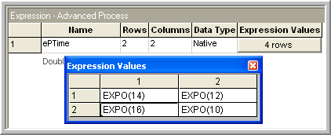
<p class="caption">(\#fig:ch4IterativeLoopingExpressions)Expression definitions for iterative looping example</p>
</div>

This creates an arrayed expression. This is similar to an arrayed
variable, except that the value stored in the array element can be any
valid expression. Now that you have the basic data predefined for the
model you can continue with the model building by starting with the
CREATE modules. Since the model is large, you will begin by laying down
the first part of the model. You should place the two CREATE modules and
the two ASSIGN modules into the model window as shown in Figure \@ref(fig:ch4IterativeLooping). Fill in the create modules as
indicated in Figure \@ref(fig:ch4IterativeLoopingCreateModules). For this example, there will only be 10 products of each model configuration created.

<div class="figure" style="text-align: center">
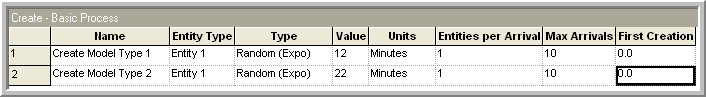
<p class="caption">(\#fig:ch4IterativeLoopingCreateModules)Creating the products for iterative looping example</p>
</div>

The ASSIGN modules can be used to define the attributes and to assign
their values. In the ASSIGN modules, the values of the `myModel` and
`myType` attributes are assigned. There are two different models 1 and
2. Also, each model is assigned a type, dependent upon a specific
probability distribution for that model. The `DISC()` function can be used
to represent the model type. Open up the first ASSIGN module for model
type 1 and make it look like the ASSIGN module show in
Figure \@ref(fig:ch4IterativeLoopingAssign1).

<div class="figure" style="text-align: center">

<p class="caption">(\#fig:ch4IterativeLoopingAssign1)ASSIGN module dialog box for model type 1</p>
</div>

For variety, you can use the spreadsheet view to fill out the second
ASSIGN module. Click on the ASSIGN module in the model window. The
corresponding ASSIGN module will be selected in the data sheet view.
Click on the assignment rows to get the assignments window and fill it
in as indicated in Figure \@ref(fig:ch4IterativeLoopingAssign2).

<div class="figure" style="text-align: center">
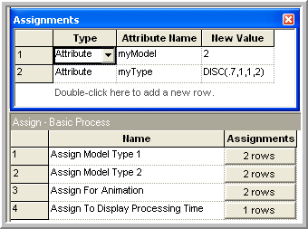
<p class="caption">(\#fig:ch4IterativeLoopingAssign2)Second ASSIGN module in data sheet view</p>
</div>

\FloatBarrier

#### Hierarchical Sub-models {#ch4s6sb3sub4}

In this section, the middle portion of the model as indicated in
Figure \@ref(fig:ch4IterativeLoopingFirstLocation), which includes a sub-model will be
built. A sub-model in is a named collection of modules that is used to
organize the main model. Go to the Object menu and choose Sub-model $>$
Add Sub-model. Place the cross-haired cursor that appears in the model
window at the desired location and connect your ASSIGN modules to it as
indicated in the figure. By right-clicking on the sub-model and
selecting the properties menu item, you can give the sub-model a name.
This sub-model will demonstrate the use of a WHILE-ENDWHILE loop.
The WHILE-ENDWHILE construct will be used as an iterative looping
technique to compute the total processing time according to the number
of iterations (10) for the given model/type combination.

<div class="figure" style="text-align: center">

<p class="caption">(\#fig:ch4IterativeLoopingFirstLocation)First location processing</p>
</div>

#### WHILE-ENDWHILE Blocks {#ch4s6sb3sub5}

Open up the sub-model by double clicking on it and add the modules
(ASSIGN, WHILE, ASSIGN, and ENDWHILE) to the sub-model as indicated in
Figure \@ref(fig:ch4IterativeLoopingSubModel1). You will find the WHILE and ENDWHILE
blocks on the BLOCKS panel. If you haven't already done so you should
attach the BLOCKS panel by going to the Basic Process panel and right
clicking, choose Attach, and then select the file called *Blocks.tpo*. A
new panel of blocks will appear for use.

<div class="figure" style="text-align: center">

<p class="caption">(\#fig:ch4IterativeLoopingSubModel1)First location processing sub-model</p>
</div>

Now we implement the pseudo-code logic within the sub-model. We will initialize the counter in the first Assign block:

1.  The counter can be an attribute or a variable

2.  If the counter is an attribute, then every entity has this attribute
    and the value will persist with the entity as it moves through the
    model. It may be preferable to have the counter as an attribute for
    the reason given in item (3) below.

3.  If the counter is a (global) variable, then it is accessible from
    anywhere in the model. If the WHILE-ENDWHILE loop contains a block
    that can cause the entity to stop moving (e.g. DELAY, HOLD, etc.
    then it may be possible for another entity to change the value of
    the counter when the entity in the loop is in the delayed state. This may cause
    unintended side effects, e.g. resetting the counter would cause an
    infinite loop. Since there are no time delays within this
    WHILE-ENDWHILE loop example, there is no danger of this. Remember,
    there can only be one entity moving (being processed by the
    simulation engine) at anytime while the simulation is running.

Open up the first ASSIGN module and make it look like that shown in
Figure \@ref(fig:ch4IterativeLoopingSubModel1Assign). Notice how the variables are
initialized prior to the WHILE. In addition, the `myProcessingTime`
attribute has been defined and initialized to zero.

<div class="figure" style="text-align: center">

<p class="caption">(\#fig:ch4IterativeLoopingSubModel1Assign)Initializing the looping counter</p>
</div>

Now the counter must be checked in the condition expression of the WHILE
block. The WHILE and ENDWHILE blocks can be found on the Blocks Panel.
Open up the WHILE block and make it look like that shown in
Figure \@ref(fig:ch4IterativeLoopingWHILE). When the variable `vCounter` is
greater than `vNumIterations`, the WHILE condition will evaluate to
false and the entity will exit the WHILE-ENDWHILE loop.

<div class="figure" style="text-align: center">

<p class="caption">(\#fig:ch4IterativeLoopingWHILE)WHILE block within first sub-model</p>
</div>

Make sure to update the value of the counter variable or the evaluation
expression within the body of the WHILE and ENDWHILE loop; otherwise you
may end up with an infinite loop. Open up the second ASSIGN module and
make the assignments as shown in
Figure \@ref(fig:ch4IterativeLoopingSubModel1Assign2). In the first assignment, the
attributes `myModel` and `myType` are used to index into the `ePTime`
array of expressions. Each time the entity hits this assignment
statement, the value of the `myProcessingTime` attribute is updated
based on the previous value, resulting in a summation. The variable
`vCounter` is incremented each time to ensure that the WHILE loop will
eventually end.

<div class="figure" style="text-align: center">

<p class="caption">(\#fig:ch4IterativeLoopingSubModel1Assign2)Second ASSIGN module with first sub-model</p>
</div>

There is nothing to fill in for the ENDWHILE block. Just make sure that
it is connected to the last ASSIGN module and to the exit point
associated with the sub-model. Right clicking within the sub-model will
give you a context menu for closing the sub-model. After the entity has
exited the sub-model, the appropriate amount of processing time has been
computed within the attribute, `myProcessingTime.` You now need to
implement the delay associated with processing the entity for the
computed processing time.

#### PROCESS Module Delay Option {#ch4s6sb3sub6}

Within only the active entity is moving through the modules at any time.
The active entity is the entity that the simulation executive has
determined is associated with the current event. At the current event
time, the active entity executes the modules along its flow path until
it is delayed or cannot proceed due to a condition in the model. When
the active entity is time delayed, an event is placed on the event
calendar that represents the time that the delay will end. In other
words, a future event is scheduled to occur at the end of the delay. The
active entity is placed in the future events list and yields control to
the next entity that is scheduled to move within the model. The
simulation executive then picks the next event and the associated entity
and tells that entity to continue executing modules. Thus, only one
entity is executing model statements at the current time and that module
execution only occurs at event times. moves from event time to event
time, executing the associated modules. This concept is illustrated in
Figure  \@ref(fig:ch4IterativeLoopingDelay) where a simple delay is scheduled to
occur in the future. It is important to remember that while the entity
associated with the delay is waiting for its delay to end, other events
may occur causing other entities to move.

<div class="figure" style="text-align: center">
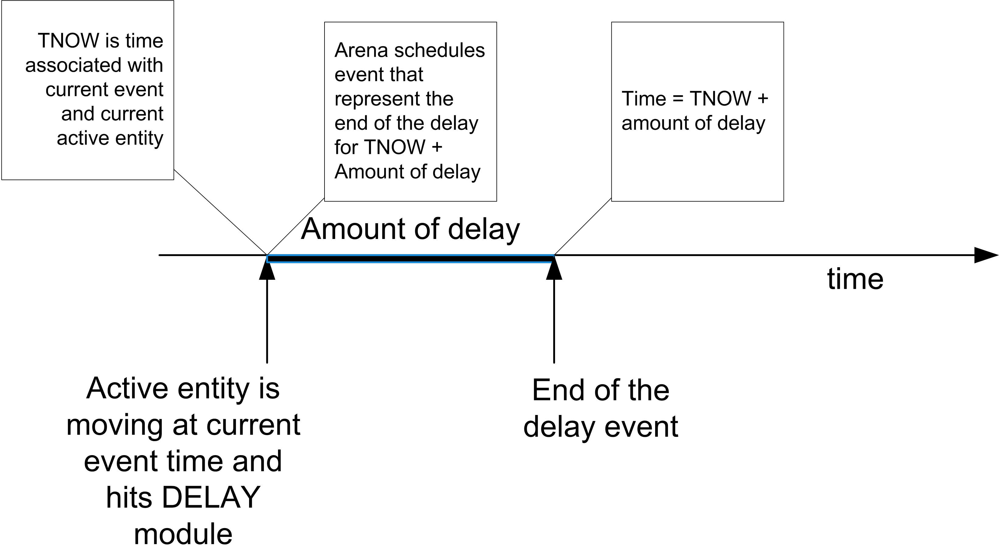
<p class="caption">(\#fig:ch4IterativeLoopingDelay)Scheduling a selay</p>
</div>

There are two basic ways to cause a delay for an entity, the PROCESS
module and the DELAY module. We have already used the delay option of the PROCESS module. The DELAY module is found on the Advanced Process
template panel. This example illustrates the use of the DELAY module.
The next step in building the model is to place the DELAY module after
the sub-model as shown in Figure \@ref(fig:ch4IterativeLoopingFirstLocation).  In this case, you want to delay by the amount of time computed for the processing time. This value
is stored in the `myProcessingTime` attribute. Within the expression text field fill in
`myProcessingTime` as shown in Figure \@ref(fig:ch4IterativeLoopingDelayModule). Be careful to appropriately set the time units (minutes) associated with the delay. A common mistake is to
not set the units and have too long or too short a delay. The too long a
delay is often caught during debugging because the entities take such a
long time to leave the module.

<div class="figure" style="text-align: center">

<p class="caption">(\#fig:ch4IterativeLoopingDelayModule)The DELAY module</p>
</div>

Now you will add an ASSIGN module to facilitate the displaying of the
values of variables in the model window during the simulation. This will
also illustrate how arrays can be used within a model. Using the
data sheet view, make the ASSIGN module look like that show in
Figure \@ref(fig:ch4IterativeLoopingAssignArrays).

<div class="figure" style="text-align: center">
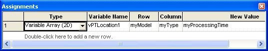
<p class="caption">(\#fig:ch4IterativeLoopingAssignArrays)ASSIGN module with arrays</p>
</div>

The values of *attributes* cannot be displayed using the variable
animation constructs. So, in this ASSIGN module, an array
variable is used to temporarily assign the value of the attribute to the
proper location of the array variable so that it can be displayed. Go to
the toolbar area in and right click. Make sure that the Animate toolbar
is available. From the Animate toolbar, choose the button that has a 0.0
indicated on it. You will get a dialog for entering the variable to
display. Fill out the dialog box so that it looks like
Figure \@ref(fig:ch4IterativeLoopingAnimateVariables). After filling out the dialog and
choosing OK, you will need to place the cross-hair somewhere near the
ASSIGN module in the model window. In fact, the element can be placed
anywhere in the model window. Repeat this process for the other elements
of the `vPTLocation1` array.

<div class="figure" style="text-align: center">

<p class="caption">(\#fig:ch4IterativeLoopingAnimateVariables)Animate variable dialog box</p>
</div>

Now, the model can be completed. Lay down the modules indicated in
Figure \@ref(fig:ch4IterativeLooping) to complete the model. In
Figure \@ref(fig:ch4IterativeLooping), the second sub-model uses a PROCESS
based sub-model. It looks like a PROCESS module and is labeled "GOTO
Iterative Loop Sub Model\", see
Figure \@ref(fig:ch4IterativeLoopingProcessSubModel). To create this sub-model, lay down
a PROCESS module and change its type to sub-model. In what follows, you
will examine a different method for looping within the second sub-model.
Other than that, the rest of the model is similar to what has already
been completed. The second sub-model has the modules given in
Figure \@ref(fig:ch4IterativeLoopingSubModel2). Place and connect the ASSIGN,
DECIDE, and ASSIGN modules as indicated in
Figure \@ref(fig:ch4IterativeLoopingSubModel2Assign) and
Figure \@ref(fig:ch4IterativeLoopingSubModel2Decide). In this logic, the entity
initializes a counter for counting the number of times through the loop
and updates the counter. An If/Then DECIDE module is used to redirect
the entity back through the loop the appropriate number of times. This
is GOTO programming!

<div class="figure" style="text-align: center">
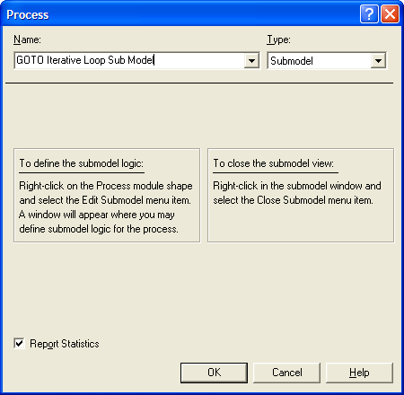
<p class="caption">(\#fig:ch4IterativeLoopingProcessSubModel)PROCESS based sub-model</p>
</div>

<div class="figure" style="text-align: center">
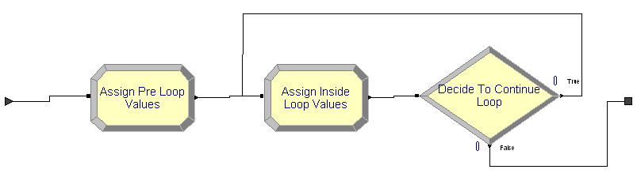
<p class="caption">(\#fig:ch4IterativeLoopingSubModel2)Second sub-model modules</p>
</div>

<div class="figure" style="text-align: center">
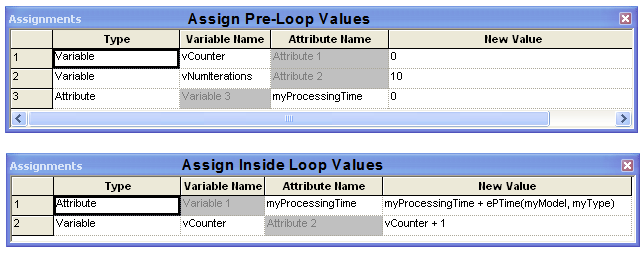
<p class="caption">(\#fig:ch4IterativeLoopingSubModel2Assign)ASSIGN modules in second sub-model</p>
</div>

<div class="figure" style="text-align: center">

<p class="caption">(\#fig:ch4IterativeLoopingSubModel2Decide)ASSIGN modules in second sub-model</p>
</div>

Again, be sure to use logic that will change the tested condition (in
this case `vCounter`) so that you do not get an infinite loop. I prefer
the use of the WHILE-ENDWHILE blocks instead of this "go to" oriented
implementation, but it is ultimately a matter of taste.

In general, you should be careful when implementing logic in which the
entity simply loops around to check a condition. As mentioned, you must
ensure that the condition can change to prevent an infinite loop. A
common error is to have the entity check a condition that can be changed
from somewhere else in the model, e.g. a queue becomes full. Suppose you
have the entity looping around to check if the queue is not full so that
when the queue becomes full the entity can perform other logic. This
seems harmless enough; however, if the looping entity does not change
the status of the queue then it will be in an infinite loop! Why? While
you might have many entities in the model at any given simulated time,
only *one* entity can be active at any time. You might think that one of
the other entities in the model may enter the queue and thus change its
status. If the looping entity does not enter a module that causes it to
"hand off the ball" to another entity then no other entity will be able
to move to change the queue condition. If this occurs, you will have an
infinite loop.

If the looping entity does not explicitly change the checked condition,
then you must ensure that the looping entity passes control to another
entity. How can this be achieved? The looping entity must enter a
blocking module that allows another entity to get to the beginning
of the future events list and become the active entity. A blocking module is a module that causes the forward movement ofan entity to stop in some manner. There are a
variety of modules which will cause this, e.g. HOLD, SEIZE, DELAY, etc.
Another thing to remember, even if the looping entity enters a blocking
module, your other simulation logic must ensure that it is at least
possible to have the condition change. If you have a situation where an
entity needs to react to a particular condition changing in the model,
then you should consider investigating the HOLD and SIGNAL modules,
which were designed specifically for these types of situations.

The second DELAY module is exactly the same as the first DELAY
module. In fact, you can just copy the first DELAY module and paste
the copy into the model at the appropriate location. If you do copy and
paste a module in this fashion, you should make sure to change the name
of the module because module names must be unique. The last
ASSIGN module is just like the previously explained example. Complete
the ASSIGN module as shown in
Figure \@ref(fig:ch4IterativeLoopingLastAssign). Complete the animation of the model in a
similar fashion as you did to show the processing time at the first
location, except in this case show the counts captured by the variable
`vMTCount.`

<div class="figure" style="text-align: center">

<p class="caption">(\#fig:ch4IterativeLoopingLastAssign)Last ASSIGN module for animation purposes</p>
</div>

To run the model, execute the model using the "VCR" run button. It is
useful to use the step command to track the entities as they progress
through model. You will be able to see that the values of the variables
change as the entities go through the modules. The completed model can be found in the files associated with this chapter as file *AttributesVariablesExpressionsLooping.doe*. 

To recap, in this example you learned about attributes and how they are
attached to entities. In addition, you saw how to share global
information through the use of arrays of variables and arrays of
expressions. The concept of scheduling events via the use of the DELAY module was also introduced. Finally, you also refreshed your memory on basic programming constructs such as decision logic and iterative processing.

\FloatBarrier

## Batching and Separating Entities {#ch4:BatchSeparate}

Of the flow chart modules on the Basic Process panel, there are two
remaining modules to discuss: BATCH and SEPARATE. The BATCH module
allows entities to be grouped together into a temporary or permanent
representative entity. A representative entity is an entity that
consists of a group of entities that can travel together and be
processed as if there was only one entity. A temporary representative
entity can be split apart, by a SEPARATE module, so that the individual
entities can again be processed. For a permanent representative entity,
the batched individual entities cannot be separated. You can use a
permanent entity when you no longer need the information associated with
the individual entities within the group. You can think of a temporary
entity as having an open bag that holds the batched members in the
group, and a permanent entity as having a closed bag. Temporary entities
are useful for modeling a manufacturing system when items are assembled
and disassembled during processing. A permanent entity is useful in
modeling a situation where the assembly is complete.

The batching of entities can be performed based on a number of criteria.
For example, the batch might form when at least 10 entities are
available. Thus, an important consideration in batching is how to
determine the size of the batch. In addition, batches might be formed
based on entities that have similar attributes. For example, suppose red
and blue paper folders are being manufactured in batches of 5 of a
specific color for sale by color. The batching of entities is also
useful in synchronizing the movement of entities. As indicated above,
when potential members of a batch enter the BATCH module, they wait
until the batching conditions have occurred before they continue their
movement with the representative entity in the model. Because of this,
the BATCH module has a queue that holds the entities that are waiting to
be batched. In the case of a temporary representative entity, the
SEPARATE module provides the functionality to split apart the
representative entity into the individual entities. The SEPARATE module
also can *duplicate or clone* the incoming entity. This provides an
additional mechanism to introduce new entities into the model, i.e.
another way of creating entities. In the following examples, the BATCH
and SEPARATE modules will be examined to investigate some of the rules
involved in the use of these modules.

***
\BeginKnitrBlock{example}<div class="example"><span class="example" id="exm:exTieDyeTShirts"><strong>(\#exm:exTieDyeTShirts) </strong></span>Suppose production orders for tie-dye T-shirts arrive to a production
facility according to a Poisson process with a mean rate of 1 per hour.
There are two basic psychedelic designs involving either red or blue
dye. For some reason the blue shirts are a little more popular than the
red shirts so that when an order arrives about 70% of the time it is for
the blue dye designs. In addition, there are two different package sizes
for the shirts, 3 and 5 units. There is a 25% chance that the order will
be for a package size of 5 and a 75% chance that the order will be for a
package size of 3. Each of the shirts must be individually hand made to
the customer's order design specifications. The time to produce a shirt
(of either color) is uniformly distributed within the range of 15 to 25
minutes. There are currently two workers who are setup to make either
shirt. When an order arrives to the facility, its type (red or blue) is
determined and the pack size is determined. Then, the appropriate number
of white (un-dyed) shirts are sent to the shirt makers with a note
pinned to the shirt indicating the customer order, its basic design, and
the pack size for the order. Meanwhile, the paperwork for the order is
processed and a customized packaging letter and box is prepared to hold
the order. It takes another worker between 8 to 10 minutes to make the
box and print a custom thank you note. After the packaging is made it
waits prior to final inspection for the shirts associated with the
order. After the shirts are combined with the packaging, they are
inspected by the packaging worker which is distributed according to a
triangular distribution with a minimum of 5 minutes, a most likely value
of 10 minutes, and a maximum value of 15 minutes. Finally, the boxed
customer order is sent to shipping.</div>\EndKnitrBlock{example}

***

### Conceptualizing the Model {#ch4:TieDyeTShirtsSub1}

Before proceeding you might want to jot down your answers to the
modeling recipe questions and then you can compare how you are doing
with respect to what is presented in this section. The modeling recipe
questions are:

-   What is the system? What information is known by the system?

-   What are the required performance measures?

-   What are the entities? What information must be recorded or
    remembered for each entity? How are entities introduced into the
    system?

-   What are the resources that are used by the entities? Which entities
    use which resources and how?

-   What are the process flows? Sketch the process or make an activity
    flow diagram

-   Develop pseudo-code for the situation

-   Implement the model

The entities can be conceptualized as the arriving orders. Since the
shirts are processed individually, they should also be considered
entities. In addition, the type of order (red or blue) and the size of
the order (3 or 5) must be tracked. Since the type of the order and the
size of the order are properties of the order, attributes can be used to
model this information. The resources are the two shirt makers and the
packager. The flow is described in the scenario statement: orders
arrive, shirts made, meanwhile packaging is made. Then, orders are
assembled, inspected, and finally shipped. It should be clear that a
CREATE module, setup to generate Poisson arrivals can create the orders,
but if shirts are entities, how should they be created? To do this, a
SEPARATE module can be used to make the number of shirts required based
on the size of the order. After this, there will be two types of
entities in the model, the orders and the shirts. The shirts can be made
and meanwhile the order can be processed. When the shirts for an order
are made, they need to be combined together and then matched for the
order. This implies that a method is required to uniquely identify the
order. This is another piece of information that both the order and the
shirt require. Thus, an attribute will be used to note the order number.

The activity diagram for this situation is given in
Figure \@ref(fig:ch4TieDyeTShirtsActivityDiagram). After the order is created, the
process separates into the order making process and the shirt making
process. Notice that the orders and shirts must be synchronized together
after each of these processes. In addition, the order making process and
the final packaging process share the packager as a resource.

<div class="figure" style="text-align: center">

<p class="caption">(\#fig:ch4TieDyeTShirtsActivityDiagram)Activity diagram for Tie Dye T-Shirts example</p>
</div>

To prepare to represent this situation in pseudo-code, let's define the structural elements of the model. 

```
Pseudo-Code Definition
ATTRIBUTES:
  myOrderNumber // assigned to provide a unique number to each order
  myOrderType // assigned based on the type of order
  myOrderSize // represents the order size (number of shirts in the order)
  
VARIABLES:
  vOrderNumber // to count the orders and assign a unique number to each order
  
RESOURCES:
  Packager (1)
  ShirtMakers (2)
```

The following pseudo-code represents the activity diagram. In the pseudo-code, a variable is incremented each time an order is created and then the value of the
variable is assigned to the attribute representing the order. In
addition, the order type and the order size are both assigned based on
the probability distribution information that was given in the problem.
The parallel processing is represented by the two pseudo-code segments
labeled A and B.

```
CREATE orders every hour exponentially
BEGIN ASSIGN
   vOrderNumber = vOrderNumber + 1
	 myOrderNumber = vOrderNumber
	 myOrderType = DISC(0.7, 1, 1.0, 2)
	 myOrderSize = DISC(0.75, 3,1.0, 5)
END ASSIGN
SEPARATE into order and shirts based on myOrderSize
	Original: Shirts GOTO Label A order making
  Duplicates: Order GOTO Label B shirt making
END SEPARATE       
    
Label A: Order Making
SEIZE packager
DELAY UNIF(8,10) minutes 
RELEASE packager
GOTO Label C, Final Packaging

Label B: Shirt Making
SEIZE shirt maker
DELAY UNIF(15,20) minutes 
RELEASE shirt maker
BATCH myOrderSize shirts based on myOrderNumber, together
GOTO Label C, Final packaging

Label C: Final Packaging
BATCH order and shirts together, based on myOrderNumber
SEIZE packager
DELAY TRIA(5,10,15) minutes
RELEASE packager
DISPOSE: Ship order out of the system
```

### Building the Model {#ch4s7sb1sub2}

The completed model is given in Figure \@ref(fig:ch4TieDyeTShirtsOverview) and can be found in the files associated with this chapter as *TieDyeShirts.doe*. Notice how there is a parallel structure in the middle of the model. This is where the orders are processed separately from the shirts. Parallel processing is quite a common pattern in simulation modeling.

<div class="figure" style="text-align: center">

<p class="caption">(\#fig:ch4TieDyeTShirtsOverview)Overall Tie Dye T-Shirt model</p>
</div>

Take the time now to drag and drop the necessary modules to your model
area. Each of the modules will be discussed in what follows.The CREATE module is essentially the same as you have already seen. Open up your CREATE module and fill it out as shown in
Figure \@ref(fig:ch4TieDyeTShirtsCreateModule).

<div class="figure" style="text-align: center">

<p class="caption">(\#fig:ch4TieDyeTShirtsCreateModule)CREATE module for Tie Dye T-Shirt model</p>
</div>

In the ASSIGN module of
Figure \@ref(fig:ch4TieDyeTShirtsAssignModule), a variable is used to count each order as it
arrives. This unique number is then assigned to the `myOrderNumber`
attribute. This attribute will be used to uniquely identify the order
within the model. Then, the `DISC()` random distribution function is used
to assign the type of order (Blue = 1, Red = 2) according the given
probabilities. Notice the concept of blue and red are mapped to the
numbers 1 and 2, respectively. This is often the case within , since
attributes and variables can only be real numbers. The DISC()
distribution is used to randomly assign the size of the order. This will
be remembered by the entity within the `myOrderSize` attribute.

<div class="figure" style="text-align: center">

<p class="caption">(\#fig:ch4TieDyeTShirtsAssignModule)Assigning the order number, type, and size</p>
</div>

After you have filled in the dialog boxes as shown, you can proceed to
the SEPARATE module. The SEPARATE module has two options *Split Existing Batch* and *Duplicate Original*. The *Duplicate Original* option is used
here. The entity that enters the SEPARATE module is an order; however,
after proceeding through the module both orders and shirts will depart
from the module. Open up the SEPARATE module and notice the text box
labeled *\# of Duplicates* as shown in
Figure \@ref(fig:ch4TieDyeTShirtsSeparate). This field indicates how many
entities will be created by the SEPARATE module. It can be any valid
expression. The size of the order should be used to indicate how many
entities to create. For example, if the `myOrderSize` attribute was set
to 3, then three additional entities will be cloned or duplicated from
the original entering entity. For modeling purposes, these entities will
be conceptualized as the shirts. Don't worry about the text field in the
dialog box relating to cost attributes at this time.

<div class="figure" style="text-align: center">

<p class="caption">(\#fig:ch4TieDyeTShirtsSeparate)SEPARATE module for creating shirts from orders</p>
</div>

When an entity enters the SEPARATE module, the original will exit along
the original exit point, and the duplicate (or split off) entities will
exit along the duplicate exit point. Since the created entities are
duplicates, they will have the same values for all attributes as the
original. Thus, each shirt will know its order type (`myOrderType`) and
its order size (`myOrderSize`). In addition, each shirt will also know
which order it belongs to through the (`myOrderNumber`) attribute. These
shirt attributes will be used when combining the orders with their
shirts after all the processing is complete.

Next, you should define and use the resources in the model. First you
should add the resources to the model using the resource data sheet view
as shown in Figure \@ref(fig:ch4TieDyeTShirtsResources). Notice here that there are two units of capacity for the shirt maker resource to represent the two workers
involved in this process.

<div class="figure" style="text-align: center">

<p class="caption">(\#fig:ch4TieDyeTShirtsResources)Defining the resources for Tie Dye T-Shirts example</p>
</div>

The packager is used to process the orders along the original entity
path. Figure \@ref(fig:ch4TieDyeTShirtsOrderFormingProcess) shows the dialog box for using the
packager. This is similar to how the pharmacist was implemented in the
drive through pharmacy model. Fill out both PROCESS modules as shown in
Figure \@ref(fig:ch4TieDyeTShirtsOrderFormingProcess)  and
Figure \@ref(fig:ch4TieDyeTShirtsShirtMakingProcess).

<div class="figure" style="text-align: center">

<p class="caption">(\#fig:ch4TieDyeTShirtsOrderFormingProcess)Seizing, delaying, and releasing the packager</p>
</div>

<div class="figure" style="text-align: center">

<p class="caption">(\#fig:ch4TieDyeTShirtsShirtMakingProcess)Seizing,delaying, and releasing the shirt makers</p>
</div>

After the order's packaging is complete, it must wait until the shirts
associated with the order are made. As seen in
Figure \@ref(fig:ch4TieDyeTShirtsOverview), the orders go to a BATCH module, where they
will be batched by the attribute `myOrderNumber` with the associated
batch of shirts that exit the BATCH module named *Batch Shirts*. Open up
the BATCH module that you previously placed and fill it out as shown in
Figure \@ref(fig:ch4TieDyeTShirtsBatchingShirts). This BATCH module creates a permanent
entity because the shirts do not need to be process individually after
being combined into the size of the order. The entities that enter this
module are shirts. They can be red or blue. The shirts enter the module
and wait until there are `myOrderSize` other entities also in the batch
queue that have the same indicated attribute. Then these entities are
combined together and leave as a permanent entity.

<div class="figure" style="text-align: center">

<p class="caption">(\#fig:ch4TieDyeTShirtsBatchingShirts)Batching the shirts in an order together</p>
</div>

The attributes of the representative entity are determined by the
selection indicated in the *Save Criterion* text box field. All the
user-defined attributes of the representative entity are assigned based
on the Save Criterion.

First or Last

:   assigns the user-defined attributes based on the first/last entity
    forming the batch.

Product

:   multiplies the value of each user-defined attribute among all
    entities in the batch and assigns the product to the corresponding
    attribute of the representative entity.

Sum

:   performs the same action, adding instead of multiplying.

For a detailed discussion of how Arena handles the assigning of its special
purpose attributes, you should refer to the help files on the BATCH
module. In fact, reading the help files for this important module is
extremely useful. In this example *First* or *Last* can be used. When an
entity leaves the BATCH module, it will be a group of `myOrderSize`
shirts for specified order number. The group of shirts will exit the
BATCH and then enter the second BATCH module (Figure \@ref(fig:ch4TieDyeTShirtsSecondBatch)) where they will be combined with their associated order.  Since the order number is
unique and the batch size is 2, the result of this BATCH module will be
to combine the group of shirts and the order/packaging together into a
permanent entity. After the order is completed, it is sent to a PROCESS
module (Figure \@ref(fig:ch4TieDyeTShirtsInspectionAndPackaging)) where it is inspected and then sent to a DISPOSE module, which represents shipping.

<div class="figure" style="text-align: center">

<p class="caption">(\#fig:ch4TieDyeTShirtsSecondBatch)Batching the shirts and the order together</p>
</div>

<div class="figure" style="text-align: center">

<p class="caption">(\#fig:ch4TieDyeTShirtsInspectionAndPackaging)Using the packager to do inspection and packaging</p>
</div>

The only items that have not been discussed are the two ASSIGN modules
labeled *Assign 2* and *Assign 3*. In these modules, the animation
picture of the entities is changed so that the operation of the
SEPARATE and BATCH modules will be more visible in the
animation. To do this, a SET is used to hold the pictures for each type
of entity.

The SET module is found on the Basic Process panel as a data module. A
set is a group of related (similar) objects that are held in a list
within . In this instance, a set is defined to hold a list of animation
pictures. Click on the SET module and use the edit via dialog option to
add the picture of the blue ball and the red ball to a set with its type
set to Entity Picture as shown in
Figure \@ref(fig:ch4TieDyeTShirtsPictureSet). The order of the entries in the set
matters. The first location in the set is associated with the blue ball
and the second location in the set is associated with the red ball. This
is done because the numbers 1 and 2 have been mapped to the type of
order, Blue = 1 and Red = 2. The order type attribute can be used to
index into the set to assign the appropriate picture to the entity.

<div class="figure" style="text-align: center">

<p class="caption">(\#fig:ch4TieDyeTShirtsPictureSet)Defining a picture set</p>
</div>

In Figure \@ref(fig:ch4TieDyeTShirtsAssignPicture), an assignment of type "Other" has
been made to the Entity.Picture special purpose attribute. The
expression builder was used to build the appropriate expression for
indexing into the set as shown in
Figure \@ref(fig:ch4TieDyeTShirtsExpressionBuilder). The resulting ASSIGN module is
shown in Figure \@ref(fig:ch4TieDyeTShirtsAssignPicture).
Figure \@ref(fig:ch4TieDyeTShirtsAssignBox) indicates the ASSIGN module for directly
assigning a picture to an entity. In this case, since the shirts and
packaging have been combined, the combined entity is shown as a box.

<div class="figure" style="text-align: center">

<p class="caption">(\#fig:ch4TieDyeTShirtsExpressionBuilder)Using the expression builder to index into a set</p>
</div>

<div class="figure" style="text-align: center">

<p class="caption">(\#fig:ch4TieDyeTShirtsAssignPicture)Assigning an animation picture based on a set index</p>
</div>

<div class="figure" style="text-align: center">

<p class="caption">(\#fig:ch4TieDyeTShirtsAssignBox)Directly assigning an animation picture</p>
</div>

You should run the model for 8 hours and set the base time unit to
minutes. When you run the model use the animation slider bar to slow
down the speed of the animation. You will see in the animation how the
SEPARATE, MATCH, and BATCH modules operate. For this short period of
time, it took about 75 minutes on average to produce an order. You are
asked to further explore the operation of this system in the exercises.

In this example, you learned that parallel processing can be easily
accomplished within by using a SEPARATE module. This facilitates the
creation of other entity (types) with the model and allows them to
proceed in parallel. The BATCH module shows how you can combine (and
synchronize) the movement of a group of entities.  Finally,
you saw that that also has another data structure for holding
information (besides variables and attributes) called a set. A set acts
as a list of similar items and can be indexed to return the items in the
set. The use of the set allowed an index to be used in an animation
picture set to assign different pictures to the entities as they move
through the model. This is especially useful in debugging and
interpreting the actions of modules within Arena.

\BeginKnitrBlock{rmdnote}<div class="rmdnote">**What is the difference between a DECIDE module and a SEPARATE module?**
  It seems like DECIDE and SEPARATE control the flow of the entities.  There are two ouput ports on each of the modules. However, these modules function quite differently. The DECIDE module allows for decision-making processes in the model. One entity enters and the *same* entity exits on one of the output ports. For the SEPARATE module, one entity enters and potentially *multiple* entities exit. The original entity exits the port labeled "original" and duplicates exit the port labeled "duplicates". A SEPARATE module can also be used to split an entity that has been batched together. The CLONE module also has similar functionality.</div>\EndKnitrBlock{rmdnote}

In the next section, we will review some statistical concepts related to comparing two random samples.  Then, we will examine another modeling situation that uses the SEPARATE module and then use that model to compare two design configurations.

## Statistical Issues When Comparing Two Systems {#ch4:StatIssuesTwoSystems}

The previous sections have concentrated on estimating the performance of
a system through the execution of a single simulation model. The running
of the model requires the specification of the input variables (e.g.
mean time between arrivals, service distribution, etc.) and the
structure of the model (e.g. FIFO queue, process flow, etc.) The
specification of a set of inputs (variables and/or structure) represents
a particular system configuration, which is then simulated to estimate
performance. To be able to simulate design configurations, you may have
to build different models or you may be able to use the same model
supplied with different values of the program inputs. In either
situation, you now have different design configurations that can be
compared. This allows the performance of the system to be estimated
under a wide-variety of controlled conditions. It is this ability to
easily perform these what-if simulations that make simulation such a
useful analysis tool.
Figure \@ref(fig:MultipleInputsMultipleOutput) represents the notion of using
different inputs to get different outputs.

<div class="figure" style="text-align: center">

<p class="caption">(\#fig:MultipleInputsMultipleOutput)Changing inputs on models represent different system configurations</p>
</div>

Naturally, when you have different design configurations, you would like
to know which configurations are better than the others. Since the
simulations are driven by random variables, the outputs from each
configuration (e.g. $Y^1, Y^2$) are also random variables. The estimate
of the performance of each system must be analyzed using statistical
methods to ensure that the differences in performance are not simply due
to sampling error. In other words, you want to be confident that one
system is statistically better (or worse) than the other system.

The techniques for comparing two systems via simulation are essentially
the same as that found in books that cover the statistical analysis of
two samples (e.g. [@montgomery2006applied]). This section begins with a
review of these methods. Assume that samples from two different
populations (system configurations) are available:

$$X_{11}, X_{12},\ldots, X_{1 n_1} \ \ \text{a sample of size $n_1$ from system configuration 1}$$

$$X_{21}, X_{22},\ldots, X_{2 n_2} \ \ \text{a sample of size $n_2$ from system configuration 2}$$

The samples represent a performance measure of the system that will be
used in a decision regarding which system configuration is preferred.
For example, the performance measure may be the average system
throughput per day, and you want to pick the design configuration that
has highest throughput.

Assume that each system configuration has an unknown population mean for
the performance measure of interest, $E[X_1] = \theta_1$ and
$E[X_2] = \theta_2$. Thus, the problem is to determine, with some
statistical confidence, whether $\theta_1 < \theta_2$ or alternatively
$\theta_1 > \theta_2$. Since the system configurations are different, an
analysis of the situation of whether $\theta_1 = \theta_2$ is of less
relevance in this context.

Define $\theta = \theta_1 - \theta_2$ as the mean difference in
performance between the two systems. Clearly, if you can determine
whether $\theta >$ 0 or $\theta <$ 0 you can determine whether
$\theta_1 < \theta_2$ or $\theta_1 > \theta_2$. Thus, it is sufficient
to concentrate on the difference in performance between the two systems.

Given samples from two different populations, there are a number of ways
in which the analysis can proceed based on different assumptions
concerning the samples. The first common assumption is that the
observations within each sample for each configuration form a random
sample. That is, the samples represent independent and identically
distributed random variables. Within the context of simulation, this can
be easily achieved for a given system configuration by performing
replications. For example, this means that
$X_{11}, X_{12},\ldots, X_{1 n_1}$ are the observations from $n_1$
replications of the first system configuration. A second common
assumption is that both populations are normally distributed or that the
central limit theorem can be used so that sample averages are at least
approximately normal.

To proceed with further analysis, assumptions concerning the population
variances must be made. Many statistics textbooks present results for
the case of the population variance being known. In general, this is not
the case within simulation contexts, so the assumption here will be that
the variances associated with the two populations are unknown. Textbooks
also present cases where it is assumed that the population variances are
equal. Rather than making that assumption it is better to test a
hypothesis regarding equality of population variances.

The last assumption concerns whether or not the two samples can be
considered independent of each other. This last assumption is very
important within the context of simulation. Unless you take specific
actions to ensure that the samples will be independent, they will, in
fact, be dependent because of how simulations use (re-use) the same
random number streams. The possible dependence between the two samples
is not necessarily a bad thing. In fact, under certain circumstance it
can be a good thing.

The following sections first presents the methods for analyzing the case
of unknown variance with independent samples. Then, we focus on the case
of dependence between the samples. Finally, how to use to do the work of
the analysis will be illustrated.

### Analyzing Two Independent Samples {#ch4:2indepSamples}

Although the variances are unknown, the unknown variances are either
equal or not equal. In the situation where the variances are equal, the
observations can be pooled when developing an estimate for the variance.
In fact, rather than just assuming equal or not equal variances, you can
(and should) use an F-test to test for the equality of variance. The
F-test can be found in most elementary probability and statistics books
(see [@montgomery2006applied]).

The decision regarding whether $\theta_1 < \theta_2$ can be addressed by
forming confidence intervals on $\theta = \theta_1 - \theta_2$. Let
$\bar{X}_1$, $\bar{X}_2$, $S_1^2$, and $S_2^2$ be the sample averages
and sample variances based on the two samples (k = 1,2):

$$\bar{X}_k = \dfrac{1}{n_k} \sum_{j=1}^{n_k} X_{kj}$$

$$S_k^2 = \dfrac{1}{n_k - 1} \sum_{j=1}^{n_k} (X_{kj} - \bar{X}_k)^2$$

An estimate of $\theta = \theta_1 - \theta_2$ is desired. This can be
achieved by estimating the difference with
$\hat{D} = \bar{X}_1 - \bar{X}_2$. To form confidence intervals on
$\hat{D} = \bar{X}_1 - \bar{X}_2$ an estimator for the variance of
$\hat{D} = \bar{X}_1 - \bar{X}_2$ is required. Because the samples are
independent, the computation of the variance of the difference is:

$$Var(\hat{D}) = Var(\bar{X}_1 - \bar{X}_2) = \dfrac{\sigma_1^2}{n_1} + \dfrac{\sigma_2^2}{n_2}$$

where $\sigma_1^2$ and $\sigma_2^2$ are the unknown population
variances. Under the assumption of equal variance,
$\sigma_1^2 = \sigma_2^2 =\sigma^2$, this can be written as:

$$Var(\hat{D}) = Var(\bar{X}_1 - \bar{X}_2) = \dfrac{\sigma_1^2}{n_1} + \dfrac{\sigma_2^2}{n_2} = \sigma^2 (\dfrac{1}{n_1} + \dfrac{1}{n_2})$$

where $\sigma^2$ is the common unknown variance. A pooled estimator of
$\sigma^2$ can be defined as:

$$S_p^2 = \dfrac{(n_1 - 1)S_1^2 + (n_2 - 1)S_2^2}{n_1 + n_2 - 2}$$

Thus, a ($1 - \alpha$)% confidence interval on
$\theta = \theta_1 - \theta_2$ is:

$$\hat{D} \pm t_{1-(\alpha/2) , v} s_p \sqrt{\dfrac{1}{n_1} + \dfrac{1}{n_2}}$$

where $v = n_1 + n_2 - 2$. For the case of unequal variances, an
approximate ($1 - \alpha$)% confidence interval on
$\theta = \theta_1 - \theta_2$ is given by:

$$\hat{D} \pm t_{1-(\alpha/2) , v} \sqrt{S_1^2/n_1 + S_2^2/n_2}$$

where
$$v = \Biggl\lfloor \frac{(S_1^2/n_1 + S_2^2/n_2)^2}{\frac{(S_1^2/n_1)^2}{n_1 +1} + \frac{(S_2^2/n_2)^2}{n_2 + 1}} - 2 \Biggr\rfloor$$

Let $[l, u]$ be the resulting confidence interval where $l$ and $u$
represent the lower and upper limits of the interval with by
construction $l < u$. Thus, if $u < 0$, you can conclude with
($1 - \alpha$)% confidence that $\theta = \theta_1 - \theta_2 < 0$ (i.e.
that $\theta_1 < \theta_2$). If $l > 0$, you can conclude with
($1 - \alpha$)% that $\theta = \theta_1 - \theta_2 > 0$ (i.e. that
$\theta_1 > \theta_2$). If $[l, u]$ contains 0, then no conclusion can
be made at the given sample sizes about which system is better. This
does not indicate that the system performance is the same for the two
systems. You *know* that the systems are different. Thus, their
performance will be different. This only indicates that you have not
taken enough samples to detect the true difference. If sampling is
relatively cheap, then you may want to take additional samples in order
to discern an ordering between the systems.

Two configurations are under consideration for the design of an airport
security checkpoint. A simulation model of each design was made. The
replication values of the throughput per minute for the security station
for each design are provided in Table \@ref(tab:TwoDesigns).

::: {#tab:TwoDesigns}
               Design 1   Design 2
  ----------- ---------- ----------
       1        10.98       8.93
       2         8.87       9.82
       3        10.53       9.27
       4         9.40       8.50
       5        10.10       9.63
       6        10.28       9.55
       7         8.86       9.30
       8         9.00       9.31
       9         9.99       9.23
      10         9.57       8.88
      11                    8.05
      12                    8.74
   $\bar{x}$     9.76       9.10
      $s$        0.74       0.50
      $n$         10         12

  Table: (\#tab:TwoDesigns) Comparing two designs
:::

Assume that the two simulations were run independently of each other,
using different random numbers. Recommend the better design with 95%
confidence.

According to the results:

$$\hat{D} = \bar{X}_1 - \bar{X}_2 = 9.76 - 9.1 = 0.66$$

In addition, we should test if the variances of the samples are equal.
This requires an $F$ test, with $H_0: \sigma_{1}^{2} = \sigma_{2}^{2}$
versus $H_1: \sigma_{1}^{2} \neq \sigma_{2}^{2}$. Based on elementary
statistics, the test statistic is: $F_0 = S_{1}^{2}/S_{1}^{2}$. The
rejection criterion is to reject $H_0$ if
$F_0 > f_{\alpha/2, n_1-1, n_2 -1}$ or
$F_0 < f_{1-(\alpha/2), n_1-1, n_2 -1}$, where $f_{p, u, v}$ is the upper
percentage point of the $F$ distribution. Assuming a 0.01 significance
level for the $F$ test, we have $F_0 = (0.74)^{2}/(0.50)^{2} = 2.12$.
Since $f_{0.005, 9, 11} = 5.54$ and $f_{0.995, 9, 11} = 0.168$, there is
not enough evidence to conclude that the variances are different at the
0.01 significance level. The value of $f_{p, u, v}$ can be determined in
as F.INV.RT(p, u, v) within Excel. Note also that $f_{1-p, u, v} = 1/f_{p, v, u}$. In
$R$, the formula is $f_{p, u, v} = qf(1-p, u,v)$, since $R$ provides the 
quantile function, not the upper right tail function.

Since the variances can be assumed equal, we can use the pooled
variance, which is:

$$\begin{aligned}
S_p^2 & = \dfrac{(n_1 - 1)S_1^2 + (n_2 - 1)S_2^2}{n_1 + n_2 - 2}\\
  & = \dfrac{(10 - 1)(0.74)^2 + (12 - 1)(0.5)^2}{12 + 10 - 2} \\
  & = 0.384\end{aligned}$$

Thus, a ($1 -0.05$)% confidence interval on
$\theta = \theta_1 - \theta_2$ is:

$$\begin{aligned}
\hat{D} & \pm t_{1-(\alpha/2), v} s_p \sqrt{\dfrac{1}{n_1} + \dfrac{1}{n_2}} \\
0.66 &  \pm t_{1-0.025 , 20} (\sqrt{0.384}) \sqrt{\dfrac{1}{10} + \dfrac{1}{12}} \\
0.66 & \pm (2.086)(0.6196)(0.428) \\
0.66 & \pm 0.553\end{aligned}$$

where $v = n_1 + n_2 - 2 = 10 + 12 - 2 = 20$. Since this results in an
interval $[0.10, 1.21]$ that does not contain zero, we can conclude that
design 1 has the higher throughput with 95% confidence.

The confidence interval can assist in making decisions regarding
relative performance of the systems from a *statistically significant*
standpoint. However, if you make a conclusion about the ordering of the
system, it still may not be practically significant. That is, the
difference in the system performance is statistically significant but
the actual difference is of no practical use. For example, suppose you
compare two systems in terms of throughput with resulting output
$\bar{X}_1$ = 5.2 and $\bar{X}_2$ = 5.0 with the difference
statistically significant. While the difference of 0.2 may be
statistically significant, you might not be able to achieve this in the
actual system. After all, you are making a decision based on a *model of
the system* not on the real system. If the costs of the two systems are
significantly different, you should prefer the cheaper of the two
systems since there is no practical difference between the two systems.
The fidelity of the difference is dependent on your modeling
assumptions. Other modeling assumptions may overshadow such a small
difference.

The notion of practical significance is model and performance measure
dependent. One way to characterize the notion of practical significance
is to conceptualize a zone of performance for which you are indifferent
between the two systems.
Figure \@ref(fig:IndifferenceZone) illustrates the concept of an indifference zone
around the difference between the two systems. If the difference between
the two systems falls in this zone, you are indifferent between the two
systems (i.e. there is no practical difference).

<div class="figure" style="text-align: center">

<p class="caption">(\#fig:IndifferenceZone)Concept of an indifference zone</p>
</div>

Using the indifference zone to model the notion of practical
significance, if $u < -\Delta$, you can conclude confidence that
$\theta_1 < \theta_2$, and if $l > \Delta$, you can conclude with
confidence that $\theta_1 > \theta_2$. If $l$ falls within the
indifference zone and $u$ does not (or vice versa), then there is not
enough evidence to make a confident conclusion. If $[l,u]$ is totally
contained within the indifference zone, then you can conclude with
confidence that there is no practical difference between the two
systems.

### Analyzing Two Dependent Samples {#ch4:2depSamples}

In this situation, continue to assume that the observations within a
sample are independent and identically distributed random variables;
however, the samples themselves are not independent. That is, assume
that the $(X_{11}, X_{12},$, $\ldots, X_{1n_1})$ and
$(X_{21}, X_{22}, \ldots, X_{2n_2})$ from the two systems are dependent.

For simplicity, suppose that the difference in the configurations can be
implemented using a simple parameter change within the model. For
example, the mean processing time is different for the two
configurations. First, run the model to produce
$(X_{11}, X_{12}, \ldots, X_{1n_1})$ for configuration 1. Then, change
the parameter and re-executed the model to produce
$(X_{21}, X_{22}, \ldots, X_{2n_2})$ for configuration 2.

Assuming that you did nothing with respect to the random number streams,
the second configuration used the same random numbers that the first
configuration used. Thus, the generated responses will be correlated
(dependent). In this situation, it is convenient to assume that each
system is run for the same number of replications, i.e. $n_1$ = $n_2$ =
n. Since each replication for the two systems uses the same random
number streams, the correlation between $(X_{1,j}, X_{2,j})$ will not be
zero; however, each pair will still be independent *across* the
replications. The basic approach to analyzing this situation is to
compute the difference for each pair:

$$D_j = X_{1j} - X_{2j} \ \ \text{for} \; j = 1,2,\ldots,n$$

The $(D_1, D_2, \ldots, D_n)$ will form a random sample, which can be
analyzed via traditional methods. Thus, a ($1 - \alpha$)% confidence
interval on $\theta = \theta_1 - \theta_2$ is:

$$\bar{D} = \dfrac{1}{n} \sum_{j=1}^n D_j$$

$$S_D^2 = \dfrac{1}{n-1} \sum_{j=1}^n (D_j - \bar{D})^2$$

$$\bar{D} \pm t_{1-\alpha/2, n-1} \dfrac{S_D}{\sqrt{n}}$$

The interpretation of the resulting confidence interval $[l, u]$ is the
same as in the independent sample approach. This is the paired-t
confidence interval presented in statistics textbooks.

Assume that the two simulations were run dependently using common random
numbers. Recommend the better design with 95% confidence.

According to the results:

$$\bar{D} = \bar{X}_1 - \bar{X}_2 = 50.88 - 48.66 = 2.22$$

Also, we have that $S_D^2 = (0.55)^2$. Thus, a ($1 -0.05$)% confidence
interval on $\theta = \theta_1 - \theta_2$ is:

$$\begin{aligned}
\hat{D} & \pm t_{1-(\alpha/2), n-1} \dfrac{S_D}{\sqrt{n}}\\
2.22 &  \pm t_{1-0.025 , 9}  \dfrac{0.55}{\sqrt{10}}\\
2.22 & \pm (2.261)(0.1739)\\
2.22 & \pm 0.0.393\end{aligned}$$

Since this results in an interval $[1.827, 2.613]$ that does not contain
zero, we can conclude that design 1 has the higher cost with 95%
confidence.

Of the two approaches (independent versus dependent) samples, the latter
is much more prevalent in simulation contexts. The approach is called
the method of *common random numbers (CRN)* and is a natural by product
of how most simulation languages handle their assignment of random
number streams.

To understand why this method is the preferred method for comparing two
systems, you need to understand the method's affect on the variance of
the estimator. In the case of independent samples, the estimator of
performance was $\hat{D} = \bar{X}_1 - \bar{X}_2$. Since

$$\begin{aligned}
\bar{D} & = \dfrac{1}{n} \sum_{j=1}^n D_j \\
 & =  \dfrac{1}{n} \sum_{j=1}^n (X_{1j} - X_{2j}) \\
 & = \dfrac{1}{n} \sum_{j=1}^n X_{1j} - \dfrac{1}{n} \sum_{j=1}^n X_{2j} \\
 & = \bar{X}_1 - \bar{X}_2 \\
 & = \hat{D}\end{aligned}$$

The two estimators are the same, when $n_1 = n_2 = n$; however, their
variances are not the same. Under the assumption of independence,
computing the variance of the estimator yields:

$$V_{\text{IND}} = Var(\bar{X}_1 - \bar{X}_2) = \dfrac{\sigma_1^2}{n} + \dfrac{\sigma_2^2}{n}$$

Under the assumption that the samples are not independent, the variance
of the estimator is:

$$V_{\text{CRN}} = Var(\bar{X}_1 - \bar{X}_2) = \dfrac{\sigma_1^2}{n} + \dfrac{\sigma_2^2}{n} - 2\text{cov}(\bar{X}_1, \bar{X}_2)$$

If you define $\rho_{12} = corr(\bar{X}_1, \bar{X}_2)$, the variance for
the common random number situation is:

$$V_{\text{CRN}} = V_{\text{IND}} - 2\sigma_1 \sigma_2 \rho_{12}$$

Therefore, whenever there is positive correlation $\rho_{12} > 0$ within
the pairs we have that, $V_{\text{CRN}} < V_{\text{IND}}$.

If the variance of the estimator in the case of common random numbers is
smaller than the variance of the estimator under independent sampling,
then a *variance reduction* has been achieved. The method of common
random numbers is called a variance reduction technique. If the variance
reduction results in a confidence interval for $\theta$ that is tighter
than the independent case, the use of common random numbers should be
preferred. The variance reduction needs to be big enough to overcome any
loss in the number of degrees of freedom caused by the pairing. When the
number of replications is relatively large ($n > 30$) this will
generally be the case since the student-t value does not vary
appreciatively for large degrees of freedom. Notice that the method of
common random numbers might backfire and cause a variance increase if
there is negative correlation between the pairs. An overview of the
conditions under which common random numbers may work is given in
[@law2007simulation].

This notion of pairing the outputs from each replication for the two
system configurations makes common sense. When trying to discern a
difference, you want the two systems to experience the same randomness
so that you can more readily infer that any difference in performance is
due to the inherent difference between the systems and not caused by the
random numbers.

\BeginKnitrBlock{rmdnote}<div class="rmdnote">Use common random numbers when comparing two alternatives to block out the factor of the assigned random numbers and reduce the variance of your estimates for the difference between the system configurations.</div>\EndKnitrBlock{rmdnote}

In experimental design settings, this is called blocking on a factor.
For example, if you wanted to perform and experiment to determine
whether a change in a work method was better than the old method, you
should use the same worker to execute both methods. If instead, you had
different workers execute the methods, you would not be sure if any
difference was due to the workers or to the proposed change in the
method. In this context, the worker is the factor that should be
blocked. In the simulation context, the random numbers are being blocked
when using common random numbers.

In the next section, we introduce a modeling situation involving the production of rings.  We will then apply the methods of this section to compare two design configurations involving this system. 

## The LOTR Makers, Inc. Example {#ch4:LOTRExample}

In this section, we will develop a model for a small manufacturing system.  The purpose of the model is to illustrate how to model with a variety of different distributions, illustrate a common entity creation pattern, and cover the use of resource sets.  In a future section we will build on this model in order to compare two system design configurations in a statistically valid manner.  We start by introducing the modeling situation. The situation is fictitious but has a number of interesting modeling issues.

***
\BeginKnitrBlock{example}<div class="example"><span class="example" id="exm:exLOTR"><strong>(\#exm:exLOTR) </strong></span>Every morning the sales force at LOTR Makers, Inc. makes a number of confirmation
calls to customers who have previously been visited by the sales force.
They have tracked the success rate of their confirmation calls over time
and have determined that the chance of success varies from day to day.
They have modeled the probability of success for a given day as a beta
random variable with parameters $\alpha_1 = 5$ and $\alpha_2 = 1.5$ so
that the mean success rate is about 77%. They always make 100 calls
every morning. Each sales call will or will not result in an order for a
pair of magical rings for that day. Thus, the number of pairs of rings
to produce every day is a binomial random variable, with $p$ determined
by the success rate for the day and $n = 100$ representing the total
number of calls made. Note that $p$ is random in this modeling.

The sale force is large enough and the time to make the confirmation
calls small enough so as to be able to complete all the calls before
releasing a production run for the day. In essence, ring production does
not start until all the orders have been confirmed, but the actual
number of ring pairs produced every day is unknown until the sales call
confirmation process is completed. The time to make the calls is
negligible when compared to the overall production time.

Besides being magical, one ring is smaller than the other ring so that
the smaller ring must fit snuggly inside the larger ring. The pair of
rings is produced by a master ring maker and takes uniformly between 5
to 15 minutes. The rings are then scrutinized by an inspector with the
time (in minutes) being distributed according to a triangular
distribution with parameters (2, 4, 7) for the minimum, the mode, and
the maximum. The inspection determines whether the smaller ring is too
big or too small when fit inside the bigger outer ring. The inside
diameter of the bigger ring, $D_b$, is normally distributed with a mean
of 1.5 cm and a standard deviation of 0.002. The outside diameter of the
smaller ring, $D_s$, is normally distributed with a mean of 1.49 and a
standard deviation of 0.005. If $D_s > D_b$, then the smaller ring will
not fit in the bigger ring; however, if $D_b - D_s > tol$, then the
rings are considered too loose. The tolerance is currently set at 0.02 cm.

If there are no problems with the rings, the rings are sent to a packer
for custom packaging for shipment. A time study of the packaging time
indicates that it is distributed according to a log-normal distribution
with a mean of 7 minutes and a standard deviation of 1 minute. If the
inspection shows that there is a problem with the pair of rings they are
sent to a rework craftsman. The minimum time that it takes to rework the
pair of rings has been determined to be 5 minutes plus some random time
that is distributed according to a Weibull distribution with a scale
parameter of 15 and a shape parameter of 5. After the rework is
completed, the pair of rings is sent to packaging.</div>\EndKnitrBlock{example}

***

LOTR Makers, Inc. is interested in estimating the daily production time.
In particular, management is interested in estimating the probability of
overtime. Currently, the company runs two shifts of 480 minutes each.
Time after the end of the second shift is considered overtime. Use 30
simulated days to investigate the situation.

### Conceptualizing the Model

Now let's proceed with the modeling of
Example \@ref(exm:exLOTR). We start with answering the basic model
building questions.

-   *What is the system? What information is known by the system?*

The system is the LOTR Makers, Inc. sales calls and ring production
processes. The system starts every day with the initiation of sales
calls and ends when the last pair of rings produced for the day is
shipped. The system knows the following:

-   Sales call success probability distribution:
    $p \sim BETA(\alpha_1 = 5,\alpha_2 = 1.5)$

-   Number of calls to be made every morning: $n = 100$

-   Distribution of time to make the pair of rings: `UNIF(5,15)`

-   Distributions associated with the big and small ring diameters:
    `NORM(1.5, 0.002)` and `NORM(1.49, 0.005)`, respectively

-   Distribution of ring-inspection time: `TRIA(2,4,7)`

-   Distribution of packaging time: `LOGN(7,1)`

-   Distribution of rework time, `5 + WEIB(15, 3)`

-   Length of a shift: 480 minutes

```{=html}
<!-- -->
```
-   *What are the entities? What information must be recorded for each
    entity?*

Possible entities are the sales calls and the production job (pair of
rings) for every successful sales call. Each sales call knows whether it
is successful. For every pair of rings, the diameters must be known.

-   *What are the resources that are used by the entities?*

The sales calls do not use any resources. The production job uses a
master craftsman, an inspector, and a packager. It might also use a
rework craftsman.

-   *What are the process flows? Write out or draw sketches of the
    process.*

There are two processes: sales order and production. An outline of the
sales order process should look like this:

1.  Start the day.

2.  Determine the likelihood of calls being successful.

3.  Make the calls.

4.  Determine the total number of successful calls.

5.  Start the production jobs.

An outline of the production process should look like this:

1.  Make the rings (determine sizes).

2.  Inspect the rings.

3.  If rings do not pass inspection, perform rework

4.  Package rings and ship.

The next step in the modeling process is to develop pseudo-code for the
situation.

Each of the above-described processes needs to be modeled. Note that in
the problem statement there is no mention that the sales calls take any
significant time. In addition, the sales order process does not use any
resources. The calls take place before the production shifts. The major
purpose of the sales order process is to determine the number of rings
to produce for the daily production run. This type of situation is best
modeled using a logical entity. In essence, the logical entity
represents the entire sales order process and must determine the number
of rings to produce. From the problem statement, this is a binomial
random variable with $n= 100$ and
$p \sim BETA(\alpha_1 = 5,\alpha_2 = 1.5)$. does not have a binomial
distribution. The easiest way to accomplish this is to use the
convolution property of Bernoulli random variables to generate the
binomial random variable.

In the following pseudo-code for the sales order process, the logical
entity is first created and then assigned the values of p. Then, 100
Bernoulli random variables are generated to represent the success (or
not) of a sales call. The successes are summed so that the appropriate
number of production jobs can be determined. In the pseudo-code, the
method of summing up the number of successes is done with a looping flow
of control construct.

```
CREATE 1 order process logical entity
BEGIN ASSIGN
 vSalesProb = BETA (5, 1.5)
 myCallNum = 1
END ASSIGN
WHILE myCallNum <= 100
 BEGIGN ASSIGN
    myCallNum = myCallNum + 1
    mySale = DISC(vSalesProb,1,1.0,0)
    myNumSales = myNumSales + mySale
 END ASSIGN
ENDWHILE
SEPARATE
  Original: dispose of original order logical entity
  Duplicate: create myNumSales duplicates, send to LABEL Production
END SEPARATE
```

The production process pseudo-code describes what happens to a pair of
rings as it moves through production.

```
LABEL: Production
BEGIN PROCESS Ring Making
	SEIZE master ring maker
	DELAY for ring making
	RELEASE master ring maker
END PROCESS
BEGIN ASSIGN
	myIDBigRing = NORM(1.49, 0.005)
	myODSmallRing = NORM(1.5, 0.002)
	myGap = myIDBigRing - myODSmallRing
END ASSIGN
BEGIN PROCESS Inspection
	SEIZE inspector
	DELAY for inspection
	RELEASE inspector
END PROCESS
DECIDE IF myODSmallRing > myIDBigRing
		RECORD too big
		GOTO LABEL: Rework
ELSE
		RECORD not too big
		IF myGap > 0.02
			RECORD too small
			GOTO LABEL: Rework
		ELSE
			RECORD not too small
		ENDIF
END DECIDE
LABEL: Packaging
BEGIN PROCESS Packaging
	SEIZE packager
	DELAY for packaging
	RELEASE packager
END PROCESS
DISPOSE

LABEL: REWORK
BEGIN PROCESS Rework
	SEIZE rework craftsman
	DELAY for rework
	RELEASE rework craftsman
END PROCESS
GOTO LABEL: Packaging
```

### Implementing the Model

Thus far, the system has been conceptualized in terms of entities,
resources, and processes. This provides a good understanding of the
information that must be represented in the simulation model. In
addition, the logical flow of the model has been represented in
pseudo-code. Now it is time to implement these ideas. The following
describes an implementation for these processes. Before proceeding, you
might want to try to implement the logic yourself so that you can check
how you are doing against what is presented here. If not, you should try
to implement the logic as you proceed through the example.

<div class="figure" style="text-align: center">
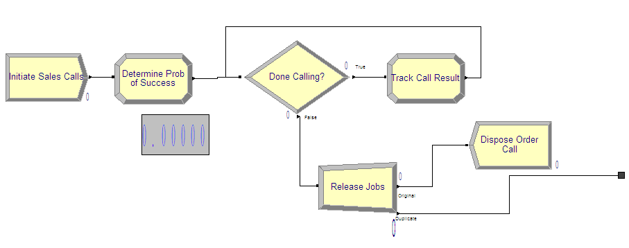
<p class="caption">(\#fig:LOTRSalesProcess)Sales confirmation process</p>
</div>

To implement the sales order process, you first need to decide how to
represent the required data. In the pseudo-code, there is only one
entity and no passage of time. In this situation, only 1 entity is
needed to execute the associated modules. Thus, either variables or
attributes can be used to implement the logic. A variable can be used
because there is no danger of another entity changing the global value
of the represented variables. In this model, the looping has been
implemented using a looping DECIDE construct as discussed in
section \@ref(ch4:IterativeLooping). An
overview of the sales order portion of the model is given in
Figure \@ref(fig:LOTRSalesProcess). If you are building the model as you
follow along, you should take the time to lay down the modules shown in
the figure. Each of the modules will be illustrated in what follows.

The CREATE module is very straightforward. Because the Max Arrivals
field is 1 and the First Creation field is 0.0, only 1 entity will be
created at time 0.0. The fields associated with the label Time between
Arrivals are irrelevant in this situation since there will not be any
additional arrivals generated from this CREATE module. Fill out your
CREATE module as shown in
Figure \@ref(fig:LOTRCreateModule).

<div class="figure" style="text-align: center">
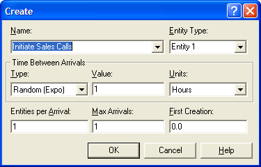
<p class="caption">(\#fig:LOTRCreateModule)Initiating the sales call confirmation process</p>
</div>

In the first ASSIGN module, the probability of success for the day is
determined. The variable (`vSalesProb`) has been used to represent the
probability as drawn from the BETA() distribution function
(Figure \@ref(fig:LOTRAssign1). The attribute (`myCallNum`) is
initialized to 1, prior to starting the looping logic. This attribute is
going to count the number of calls made.

<div class="figure" style="text-align: center">

<p class="caption">(\#fig:LOTRAssign1)Determining the probability of success</p>
</div>

<div class="figure" style="text-align: center">
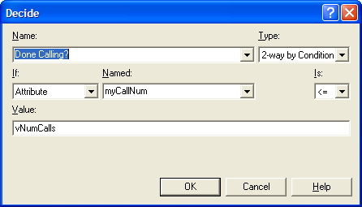
<p class="caption">(\#fig:LOTRSPDecide)Checking that all calls have been made</p>
</div>

The DECIDE module in Figure \@ref(fig:LOTRSPDecide) uses the attribute (`myCallNum`) to check the variable `vNumCalls`. The variable (`vNumCalls`) is defined
in the VARIABLE module (not shown here) and has been initialized to 100.
Because the total number of calls has been represented as a variable,
the desired number of calls can be easily changed in the VARIABLE
module, without editing the DECIDE module.

<div class="figure" style="text-align: center">
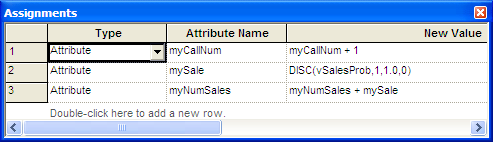
<p class="caption">(\#fig:LOTRAssign2)Tracking the call results</p>
</div>

Figure \@ref(fig:LOTRAssign2) presents the ASSIGN module in the
looping logic. In this ASSIGN, the attribute `myCallNum` is incremented.
Then, according to the pseudo-code, you must implement a Bernoulli
trial. This can easily be accomplished by using the `DISC()` distribution
function with only two outcomes, 1 and 0, to assign to the attribute
`mySale.` You can set the probability of success for the value 1 to
`vSalesProb`, which was determined via the call to the BETA function.
Note that the function `DISC(BETA(5, 1.5), 1, 1.0, 0)` would not work in
this situation. `DISC(BETA(5, 1.5)` will draw a new probability from the
`BETA()` function every time `DISC() `is called. Thus, each trial will have
a different probability of success. This is not what is required for the
problem and this is why the variable `vSaleProb` was determined outside
the looping logic. The attribute (`myNumSales`) is incremented with the
value from `mySale`, which essentially counts up all the successful
sales calls (marked with a 1).

When the DECIDE module evaluates to false, all the sales calls have been
made, and the attribute `myNumSales` has recorded how many successful
calls there have been out of the 100 calls made. The order process
entity is directed to the SEPARATE module where it creates
(`myNumSales`) duplicates and sends them to the production process
(Figure  \@ref(fig:LOTRSeparateModule). The original order process logic
entity is sent to a DISPOSE, which has its collect entity statistics box
unchecked (not shown). By not checking this box, no statistics will be
collected for entities that exit through this DISPOSE module. Since the
problem does not require anything about the statistics for the order
process logic entity, this is advisable.

<div class="figure" style="text-align: center">

<p class="caption">(\#fig:LOTRSeparateModule)Creating the jobs for production</p>
</div>

The production process is too long for one screen shot so this
discussion is divided into three parts: the making and inspection
processes, the decision concerning too big/too small, and the repair and
packaging operations.
Figure \@ref(fig:LOTRMakeAndInspect) presents the making and
inspection processes which are implemented with PROCESS modules using
the SEIZE, DELAY, RELEASE option.
Figure \@ref(fig:LOTRMakeProcess) and
Figure \@ref(fig:LOTRInspectProcess) show the PROCESS modules and the
appropriate delay distributions using the uniform and triangular
distributions.

<div class="figure" style="text-align: center">
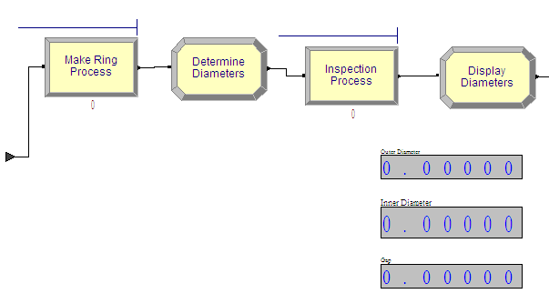
<p class="caption">(\#fig:LOTRMakeAndInspect)Making and inspecting the rings</p>
</div>

<div class="figure" style="text-align: center">

<p class="caption">(\#fig:LOTRMakeProcess)PROCESS module for making the rings</p>
</div>

<div class="figure" style="text-align: center">
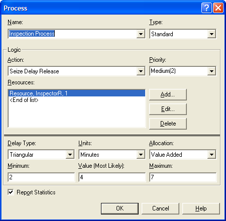
<p class="caption">(\#fig:LOTRInspectProcess)PROCESS module for inspecting the rings</p>
</div>

The ASSIGN module between the two processes is used to determine the
diameters of the rings.
Figure \@ref(fig:LOTRDiameters) shows that attributes (`myIDBigRing`
and `myODSmallRing`) are both set using the normal distribution. The
parameters of the `NORM()` functions are defined by variables in the
VARIABLE module (not shown here).

<div class="figure" style="text-align: center">

<p class="caption">(\#fig:LOTRDiameters)Determining the ring diameters</p>
</div>

After inspection, the rings must be checked to see whether rework is
necessary. An overview of this checking is given in
Figure \@ref(fig:LOTRDiameters). The RECORD modules are used to
collect statistics on the probability of the smaller ring being too big
or the smaller ring being too small.

<div class="figure" style="text-align: center">
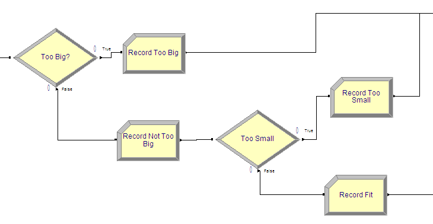
<p class="caption">(\#fig:LOTRCheckDiameters)Checking ring diameters</p>
</div>

Figure \@ref(fig:LOTRCheckSmallRingTooBig) shows the DECIDE module for
checking if the ring is too big. The 2-way by condition option was used
to check if the attribute (`myODSmallRing`) is larger than the attribute
(`myIDBigRing`). If the smaller ring's outer diameter is larger than the
bigger ring's inner diameter, then the smaller ring will not fit inside
the bigger ring and the rings will require rework.

Figure\@ref(fig:LOTRCheckSmallRingTooLoose) shows the DECIDE module
for checking if the smaller ring is too loose. In this DECIDE module,
the two-way by condition option is used to check the expression
`(myIDBigRing - myODSmallRin) > vTol`. If the difference between
the diameters of the rings is too large (larger than the tolerance),
then the rings are too loose and need rework. If the rings fit properly,
then they go directly to packaging.

<div class="figure" style="text-align: center">
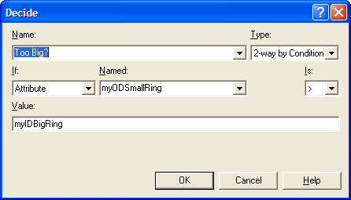
<p class="caption">(\#fig:LOTRCheckSmallRingTooBig)Checking to determine whether small ring is too big</p>
</div>

<div class="figure" style="text-align: center">
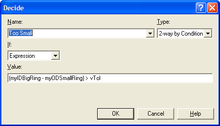
<p class="caption">(\#fig:LOTRCheckSmallRingTooLoose)Checking to determine whether small ring is too small</p>
</div>

Figure \@ref(fig:LOTRReworkPackaging) shows the rework and packaging
processes. Again, the PROCESS module is used to represent these
processes.

<div class="figure" style="text-align: center">

<p class="caption">(\#fig:LOTRReworkPackaging)Rework and packaging processes</p>
</div>

Figures \@ref(fig:LOTRReworkProcess) and
Figure \@ref(fig:LOTRPackagingProcess) show the rework and packaging
process modules. Note that the delay type has been changed to expression
so that `5 + WEIB(15, 3)` and `LOGN(7, 1)` can be specified for each of the
respective processing times.

<div class="figure" style="text-align: center">
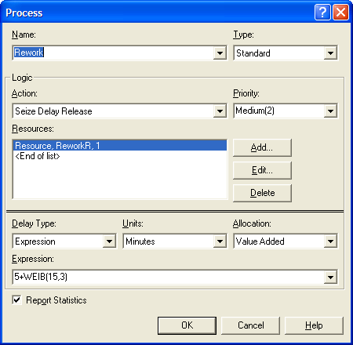
<p class="caption">(\#fig:LOTRReworkProcess)Rework PROCESS module</p>
</div>

<div class="figure" style="text-align: center">

<p class="caption">(\#fig:LOTRPackagingProcess)Packaging PROCESS module</p>
</div>

### Running the Model

The completed model for Example \@ref(exm:exLOTR) can be found in the chapter files as *LOTRExample.doe*. In this section, we will setup and run the model. In Arena, a simulation can end based on three situations:

1.  A scheduled run length

2.  A terminating condition is met

3.  No more events (entities) to process

The problem statement requests the estimation of the probability of
overtime work. The sales order process determines the number of rings to
produce. The production process continues until there are no more rings
to produce for that day. The number of rings to produce is a binomial
random variable as determined by the sales order confirmation process.
Thus, there is no clear run length for this simulation.

Because the production for the day stops when all the rings are
produced, the third situation applies for this model. The simulation
will end automatically after all the rings are produced. In essence, a
day's worth of production is simulated. Because the number of rings to
produce is random and it takes a random amount of time to make, inspect,
rework, and package the rings, the time that the simulation will end is
a random variable. If this time is less than 960 (the time of two
shifts), there will not be any overtime. If this time is greater than
960, production will have lasted past two shifts and thus overtime will
be necessary. To assess the chance that there is overtime, you need to
record statistics on how often the end of the simulation is past 960.

Thus, when the simulation ends, `TNOW` will be the time that the
simulation ended. In this case, `TNOW` will represent the time that the
last ring completed processing. To estimate the chance that there is
overtime, the Advanced Process Panel's Statistic module can be used. In
particular, you need to define what is called an OUTPUT statistic.

An OUTPUT statistic records the final value of some system or
statistical value at the end of a replication. An OUTPUT statistic can
be defined by any valid expression involving system variables,
variables, statistical functions, and so on. In
Figure \@ref(fig:LOTROutputStatistics), an OUTPUT statistic called
`TimeToMakeOrderStat` has been defined, which records the value of
`TNOW`. This will cause the collection of statistics (across
replication) for the ending value of `TNOW`. The OUTPUT statistic will
record the average, minimum, maximum, and half-width across the
replications for the defined expression. You can also use the Output
File field to write out the observed values to a file if necessary.

<div class="figure" style="text-align: center">

<p class="caption">(\#fig:LOTROutputStatistics)Defining OUTPUT statistics for overtime</p>
</div>

The second OUTPUT statistic in
Figure \@ref(fig:LOTROutputStatistics) defines an OUTPUT statistic called
`ProbOfOT` to represent the chance that the production lasts longer than
960 minutes. In this case, the expression is the Boolean value of
`(TNOW > 960)`. The expression `(TNOW > 960)` will be evaluated. If
it is true, it will evaluate to 1.0; otherwise, it will evaluate to a
0.0. This is just like an indicator variable on the desired condition.
The OUTPUT statistic will compute the average of the 1's and 0's, which
is an estimate of the probability of the condition. Thus, you will get
an estimate of the likelihood of overtime.

Figure \@ref(fig:LOTRRunSetup) shows how to set up the run parameters
of the simulation. You should run the simulation with a base time unit
of minutes. This is important to set up here so that `TNOW` can now be
interpreted in minutes. This ensures that the expression `(TNOW > 960)` makes sense in terms of the desired units. There is no replication
length specified nor is there a terminating condition specified. As
previously mentioned, the simulation end when there are no more events
(entities) to process. If the model is not set up correctly (i.e., an
infinite number of entities are processed), then the simulation will
never terminate. This is a logical situation that the modeler is
responsible for preventing. The number of replications has been
specified to 30 to represent the 30 days of production.

<div class="figure" style="text-align: center">
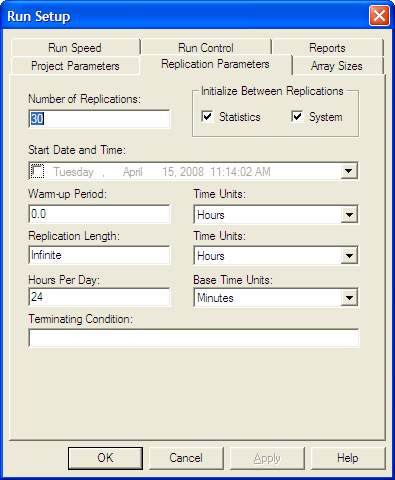
<p class="caption">(\#fig:LOTRRunSetup)Specifying the number of replications in run setup</p>
</div>

Running the model results in the user defined statistics for the
probability of overtime and the average time to produce the orders as
shown in Figure \@ref(fig:LOTRResults). The probability of overtime appears to
be about 6%, but the 95% half-width is wide for these 30 replications.
The average time to produce an order is about 780.68 minutes. While the
average is under 960, there still appears to be a reasonable chance of
overtime occurring. In the exercises, you are asked to explore the
reasons behind the overtime and to recommend an alternative to reduce
the likelihood of overtime.

<div class="figure" style="text-align: center">
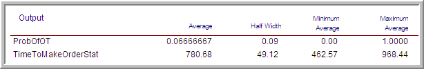
<p class="caption">(\#fig:LOTRResults)LOTR model results across 30 replicated days</p>
</div>

In this example, you have learned how to model a small system involving
random components and to translate the conceptual model into an
simulation. The following explores how independent sampling and common random
numbers can be implemented. This example returns to the LOTR Makers
system. This example also illustrates the use of resources sets.

## Comparing Two Alternative Configurations for the LOTR Makers

Suppose LOTR Makers is interested in
reducing the amount of overtime. They have noticed that a bottleneck
forms at the ring making station early in the production release and
that the rework station is not sufficiently utilized. Thus, they would
like to test the sharing of the rework worker between the two stations.
The rework worker should be assigned to both the rework station and the
ring making station. If a pair of rings arrives to the ring making
station either the master ring maker or the rework worker can make the
rings. If both ring makers are available, the master ring maker should
be preferred. If a pair of rings needs rework, the rework worker should
give priority to the rework. The rework worker is not as skilled as the
master ring maker and the time to make the rings varies depending on the
maker. The master ring maker still takes a UNIF(5,15) minutes to make
rings; however, the shared rework worker has a much more variable
process time. The rework worker can make rings in 30 minutes according
to an exponential distribution. In addition, the rework worker must walk
from station to station to perform the tasks and needs a bit more time
to change from one task to the next. It is estimated that it will take
the rework work an extra 10 minutes per task. Thus, the rework worker's
ring making time is on average 10 + EXPO(30) minutes, and the rework
worker's time to process rework is now 15+WEIB(15,3) minutes.

In addition to the sharing of the rework craftsman, management has noted
that the release of the jobs at the beginning of the day is not well
represented by the previous model. In fact, after the jobs are released
the jobs go through an additional step before reaching the ring making
station. After being released all the paperwork and raw materials for
the job are found and must travel to the ring station for the making of
the rings. The process takes 12 minutes on average according to an
exponential distribution for each pair of rings. There are always
sufficient workers available to move the rings to the ring station at
the beginning of the day. LOTR Makers Inc. would like an analysis of the
time to complete the orders for each of the following systems:

-   Configuration 1: The system with ring preparation/travel delay with
    no sharing of the rework craftsman.

-   Configuration 2: The system with ring preparation/travel delay and
    the sharing of the rework craftsman.

Figure \@ref(fig:LOTRTwoAlternatives) illustrates the two system configurations
in the form of activity diagrams. Configuration two illustrates that the
two resources (master craftsman and rework craftsman) are shared at the
make ring activity by placing the two resources in a larger oval. This
oval represents the fact that these two resources are in a set. Notice
how the SEIZE and RELEASE arrows from the make ring activity go to the
boundary of the oval. This indicates that the make ring activity pulls
resources from this set of resources.

<div class="figure" style="text-align: center">
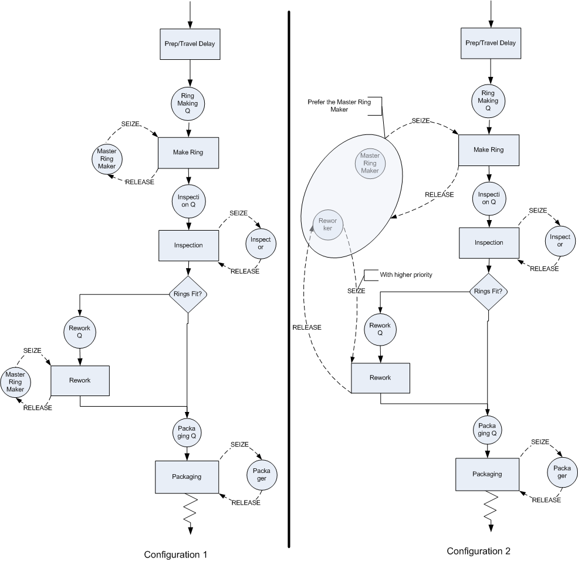
<p class="caption">(\#fig:LOTRTwoAlternatives)Two LOTR alternative configurations</p>
</div>

The rework activity still uses the rework craftsman. In particular, the
SEIZE and RELEASE arrows go directly to the rework craftsman. The SEIZE
arrows have been augmented to indicate that the master craftsman is to
be preferred and that the rework activity has higher priority for the
rework craftsman. In both activity diagrams the preparation/travel time
has been represented with an activity that does not use any resources.
This can be modeled with a DELAY module. The implementation of
configuration 1 poses no additional modeling challenges; however, for
configuration 2, the resource sharing must be modeled.

### Resource Sets

The diagram indicates that the master craftsman and the rework craftsman
are within the same set. has the capability of defining sets to hold
various object types (e.g. resources, queues, etc.). Thus, the set
construct can be used to model the sharing of the resources. The set
construct is simply a named *list* of objects of the same type. Thus, a
resource set is a list of resources. Each resource listed in the set is
called a member of the set. Unlike the mathematical set concept, these
sets are ordered lists. Each member of the set is associated with an
index representing its order in the list. The first member has an index
of 1, the 2nd has an index of 2, and so forth. If you know the index,
you can look up which member of the set is associated with the index. In
this sense, a set is like an array of objects found in other programming
languages. The following illustrates the resource set concept to hold
the ring makers.

   Index     Member
  ------- ------------
     1     RingMakerR
     2      ReworkR

A set named, *RingMakers*, can be defined with the two previously
defined resources as members of the set. In this case, the resource
representing the master craftsman (`RingMakerR`) is placed first in the
set and the resource representing the rework craftsman (`ReworkR`) is
placed second in the set. The name of the set can be used to return the
associated object:

-   `RingMakers(1)` will return the resource `RingMakerR`

-  ` RingMakers(2)` will return the resource `ReworkR`

There are three useful functions for working with sets:

MEMBER(Set ID, Index)

:   The `MEMBER` function returns the construct number of a particular set
    member. Set ID identifies the set to be examined and index is the
    index into the set. Using the name of the set with the index number
    is functionally equivalent to the `MEMBER` function.

MEMIDX(Set ID, Member ID)

:   The `MEMIDX` function returns the index value of a construct within
    the specified `Set ID`. `Member ID` is the name of the construct.

NUMMEM(Set ID)

:   The `NUMMEM` function returns the number of members in the specified
    `Set ID`.

The ordering of the members in the set may be important to the modeling
because of how the rules for selecting members from the set are defined.
When an entity attempts to seize a member of the resource set, a
resource selection rule may be invoked. The rule will be invoked if
there is more than one resource idle at the time that the entity
attempts to seize a member of the resource set. There are 7 default
rules and 2 ways to specify user defined rules:

CYC

:   Selects the first available resource beginning with the successor of
    the last resource selected. This has the effect of cycling through
    the resources. For example, if there are 5 members in the set
    1,2,3,4,5 and 3 was the last resource selected then 4 will be the
    next resource selected if it is available.

POR

:   Selects the first resource for which the required resource units are
    available. Each member of the set is checked in the order listed.
    The order of the list specifies the preferred order of selection.

LNB

:   Selects the resource that has the largest number of resource units
    busy, any ties are broken using the POR rule.

LRC

:   Selects the resource that has the largest remaining resource
    capacity, any ties are broken using the POR rule.

SNB

:   Selects the resource that has the smallest number of resource units
    busy, any ties are broken using the POR rule.

SRC

:   Select the resource that has the smallest remaining resource
    capacity, any ties are broken using the POR rule.

RAN

:   Selects randomly from the resources of the set for which the
    required resource units are available.

ER(User Rule)

:   Selects the resource based on rule User Rule defined in the
    experiment frame.

UR(User Rule)

:   Selects the UR$^{th}$ resource where UR is computed in a user-coded
    rule function.

Since the master ring maker should be preferred if both are available,
the `RingMakerR` resource should be listed first in the set and the `POR`
resource selection rule should used. The only other modeling issue that
must be handled is the fact that the rework worker should show priority
for rework jobs.

From the activity diagram, you can see that there will be two SEIZE
modules attempting to grab the rework worker. If the rework worker
becomes idle, which SEIZE should have preference? According to the
problem, the SEIZE related to the rework activity should be given
preference. In the module, you can specify a priority level associated
with the SEIZE to handle this case. A lower number results in the SEIZE
having a higher priority.

Now, you are ready to implement this situation by modifying the file,
*LOTRExample.doe*. The files related to this section are available in the book support files for this chapter in a folder called, *CompartingTwoSystemsCRN*.  Open up the submodel named, *Ring Processing*, and
insert a DELAY module at the beginning of the process as shown in
Figure \@ref(fig:LOTRConfig1DelayModule). The DELAY module can be found on the
Advanced Process panel. Specify an `expo(12)` distribution for the delay
time. After making this change, you should save the model under the
name, *LOTRConfig1.doe*, to represent the first system configuration.
You will now edit this model to create the second system configuration.

<div class="figure" style="text-align: center">
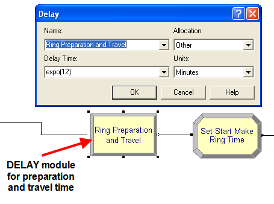
<p class="caption">(\#fig:LOTRConfig1DelayModule)DELAY module for preparation and travel time</p>
</div>

The first step will be to define the resource set. This can be done
using the SET module on the Basic Process panel. Within the SET module,
double click on a row to start a new set. Then, you should name the set
RingMakers and indicate that the type of set is Resource as shown in
Figure \@ref(fig:LOTRConfig2ResourceSet).
Now, you can click on the Members area to add rows for each member. Do
this as shown in Figure \@ref(fig:LOTRConfig2ResourceSet) and make sure to place RingMakerR and ReworkR as
the first and second members in the set. Since the resources had already
been defined it is a simple matter of using the drop down textbox to
select the proper resources. If you define a set of resources before
defining the resources using the RESOURCE module, the programming
environment will automatically create the listed resources in the
RESOURCE module. You will still have to edit the RESOURCE module.

<div class="figure" style="text-align: center">
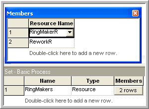
<p class="caption">(\#fig:LOTRConfig2ResourceSet)Adding members to a resource set</p>
</div>

After defining and adding the resources to the set, you should save your
model as *LOTRConfig2.doe*. You are now ready to specify how to use
the sets within model. Open up the PROCESS module named, Make Ring
Process, in order to edit the previously defined resource specification
for the SEIZE, DELAY, RELEASE logic. In
Figure \@ref(fig:LOTRConfig2ProcessResourceSet), the resource type has been specified as
Set. Then, you should select the `RingMakers` set using the `Preferred
Order` resource selection rule. You should close up the PROCESS module
and save your model.

<div class="figure" style="text-align: center">
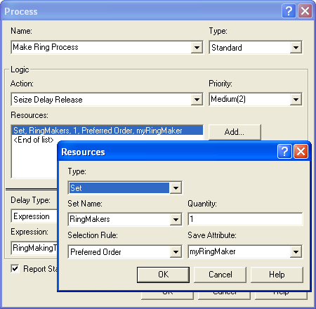
<p class="caption">(\#fig:LOTRConfig2ProcessResourceSet)Using a resource set in a PROCESS module</p>
</div>

Now, you must handle the fact that the processing time to make a ring
depends on which resource is selected. In
Figure \@ref(fig:LOTRConfig2ProcessResourceSet), there is a text field labeled Save
Attribute. This attribute will hold the index number of the resource
that was selected by the SEIZE. In the current situation, this attribute
can be used to have the rings (entity) remember which resource was
selected. This index will have the value 1 or 2 according to whichever
member of the `RingMakers` set was selected. This index can then be used
to determine the appropriate processing time. 

<div class="figure" style="text-align: center">
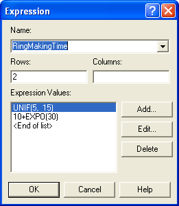
<p class="caption">(\#fig:LOTRConfig2Expressions)Expressions for ring making time by type of worker</p>
</div>

Since there are only two
ring makers, an arrayed EXPRESSION can be defined, see
Figure \@ref(fig:LOTRConfig2Expressions), to represent the different processing
times. The first expression represents the processing time for the
master ring maker and the second expression represents the ring making
time of the rework worker. The Save Attribute index can be used to
select the appropriate processing time distribution within this arrayed
expression. After defining your expressions as shown in
Figure \@ref(fig:LOTRConfig2Expressions), open up your Make Ring Process module
and edit it according to
Figure \@ref(fig:LOTRConfig2RingProcessingTime). Notice how an attribute has been
used to remember the index and then that attribute is used to select the
appropriate processing time from the EXPRESSION array.

<div class="figure" style="text-align: center">
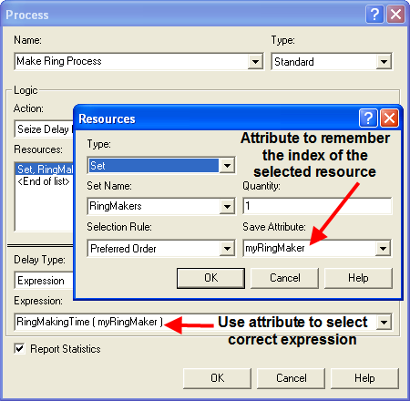
<p class="caption">(\#fig:LOTRConfig2RingProcessingTime)Using the save attribute to remember the selected resource and index into the expression</p>
</div>

The next required model change is to ensure that the rework craftsman
gives priority to rework jobs. This can be done by editing the PROCESS
module for the rework process as shown in
Figure \@ref(fig:LOTRConfig2SeizePriority). In addition, you need to add an
additional 15 minutes for the rework worker's time to perform the rework
due to the job sharing. You are now almost ready to run the models.

<div class="figure" style="text-align: center">
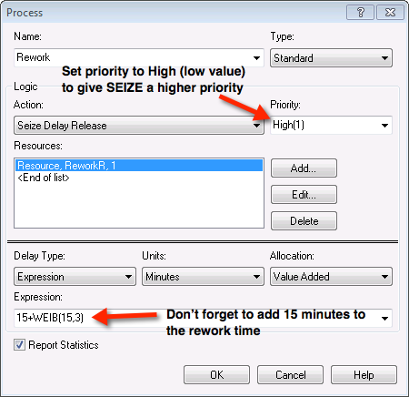
<p class="caption">(\#fig:LOTRConfig2SeizePriority)Adjusting the priority when seizing the resource</p>
</div>

The final change to the model will enable the time to produce the rings
to be captured to a file for analysis within the Output Analyzer. Go to
the STATISTICS module and add a file name (*prodTimeC2.dat*) to the
OUTPUT statistic for the time to make the order statistics as shown in Figure \@ref(fig:LOTRConfig2CaptureOutput). The time to
make the orders will be written to the file so that the analysis tools
within the Output Analyzer can be used. You should then open up the
model file for the first configuration and add an output file (e.g.
*prodTimeC1.dat*) to capture the statistics for the first configuration.
You should then run each model for 30 replications.

<div class="figure" style="text-align: center">

<p class="caption">(\#fig:LOTRConfig2CaptureOutput)Capturing total production time across replication results to a file</p>
</div>

After running the models, open up the Output Analyzer and add the two
generated files to a new data group. Use the Analyze $>$ Compare Means
option of the Output Analyzer to develop a paired confidence interval
for the case of common random numbers.
Figure \@ref(fig:LOTRSetupCRNCompare) illustrates how to set up the Compare
Means options. Note that configuration 1 is associated with data file A
and configuration 2 is associated with data file B. The default behavior
is to compute the difference between A and B
($\theta = \theta_1 - \theta_2$). Thus, if $l > 0$ , you can conclude
that configuration 1 has the higher mean time to produce the rings. If
this is the case, then configuration 2 would be preferred (shorter
production time is better). 

<div class="figure" style="text-align: center">

<p class="caption">(\#fig:LOTRSetupCRNCompare)Setup paired difference analysis in Output Analyzer</p>
</div>

From the results shown in Figure \@ref(fig:LOTRCRNResults), you can clearly see that system configuration 2 has the smaller production time. In fact, you can be 95%
confident that the true difference between the systems is 92 minutes.
This is a practical difference by most standards.

<div class="figure" style="text-align: center">
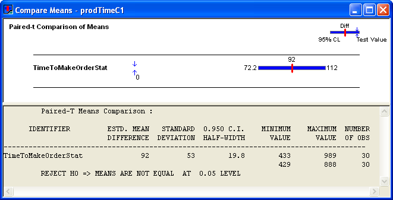
<p class="caption">(\#fig:LOTRCRNResults)Results for the paired difference analysis</p>
</div>

Based on these results, LOTR Makers Inc should consider sharing the
rework worker between the work stations. If you check the other
performance measures as per Figures \@ref(fig:figLOTRConfig1Utilization) and \@ref(fig:figLOTRConfig2Utilization), you will see that the utilization of the rework
worker is increased significantly (near 97%) in configuration 2. 

<div class="figure" style="text-align: center">
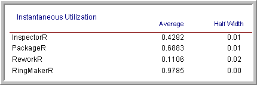
<p class="caption">(\#fig:figLOTRConfig1Utilization)Configuration 1 resource utilization</p>
</div>

<div class="figure" style="text-align: center">
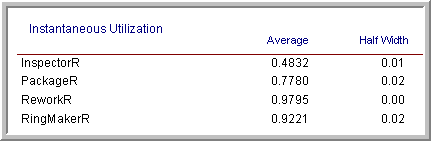
<p class="caption">(\#fig:figLOTRConfig2Utilization)Configuration 2 resource utilization</p>
</div>

There is also a larger waiting line at the rework station. Such a high
utilization for both the ring makers (especially the rework worker) is a
bit worrisome. For example, suppose the quality of the work suffered in
the new configuration. Then, there would be even more work for the
rework worker and possibly a bottleneck at the rework station.
Certainly, such a high utilization is troublesome from a human factors
standpoint, since worker breaks have not even been modeled! These and
other trade-offs can be examined using simulation.

In order to try to ensure a stronger variance reduction when using
common random numbers, there are a number of additional implementation
techniques that can be applied. For example, to help ensure that the
same random numbers are used for the same processes within each of the
simulation alternatives you should dedicate a different stream number to
each random process in the model. To do this use a different stream
number in each probability distribution used within the model. In
addition, to help with the synchronization of the use of the random
numbers, you can generate the random numbers that each entity will need
upon entering the model. Then each entity carries its own random numbers
and uses them as it proceeds through the model. In the example, neither
technique was done in order to simplify the exposition.

#### Implementing Independent Sampling {#ch4:INDSamplingResults}

This section outlines how to perform the independent sampling case
within a model. The completed model files are available as
*LOTRConfig1IND.doe* and *LOTRConfig2IND.doe* in the folder called *ComparingTwoSystemsIND* in the book support files for this chapter. 

The basic approach to implementing independent sampling is to utilize different random
number streams for each configuration. There are a number of different
ways to implement the models so that independent sampling can be
achieved. The simplest method is to use a variable to represent the
stream number in each of the distributions within the model. In
*LOTRConfig1IND.doe*, every distribution was changed as follows:

-   Sales probability distribution: `BETA(5,1.5, vStream)`

-   Success of sale distribution: `DISC(vSalesProb,1,1.0,0, vStream)`

-   Preparation and travel time distribution: `EXPO(12,vStream)`

-   Master ring make processing time: `UNIF(5,15,vStream)`

-   Inner ring diameter: `NORM(vIDM, vIDS, vStream)`

-   Outer ring diameter: `NORM(vODM, vODS, vStream)`

-   Inspection time distribution: `TRIA(2,4,7,vStream)`

-   Rework time distribution: `5+WEIB(15,3, vStream)`

-   Packaging time distribution: `LOGN(7,1, vStream)`

The same procedure was used for *LOTRConfig2IND.doe*. Then, the
variable, `vStream`, was set to different stream numbers so that each
model uses different random number streams. Both models were executed
first using `vStream` equal to 1 for configuration 1 and `vStream` equal to
2 for configuration 2. The Output Analyzer can again be used to compare
the results using the Analyze $>$ Compare Means $>$ Two sample t-test
option. Figure \@ref(fig:LOTRINDResults) presents the results from the analysis.

<div class="figure" style="text-align: center">
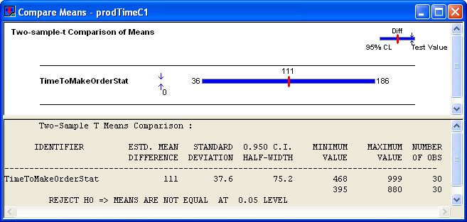
<p class="caption">(\#fig:LOTRINDResults)Independent two sample analysis from Output Analyzer</p>
</div>

The results indicate that configuration 2 has a smaller production time.
Notice that the confidence interval for the independent analysis is
*wider* than in the case of common random numbers. This indicates that there is more variability in the independent analysis than in the analysis that used common random numbers.

Since comparing two systems through independent samples takes additional
work in preparing the model, one may wonder when it should be applied.
If the results from one of the alternatives are already available, but
the individual replication values are unavailable to perform the
pairing, then the independent sample approach might be used. For
example, this might be the case if you were comparing to already
published results. In addition, suppose the model takes a very long time
to execute and only the summary statistics are available for one of the
system configurations. You might want to ensure that the running of the
second alternative is independent of the first so that you do not have
to re-execute the first alternative. Finally, even though the situation
of comparing two simulation runs has been the primary focus of this
section, you might have the situation of comparing the results of the
simulation to the performance of the actual system. In this case, you
can use the data gathered on the actual system and use the two sample
independent analysis to compare the results. This is useful in the
context of validating the results of the model against the actual
system.

This section presented the results for how to compare two alternatives;
however, in many situations, you might have many more than two
alternatives to analyze. For a small number of alternatives, you might
take the approach of making all pair-wise comparisons to develop an
ordering. This approach has its limitations which will be discussed in
the next section along with how to handle the multiple comparison of
alternative.

The last few sections discussed systems that involved queues. In fact, almost all of the models that have been presented within the previous chapters involved queueing lines of some kind. In the next section, we will look at ways to leverage the STATION and ROUTE modules to model more complex networks of queues. This will allow the scaling up of models and facilitate many common modeling situations, found especially in manufacturing environments.

## Modeling Systems with Routing Sequences {#ch4:RoutingSequences}

A network of queues can be thought of as a set of stations, where each
station represents a service facility. In the simple case, each service
facility might have a single queue feeding into a resource. In the most
general case, customers may arrive to any station within the network
from outside the system. Customers then proceed from station to station
to receive service. After receiving all of their service requirements,
the customers depart the system.

In general the customers, do not take the same path through the network
and for a given customer type, the path may be deterministic or
stochastic in nature. For example, consider the case of a job shop
manufacturing setting. Each product that is manufactured may require a
different set of manufacturing processes, which are supplied by
particular stations (e.g. drilling, milling, etc.). As another example,
consider a telecommunications network where packets are sent from some
origin to some destination through a series of routers. In each of these
cases, understanding how many resources to supply so that the customer
can efficiently traverse the network at some minimum cost is important.
As such, queuing networks are an important component of the efficient
design of manufacturing, transportation, distribution,
telecommunication, computer, and service systems.
Figure \@ref(fig:NetworkOfQueues) illustrates the concept of a network of
stations for producing a vacuum cleaner.

<div class="figure" style="text-align: center">
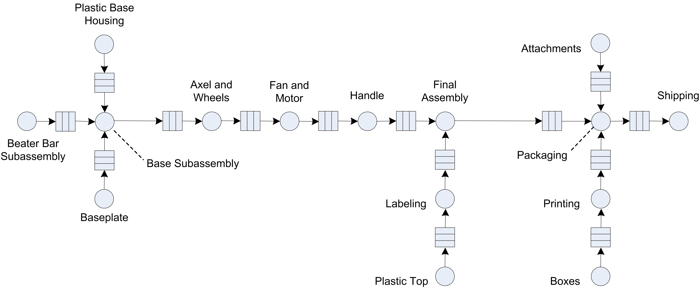
<p class="caption">(\#fig:NetworkOfQueues)Vaccum cleaner manufacturing system as a network of stations</p>
</div>

The analytical treatment of the theory associated with networks of
queues has been widely examined and remains an active area for
theoretical research. It is beyond the scope of this text to discuss the
enormous literature on queuing networks. The interested reader is
referred to the following texts as a starting point,
[@gross1998fundamentals], [@kelly1979reversibility],
[@buzacott1993stochastic], or @bolch2006queueing.

A number of examples have already been examined that can be considered
queuing networks (e.g. the Tie-Dye T-Shirts and the LOTR's Ring Making
examples). The purpose of this section will be to introduce some 
constructs that facilitate the simulation of queuing networks.
Since a queuing network involves the movement of entities between
stations, the use of the STATION, ROUTE, and SEQUENCE modules from the
Advanced Transfer template panel will be emphasized.

### Computer Test and Repair Shop Example 

Consider a test and repair shop for computer parts (e.g. circuit boards,
hard drives, etc.) The system consists of an initial diagnostic station
through which all newly arriving parts must be processed. Currently,
newly arriving parts arrive according to a Poisson arrival process with
a mean rate of 3 per hour. The diagnostic station consists of 2
diagnostic machines that are fed the arriving parts from a single queue.
Data indicates that the diagnostic time is quite variable and follows an
exponential distribution with a mean of 30 minutes. Based on the results
of the diagnostics, a testing plan is formulated for the parts. There
are currently three testing stations 1. 2, 3 which consist of one
machine each. The testing plan consists of an ordered sequence of
testing stations that must be visited by the part prior to proceeding to
a repair station. Because the diagnosis often involves similar problems,
there are common sequences that occur for the parts. The company
collected extensive data on the visit sequences for the parts and found
that the sequences in Table \@ref(tab:TestPlans) constituted the vast majority of test plans for the parts.

::: {#tab:TestPlans}
  Test Plan    \% of Parts   Sequence
  ----------- ------------- ----------
  1                25%       2,3,2,1
  2               12.5%        3,1
  3               37.5%       1,3,1
  4                25%         2,3

  Table: (\#tab:TestPlans) Test plan sequences
:::

For example, 25% of the newly arriving parts follow test plan 1, which
consists of visiting test stations 2, 3, 2, and 1 prior to proceeding to
the repair station.

The testing of the parts at each station takes time that may depend upon
the sequence that the part follows. That is, while parts that follow
test plan's 1 and 3 both visit test station 1, data shows that the time
spent processing at the station is not necessarily the same. Data on the
testing times indicate that the distribution is well modeled with a
lognormal distribution with mean, $\ \mu$, and standard deviation,
$\sigma$ in minutes. Table \@ref(tab:TestDist) presents the mean and standard
deviation for each of the testing time distributions for each station in
the test plan.

::: {#tab:TestDist}
  Test Plan           Testing Time Parameters           Repair Time Parameters
  ----------- ---------------------------------------- ------------------------
  1            (20,4.1), (12,4.2), (18,4.3), (16,4.0)         (30,60,80)
  2                        (12,4), (15,4)                     (45,55,70)
  3                 (18,4.2), (14,4.4), (12,4.3)              (30,40,60)
  4                        (24,4), (30,4)                     (35,65,75)

  Table: (\#tab:TestDist) Testing and repair distributions
:::

For example, the first pair of parameters, (20, 4.1), for test plan 1
indicates that the testing time at test station 2 has a lognormal
distribution with mean,$\mu = 20$, and standard deviation,$\sigma = 4.1$
minutes.

The repair station has 3 workers that attempt to complete the repairs
based on the tests. The repair time also depends on the test plan that
the part has been following. Data indicates that the repair time can be
characterized by a triangular distribution with the minimum, mode, and
maximum as specified in the previous table. After the repairs, the parts
leave the system. When the parts move between stations assume that there
is always a worker available and that the transfer time takes between 2
to 4 minutes uniformly distributed.
Figure \@ref(fig:TestAndRepairSystem) illustrates the arrangement of the
stations and the flow of the parts following Plan 2 in the test and
repair shop.

<div class="figure" style="text-align: center">

<p class="caption">(\#fig:TestAndRepairSystem)Overview of the test and repair shop</p>
</div>

The company is considering accepting a new contract that will increase
the overall arrival rate of jobs to the system by 10%. They are
interested in understanding where the potential bottlenecks are in the
system and in developing alternatives to mitigate those bottlenecks so
that they can still handle the contract. The new contract stipulates
that 80% of the time the testing and repairs should be completed within
480 minutes. The company runs 2 shifts each day for each 5 day work
week. Any jobs not completed at the end of the second shift are carried
over to first shift of the next working day. Assume that the contract is
going to last for 1 year (52 weeks). Build a simulation model that can
assist the company in assessing the risks associated with the new
contract.

### Conceptualizing the Model

Before implementing the model, you should prepare by conceptualizing
the process flow.
Figure \@ref(fig:TestAndRepairActivityDiagram) illustrates the activity diagram
for the test and repair system. Parts are created and flow first to the
diagnostic station where they seize a diagnostic machine while the
diagnostic activity occurs. Then, the test plan is assigned. The flow
for the visitation of the parts to the test station is shown with a loop
back to the transfer time between the stations. It should be clear that
the activity diagram is representing any of the three test stations.
After the final test station in the test plan has been visited, the part
goes to the repair station, where 1 of 3 repair workers is seized for
the repair activity. After the repair activity, the part leaves the
system.

<div class="figure" style="text-align: center">
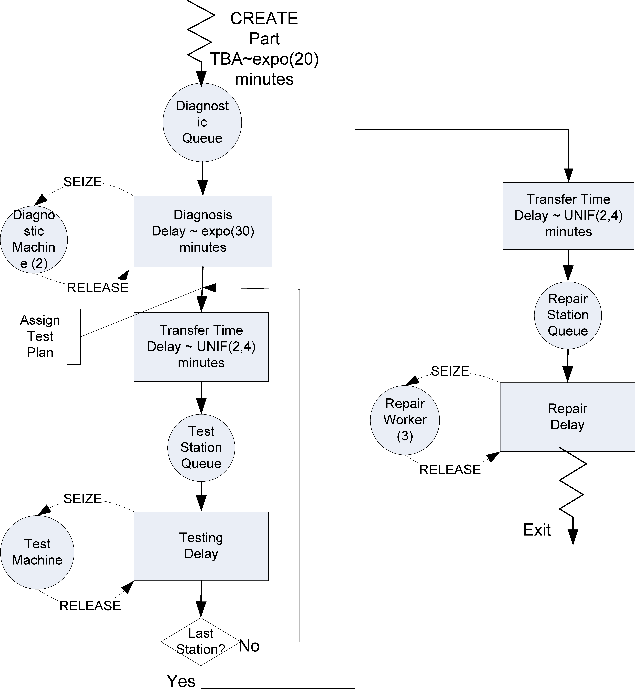
<p class="caption">(\#fig:TestAndRepairActivityDiagram)Activity diagram for test and repair system</p>
</div>

The following pseudo-code represent the main concepts for modeling the test and repair system. This is a straight forward representation of the flow presented in the activity
diagram. From the activity diagram and the pseudo-code, it should be
clear that with the current modeling constructs you should be able to
model this situation. In order to model the situation, you need some way
to represent where the part is currently located in the system (e.g. the
current station). Secondly, you need some way to indicate where the part
should go to next. And finally, you need some way to model the transfer
and the time of the transfer of the part between stations. This type of
modeling is very common. Because of this, there are special modules that
are specifically designed to handle situations like this.

```
CREATE part
BEGIN PROCESS Diagnostics
	SEIZE 1 diagnostic machine
	DELAY for diagnostic time
	RELEASE diagnostic machine
END PROCESS
BEGIN ASSIGN
	determine test plan type
	determine SEQUENCE for test plan type
END ASSIGN
ROUTE for transfer time by SEQUENCE to STATION Test

STATION Test
BEGIN PROCESS Testing 
	SEIZE appropriate test machine
	DELAY for testing time
	RELEASE test machine
END PROCESS
DECIDE IF not at last station
		ROUTE for transfer time by SEQUENCE to STATION Test
ELSE
		ROUTE for transfer time by SEQUENCE to STATION Repair
END DECIDE

STATION Repair
BEGIN PROCESS Repair Process 
	SEIZE repair worker from repair worker set
	DELAY for repair time
	RELEASE repair worker
END PROCESS
RECORD statistics
DISPOSE
```

The pseudo-code introduces some new concepts involving sequences, routes, and stations. The next section introduces these very useful constructs.

### STATION, ROUTE, and SEQUENCE Modules {#ch4:Sequences}

Entities typically represent the things that are flowing through the system. *Entity transfer* refers to the various ways by which entities can move
between modules. As we have previously seen, the STATION and ROUTE modules facilitate the transfer of entities between stations with a transfer delay. The SEQUENCE module
defines a list of stations to be visited.

SEQUENCE

:   The SEQUENCE module is a data module that defines an ordered list of
    stations. The list represents the natural order in which the
    stations will be visited, if transferred using the ROUTE module with
    the *By Sequence* option. In addition to defining a list of
    stations, a SEQUENCE permits the listing of a set of assignments
    (e.g. ASSIGN modules) to be executed when the transfer occurs.

Unlike our previous use of the STATION and ROUTE module, we may need to know where (at which station) the entities are in order to provide appropriate processing logic. Entities have a number of special purpose attributes that are useful
when modeling with the SEQUENCE, STATION, and ROUTE modules. The
`Entity.Station` and `Entity.CurrentStation` keep track of the location
of the entity within the model. The attribute, `Entity.CurrentStation`
is updated to the current station whenever the entity passes through the
STATION module. This attribute is not user assignable, but can be used
(read) in the model. It will return the station number for the current
station of the entity or 0 if the entity is not currently at a station.
In addition, every entity has an `Entity.Station` attribute, which
returns the entity's station or destination. The `Entity.Station`
attribute is user assignable. It is (automatically) set to the intended
destination station when an entity is transferred (e.g. via a ROUTE
module). It will remain equal to the current station after the transfer
or until either changed by the user or affected by another transfer type
module (e. g. ROUTE module). Thus, the modules attached to a STATION
module are conceptually at the station location.

In many modeling contexts, entities will follow a specific path through
the system. In a manufacturing job shop, this is often called the
process plan. In a bus system, this called a bus route. In the test and
repair system, this is referred to as the test plan. To model a specify
path through the system, the SEQUENCE module can be used. A sequence
consists of an ordered list of *job steps*. Each job step must indicate
the STATION associated with the step and may indicate a series of
assignments that must take place when the entity reaches the station
associated with the job step. Each job step can have an optional name
and can give the name of the next step in the sequence. Thus, a sequence
is built by simply providing the list of stations that must be visited.

Each entity has a number of special purpose attributes that facilitate
the use of sequences. The `Entity.Sequence` attribute holds the sequence
that the entity is currently following or 0 if no sequence has been
assigned. The ASSIGN module can be used to assign a specific sequence to
an entity. In addition, the entity has the attribute, `Entity.JobStep`,
which indicates the current step within the sequence that the entity is
executing. `Entity.JobStep` is user assignable and is automatically
incremented when a transfer type module (e.g. ROUTE) is used with the
*By Sequence* option. Finally, the attribute (`Entity.PlannedStation`)
is available and represents the number of the station associated with
the next job step in the sequence. `Entity.PlannedStation` is not
user-assignable. It is automatically updated whenever `Entity.Sequence`
or `Entity.JobStep` changes, or whenever the entity enters a station.

In the test and repair example, STATION modules will be associated with
the diagnostic station, each of three test stations, and with the repair
station. The work performed at each station will be modeled with a
PROCESS module using the (SEIZE, DELAY, and RELEASE) option. The four
different test plans will be modeled with four sequences. Finally, ROUTE
modules, using the *By Sequence* transfer option will be used to
transfer the entities between the stations with a `UNIF(2,4)` transfer
delay time distribution in minutes. Other than the new modules for
entity transfer this model is similar to previous models. This model can
be built by following these steps:

1.  Define 5 different resources (`DiagnosticMachine`, `TestMachine1`,
    `TestMachine2`, `TestMachine3`, `RepairWorkers`) with capacity (2, 1, 1,
    1, 3) respectively.

2.  Define 2 variables (`vContractLimit`, `vMTBA`) with initial values
    (480 and 20) respectively. These variables represent the length of
    the contract and the mean time between arrivals, respectively.

3.  Define 3 expressions (`eDiagnosticTime`, `eTestPlanCDF`, and
    `eRepairTimeCDFs`). `eDiagnosticTime` should be expo(30),
    `eTestPlanCDF` should be DISC(0.25, 1, 0.375, 2, 0.75,3, 1.0,4). In
    this distribution 1, 2, 3, 4 represents the four test plans.
    Finally, `eRepairTimeCDFs` should be an arrayed expression with four
    rows. Each row should specify a triangular distribution according to
    the information given concerning the repair time distributions (e.g.
    TRIA(30,60,80).

4.  Use the SEQUENCE module on the Advanced Transfer panel to define
    four different sequences. This is illustrated in
    Figure \@ref(fig:TestAndRepairJobSteps). First, double click on the SEQUENCE
    module to add a new sequence (row). The first sequence is called
    `TestPlan1Seq.` Then, add job steps to the sequence by clicking on
    the Steps button. Figure \@ref(fig:TestAndRepairJobSteps)
    shows the five job steps for test plan
    1 (`TestStation2`, `TestStation3`, `TestStation2`, `TestStation1`, and
    `RepairStation`). Typing in a station name defines a station for use
    in the model window. Since every part must visit the repair station
    before exiting the system, `RepairStation` has been listed last in
    all the sequences.

    For each job step, define an assignment that will happen when the
    entity is transferred to the step. In the test and repair system,
    the testing time depends upon the job step. Thus, an attribute,
    `myTestingTime`, can be defined so that the value from the pertinent
    lognormally distributed test time distribution can be assigned. In
    the case illustrated, `myTestingTime` will be set equal to a random
    number from a LOGN(20, 4.1) distribution, which represents the
    distribution for test station 2 on the first test plan. The
    `myTestingTime` attribute is used to specify the delay time for each
    of the PROCESS modules that represent the testing processes.

5.  Finally, define a set to hold the sequences so that they can be
    randomly assigned to the parts after they visit the diagnostic
    machine. To define a Sequence set, you must use the Advance Set
    module on the Advance Process panel. Each of the sequences should be
    listed in the set as shown in
    Figure \@ref(fig:TestAndRepairSequenceSet). The set type should be specified
    as *Other*. Unfortunately, the build expression option is not
    available here and each sequence name must be carefully typed into
    the dialog box. The order of the sequences is important.

<div class="figure" style="text-align: center">

<p class="caption">(\#fig:TestAndRepairJobSteps)Defining sequences, job steps, and assignments</p>
</div>

<div class="figure" style="text-align: center">
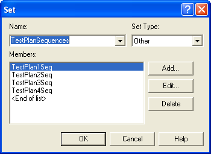
<p class="caption">(\#fig:TestAndRepairSequenceSet)Defining an advanced set to hold the sequences</p>
</div>

Now that all the data modules have been specified, you can easily build
the model using the flow chart modules. The completed model can be found in the book support files associated with chapter called, *RepairShop.doe*.  Figure \@ref(fig:TestAndRepairModelOverview) presents an overview of the model. The
pink colored modules in the figure are the STATION and ROUTE modules. A
CREATE module is used to generate the parts needing testing and repair
with a mean time between arrivals of 20 minutes exponentially
distributed. Then, the entity proceeds through an ASSIGN module where
the attribute, `myArriveTime`, is set to `TNOW.` This will be used to
record the job's system time. The next module is a STATION module that
represents the diagnostic station, see
Figure \@ref(fig:TestAndRepairDiagnosticStation).

<div class="figure" style="text-align: center">

<p class="caption">(\#fig:TestAndRepairModelOverview)Overview of the test and repair model</p>
</div>

<div class="figure" style="text-align: center">

<p class="caption">(\#fig:TestAndRepairDiagnosticStation)Modeling the diagnostics station with a STATION module</p>
</div>

After passing through the STATION module, the entity goes through the
diagnostic process. Following the diagnostic process, the part is
assigned a test plan.
Figure \@ref(fig:TestAndRepairTestPlanAssign) shows that the test plan expression holding
the DISC distribution across the test plans is used to assign a number
1, 2, 3, or 4 to the attribute `myTestPlan.` Then, the attribute is used
to select the appropriate sequence from our previously defined set of
test plan sequences. The sequence returned from the set is assigned to
the special purpose attribute, `Entity.Sequence`, so that the entity can
now follow this sequence.

<div class="figure" style="text-align: center">

<p class="caption">(\#fig:TestAndRepairTestPlanAssign)Assigning the test plans</p>
</div>

The part then enters the ROUTE module for sending the parts to the
testing stations. Figure \@ref(fig:TestAndRepairRouteModule) illustrates the ROUTE module. This module allows a time delay in the route time field and allows the user to
select the method by which the entity will be transferred. Choosing the
*By Sequence* option indicates that the entity should use its assigned
sequence (via the `Entity.Sequence` attribute) to determine the
destination station for the route. The entity's sequence and its current
job step are used. When the entity goes into the ROUTE module,
`Entity.JobStep` is incremented to the next step. The entity's
`Entity.Station` attribute is set equal to the station associated with
the step and all attributes associated with the step are executed. Then,
the entity is transferred (starts the delay associated with the
transfer). After the entity completes the transfer and enters the
destination station, the entity's `Entity.CurrentStation` attribute is
updated.

<div class="figure" style="text-align: center">
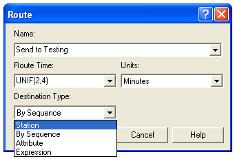
<p class="caption">(\#fig:TestAndRepairRouteModule)Selecting the By Sequence option within the ROUTE module</p>
</div>

In the example, the part is sent to the appropriate station on its
sequence. Each of the stations used to represent the testing stations
follow the same pattern (STATION, PROCESS (seize, delay, release), and
ROUTE). The PROCESS module (Figure \@ref(fig:TestAndRepairTestingProcessModule)) uses the attribute, `myTestingTime`, to
determine the delay time for the testing process. This attribute was set
when the entity's job step attributes were executed.

<div class="figure" style="text-align: center">
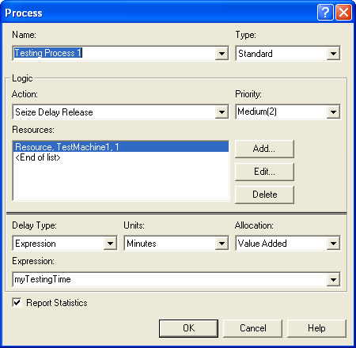
<p class="caption">(\#fig:TestAndRepairTestingProcessModule)PROCESS module for the testing process</p>
</div>

After proceeding through its testing plan, the part is finally routed to
the `RepairStation`, since it was the station associated with the last
job step. At the repair station, the part goes through its repair
process by using the expression `eRepairTimeCDFs` and its attribute,
`myTestPlan`, as shown in Figure \@ref(fig:TestAndRepairRepairProcess).

<div class="figure" style="text-align: center">
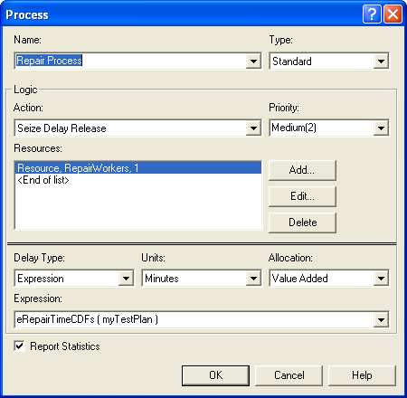
<p class="caption">(\#fig:TestAndRepairRepairProcess)PROCESS module for the repair process</p>
</div>

The ASSIGN module after the repair process module simply computes the
entity's total system time in the attribute, `mySysTime`, so that the
following two RECORD modules can compute the appropriate statistics as
indicated in Figure \@ref(fig:TestAndRepairRecordModules).

<div class="figure" style="text-align: center">
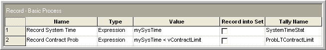
<p class="caption">(\#fig:TestAndRepairRecordModules)RECORD modules for test and repair model</p>
</div>

### Running the Test and Repair Model

Now the model is ready to set up and run. According to the problem, the
purpose of the simulation is to evaluate the risk associated with the
contract. The life of the contract is specified as 1 year (52 weeks
$\times$ 5 days/week $\times$ 2 shifts/day $\times$ 480 minutes/shift =
249,600 minutes). Since the problem states that any jobs not completed
at the end of a shift are carried over to the next working day, it is as
if there are 249,600 minutes or 4,160 hours of continuous operation
available for the contract. This is also a terminating simulation since
performance during the life of the contract is the primary concern. The
only other issue to address is how to initialize the system. The
analysis of the two situations (current contract versus contract with
10% more jobs) can be handled via a relative comparison. Thus, to
perform a *relative* comparison you need to ensure that both
alternatives start under the same initial conditions. For simplicity,
assume that the test and repair shop starts each contract alternative
under empty and idle conditions. Let's assume that 10 replications of
4,160 hours will be sufficient as illustrated in
Figure \@ref(fig:TestAndRepairRunSetup).

<div class="figure" style="text-align: center">

<p class="caption">(\#fig:TestAndRepairRunSetup)Run setup specification for test and repair shop model</p>
</div>

As shown in Figure \@ref(fig:TestAndRepairResults), for the current situation, the
probability that a job completes its testing and repair within 480
minutes is about 82%. The addition of more jobs should increase the risk
of not meeting the contract specification. You are asked to analyze the
new contract's risks and make a recommendation to the company on how to
proceed within the exercises.

<div class="figure" style="text-align: center">
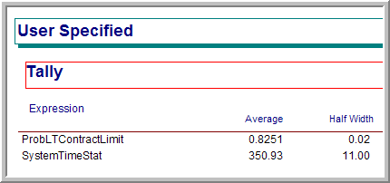
<p class="caption">(\#fig:TestAndRepairResults)User defined statistics for current contract</p>
</div>

In the test and repair example, the time that it took to transfer the
parts between the stations was a simple stochastic delay (e.g. UNIF
(2,4) minutes). The STATION, ROUTE, and SEQUENCE modules make the
modeling of entity movement between stations in this case very
straightforward. In some systems, the modeling of the movement is much
more important because material handling devices (e.g. people to carry
the parts, fork lifts, conveyors, etc.) may be required during the
transfer. These will require an investigation of the modules within the
Advanced Transfer Panel. This topic will be taken up in
Chapter \@ref(ch7).

## Summary {#ch4:Summary}

In this chapter, you have learned a great deal about modeling processes within discrete-event dynamic systems using simulation. All of the modules found in Arena's Basic Process panel, except for the SCHEDULE module have been discussed. The modules covered included:

CREATE

:   Used to create and introduce entities into the model according to a
    pattern.

DISPOSE

:   Used to dispose of entities once they have completed their
    activities within the model.

PROCESS

:   Used to allow an entity to experience an activity with the possible
    use of a resource.

ASSIGN

:   Used to make assignments to variables and attributes within the
    model

RECORD

:   Used to capture and tabulate statistics within the model.

BATCH

:   Used to combine entities into a permanent or temporary
    representative entity.

SEPARATE

:   Used to create duplicates of an existing entity or to split a
    batched group of entities.

DECIDE

:   Used to provide alternative flow paths for an entity based on
    probabilistic or condition based branching.

VARIABLE

:   Used to define variables to be used within the model.

RESOURCE

:   Used to define a quantity of units of a resource that can be seized
    and released by entities.

QUEUE

:   Used to define a waiting line for entities whose flow is currently
    stopped within the model.

ENTITY

:   Used to define different entity types for use within the model.

SET

:   Used to define a list of elements within that can be indexed by the
    location in the list.

In addition to Arena's Basic Process panel, the following constructs from the Advanced Process Panel
have been introduced:

READWRITE

:   From the Advanced Process panel, this module allows input and output
    to occur within the model.

FILE

:   From the Advanced Process panel, this module defines the
    characteristics of the operating system file used within a READWRITE
    module.

EXPRESSION

:   From the Advanced Process panel, this module allows the user to
    define named logical/mathematical expressions that can be used
    throughout the model.

DELAY

:   From the Advanced Process panel, this module allows an entity to
    experience a delay in movement via the scheduling of an event.

We also saw how to access the basic programming blocks available on the BLOCKS panel via the WHILE-ENDWHILE blocks.

WHILE-ENDWHILE

:   From the Blocks panel, these modules allow for iterative looping.

Finally, we illustrated the following modules from the Advanced Transfer Panel.

STATION module

:   Allows the marking in the model for a location to which entities can
    be directed for processing.

SEQUENCE module

:   Allows for pre-specified routes of stations to be defined and
    attributes to be assigned when entities are transferred to the
    stations.

ROUTE module

:   Facilitates the movement between stations with a time delay.

With all these modules, you can already model very complex systems.

In addition to systems modeling, we learned that when developing a simulation model, we are really developing software programs.  To develop a program in Arena, you used data modules to define the elements to be used in the model and flow chart modules to specify the logical flow of the model. The flow chart style that facilitates has its
advantages and disadvantages. The primary advantage is that you can
quickly build useful models within the environment without really
knowing how to program. This is a great boon to the use of simulation
technology. The primary disadvantage is that the flow chart paradigm
makes it difficult to organize and develop code that is well structured.

Because of this disadvantage, I strongly encourage you to plan your
simulation model carefully (on paper) prior to entering it into the
computer. If you just sit down and try to program at the computer,
the effort can result in confusing spaghetti code. You should have a
plan for defining your variables and use a naming convention for things
that you use in the model. For example, attach an "r" to the beginning of your
resource names or add a "v" to the beginning of your variables. Also,
you should fill in the description property for your modules and use
good common sense module names. In addition, you should list out the
logic of your model in some sort of pseudo-code. Examples of pseudo-code
were provided within the chapter. Additional examples of this will be
given in future chapters of this text. Finally, you should use the LABELS, STATIONS, and
sub-models to organize your code into manageable and logically
consistent pieces. You should treat simulation model development
more like a programming effort than you might have first thought.

The next couple of chapters will build upon the modeling foundations
learned in this chapter. Chapter \@ref(ch5) will return to some statistical concepts as we learn how to simulate infinite horizon systems. will concentrate on building models that incorporate randomness and how facilitates modeling random processes. Then, we will explore some of the more advanced modules within Arena.  Along the way, more of the modules and concepts needed to build more realistic simulation models will be presented.

\clearpage

## Exercises {#ch4:Exercises}

***

\BeginKnitrBlock{exercise}<div class="exercise"><span class="exercise" id="exr:ch4P10"><strong>(\#exr:ch4P10) </strong></span>The $\underline{\hspace{3cm}}$ attribute is a unique number assigned
to an entity when it is created; however, if the entity is ever
duplicated (cloned) in the model, the clones will have the same value
for the attribute.</div>\EndKnitrBlock{exercise}

***

\BeginKnitrBlock{exercise}<div class="exercise"><span class="exercise" id="exr:ch4P20"><strong>(\#exr:ch4P20) </strong></span>Groups of customers arrive to a Blues, Bikes, and BBQ T-Shirt Concession
Stand according to a Poisson process with a mean rate of 10 per hour.
There is a 10\% chance that a family of 4 will want T-Shirts, a 30\%
chance that a family of 3 will want T-Shirts, a 20\% chance that a couple
will want matching T-Shirts, and a 40\% chance that an individual person
will want a T-Shirt.</div>\EndKnitrBlock{exercise}

<div class="figure" style="text-align: center">
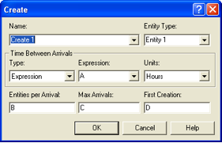
<p class="caption">(\#fig:CreateProblem)CREATE Module</p>
</div>

Specify expressions for A, B, C, and D in the above CREATE module to
properly generate customers for the T-Shirt Stand.

-   A: $\underline{\hspace{3cm}}$

-   B: $\underline{\hspace{3cm}}$

-   C: $\underline{\hspace{3cm}}$

-   D: $\underline{\hspace{3cm}}$

***

\BeginKnitrBlock{exercise}<div class="exercise"><span class="exercise" id="exr:ch4P30"><strong>(\#exr:ch4P30) </strong></span>Suppose that a customer arriving to the drive through pharmacy will decide to balk if
the number of cars waiting in line is 4 or more. A customer is said to
*balk* if he or she refuses to enter the system and simply departs
without receiving service. Model this situation using and estimate the
probability that a customer will balk because the line is too long. Run
your model for 1 year, with 20 replications. *Hint* Use the NQ() function.</div>\EndKnitrBlock{exercise}

***

\BeginKnitrBlock{exercise}<div class="exercise"><span class="exercise" id="exr:ch4P40"><strong>(\#exr:ch4P40) </strong></span>Samples of 20 parts from a metal grinding process are selected every hour. Typically 2\% of
the parts need rework. Let X denote the number of parts in the sample of
20 that require rework. A process problem is suspected if X exceeds its
mean by more than 3 standard deviations. Using simulate 30 hours of the
process, i.e. 30 samples of size 20, and estimate the chance that X
exceeds its expected value by more than 1 standard deviation.</div>\EndKnitrBlock{exercise}

***

\BeginKnitrBlock{exercise}<div class="exercise"><span class="exercise" id="exr:ch4P50"><strong>(\#exr:ch4P50) </strong></span>Samples of 20 parts
from a metal grinding process are selected every hour. Typically 2\% of
the parts need rework. Let X denote the number of parts in the sample of
20 that require rework. A process problem is suspected if X exceeds its
mean by more than 1 standard deviations. Each time X exceeds its mean by
more than 1 standard deviations all X of the parts requiring rework are
sent to a rework station. Each part consists of two subcomponents, which
are split off and repaired separately. The splitting process takes 1
worker and lasts U(10, 20) minutes per part. After the subcomponents
have been split, they are repaired in different processes. Subcomponent
1 takes U(5, 10) minutes to repair with 1 worker at its repair process
and subcomponent 2 takes expo(7.5) minutes to repair with 1 worker at
its repair process. Once both of the subcomponents have been repaired,
they are joined back together to form the original part. The joining
process takes 5 minutes with 1 worker. The part is then sent back to the
main production area, which is outside the scope of this problem.
Simulate 8 hours of production and estimate the average time that it
takes a part to be repaired.</div>\EndKnitrBlock{exercise}

***

\BeginKnitrBlock{exercise}<div class="exercise"><span class="exercise" id="exr:ch4P60"><strong>(\#exr:ch4P60) </strong></span>TV sets arrive at a two-inspector station for testing. The time between
arrivals is exponential with a mean of 15 minutes. The inspection time
per TV set is exponential with a mean of 10 minutes. On the average, 82
percent of the sets pass inspection. The remaining 18\% are routed to an
adjustment station with a single operator. Adjustment time per TV set is
uniform between 7 and 14 minutes. After adjustments are made, sets are
routed back to the inspection station to be retested. We are interested
in estimating the total time a TV set spends in the system before it is
released.

Develop a model for this situation. Report the average system
time for the TV sets based on 20 replications of 4800 minutes. Also
report statistics for the average number of times a given TV is
adjusted.</div>\EndKnitrBlock{exercise}

***

\BeginKnitrBlock{exercise}<div class="exercise"><span class="exercise" id="exr:ch4P70"><strong>(\#exr:ch4P70) </strong></span>A simple manufacturing system is staffed by 3 operators. Parts arrive
according to a Poisson process with a mean rate of 2 per minute to a
workstation for a drilling process at one of three identical drill
presses. The parts wait in a single queue until a drill press is
available. Each part has a particular number of holes that need to be
drilled. Each hole takes a Lognormal time to be drilled with an
approximate mean of 1 minute and a standard deviation of 30 seconds.
Once the holes are drilled, the part goes to the grinding operation. At
the grinding operation, one of the 3 available operators grinds out the
burrs on the part. This activity takes approximately 5 minutes plus or
minus 30 seconds. After the grinding operation the part leaves the
system.

Develop model for this situation. Report the average system
time for the parts based on 20 replications of 4800 minutes.</div>\EndKnitrBlock{exercise}

***

\BeginKnitrBlock{exercise}<div class="exercise"><span class="exercise" id="exr:ch4P80"><strong>(\#exr:ch4P80) </strong></span>The Hog BBQ Joint is interested in understanding the flow of customers
for diner (5 pm to 9 pm). Customers arrive in parties of 2, 3, 4, or 5
with probabilities 0.4, 0.3, 0.2, 0.1, respectively. The time between
arrivals is exponentially distributed with a mean of 1.4 minutes.
Customers must arrive prior to 9 pm in order to be seated. The dining
area has 50 tables. Each table can seat 2 people. For parties, with more
than 2 customers, the tables are moved together. Each arriving group
gets in line to be seated. If there are already 6 parties in line, the
arriving group will leave and go to another restaurant. The time that it
takes to be served is triangularly distributed with parameters (14, 19,
24) in minutes. The time that it takes to eat is lognormally distributed
with a mean of 24 minutes and a standard deviation of 5 minutes. When
customers are finished eating, they go to the cashier to pay their bill.
The time that it takes the cashier to process the customers is gamma
distributed with a mean of 1.5 minutes and a standard deviation of 0.5
minutes.

Develop an model for this situation. Simulate 30 days of operation. Make
a table like the following to summarize your results.</div>\EndKnitrBlock{exercise}


                                                       Average   Half-width
  --------------------------------------------------- --------- ------------
              Number of customers served                        
                 Number of busy tables                          
               Number of waiting parties                        
     Number of parties that depart without eating               
                Utilization of cashier                          
           Customer System Time (in minutes)                    
   Probability of waiting to be seated $>$ 5 minutes            

***

\BeginKnitrBlock{exercise}<div class="exercise"><span class="exercise" id="exr:ch4P90"><strong>(\#exr:ch4P90) </strong></span>In the Tie-Dye T-Shirt model, the owner is expecting the business to grow during the
summer season. The owner is interested in estimating the average time to
produce an order and the utilization of the workers if the arrival rate
for orders increases. Re-run the model for 30 eight hour days with the
arrival rate increased by 20, 40, 60, and 80 percent. Will the system
have trouble meeting the demand? Use the statistics to justify your conclusions.</div>\EndKnitrBlock{exercise}

***

\BeginKnitrBlock{exercise}<div class="exercise"><span class="exercise" id="exr:ch4P100"><strong>(\#exr:ch4P100) </strong></span>Suppose that the inspection and packaging process has been split into two processes for
the Tie-Dye T-Shirt system and assume that there an additional worker to
perform inspection. The inspection process is uniformly distributed
between 2 and 5 minutes. After inspection there is a 4 percent chance
that the whole order will have to be scrapped (and redone). If the order
fails inspection, the scrapped order should be counted and a new order
should be initiated into the system. *Hint*: Consider redirecting the
order back to the original SEPARATE module. If the order passes
inspection, it goes to packaging where the packaging time is distributed
according to a triangular distribution with parameters (2, 4, 10) all in
minutes. Re-run the model for 30, 8-hour days, with the arrival rate
increased by 20, 40, 60, and 80%. Will the system have trouble meeting
the demand? In other words, how does the throughput (number of shirts
produced per day) change in response to the increasing demand rate?</div>\EndKnitrBlock{exercise}

***

\BeginKnitrBlock{exercise}<div class="exercise"><span class="exercise" id="exr:ch4P110"><strong>(\#exr:ch4P110) </strong></span>Hungry customers arrive to a Mickey R's drive through restaurant at a
mean rate of 10 per hour according to a Poisson process. Management is
interested in improving the total time spent within the system (i.e.
from arrival to departure with their food).

Management is considering a proposed system that splits the order
taking, payment activity and the order delivery processes. The first
worker will take the orders from an order-taking speaker. This takes on
average 1 minute plus or minus 20 seconds uniformly distributed. When
the order taking activity is completed, the making of the order will
start. It takes approximately 3 minutes (plus or minus 20 seconds) to
make the customer's order, uniformly distributed. Meanwhile, the
customer will be instructed to drive to the first window to pay for the
order. Assume that the time that it takes the customer to move forward
is negligible. The first worker accepts the payment from the customer.
This takes on average 45 seconds plus or minus 20 seconds uniformly
distributed. After paying for the order the customer is instructed to
pull forward to the second window, where a second worker delivers the
order. Assume that the time that it takes the customer to move forward
is negligible.

If the order is not completed by the time the customer reaches the
second window, then the customer must wait for the order to be
completed. If the order is completed before the customer arrives to the
2nd window, then the order must wait for the customer. After both the
order and the customer are at the 2nd window, the 2nd worker packages
the customer's order and gives it to the customer. This takes
approximately 30 seconds with a standard deviation of 10 seconds,
lognormally distributed. After the customer receives their order they
depart.

Simulate this system for the period from 10 am to 2 pm. Report the total
time spent in the system for the customers based on 30 days.</div>\EndKnitrBlock{exercise}

***

\BeginKnitrBlock{exercise}<div class="exercise"><span class="exercise" id="exr:ch4P120"><strong>(\#exr:ch4P120) </strong></span>The city is considering improving its hazardous waste and bulk item drop
off area to improve service. Cars arrive to the drop off area at a rate
of 10 per hour according to a Poisson process. Each car contains items
for drop off. There is a 10% chance that the car will contain 1 item, a
50% chance that the car will contain 2 items, and a 40% chance that the
car will contain 3 items. There is an 80% chance that an item will be
hazardous (e.g. chemicals, light bulbs, electronic equipment, etc.) and
a 20% chance that the item will be a bulk item, which cannot be picked
up in the curbside recycling program. Of the 80% of items that have
hazardous waste, about 10% are for electronic equipment that must be
inspected and taken apart.

A single worker assists the citizen in taking the material out of their
car and moving the material to the recycling center. This typically
takes between 0.5 to 1.5 minutes per item (uniformly distributed) if the
item is not a bulk item. If the item is a bulk item, then the time takes
a minimum of 1 minute, most likely 2.5 minutes, with a maximum of 4
minutes per item triangularly distributed. The worker finishes all items
in a car before processing the next car.

Another worker will begin sorting the items immediately after the item
is unloaded. This process takes 1-2 minutes per item uniformly
distributed. If the item is electronic equipment, the items are placed
in front of a special disassembly station to be taken apart.

The same worker that performs sorting also performs the disassembly of
the electronic parts. Items that require sorting take priority over
items that require disassembly. Each electronic item takes between 8 to
16 minutes uniformly distributed to disassemble.

The hazardous waste recycling center is open for 7 hours per day, 5 days
per week. Simulate 12 weeks of performance and estimate the following
quantities:</div>\EndKnitrBlock{exercise}

-   Utilization of the workers

-   Average waiting time for items waiting to be unloaded

-   Average number of items waiting to be unloaded

-   Average number of items waiting to be sorted

-   Average waiting time of items to be sorted

-   Average number of items waiting to be disassembled

-   Average waiting time for items waiting to be disassembled.

***

\BeginKnitrBlock{exercise}<div class="exercise"><span class="exercise" id="exr:ch4P130"><strong>(\#exr:ch4P130) </strong></span>Orders for street lighting poles require the production of the tapered pole, the base
assembly, and the wiring/lighting assembly package. Orders are released
to the shop floor with an exponential time between arrival of 20
minutes. Assume that all the materials for the order are already
available within the shop floor.

Once the order arrives, the production of the pole begins. Pole
production requires that the sheet metal be cut to a trapezoidal shape.
This process takes place on a cutting shear. After cutting, the pole is
rolled using a press brake machine. This machine rolls the sheet to an
almost closed form. After rolling, the pole is sealed on an automated
welding machine. Each of these processes are uniformly distributed with
ranges $[3, 5]$, $[6,10]$, and $[4,8]$ minutes respectively.

While the pole is being produced, the base is being prepared. The base
is a square metal plate with four holes drilled for bolting the place to
the mounting piece and a large circular hole for attaching the pole to
the base. The base plates are in stock so that only the holes need to be
cut. This is done on a water jet cutting machine. This process takes
approximately 20 minutes plus or minus 2 minutes, triangularly
distributed. After the holes are cut, the plate goes to a
grinding/deburring station, which takes between 10 minutes,
exponentially distributed.

Once the plate and the pole are completed, they are transported to the
inspection station. Inspection takes 20 minutes, exponentially
distributed with 1 operator. There could be a quality problem with the
pole or with the base (or both). The chance that the problem is with the
base is 0.02 and the chance that the problem is with the pole is 0.01.
If either or both have a quality issue, the pole and base go to a rework
station for rework. Rework is performed by a single operator and
typically takes between 100 minutes, exponentially distributed. After
rework, the pole and base are sent to final assembly. If no problems
occur with the pole or the base, the pole and base are sent directly to
final assembly.

At the assembly station, the pole is fixed to the base plate and the
wiring assembly is placed within the pole. This process takes 1 operator
approximately 30 minutes with a standard deviation of 4 minutes
according to a lognormal distribution. After assembly, the pole is sent
to the shipping area for final delivery.

The shop is interested in taking on additional orders which would
essentially double the arrival rate. Estimate the utilization of each
resource and the average system time to produce an order for a lighting
pole. Assume that the system runs 5 days per week, with two, eight hours
shifts per day. Any production that is not completed within 5 days is
continued on the next available shift. Run the model for 10 years
assuming 52 weeks per year to report your results.</div>\EndKnitrBlock{exercise}

***

\BeginKnitrBlock{exercise}<div class="exercise"><span class="exercise" id="exr:ch4P140"><strong>(\#exr:ch4P140) </strong></span>Patients arrive at an emergency room where they are treated and then
depart. Arrivals are exponentially distributed with a mean time between
arrivals of 0.3 hours. Upon arrival, patients are assigned a rating of 1
to 5, depending on the severity of their ailments. Patients in Category
1 are the most severe, and they are immediately sent to a bed where they
await medical attention. All other patients must first wait in the
receiving room until a basic registration form and medical record are
completed. They then proceed to a bed.

The emergency room has three beds, one registration nurse, and two
doctors. In all cases, the priority for allocating these resources is
based on the severity of the ailment. Hint: Read the help for the QUEUE
module and rank the queue by the severity attribute. The registration
time for patients in Categories 2 through 5 is Uniform (0.1, 0.2) hours.
The treatment time for all patients is triangularly distributed with the
minimum, most likely, and maximum values differing according to the
patient's category. The distribution of patients by category and the
corresponding minimum, most likely, and maximum treatment times are
summarized below.
</div>\EndKnitrBlock{exercise}

    Category      1     2      3      4      5
  ------------- ----- ------ ------ ------ ------
     Percent      6     8      18     33     35
     Minimum     0.8   0.7    0.4    0.2    0.1
   Most Likely   1.2   0.95   0.6    0.45   0.35
     Maximum     1.6   1.1    0.75   0.6    0.45

The required responses for this simulation include:

-   Average number of patients waiting for registration

-   Utilization of beds

-   System time of each type of patient and overall (across patient
    types)
    
Using a run length of 30 days, develop a model to estimate the required responses. Report
the responses based on estimating the system time of a patient
regardless of type based on 50 replications.

***

\BeginKnitrBlock{exercise}<div class="exercise"><span class="exercise" id="exr:ch4P150"><strong>(\#exr:ch4P150) </strong></span>Customers enter a fast-food restaurant according to an exponential
inter-arrival time with a mean of 0.7 minutes (use stream 1). Customers
have a choice of ordering one of three kinds of meals: (1) a soft drink,
(2) fries, or (3) soft drink, fries, and a burger. Upon arrive to the
restaurant, the customer enters a single queue, awaits the availability
of a cashier, gives the order to the cashier, then the customer pays the
cashier. After the order is placed, the cooking can begin. The customer
then waits until their order is ready. After receiving the order, the
customer exits. A cashier may not take any additional orders until the
current customer has paid. In this system, there are two cooks and two
cashiers. The time to order and pay is represented by a triangular
distribution with parameters (0.4, 0.8, 1.2) minutes and (0.2, 0.4, 0.6)
minutes, respectively. The cooking time depends on the order as follows:</div>\EndKnitrBlock{exercise}


   Type   Percentage     Cooking Time
  ------ ------------ -------------------
    1        30%       Uniform(0.3,0.8)
    2        15%       Uniform(0.8,1.1)
    3        55%       Uniform(1.0, 1.4)

Model the system for 8 hours of operation with 30 replications. Make a
table like the following to summarize your answers for your
replications.

                                        Average   Half-width
  ------------------------------------ --------- ------------
           Type 1 Throughput                     
           Type 2 Throughput                     
           Type 3 Throughput                     
        Utilization of cashiers                  
          Utilization of cooks                   
   Customer System Time (in minutes)             
   Customer Waiting Time (in minutes)            
   Probability of wait $>$ 5 minutes             

***

\BeginKnitrBlock{exercise}<div class="exercise"><span class="exercise" id="exr:ch4P160"><strong>(\#exr:ch4P160) </strong></span>Create a model to simulate observations from a $N(\mu, \sigma^2)$ random variable. Use your
simulation to generate two independent samples of size $n_1 = 20$ and
$n_2 = 30$ from normal distributions
having $\mu_1 = 2$, $\sigma_1^2 = 0.64$ and  $\mu_2 = 2.2, \sigma_2^2 = 0.64$.
Assume that you don't know the true means and variances. Use the method
of independent samples to test whether $\mu_2 > \mu_1$.</div>\EndKnitrBlock{exercise}

***

\BeginKnitrBlock{exercise}<div class="exercise"><span class="exercise" id="exr:ch4P170"><strong>(\#exr:ch4P170) </strong></span>Create a model to simulate observations from a $N(\mu, \sigma^2)$ random variable. Use your
simulation to generate two independent samples of size $n_1 = 20$ and
$n_2=30$ from normal distributions having
$\mu_1 = 2$, $\sigma_1^2 = 0.64$, and  $\mu_2 = 2.2$, $\sigma_2^2 = 0.36$. Assume
that you don't know the true means and variances. Use the method of
independent samples to test whether $\mu_2 > \mu_1$.</div>\EndKnitrBlock{exercise}

***

\BeginKnitrBlock{exercise}<div class="exercise"><span class="exercise" id="exr:ch4P180"><strong>(\#exr:ch4P180) </strong></span>Create a model to simulate observations from a $N(\mu, \sigma^2)$ random variable. Use your
simulation to generate two independent samples of size $n_1 = 30$ and
$n_2 = 30$ from normal distributions having
$\mu_1 = 2$, $\sigma_1^2 = 0.64$ and $\mu_2 = 2.2$, $\sigma_2^2 = 0.36$. Assume
that you don't know the true means and variances. Use the paired-t
method to test whether $\mu_2 > \mu_1$.</div>\EndKnitrBlock{exercise}

***

\BeginKnitrBlock{exercise}<div class="exercise"><span class="exercise" id="exr:ch4P190"><strong>(\#exr:ch4P190) </strong></span>Create a model to simulate observations from a $N(\mu, \sigma^2)$ random variable. Use your
simulation to generate two dependent samples of size $n_1 = 30$ and
$n_2 = 30$ from normal distributions having
$\mu_1 = 2$, $\sigma_1^2 = 0.64$ and $\mu_2 = 2.2$, $\sigma_2^2 = 0.36$. Use the method of common random number.  Assume that you don't know the true means and variances. Use the paired-t
method to test whether $\mu_2 > \mu_1$.</div>\EndKnitrBlock{exercise}

***

\BeginKnitrBlock{exercise}<div class="exercise"><span class="exercise" id="exr:ch4P200"><strong>(\#exr:ch4P200) </strong></span>Jobs arrive in batches of ten items each. The inter-arrival time is EXPO(2) hours. The
machine shop contains 2 milling machines and one drill press. About 30%
of the items require drilling before being processed on the milling
machine. Drilling time per item is UNIF(10, 15) minutes. The milling
time is EXPO(15) minutes for items that do not require drilling, and
UNIF(15,20) for items that do. Assume that the shop has two 8-hour
shifts each day and that you are only interested in the *first* shift's
performance. Any jobs left over at the end of the first shift are left
to be processed by the second shift. Estimate the average number of jobs
left for the second shift to complete at the end of the first shift to
within plus or minus 5 jobs with 95\% confidence. What is your
replication length? Number of replications? Determine the utilization of
the drill press and the milling machines as well as the average time an
item spends in the system.
</div>\EndKnitrBlock{exercise}

***

\BeginKnitrBlock{exercise}<div class="exercise"><span class="exercise" id="exr:ch4P210"><strong>(\#exr:ch4P210) </strong></span>A repair and inspection facility consists of two stations, a repair station with two
technicians, and an inspection station with 1 inspector. Each repair
technician works at a rate of 3 items per hour, while the inspector can
inspect 8 items per hour each exponentially distributed. Approximately
10\% of all items fail inspection and are sent back to the repair station
(this percentage holds even for items that have been repaired two to
three times). If an item fails inspection three times then it is
scrapped. When an item is scrapped, the item is sent to a disassembly
station to recover the usable parts. At the disassembly station, the
items wait in a queue until a technician is available. The disassembly
time is distributed according to a Lognormal distribution with a mean of
20 minutes and a standard deviation of 10 minutes. Assume that items
arrive according to a Poisson arrival process with a rate of 4 per hour.
The weekly performance of the system is the key objective of this
simulation analysis. Assume that the system starts empty and idle on
Monday mornings and runs continuously for 2 shifts per day for 5 days.
Any jobs not completed by the end of $2^{nd}$ shift are carried over to
the $1^{st}$ shift of the next day. Any jobs left over at the end of the
week are handled by a separate weekend staff that is not of concern to
the current study. Estimate the following:
  </div>\EndKnitrBlock{exercise}
-   The average system time of items that pass inspection on the first
    attempt. Measure this quantity such that you are 95\% confident to
    within +/- 3 minutes.

-   The average number of jobs completed per week.

a. Sketch an activity diagram for this situation.

b. Assume that there are 2 technicians at the repair station, 1 inspector at the
inspection station, and 1 technician at the disassembly station. Develop
a model for this situation.

c. Assume that there are 2 technicians at the repair station and 1 inspector at the
inspection station. The disassembly station is also staffed by the 2
technicians that are assigned to the repair station. Develop a model for this situation.

***

\BeginKnitrBlock{exercise}<div class="exercise"><span class="exercise" id="exr:ch4P220"><strong>(\#exr:ch4P220) </strong></span>As part of a diabetes prevention program, a clinic is considering
setting up a screening service in a local mall. They are considering two
designs: Design A: After waiting in a single line, each walk-in patient
is served by one of three available nurses. Each nurse has their own
booth, where the patient is first asked some medical health questions,
then the patient's blood pressure and vitals are taken, finally, a
glucose test is performed to check for diabetes. In this design, each
nurse performs the tasks in sequence for the patient. If the glucose
test indicates a chance of diabetes, the patient is sent to a separate
clerk to schedule a follow-up at the clinic. If the test is not
positive, then the patient departs.

Design B: After waiting in a single line, each walk-in is served in
order by a clerk who takes the patient's health information, a nurse who
takes the patient's blood pressure and vitals, and another nurse who
performs the diabetes test. If the glucose test indicates a chance of
diabetes, the patient is sent to a separate clerk to schedule a
follow-up at the clinic. If the test is not positive, then the patient
departs. In this configuration, there is no room for the patient to wait
between the tasks; therefore, a patient who as had their health
information taken cannot move ahead unless the nurse taking the vital
signs is available. Also, a patient having their glucose tested must
leave that station before the patient in blood pressure and vital
checking can move ahead.

Patients arrive to the system according to a Poisson arrival process at
a rate of 9.5 per hour (stream 1). Assume that there is a 5% chance
(stream 2) that the glucose test will be positive. For design A, the
time that it takes to have the paperwork completed, the vitals taken,
and the glucose tested are all log-normally distributed with means of
6.5, 6.0, and 5.5 minutes respectively (streams 3, 4, 5). They all have
a standard deviation of approximately 0.5 minutes. For design B, because
of the specialization of the tasks, it is expected that the mean of the
task times will decrease by 10\%.

Assume that the clinic is open from 10 am to 8 pm (10
hours each day) and that any patients in the clinic before 8 pm are
still served. The distribution used to model the time that it takes to
schedule a follow up visit is a WEIB(2.6, 7.3) distribution using stream 6.

Make a statistically valid recommendation as to the best design based on
the average system time of the patients. We want to be 95\% confident of
our recommendation to within 2 minutes.
</div>\EndKnitrBlock{exercise}

***

\BeginKnitrBlock{exercise}<div class="exercise"><span class="exercise" id="exr:ch4P230"><strong>(\#exr:ch4P230) </strong></span>A copy center has one fast copier
and one slow copier. The copy time per page for the fast copier is
thought to be lognormally distributed with a mean of 1.6 seconds and a
standard deviation of 0.3 seconds. A co-op Industrial Engineering
student has collected some time study data on the time to copy a page
for the slow copier. The times, in seconds, are given in the data set associated with Exercise \@ref(exr:AppDistFitP13).

The copy times for the slow and fast copiers are given on a per page
basis. Thus, the total time to perform a copy job of N pages is the sum
of the copy times for the N individual pages. Each individual page's
time is random.

Customers arrive to the copy center according to a Poisson process with
a mean rate of 1 customer every 40 seconds. The number of copies
requested by each customer is equally likely over the range of 10 and 50
copies. The customer is responsible for filling out a form that
indicates the number of copies to be made. This results in a copy job
which is processed by the copying machines in the copy center. The
copying machines work on the entire job at one time.

The policy for selecting a copier is as follows: If the number of copies
requested is less than or equal to 30, the slow copier will be used. If
the number of copies exceeds 30, the fast copier will be used, with one
exception: If no jobs are in queue on the slow copier and the number
of jobs waiting for the fast copier is at least two, then the customer
will be served by the slow copier. After the customer gives the
originals for copying, the customer proceeds to the service counter to
pay for the copying. Assume that giving the originals for copying
requires no time and thus does not require action by the copy center
personnel. In addition, assume that one cashier handles the payment
counter only so that sufficient workers are available to run the copy
machines. The time to complete the payment transaction is lognormally
distributed with a mean of 20 seconds and a standard deviation of 10
seconds. As soon as both the payment and the copying job are finished,
the customer takes the copies and departs the copying center. The copy
center starts out a day with no customers and is open for 10 hours per
day.

Management has requested that the co-op Industrial Engineer develop a
model because they are concerned that customers have to wait too long
for copies. Recently, several customers complained about long waits.
Their standard is that the probability that a customer waits longer than
4 minutes should be no more than 10\%. They define a customer's waiting
time as the time interval from when the customer enters the store to the
time the customer leaves the store with their completed copy job. If the
waiting time criteria is not met, several options are available: The
policy for allocating jobs to the fast copier could be modified or the
company could purchase an additional copier which could be either a slow
copier or a fast copier.

Develop a model for this problem. Based on 25 replications, report in
table form, the appropriate statistics on the waiting time of customers,
the daily throughput of the copy center, and the utilization of the
payment clerk. In addition estimate the probability that a customer
spends in the system is longer than 4 minutes.</div>\EndKnitrBlock{exercise}

***

\BeginKnitrBlock{exercise}<div class="exercise"><span class="exercise" id="exr:ch4P240"><strong>(\#exr:ch4P240) </strong></span>Passengers arrive at
an airline terminal according to an exponential distribution for the
time between arrivals with a mean of 1.5 minutes (stream 1). Of the
arriving passengers 7\% are frequent flyers (stream 2). The time that it
takes the passenger to walk from the main entrance to the check-in
counter is uniform between 2.5 and 3.5 minutes (stream 3). Once at the
counter the travellers must wait in a single line until one of four
agents is available to serve them. The check-in time (in minutes) is
Gamma distributed with a mean of 5 minutes and a standard deviation of 4
minutes (stream 4). When their check-in is completed, passengers with
carry-on only go directly to security. Those with a bag to check, walk
to another counter to drop their bag. The time to walk to bag check is
uniform(1,2) minutes (stream 9). Since the majority of the flyers are
business, only 25\% of the travellers have a bag to check (stream 5). At
the baggage check, there is a single line served by one agent. The time
to drop off the bag at the bag check stations is lognormally distributed
with a mean of 2 minutes and a standard deviation of 1 minute (stream
6). After dropping off their bags, the traveller goes to security. The
time to walk to security (either after bag check or directly from the
check in counter) is exponentially distributed with a mean of 8 minutes
(stream 10). At the security check point, there is a single line, served
by two TSA agents. The TSA agents check the boarding passes of the
passengers. The time that it takes to check the boarding pass is
triangularly distributed with parameters (2, 3, 4) minutes (stream 7).
After getting their identity checked, the travellers go through the
screening process. We are not interested in the screening process.
However, the time that it takes to get through screening is distributed
according to a triangular distribution with parameters (5, 7, 9) minutes
(stream 8). After screening, the walking time to the passenger's gate is
exponentially distributed with a mean of 5 minutes (stream 11).

We are interested in estimating the average time it takes from arriving
at the terminal until a passenger gets to their gate. This should be
measured overall and by type (frequent flyer versus non-frequent flyer).

Assume that the system should be studied for 16 hours per day.

</div>\EndKnitrBlock{exercise}
a. Report the average and 95\% confidence interval half-width on the following based on
the simulation of 10 days of operation. Report all time units in
minutes.

  Statistic                                    Average   Half-Width
  ------------------------------------------- --------- ------------
  Utilization of the check-in agents                    
  Utilization of the TSA agents                         
  Utilization of the Bag Check agent                    
  Frequent Flyer Total time to Gate                     
  Non-Frequent Flyer Total time to Gate                 
  Total time to Gate regardless of type                 
  Number of travellers in the system                    
  Number of travellers waiting for check-in             
  Number of travellers waiting for security             
  Time spent waiting for check-in                       
  Time spent waiting for security                       

b. Based on the results of part (a) determine the number of replications
necessary to estimate the total time to reach their gate regardless of
type to within $\pm$ 1 minute with 95\% confidence.

***

\BeginKnitrBlock{exercise}<div class="exercise"><span class="exercise" id="exr:ch4P250"><strong>(\#exr:ch4P250) </strong></span>Consider the testing and repair
shop. Suppose instead of increasing the overall arrival rate of jobs to
the system, the new contract will introduce a new type of component into
the system that will require a new test plan sequence. The following two
tables represent the specifics associated with the new testing plan.</div>\EndKnitrBlock{exercise}


  Test Plan    \% of parts   Sequence
  ----------- ------------- ----------
  1                20%       2,3,2,1
  2               12.5%        3,1
  3               37.5%       1,3,1
  4                20%         2,3
  5                10%        2,1,3

  Test Plan           Testing Time Parameters           Repair Time Parameters
  ----------- ---------------------------------------- ------------------------
  1            (20,4.1), (12,4.2), (18,4.3), (16,4.0)         (30,60,80)
  2                        (12,4), (15,4)                     (45,55,70)
  3                 (18,4.2), (14,4.4), (12,4.3)              (30,40,60)
  4                        (24,4), (30,4)                     (35,65,75)
  5                  (20,4.1), (15,4), (12,4.2)               (20,30,40)

Management is interested in understanding where the potential bottlenecks are
in the system and in developing alternatives to mitigate those
bottlenecks so that they can still handle the contract. The new contract
stipulates that 80% of the time the testing and repairs should be
completed within 480 minutes. The company runs 2 shifts each day for
each 5 day work week. Any jobs not completed at the end of the second
shift are carried over to first shift of the next working day. Assume
that the contract is going to last for 1 year (52 weeks). Build a
simulation model that can assist the company in assessing the risks
associated with the new contract.

***

\BeginKnitrBlock{exercise}<div class="exercise"><span class="exercise" id="exr:ch4P260"><strong>(\#exr:ch4P260) </strong></span>Parts arrive at a 4 workstation
system according to an exponential inter-arrival distribution with a
mean of 10 minutes. The workstation A has 2 machines. The three
workstations (B, C, D) each have a single machine. There are 3 part
types, each with an equal probability of arriving. The process plan for
the part types are given below. The entries are for exponential
distributions with the mean processing time (MPT) parameter given.
</div>\EndKnitrBlock{exercise}

  ------------------ ------------------ ------------------
  Workstation, MPT    Workstation, MPT   Workstation, MPT
  A, 9.5                  C, 14.1             B, 15
  A, 13.5                  B, 15              C, 8.5
  A, 12.6                 B, 11.4             D, 9.0
  ------------------ ------------------ ------------------

Assume that the transfer time between arrival and the first station,
between all stations, and between the last station and the system exit
is 3 minutes.Using the ROUTE, SEQUENCE, and STATION modules, simulate
the system for 30000 minutes and discuss the potential bottlenecks in
the system.

***

<!-- # ```{exercise, label="ch4P270"} -->
<!-- #  -->
<!-- # ``` -->
<!-- #  -->
<!-- # *** -->
<!-- #  -->
<!-- # ```{exercise, label="ch4P280"} -->
<!-- #  -->
<!-- # ``` -->
<!-- #  -->
<!-- # *** -->
