# Statistical Analysis for Infinite Horizon Simulation Models {#ch5}

**[LEARNING OBJECTIVES]{.smallcaps}**

-   To understand the concept of steady state analysis and the implications of modeling an infinite horizon system.

-   To be able to analyze infinite horizon simulations via the method of replication-deletion

-   To be able to analyze infinite horizon simulations via the method of batch means 

-   To be able to perform sequential sampling for an infinite horizon model

-   To be able to apply verification and validation methods

This chapter discusses how to plan and analyze infinite horizon
simulations. When analyzing infinite horizon simulations, the primary
difficulty is the nature of observations from within a replication. In the finite
horizon case, the statistical analysis is based on three basic
requirements:

1.  Observations are independent

2.  Observations are sampled from identical distributions

3.  Observations are drawn from a normal distribution (or enough
    observations are present to invoke the central limit theorem)

In Chapter \@ref(ch3), these requirements were met by performing independent replications of
the simulation to generate a random sample. Simulating independent replications is natural when performing an analysis of a finite horizon model. In the case of a finite horizon model, there are very well determined initial and ending conditions.  Initial conditions refer to the
starting conditions for the model, i.e. whether or not the system starts
"empty and idle\". The challenge of performing an infinite horizon simulation is that there are, in essence, no initial and ending conditions.  We often call infinite horizon simulation by the term steady state simulation. This is because, in this context, we want to measure the performance of the system after a long time (i.e. under steady state conditions). The effect of initial conditions on steady state performance measures will be discussed in this chapter.

In a direct sense, the outputs from within a replication do not satisfy the requirements of producing a random sample (IID observations); however, certain procedures can be imposed on the manner in which the observations are gathered to ensure that these statistical assumptions
are not grossly violated. The following section will first explain why within
replication observations typically violate these assumptions and then we will
explore some methods for mitigating the violations within the context of
infinite horizon simulations.  

The chapter ends with an illustration of methods to verify and validate a simulation model.  The analysis will rely on concepts of queueing theory (see Appendix \@ref(app:qtAndInvT)) and the use of analytical formulas that apply to steady state queueing systems.

## A Spreadsheet Example {#ch5:MM1Spreadsheet}

To illustrate the challenges related to infinite horizon simulations, a
simple spreadsheet simulation was developed for a M/M/1 queue as introduced in Chapter \@ref(ch2). The  spreadsheet model is provided in the spreadsheet file
*MM1-QueueingSimulation.xlsm* that accompanies this chapter. The
immediate feedback from a spreadsheet model should facilitate
understanding the concepts. Consider a single server queuing system as
illustrated Figure \@ref(fig:SingleServerQ).

(\#fig:SingleServerQ)Single server queueing system

For a single server queueing system, there is an equation that allows
the computation of the waiting times of each of the customers based on
knowledge of the arrival and service times. Let $X_1, X_2, \ldots$
represent the successive service times and $Y_1, Y_2, \ldots$ represent
the successive inter-arrival times for each of the customers that visit
the queue. Let $E[Y_i] = 1/\lambda$ be the mean of the inter-arrival
times so that $\lambda$ is the mean arrival rate. Let $E[Y_i] = 1/\mu$
be the mean of the service times so that $\mu$ is the mean service rate.
Let $W_i$ be the waiting time in the queue for the $i^{th}$ customer.
That is, the time between when the customer arrives until they enter
service.

Lindley's equation, see [@gross1998fundamentals], relates the waiting
time to the arrivals and services as follows:

$$W_{i+1} = max(0, W_i + X_i - Y_i)$$

The relationship says that the time that the $(i + 1)^{st}$ customer
must wait is the time the $i^{th}$ waited, plus the $i^{th}$ customer's
service time, $X_i$ (because that customer is in front of the $i^{th}$
customer), less the time between arrivals of the $i^{th}$ and
$(i + 1)^{st}$ customers, $Y_i$. If $W_i + X_i - Y_i$ is less than zero,
then the ($(i + 1)^{st}$ customer arrived after the $i^{th}$ finished
service, and thus the waiting time for the $(i + 1)^{st}$ customer is
zero, because his service starts immediately.

Suppose that $X_i \sim exp(E[X_i] = 0.7)$ and
$Y_i \sim exp(E[Y_i] = 1.0)$. This is a M/M/1 queue with $\lambda$ = 1
and $\mu$ = 10/7. Thus, using the equations given in
Chapter \@ref(ch2) or Appendix \@ref(app:qtAndInvT), yields:

$$\rho = 0.7$$

$$L_q = \dfrac{0.7 \times 0.7}{1 - 0.7} = 1.6\bar{33}$$

$$W_q = \dfrac{L_q}{\lambda} = 1.6\bar{33} \; \text{minutes}$$

The spreadsheet model involves generating $X_i$ and $Y_i$ as well as
implementing Lindley's equation within the rows of the spreadsheet.
Figure \@ref(fig:SpreadsheetLindley) shows some sample output from the
simulation. The simulation was initialized with $X_0$ = 0 and random
draws for $X_0$ and $Y_0$. The generated values for $X_i$ and $Y_i$ are
based on the inverse transform technique for exponential random
variables with the cell formulas given in cells D24 and E24, as shown in
Figure \@ref(fig:SpreadsheetLindleyFormulas).

(\#fig:SpreadsheetLindley)Spreadsheet for Lindley's equation

(\#fig:SpreadsheetLindleyFormulas)Spreadsheet formulas for queueing simulation

Figure \@ref(fig:SpreadsheetLindleyFormulas) shows that cell F25 is based on
the value of cell F24. This implements the recursive nature of Lindley's
formula. Column G holds the cumulative sum:

$$\sum_{i=1}^n W_i \; \text{for} \; n = 1,2,\ldots$$

and column H holds the cumulative average

$$\dfrac{1}{n} \sum_{i=1}^n W_i \; \text{for} \; n = 1,2,\ldots$$

Thus, cell H26 is the average of the first two customers, cell H27 is
the average of the first 3 customers, and so forth. The final cell of
column H represents the average of all the customer waiting times.

Figure \@ref(fig:Results1000) shows the results of the simulation
across 1000 customers. The analytical results indicate that the true
long-run expected waiting time in the queue is 1.633 minutes. The
average over the 1000 customers in the simulation is 1.187 minutes.
Figure \@ref(fig:Results1000) indicates that the sample average is
significantly lower than the true expected average.
Figure \@ref(fig:CumAvgWait1000) presents the cumulative average plot
of the first 1000 customers. As seen in the plot, the cumulative average
starts out low and then eventually trends towards 1.2 minutes.

(\#fig:Results1000)Results across 1000 customers

(\#fig:CumAvgWait1000)Cumulative average waiting time of 1000 customers

The first issue to consider with this data is independence. To do this
you should analyze the 1000 observations in terms of its
autocorrelation. From Figure \@ref(fig:ACFPlot), it is readily apparent that the
data has strong positive correlation using the methods discussed in
Appendix \@ref(app:idm). The lag-1
correlation for this data is estimated to be about 0.9.
Figure \@ref(fig:Lag1Dependence) clearly indicates the strong first
order linear dependence between $W_i$ and $W_{i-1}$. This positive
dependence implies that if the previous customer waited a long time the
next customer is likely to wait a long time. If the previous customer
had a short wait, then the next customer is likely to have a short wait.
This makes sense with respect to how a queue operates.

(\#fig:ACFPlot)Autocorrelation plot for waiting times

(\#fig:Lag1Dependence)Lag 1 dependence for waiting times

Strong positive correlation has serious implications when developing
confidence intervals on the mean customer waiting time because the usual
estimator for the sample variance:

$$S^2(n) = \dfrac{1}{n - 1} \sum_{i=1}^n (X_i - \bar{X})^2$$

is a **biased** estimator for the true population variance when there is
correlation in the observations. This issue will be re-examined when
ways to mitigate these problems are discussed.

The second issue that needs to be discussed is that of the
non-stationary behavior of the data. As discussed in
Appendix \@ref(app:idm),
non-stationary data indicates some dependence on time. More generally,
non-stationary implies that the $W_1, W_2,W_3, \ldots, W_n$ are not
obtained from identical distributions.

Why should the distribution of $W_1$ not be the same as the distribution
of $W_{1000}$? The first customer is likely to enter the queue with no
previous customers present and thus it is very likely that the first
customer will experience little or no wait (the way $W_0$ was initialize
in this example allows a chance of waiting for the first customer).
However, the $1000^{th}$ customer may face an entirely different
situation. Between the $1^{st}$ and the $1000^{th}$ customer there might
likely be a line formed. In fact from the M/M/1 formula, it is known
that the steady state expected number in the queue is 1.633. Clearly,
the conditions that the $1^{st}$ customer faces are different than those faced by the
$1000^{th}$ customer. Thus, the distributions of their waiting times are
likely to be different.

Recall the definition of covariance stationary from
Appendix \@ref(app:idm). A time
series, $W_1, W_2,W_3, \ldots, W_n$ is said to be *covariance
stationary* if:

-   The mean exists and $\theta = E[X_i]$, for i = 1,2,$\ldots$, n

-   The variance exists and $Var[X_i] = \sigma^2$ $>$ 0, for i =
    1,2,$\ldots$, n

-   The lag-k autocorrelation, $\rho_k = cor(X_i, X_{i+k})$, is not a
    function of *i*, i.e. the correlation between any two points in the
    series does not depend upon where the points are in the series, it
    depends only upon the distance between them in the series.

In the case of the customer waiting times, you should conclude from the
discussion that it is very likely that $\theta \neq E[X_i]$ and
$Var[X_i] \neq \sigma^2$ for *each* i = 1,2,$\ldots$, n for the time
series.

Do you think that is it likely that the distributions of $W_{9999}$ and
$W_{10000}$ will be similar? The argument, that the $9999^{th}$ customer
is on average likely to experience similar conditions as the
$10000^{th}$ customer, sure seems reasonable.
Figure \@ref(fig:MultipleSamplePaths) shows 10 different replications of
the cumulative average for a 10000 customer simulation. This was
developed using the sheet labeled 10000-Customers.

(\#fig:MultipleSamplePaths)Multiple sample paths of queueing simulation

From the figure, you can see that the cumulative average plots can vary
significantly over the 10000 customers with the average tracking above
the true expected value, below the true expected value, and possibly
towards the true expected value. Each of these plots was generated by
pressing the F9 function key to have the spreadsheet recalculate with
new random numbers and then capturing the observations onto another
sheet for plotting. Essentially, this is like running a new replication.
You are encouraged to try generating multiple sample paths using the
provided spreadsheet. For the case of 10000 customers, you should notice
that the cumulative average starts to approach the expected value of the
steady state mean waiting time in the queue with increasing number of
customers. This is the law of large numbers in action. It appears that
it takes a period of time for the performance measure to *warm up*
towards the true mean. Determining the warm up time will be the basic
way to mitigate the problem of non-identical distributions.

From this discussion, you should conclude that the second basic
statistical assumption of identically distributed data is not valid for
within replication data. From this, you can also conclude that it is
very likely that the data are not normally distributed. In fact, for the
M/M/1 queue, it can be shown that the steady state distribution for the waiting
time in the queue is not a normal distribution. Thus, all three of the
basic statistical assumptions are violated for the within replication
observations generated for this example. The problems associated with observations from within a replication need to be addressed in order to properly analyze infinite horizon simulation experiments.

## Statistical Analysis Techniques for Warmup Detection

There are two basic methods for performing infinite horizon simulations.
The first is to perform multiple replications. This approach addresses
independence and normality in a similar fashion as the finite horizon
case, but special procedures will be needed to address the
non-stationary aspects of the data. The second basic approach is to work
with one very long replication. Both of these methods depend on first
addressing the problem of the non-stationary aspects of the data. The
next section looks at ways to mitigate the non-stationary aspect of
within-replication data for infinite horizon simulations.

### Assessing the Effect of Initial Conditions {#ch5s4sb1}

Consider the output stochastic process $X_i$ of the simulation. Let
$F_i(x|I)$ be the conditional cumulative distribution function of $X_i$
where $I$ represents the initial conditions used to start the simulation
at time 0. If $F_i(x|I)  \rightarrow F(x)$ when $i \rightarrow \infty$,
for all initial conditions $I$, then $F(x)$ is called the steady state
distribution of the output process. [@law2007simulation].

In infinite horizon simulations, estimating parameters of the steady
state distribution, $F(x)$, such as the steady state mean, $\theta$, is
often the key objective. The fundamental difficulty associated with
estimating steady state performance is that unless the system is
initialized using the steady state distribution (which is not known),
there is no way to directly observe the steady state distribution.

It is true that if the steady state distribution exists and you run the
simulation long enough the estimators will tend to converge to the
desired quantities. Thus, within the infinite horizon simulation
context, you must decide on how long to run the simulations and how to
handle the effect of the *initial conditions* on the estimates of
performance. The initial conditions of a simulation represent the state
of the system when the simulation is started. For example, in simulating
the pharmacy system, the simulation was started with no customers in
service or in the line. This is referred to as *empty and idle*. The
initial conditions of the simulation affect the rate of convergence of
estimators of steady state performance.

Because the distributions $F_i(x|I)$ at the start of the replication
tend to depend more heavily upon the initial conditions, estimators of
steady state performance such as the sample average, $\bar{X}$, will
tend to be *biased*. A point estimator, $\hat{\theta}$, is an *unbiased*
estimator of the parameter of interest, $\theta$, if
$E[\hat{\theta}] = \theta$. That is, if the expected value of the
sampling distribution is equal to the parameter of interest then the
estimator is said to be unbiased. If the estimator is biased then the
difference, $E[\hat{\theta}] - \theta$, is called the bias of the
estimator $\hat{\theta}$.

Note that any individual difference between the true parameter,
$\theta$, and a particular observation, $X_i$, is called error,
$\epsilon_i = X_i -\theta$. If the expected value of the errors is not
zero, then there is bias. A particular observation is not biased. Bias
is a property of the estimator. Bias is analogous to being consistently
off target when shooting at a bulls-eye. It is as if the sights on your
gun are crooked. In order to estimate the bias of an estimator, you must
have multiple observations of the estimator. Suppose that you are
estimating the mean waiting time in the queue as per the previous
example and that the estimator is based on the first 20 customers. That
is, the estimator is:

$$\bar{W}_r = \dfrac{1}{20}\sum_{i=1}^{20} W_{ir}$$

and there are $r = 1, 2, \ldots 10$ replications.
Table \@ref(tab:IBTable20Cust)
shows the sample average waiting time for the first 20 customers for 10
different replications. In the table, $B_r$ is an estimate of the bias
for the $r^{th}$ replication, where $W_q = 1.6\bar{33}$. Upon averaging
across the replications, it can be seen that $\bar{B}= -0.9536$, which
indicates that the estimator based only on the first 20 customers has
significant negative bias, i.e. on average it is less than the target
value.

::: {#tab:IBTable20Cust}
    r          $\bar{W}_r$          $B_r = \bar{W}_r - W_q$
  ----- -------------------------- -------------------------
    1            0.194114                  -1.43922
    2            0.514809                  -1.11852
    3            1.127332                   -0.506
    4            0.390004                  -1.24333
    5            1.05056                   -0.58277
    6            1.604883                  -0.02845
    7            0.445822                  -1.18751
    8            0.610001                  -1.02333
    9            0.52462                   -1.10871
    10           0.335311                  -1.29802
         $\bar{\bar{W}}$ = 0.6797     $\bar{B}$ = -0.9536

  Table: (\#tab:IBTable20Cust) Ten replications of 20 customers
:::

This is the so called *initialization bias problem* in steady state
simulation. Unless the initial conditions of the simulation can be
generated according to $F(x)$, which is not known, you must focus on
methods that detect and/or mitigate the presence of initialization bias.

One strategy for initialization bias mitigation is to find an index,
$d$, for the output process, ${X_i}$, so that ${X_i; i = d + 1, \ldots}$
will have substantially similar distributional properties as the steady
state distribution $F(x)$. This is called the simulation warm up
problem, where $d$ is called the warm up point, and ${i = 1,\ldots,d}$
is called the warm up period for the simulation. Then the estimators of
steady state performance are based only on ${X_i; i = d + 1, \ldots}$.

For example, when estimating the steady state mean waiting time for each
replication $r$ the estimator would be:

$$\bar{W_r} = \dfrac{1}{n-d}\sum_{i=d+1}^{n} W_{ir}$$

For time-based performance measures, such as the average number in
queue, a time $T_w$ can be determined past which the data collection
process can begin. Estimators of time-persistent performance such as the
sample average are computed as:

$$\bar{Y}_r = \dfrac{1}{T_e - T_w}\int_{T_w}^{T_e} Y_r(t)\mathrm{d}t$$

(\#fig:WarmUpPeriod)The concept of the warm up period

Figure \@ref(fig:WarmUpPeriod) show the concept of a warm up period for a
simulation replication. When you perform a simulation, you can easily
specify a time-based warm up period using the Run $>$ Setup $>$
Replication Parameters panel. In fact, even for observation based data,
it will be more convenient to specify the warm up period in terms of
time. A given value of $T_w$ implies a particular value of $d$ and vice
a versa. Specifying a warm up period, causes an event to be scheduled
for time $T_w$. At that time, all the accumulated statistical counters
are cleared so that the net effect is that statistics are only collected
over the period from $T_w$ to $T_e$. The problem then becomes that of
finding an appropriate warm up period.

Before proceeding with how to assess the length of the warm up period,
the concept of steady state needs to be further examined. This subtle
concept is often misunderstood or misrepresented. Often you will hear
the phrase: *The system has reached steady state*. The correct
interpretation of this phrase is that the distribution of the desired
performance measure has reached a point where it is sufficiently similar
to the desired steady state distribution. Steady state is a concept
involving the **performance measures** generated by the system as time goes
to infinity. However, sometimes this phrase is interpreted incorrectly
to mean that the system *itself* has reached steady state. **Let me state
emphatically that the system never reaches steady state**. If the system
itself reached steady state, then by implication it would never change
with respect to time. It should be clear that the system continues to
evolve with respect to time; otherwise, it would be a very boring
system! Thus, it is incorrect to indicate that the system has reached
steady state. Because of this, **do not** to use the phrase: *The system has
reached steady state*.

Understanding this subtle issue raises an interesting implication
concerning the notion of deleting data to remove the initialization
bias. Suppose that the state of the system at the end of the warm up
period, $T_w$, is exactly the same as at $T = 0$. For example, it is
certainly possible that at time $T_w$ for a particular replication that
the system will be empty and idle. Since the state of the system at $T_w$ is
the same as that of the initial conditions, there will be no effect of
deleting the warm up period for this replication. In fact there will be
a negative effect, in the sense that data will have been thrown away for
no reason. Deletion methods are predicated on the likelihood that the
state of the system seen at $T_w$ is more representative of steady state
conditions. At the end of the warm up period, the system can be in *any
of the possible* states of the system. Some states will be more likely
than others. If multiple replications are made, then at $T_w$, each
replication will experience a different set of conditions at $T_w$. Let
$I_{T_w}^r$ be the initial conditions (state) at time $T_w$ on
replication $r$. By setting a warm up period and performing multiple
replications, you are in essence sampling from the distribution
governing the state of the system at time $T_w$. If $T_w$ is long
enough, then on average across the replications, you are more likely to
start collecting data when the system in states that are more
representative over the long term (rather than just empty and idle).

Many methods and rules have been proposed to determine the warm up
period. The interested reader is referred to [@wilson1978a], @lada2003a,
[@Litton:2002aa], @white2000a, @cash1992, and [@rossetti1995control] for
an overview of such methods. This discussion will concentrate on the
visual method proposed in [@welch1983a] called the Welch Plot.

### Using a Welch Plot to Detect the Warmup Period

The basic idea behind Welch's graphical procedure is simple:

-   Make $R$ replications. Typically, $R \geq 5$ is recommended.

-   Let $Y_{rj}$ be the $j^{th}$ observation on replication $r$ for
    $j = 1,2,\cdots,m_r$ where $m_r$ is the number of observations in
    the $r^{th}$ replication, and $r = 1,2,\cdots,n$,

-   Compute the averages across the replications for each
    $j = 1, 2, \ldots, m$, where $m = min(m_r)$ for $r = 1,2,\cdots,n$.

    $$\bar{Y}_{\cdot j} = \dfrac{1}{n}\sum_{r=1}^n Y_{rj}$$

-   Plot, $\bar{Y}_{\cdot j}$ for each $j = 1, 2, \ldots, m$

-   Apply smoothing techniques to $\bar{Y}_{\cdot j}$ for
    $j = 1, 2, \ldots, m$

-   Visually assess where the plots start to converge

Let's apply Welch's procedure to the replications generated from the
Lindley equation simulation. Using the 10 replications stored on sheet
*10Replications*, compute the average across each replication for each
customer. In Figure \@ref(fig:ComputingWelchPlot), cell B2 represents the average across the
10 replications for the $1^{st}$ customer. Column D represents the
cumulative average associated with column B.

(\#fig:ComputingWelchPlot)Computing the averages for the Welch plot

Figure \@ref(fig:CumAvgWelchPlot) is the plot of the cumulative average
(column D) superimposed on the averages across replications (column B).
The cumulative average is one method of smoothing the data. From the
plot, you can infer that after about customer 3000 the cumulative
average has started to converge. Thus, from this analysis you might
infer that $d = 3000$.

(\#fig:CumAvgWelchPlot)Welch plot with superimposed cumulative average Line

When you perform an infinite horizon simulation by specifying a warm up
period and making multiple replications, you are using the method of
*replication-deletion.* If the method of replication-deletion with
$d = 3000$ is used for the current example, a slight reduction in the
bias can be achieved as indicated in
Table \@ref(tab:WarmUp3000).

::: {#tab:WarmUp3000}
    $r$       $\bar{W}_r$ $(d = 0)$        $\bar{W}_r(d = 3000)$          $B_r(d = 0)$         $B_r(d = 3000)$
  -------- ---------------------------- ---------------------------- ---------------------- ----------------------
     1               1.594843                     1.592421                  -0.03849               -0.04091
     2               1.452237                     1.447396                  -0.1811                -0.18594
     3               1.657355                     1.768249                  0.024022               0.134915
     4               1.503747                     1.443251                  -0.12959               -0.19008
     5               1.606765                     1.731306                  -0.02657               0.097973
     6               1.464981                     1.559769                  -0.16835               -0.07356
     7               1.621275                     1.75917                   -0.01206               0.125837
     8               1.600563                     1.67868                   -0.03277               0.045347
     9               1.400995                     1.450852                  -0.23234               -0.18248
     10              1.833414                     1.604855                  0.20008                -0.02848
            $\bar{\bar{W}}$ = 1.573617   $\bar{\bar{W}}$ = 1.603595   $\bar{B}$ = -0.05972   $\bar{B}$ = -0.02974
                    s = 0.1248                   s = 0.1286                s = 0.1248             s = 0.1286
   95% LL             1.4843                       1.5116                  -0.149023              -0.121704
   95% UL             1.6629                       1.6959                  -0.029590               0.062228

  Table: (\#tab:WarmUp3000) Replication-Deletion results, d = 3000
:::

While not definitive for this simple example, the results suggest that
deleting the warm up period helps to reduce initialization bias. This
model's warm up period will be further analyzed using additional tools
available in the next section.

In performing the method of replication-deletion, there is a fundamental
trade-off that occurs. Because data is deleted, the variability of the
estimator will tend to increase while the bias will tend to decrease.
This is a trade-off between a reduction in bias and an increase in
variance. That is, accuracy is being traded off against precision when
deleting the warm up period. In addition to this trade off, data from
each replication is also being thrown away. This takes computational
time that could be expended more effectively on collecting usable data.
Another disadvantage of performing replication-deletion is that the
techniques for assessing the warm up period (especially graphical) may
require significant data storage. The Welch plotting procedure requires
the saving of data points for post processing after the simulation run.
In addition, significant time by the analyst may be required to perform
the technique and the technique is subjective.

When a simulation has many performance measures, you may have to perform
a warm up period analysis for every performance measure. This is
particularly important, since in general, the performance measures of
the same model may converge towards steady state conditions at different
rates. In this case, the length of the warm up period must be
sufficiently long enough to cover all the performance measures. Finally,
replication-deletion may simply compound the bias problem if the warm up
period is insufficient relative to the length of the simulation. If you
have not specified a long enough warm up period, you are potentially
compounding the problem for $n$ replications.

Despite all these disadvantages, replication-deletion is very much used
in practice because of the simplicity of the analysis after the warm up
period has been determined. Once you are satisfied that you have a good
warm up period, the analysis of the results is the same as that of
finite horizon simulations. Replication-deletion also facilitates the
use of experimental design techniques that rely on replicating design
points.

In addition, replication-deletion facilitates the use of such tools as
the Process Analyzer and OptQuest. The Process Analyzer and OptQuest will be
discussed in Chapter \@ref(ch8). The next section illustrates how to perform the method of
replication-deletion on this simple M/M/1 model.

\FloatBarrier

## Performing the Method of Replication-Deletion {#ch5:RepDeletion}

The first step in performing the method of replication-deletion is to
determine the length of the warm up period. This example illustrates how
to:

-   Save the values from observation and time-based data to files for post processing

-   Setup and run the multiple replications

-   Make Welch plots based on the saved data

-   Interpret the results

The file *MM1-ReplicationDeletionCSV.doe* contains the M/M/1 model for
with the time between arrivals $exp (E[Y_i] = 1.0)$ and the service
times $exp(E[Y_i] = 0.7)$ set in the CREATE and DELAY modules
respectively. Figure \@ref(fig:MM1RDArenaModel) shows the overall flow of the model. Since the
waiting times in the queue need to be captured, an ASSIGN module has
been used to mark the time that the customer arrives to the queue. Once
the customer exits the SEIZE module they have been removed from the
queue to start service. At that point a RECORD module is used to capture
the time interval representing the queueing time.

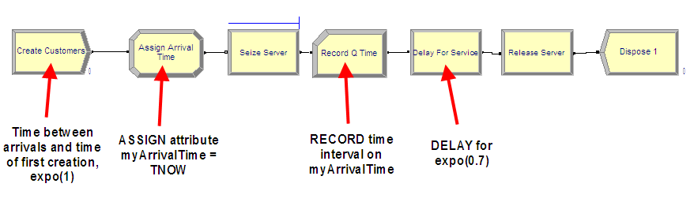

(\#fig:MM1RDArenaModel)MM1 Arena model

Using the STATISTIC data module, the statistics collected within the
replications can be captured to files for post processing by the Output
Analyzer. This example will collect the queue time of each customer and
the number of customers in the queue over time.
Figure \@ref(fig:MM1RDCSVStatisicsModule) shows how to add a statistic using the
STATISTIC data module that will capture observation-based data (e.g.
queue time) to a file. The Type of the statistic is Tally and the Tally
Name corresponds to the name specified in the RECORD module used to
capture the observations. When a name for the output file is specified,
the model will store every observation and the time of the observation
to a file with the extension (*.dat*). These files are not
human-readable, but can be processed by Arena's Output Analyzer.  However, we have set the extension to (*.csv*) because we will post process the files using other programs.

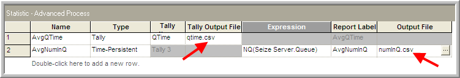

(\#fig:MM1RDCSVStatisicsModule)STATISTIC Module with CSV extension added

\BeginKnitrBlock{rmdimportant}
Changing the extension of the output file is **not** sufficient to change the actual data type of the file that is written. We have set the extension in the STATISTIC module simply to ensure that the file name has the csv extension when saved to a file.  Many programs will automatically recognize the CSV extension. In a moment, we will use the Run Setup $>$ Run Control Advanced Settings (Figure \@ref(fig:MM1RDCSVWritingStatsAsText)) tab to ensure that the files are written out as text.

\EndKnitrBlock{rmdimportant}

Figure \@ref(fig:MM1RDCSVStatisicsModule) also shows how to create a statistic to capture
the number in queue over time to a file. The type of the statistic is
indicated as Time-Persistent and an expression must be given that
represents the value of the quantity to be observed through time. In
this case, the expression builder has been used to select the current
number of entities in the Seize Server.Queue (using the `NQ(queue ID)`
function). When the Output File is specified, the value of the
expression and the time of the observation are written to a file.

When performing a warm-up period analysis, the first decision to make is
the length of each replication. In general, there is very little
guidance that can be offered other than to try different run lengths and
check for the sensitivity of your results. Within the context of
queueing simulations, the work by [@whitt1989planning] offers some ideas
on specifying the run length, but these results are difficult to
translate to general simulation models.

Since the purpose here is to determine the length of the warm up period,
then the run length should be bigger than what you suspect the warm up
period to be. In this analysis, it is better to be conservative. You
should make the run length as long as possible given your time and data
storage constraints. @banks2005discreteevent offer the rule of thumb
that the run length should be at least 10 times the amount of data
deleted. That is, $n \geq 10d$, where $d$ is the number of observations deleted from the series. In terms of time, $T_e \geq 10T_w$, where $T_w$ is the length of the warm up period in the time units of the simulation. Of course, this is a "catch 22" situation because you need to specify $n$
or equivalently $T_e$ in order to assess $T_w$. Setting $T_e$ very large
is recommended when doing a preliminary assessment of $T_w$. Then, you
can use the rule of thumb of 10 times the amount of data deleted when
doing a more serious assessment of $T_w$ (e.g. using Welch plots etc.)

A preliminary assessment of the current model has already been performed
based on the previously described Excel simulation. That assessment
suggested a deletion point of at least $d = 3000$ customers. This can be
used as a starting point in the current effort. Now, $T_w$ needs to be
determined based on $d$. The value of $d$ represents the customer number
for the end of the warm up period. To get $T_w$, you need to answer the
question: How long (on average) will it take for the simulation to
generate $d$ observations. In this model, the mean number of arrivals is 1
customer per minute. Thus, the initial $T_w$ is

$$3000 \; \text{customers} \times \frac{\text{minute}}{\text{1 customer}} \; = 3000 \; \text{minutes}$$

and therefore the initial $T_e$ should be 30,000 minutes. Thus, in general, if we let $\eta$ be the rate of occurrence of the observations, $\delta = 1/\eta$ be the time between occurrence, and $d$ the desired number of observations to delete, we have that the length of the warm up period should be:

\begin{equation}
T_w = \frac{d}{\eta} = d \times \delta
(\#eq:TwViaRate)
\end{equation}

Specify 30,000 minutes for the replication length and 10 replications on the Run $>$
Setup $>$ Replication Parameters as shown in Figure \@ref(fig:MM1RDCSVRepParameters).

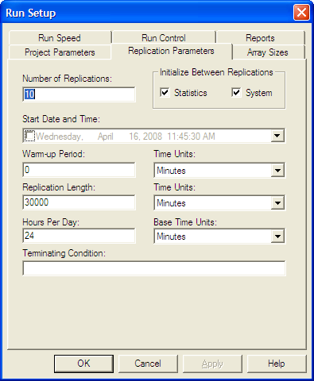

(\#fig:MM1RDCSVRepParameters)Replication parameters for the warm up analysis

The replication length, $T_e$, is the time when the simulation will end. The
Base Time Units can be specified for how the statistics on the
default reports will be interpreted and represents the units for TNOW. The Time Units for
the Warm-up Period and the Replication Length can also be set. The
Warm-up period is the time where the statistics will be cleared. Thus,
data will be reported over a net (Replication Length -- Warm-up Period)
time units. 

In order to process the recorded data from the simulation outside of Arena,
you **must specify that the program produce a text file** rather than a *dat*
file. To make this happen we need to indicated to Arena that output files should be written as text
using the Run Setup $>$ Run Control $>$ Advanced dialog as shown in
Figure \@ref(fig:MM1RDCSVWritingStatsAsText). If this option is checked, all statistical data saved to files will be in a CSV format.  Since we already ensured that the name of the file had the (*.csv*) extension this will facilitate Excel recognizing the file as a comma separate
variable (CSV) file. Thus, when you double-click on the file, the file will be opened within programs that recognize the CSV format, such as Excel.

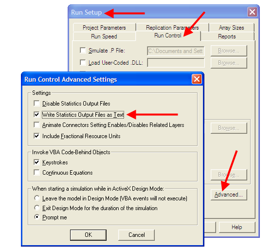

(\#fig:MM1RDCSVWritingStatsAsText)Writing statistics output files as text.

Running the simulation will generate two files *numInQ.csv*
and *qtime.csv* within the current working directory for the model.

Figure \@ref(fig:MM1RDCSVExcelSnapshot) illustrates the structure of the
resulting text file that is produced when using the *Write Statistics
Output Files as Text* option. Each time a new observation is recorded
(either time-based or observation based), the time of the observation
and the value of the observation is written to the file. When multiple
replications are executed, the number (-1) is used in the time field to
indicate that a replication has ended. Using these file characteristics,
software can be written to post-process the *csv* files in any fashion
that is required for the analysis.

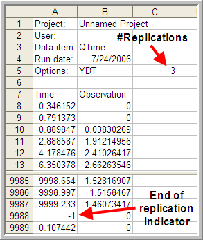

(\#fig:MM1RDCSVExcelSnapshot)Resulting CSV file as shown in Excel.

There is one caveat with respect to using Excel. Excel is limited to
1,048,576 rows of data. If you have $m$ observations per replication and
$r$ replications then $m \times r + (r + 7)$ needs to be less than
1,048,576.  Thus, you may easily exceed the row limit of Excel by having too many replications and too many observations per replication.  Regardless of whether or not the file can be *opened* in Excel, it still is a valid *csv* file and can be post processed.

To facilitate the making of Welch plots from Arena output files, I created a program that will read in the Arena text output file and allow the user to make a Welch plot as well as reformat the data to a more convenient CSV structure. The next section will overview the use of that software.

### Looking for the Warm up Period in the Welch Plot Analyzer {#ch5:WelchPlotAnalyzer}

As previously discussed, the Welch plot is a reasonable approach to
assessing the warm up period. Unfortunately, the Arena does
not automatically perform a Welch plot analysis. Before proceeding making Welch plots, there is still one more technical challenge related to the post-processing of time-persistent data that must be addressed.

Time-persistent observations are saved within a file from within the
model such that the time of the observation and the value of the state
variable at the time of change are recorded. Thus, the observations are
not equally spaced in time. In order to make a Welch plot, we need to discretize the observations into intervals of time that are equally spaced on the time axis.  

Suppose that you divide $T_e$ into $k$
intervals of size $\Delta t$, so that $T_e = k \times \Delta t$. The
time average over the $j^{th}$ interval is given by:

$$\bar{Y}_{rj} = \dfrac{1}{\Delta t} \int_{j-1) \Delta t}^{j \Delta t} Y_r(t)\mathrm{d}t$$

Thus, the overall time average can be computed from the time average
associated with each interval as shown below:

$$\begin{aligned}
\bar{Y}_{r} & = \dfrac{\int_0^{T_e} Y_r (t)dt}{T_e} =\dfrac{\int_0^{T_e} Y_r (t)dt}{k \Delta t} \\
& = \dfrac{\sum_{j=1}^{k}\int_{(j-1) \Delta t}^{j \Delta t} Y_r (t)dt}{k \Delta t} = \dfrac{\sum_{j=1}^{k} \bar{Y}_{rj}}{k}\end{aligned}$$

Each of the $\bar{Y}_{rj}$ are computed over intervals of time that are
equally spaced and can be treated as if they are tally based data. Figure \@ref(fig:DiscretizingTimePersistentData) illustrates the concept of discretizing time-persistent data.

(\#fig:DiscretizingTimePersistentData)Discretizing time persistent observations

The computation of the $\bar{Y}_{rj}$ for time-persistent data can be
achieved when processing the text file written by Arena. 

Recall that the data for the Welch analysis is as follows, $Y_{rj}$ is the $j^{th}$ observation on replication $r$ for $j = 1,2,\cdots,m_r$ where $m_r$ is the number of observations in the $r^{th}$ replication, and $r = 1,2,\cdots,n$. The the Welch averages are computed across the replications for each $j = 1, 2, \ldots, m$, where $m = min(m_r)$ for $r = 1,2,\cdots,n$.

$$
\bar{Y}_{\cdot j} = \dfrac{1}{n}\sum_{r=1}^n Y_{rj}
$$

Welch plot data has two components, the Welch averages ($\bar{Y}_{\cdot j}$ for $j = 1, 2, \ldots, m$), and the cumulative average over the observations of the Welch averages:

$$ 
\overline{\overline{Y}}_{k} = \dfrac{1}{k}\sum_{j=1}^{k} \bar{Y}_{\cdot j} 
$$
for $k = 1, 2, \ldots, m$).
   
The Welch Plot Analyzer is a program that I created to facilitate making Welch plots from Arena data. You may find the Welch Plot Analyzer program files in the [book support files][Book Support Files].  The Welch Plot Analyzer has an option for batching the data before making the Welch plot.  Figure \@ref(fig:WelchPlotAnalyzerOverview) presents the main dialog for the Welch Plot Analyzer.  The user can perform four basic tasks:

1. Importing and batching observation or time-persistent data from an Arena generated CSV data file
2. Plotting an already processed Welch data file
3. Writing Welch plot data to a CSV file. The pairs $(\bar{Y}_{\cdot k},\bar{\bar{Y}}_{k})$ are written to the CSV file for each observation, $k = 1, 2, \ldots, m$).
4. Writing all Welch data to a CSV file. The CSV file will contain each individual replication as a column, with the Welch average and cumulative average as the last two columns.

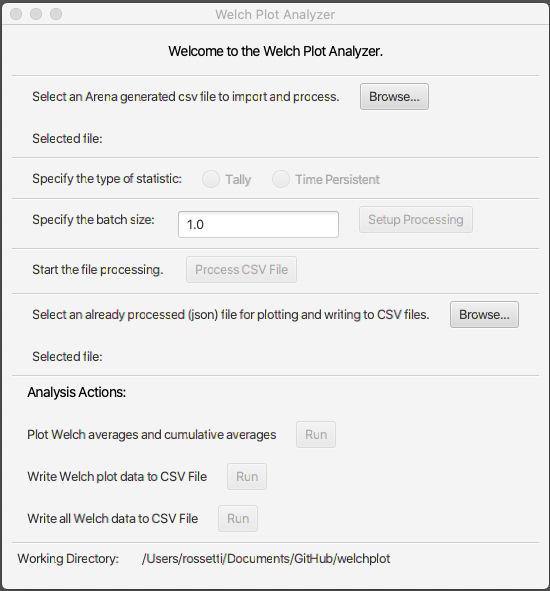

(\#fig:WelchPlotAnalyzerOverview)Welch Plot Analyzer main dialog

To begin using the Welch Plot Analyzer, use the top most *Browse* button to select the Arena CSV file that you want to process.  After selecting the file, you should specify the type of statistic, either Tally or Time-Persistent. This choice will affect how the batching of the observations is performed. 

If the data is tally based, then the batch size is interpreted as the number of observations within each batch.  The total number observations, $m$, is divided into $k$ batches of size $b$, where $b$ is the batch size. It may be useful to batch the observations if $m$ is very large.  However, it is not critical that you specify a batch size other than the default of $b=1$ for tally based data.  

For time-persistent data, the batch size is interpreted as $\Delta$ as per Figure \@ref(fig:DiscretizingTimePersistentData).  It is useful to specify a $\Delta$ for discretizing the time-persistent data. The value of $\Delta$ will default to 1 time unit, which may not be adequate based on the rate of occurrence of the state changes for the time-persistent data.  I recommend that $\Delta$ be set so that about 10 *observations* on average will fall within each interval.  To get an idea for this you can simply open up the Arena generated CSV file and look at the first few rows of the data. By scanning the rows, you can quickly estimate about how much time there needs to be to get about 10 state changes. 

(\#fig:NumInQExcelSnapshot)Initial rows of number in queue data set.

Reviewing the data for the time-persistent number in queue data as shown in Figure \@ref(fig:NumInQExcelSnapshot) indicates that about 10 observations have occurred by time 5.  Thus, it seems like having $\Delta = 5$ would be a reasonable setting.

After setting the batch size, the processing can be set up using the *Setup Processing* button. This will prepare the data for processing and check if the CSV file is a valid Arena text file.  Then, the file can be processed by using the *Process CSV File* button.  Depending on the size of the files, this action may take some time to complete.  A dialog will appear when the operation is completed. The processing of the CSV file prepares the data for analysis actions by automatically populating the file for analysis.  This file is a JSON file that holds meta-data (data about the data). A second file with a (*.wdf*) extension is produced that holds the underlying observations in a non-human readable form.  The analysis action functionality of the Welch Plot Analyzer allows you to translate the data in the *wdf* file into a plot or into better organized *csv* files. Once the file has been processed, the actions within the Analysis Actions section become available.  By using the *Run* button to plot the Welch averages and cumulative averages we produce Figures \@ref(fig:QTimeWelchPlot) and \@ref(fig:NumInQWelchPlot). The Welch Plot Analyzer will automatically open up a web browser and display the plots.  The plots are based on the [plotly](https://plotly.com/) open source java script plotting library. In addition, the plots are saved as *html* to a folder called *PlotDir*. You can open the *html* files at any time to review the plots.

Figures \@ref(fig:QTimeWelchPlot) and \@ref(fig:NumInQWelchPlot) provide the Welch plots for the time and queue and number in queue data. Notice that the title of the plot contains information that will convert each observation on the x-axis to units of time. For example, on Figure \@ref(fig:NumInQWelchPlot), we have that each observation is equivalent to 5 time units.  That is because we discretized the data with $\Delta = 5$.  Looking at the plot, it appears that the cumulative average converges after observation number 1000. Thus, to set the warm up period, we take $d=1000$ and $\Delta=5$ for $T_w = d \times \Delta = 1000 \times 5 = 5000$. In Figure \@ref(fig:QTimeWelchPlot), we see that their is a 1 to 1 correspondence between the observation number and time. This is because we get an arrival about every minute.  Thus, looking at the plot, it seems that $d=6000$ is a good deletion point, which translated to $T_w = 6000$. We will set the warm up period of the simulation to the larger of the two $T_w$ values (i.e. $T_w = 6000$)

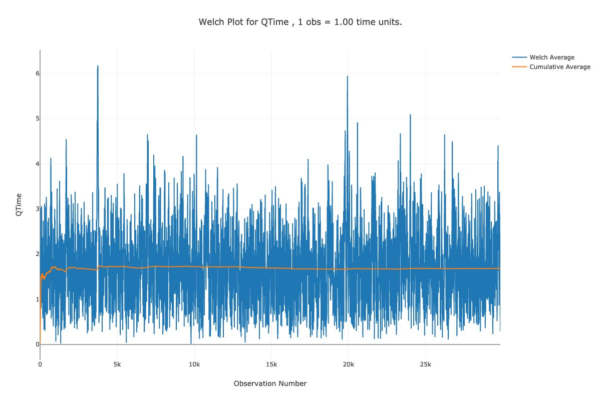

(\#fig:QTimeWelchPlot)Welch plot for time in queue data.

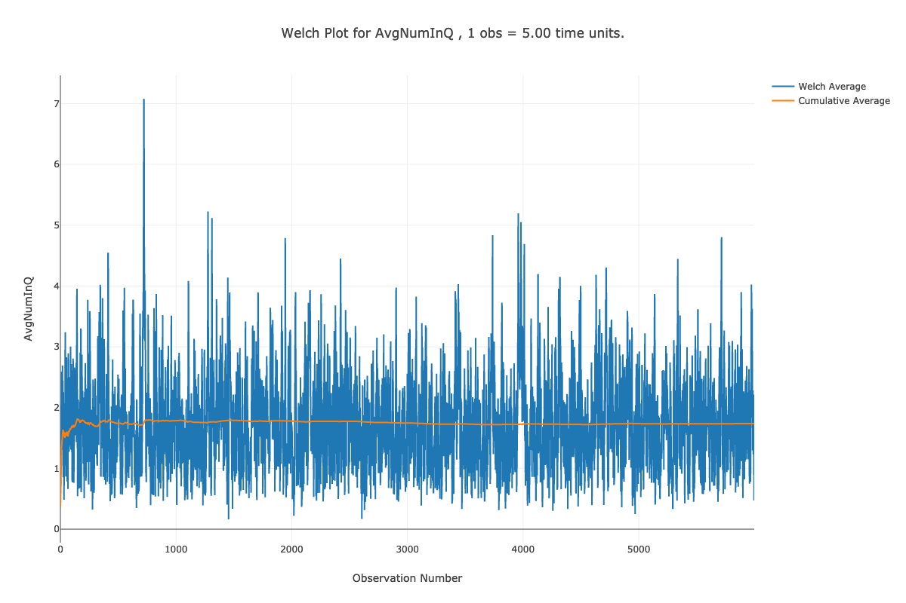

(\#fig:NumInQWelchPlot)Welch plot for number in queue data.

Once you have performed the warm up analysis, you still need to use your
simulation model to estimate system performance. Because the process of
analyzing the warm up period involves saving the data you could use the
already saved data to estimate your system performance after truncating
the initial portion of the data from the data sets. If re-running the simulation is relatively inexpensive,
then you can simply set the warm up period in the Run Setup $>$
Replication Parameters dialog and execute the model. Following the rule
of thumb that the length of the run should be at least 10 times the warm
up period, the simulation was re-run with the settings given in
Figure \@ref(fig:MM1RDCSVRunSetup) (30 replications, 6000 minute warm up
period, 60,000 minute replication length). Since the true waiting time in the queue is $1.6\bar{33}$, it is clear that the 95% confidence interval contains this value. Thus, the results shown in
Figure \@ref(fig:MM1RDCSVResultsAfterWarmup) indicate that there does not appear to be any
significant bias with these replication settings.

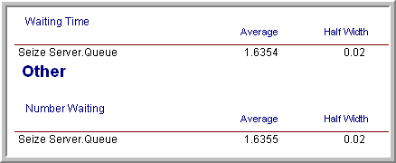

(\#fig:MM1RDCSVResultsAfterWarmup)Results based on 30 replications.

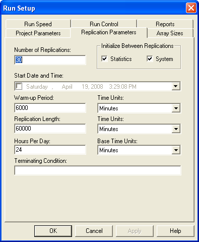

(\#fig:MM1RDCSVRunSetup)Replication-Deletion settings for the example.

The process described here for determining the warm up period for steady
state simulation is tedious and time consuming. Research into automating
this process is still an active area of investigation. The recent work
by [@robinson2005automated] and @Rossetti2005aa holds some promise in
this regard; however, there remains the need to integrate these methods
into computer simulation software. Even though determining the warm up
period is tedious, some consideration of the warm up period should be
done for infinite horizon simulations.

Once the warm up period has been found, you can set the Warm-up Period
field in the Run Setup $>$ Replication Parameters dialog to the time of
the warm up. Then, you can use the method of replication-deletion to
perform your simulation experiments. Thus, all the discussion previously
presented on the analysis of finite horizon simulations can be applied.

When determining the number of replications, you can apply the fixed
sample size procedure after performing a pilot run. If the analysis
indicates that you need to make more runs to meet your confidence
interval half-width you have two alternatives: 1) increase the number of
replications or 2) keep the same number of replications but increase the
length of each replication. If $n_0$ was the initial number of
replications and $n$ is the number of replications recommended by the
sample size determination procedure, then you can instead set $T_e$
equal to $(n/n_0)T_e$ and run $n_0$ replications. Thus, you will still
have approximately the same amount of data collected over your
replications, but the longer run length may reduce the effect of
initialization bias.

As previously mentioned, the method of replication-deletion causes each
replication to delete the initial portion of the run. As an alternative,
you can make one long run and delete the initial portion only once. When
analyzing an infinite horizon simulation based on one long replication,
a method is needed to address the correlation present in the within
replication data. The method of batch means is often used in this case
and has been automated in . The next section discusses the statistical
basis for the batch means method and addresses some of the practical
issues of using it within Arena.

## The Batch Means Method {#ch5:BatchMeansMethod}

In the batch mean method, only one simulation run is executed. After
deleting the warm up period, the remainder of the run is divided into
*k* batches, with each batch average representing a single observation
as illustrated in Figure \@ref(fig:BatchConcept).  In fact, this is essentially the same concept as previously discussed when processing the data using the Welch Plot Analyzer.

(\#fig:BatchConcept)Illustration of the batch means concept

The advantages of the batch means method are that it entails a long
simulation run, thus dampening the effect of the initial conditions. The
disadvantage is that the within replication data are correlated and
unless properly formed the batches may also exhibit a strong degree of
correlation.

The following presentation assumes that a warm up analysis has already
been performed and that the data that has been collected occurs after
the warm up period. For simplicity, the presentation assumes observation
based data. The discussion also applies to time-based data that has been
cut into discrete equally spaced intervals of time as described in
Section \@ref(ch5:WelchPlotAnalyzer).
Therefore, assume that a series of observations,
$(X_1, X_2, X_3, \ldots, X_n)$, is available from within the one long
replication after the warm up period. As shown earlier at the beginning
of Section \@ref(ch5:MM1Spreadsheet), the
within replication data can be highly correlated. In that section, it
was mentioned that standard confidence intervals based on the regular formula for the sample variance

$$S^2(n) = \dfrac{1}{n - 1}\sum_{i=1}^n (X_i - \bar{X})^2$$

are not appropriate for this type of data. Suppose you were to ignore
the correlation, what would be the harm? In essence, a confidence
interval implies a certain level of confidence in the decisions based on
the confidence interval. When you use $S^2(n)$ as defined above, you
will not achieve the desired level of confidence because $S^2(n)$ is a
biased estimator for the variance of $\bar{X}$ when the data are
correlated. Under the assumption that the data are covariance
stationary, an assessment of the harm in ignoring the correlation can be
made. For a series that is covariance stationary, one can show that

$$Var(\bar{X}) = \dfrac{\gamma_0}{n}\left[1 + 2 \sum_{k=1}^{n-1} (1 - \dfrac{k}{n}) \rho_k\right]$$

where $\gamma_0 = Var(X_i)$, $\gamma_k = Cov(X_i, X_{i + k})$, and
$\rho_k =  \gamma_k/\gamma_0$ for $k = 1, 2, \ldots, n - 1$.

When the data are correlated, $S^2/n$ is a biased estimator of
$Var(\bar{X})$. To show this, you need to compute the expected value of
$S^2/n$ as follows:

$$E\left[S^2/n\right] = \dfrac{\gamma_0}{n} \left[1 - \dfrac{2R}{n - 1}\right]$$

where

$$R = \sum_{k=1}^{n-1} (1 - \dfrac{k}{n}) \rho_k$$

Bias is defined as the difference between the expected value of the
estimator and the quantity being estimated. In this case, the bias can
be computed with some algebra as:

$$\text{Bias} = E\left[S^2/n\right] - Var(\bar{Y}) = \dfrac{-2 \gamma_0 R}{n - 1}$$

Since $\gamma_0 > 0$ and $n > 1$ the sign of the bias depends on the
quantity *R* and thus on the correlation. There are three cases to
consider: zero correlation, negative correlation, and positive
correlation. Since $-1 \leq \rho_k \leq 1$, examining the limiting
values for the correlation will determine the range of the bias.

For positive correlation, $0 \leq \rho_k \leq 1$, the bias will be
negative, ($- \gamma_0 \leq Bias \leq 0$). Thus, the bias is negative if
the correlation is positive, and the bias is positive if the correlation
is negative. In the case of positive correlation, $S^2/n$ underestimates
the $Var(\bar{X})$. Thus, using $S^2/n$ to form confidence intervals
will make the confidence intervals too short. You will have unjustified
confidence in the point estimate in this case. The true confidence will
not be the desired $1 - \alpha$. Decisions based on positively
correlated data will have a higher than planned risk of making an error
based on the confidence interval.

One can easily show that for negative correlation,
$-1 \leq \rho_k \leq 0$, the bias will be positive
($0 \leq Bias \leq \gamma_0$). In the case of negatively correlated
data, $S^2/n$ over estimates the $Var(\bar{X})$. A confidence interval
based on $S^2/n$ will be too wide and the true quality of the estimate
will be better than indicated. The true confidence coefficient will not
be the desired $1 - \alpha$; it will be greater than $1 - \alpha$.

Of the two cases, the positively correlated case is the more severe in
terms of its effect on the decision making process; however, both are
problems. Thus, the naive use of $S^2/n$ for dependent data is highly
unwarranted. If you want to build confidence intervals on $\bar{X}$ you
need to find an unbiased estimator of the $Var(\bar{X})$.

The method of batch means provides a way to develop (at least
approximately) an unbiased estimator for $Var(\bar{X})$. Assuming that
you have a series of data point, the method of batch means method
divides the data into subsequences of contiguous batches:

$$\begin{gathered}
\underbrace{X_1, X_2, \ldots, X_b}_{batch 1} \cdots 
\underbrace{X_{b+1}, X_{b+2}, \ldots, X_{2b}}_{batch 2} \cdots \\
\underbrace{X_{(j-1)b+1}, X_{(j-1)b+2}, \ldots, X_{jb}}_{batch j}  \cdots 
\underbrace{X_{(k-1)b+1}, X_{(k-1)b+2}, \ldots, X_{kb}}_{batch k}\end{gathered}$$

and computes the sample average of the batches. Let $k$ be the number of
batches each consisting of $b$ observations, so that
$k = \lfloor n/b \rfloor$. If $b$ is not a divisor of $n$ then the last
$(n - kb)$ data points will not be used. Define $\bar{X}_j(b)$ as the
$j^{th}$ batch mean for $j = 1, 2, \ldots, k$, where,

$$\bar{X}_j(b) = \dfrac{1}{b} \sum_{i=1}^b X_{(j-1)b+i}$$

Each of the batch means are treated like observations in the batch means
series. For example, if the batch means are re-labeled as
$Y_j = \bar{X}_j(b)$, the batching process simply produces another
series of data, ($Y_1, Y_2, Y_3, \ldots, Y_k$) which may be more like a
random sample. To form a $1 - \alpha$% confidence interval, you simply
treat this new series like a random sample and compute approximate
confidence intervals using the sample average and sample variance of the
batch means series:

$$\bar{Y}(k) = \dfrac{1}{k} \sum_{j=1}^k Y_j$$

$$S_b^2 (k) = \dfrac{1}{k - 1} \sum_{j=1}^k (Y_j - \bar{Y})^2$$

$$\bar{Y}(k) \pm t_{\alpha/2, k-1} \dfrac{S_b (k)}{\sqrt{k}}$$

Since the original X's are covariance stationary, it follows that the
resulting batch means are also covariance stationary. One can show, see
[@alexopoulos1998output], that the correlation in the batch means
reduces as both the size of the batches, $b$ and the number of data
points, $n$ increases. In addition, one can show that $S_b^2 (k)/k$
approximates $\text{Var}(\bar{X})$ with error that reduces as both $b$
and $n$ increase towards infinity.

The basic difficulty with the batch means method is determining the
batch size or alternatively the number of batches. Larger batch sizes
are good for independence but reduce the number of batches, resulting in
higher variance for the estimator. [@schmeiser1982batch] performed an
analysis that suggests that there is little benefit if the number of
batches is larger than 30 and recommended that the number of batches
remain in the range from 10 to 30. However, when trying to access
whether or not the batches are independent it is better to have a large
number of batches ($>$ 100) so that tests on the lag-k correlation have
better statistical properties.

There are a variety of procedures that have been developed that will
automatically batch the data as it is collected, see for example
[@fishman1997an], [@steiger2002an], and @banks2005discreteevent. has its
own batching algorithm. The batching algorithm is described in
@kelton2004simulation page 311. See also [@fishman2001discreteevent]
page 254 for an analysis of the effectiveness of the algorithm.

The discussion here is based on the description in
@kelton2004simulation. When the algorithm has recorded a sufficient
amount of data, it begins by forming k = 20 batches. As more data is
collected, additional batches are formed until k = 40 batches are
collected. When 40 batches are formed, the algorithm collapses the
number of batches back to 20, by averaging each pair of batches. This
has the net effect of doubling the batch size. This process is repeated
as more data is collected, thereby ensuring that the number of batches
is between 20 and 39. The algorithm begins the formation of batches when
it has at least 320 observations of tally-based data.

For time-persistent data, The algorithm requires that there were at
least 5 time units during which the time-based variable changed 320
times. If there are not enough observations within a run then
*Insufficient* is reported for the half-width value on the output
reports. In addition, the algorithm also tests to see if the lag-1
correlation is significant by testing the hypothesis that the batch
means are uncorrelated using the following test statistic, see
[@alexopoulos1998output]:

$$C = \sqrt{\dfrac{k^2 - 1}{k - 2}}\biggl[ \hat{\rho}_1 + \dfrac{[Y_1 - \bar{Y}]^2 + [Y_k - \bar{Y}]^2}{2 \sum_{j=1}^k (Y_j - \bar{Y})^2}\biggr]$$

$$\hat{\rho}_1 = \dfrac{\sum_{j=1}^{k-1} (Y_j - \bar{Y})(Y_{j+1} - \bar{Y})}{\sum _{j=1}^k (Y_j - \bar{Y})^2}$$

The hypothesis is rejected if $C > z_\alpha$ for a given confidence
level $\alpha$. If the batch means do not pass the test, *Correlated* is
reported for the half-width on the statistical reports.

### Performing the Method of Batch Means {#ch5:bmInArena}

Performing the method of batch means in is relatively straight forward.
The following assumes that a warm up period analysis has already been
performed. Since batches are formed during the simulation run and the
confidence intervals are based on the batches, the primary concern will
be to determine the run length that will ensure a desired half-width on
the confidence intervals. A fixed sampling based method and a sequential
sampling method will be illustrated.

The analysis performed to determine the warm up period should give you
some information concerning how long to make this single run and how
long to set it's warm up period. Assume that a warm up analysis has been
performed using $n_0$ replications of length $T_e$ and that the analysis
has indicated a warm up period of length $T_w$.

As previously discussed, the method of replication deletion spreads the
risk of choosing a bad initial condition across multiple replications.
The method of batch means relies on only one replication. If you were
satisfied with the warm up period analysis based on $n_0$ replications
and you were going to perform replication deletion, then you are willing
to throw away the observations contained in at least $n_0 \times T_w$
time units and you are willing to use the data collected over
$n_0 \times (T_e - T_w)$ time units. Therefore, the warm up period for
the single replication can be set at $n_0 \times T_w$ and the run length
can be set at $n_0 \times T_e$.

For example, suppose your warm up analysis was based on the initial
results shown in Section \@ref(ch5:MM1Spreadsheet), i.e. $n_0$ = 10, $T_e$ = 30000, $T_w$ = 3000.
Thus, your starting run length would be
$n_0 \times T_e = 10 \times 30,000 = 300,000$ and the warm period will
be $n_0 \times T_w = 30,000$. For these setting, the results shown in
Figure \@ref(fig:InitialBatchMeansResults) are very close to the results for
the replication-deletion example.

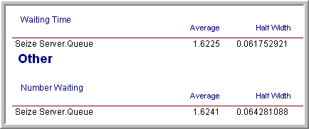

(\#fig:InitialBatchMeansResults)Initial batch means results.

Suppose now you want to ensure that the half-widths from a single
replication are less than a given error bound. The half-widths reported
by the simulation for a single replication are based on the *batch
means*. You can get an approximate idea of how much to increase the
length of the replication by using the functions: `TNUMBAT(Tally ID)` and
`TBATSIZ(Tally ID)` for observation based statistics or `DNUMBAT(DSTAT ID)`
and `DBATSIZ(DSTAT ID)` in conjunction with the half-width sample size
determination formula.

$$n \cong n_0 \left(\dfrac{h_0}{h}\right)^2$$

In this case, you interpret $n$ and $n_0$ as the number of batches.
OUTPUT statistics can be added to the model to observe the number of
batches for the waiting time in queue and for the size of each batch, as
shown in Figure \@ref(fig:OUTPUTStatBatchSizes). The resulting values for the number of
batches formed for the waiting times and the size of the batches are
given in Figure \@ref(fig:BatchSizeResults) Using this information in the half-width
based sample size formula with $n_0 = 32$, $h_0 = 0.06$, and $h = 0.02$,
yields:

$$n \cong n_0 \dfrac{h_0^2}{h^2} = 32 \times \dfrac{(0.06)^2}{(0.02)^2} = 288 \ \ \text{batches}$$

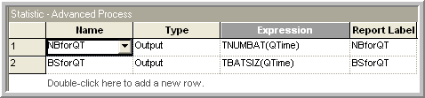

(\#fig:OUTPUTStatBatchSizes)OUTPUT Statistics to get number of batches and batch size.

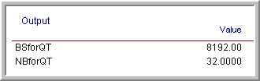

(\#fig:BatchSizeResults)Results for number of batches and batch size.

Since each batch in the run had 8192 observations, this yields the need
for additional observations for the waiting time in the queue. Since, in
this model, customers arrive at a mean rate of 1 per minute, this
requires about 2,359,296 additional time units of simulation. Because of
the warm up period, you therefore need to set $T_e$ equal to (2,359,296
+ 30,000 = 2389296). Re-running the simulation yields the results shown
in Figure \@ref(fig:FinalBatchMeansResults). The results show that the
half-width meets the desired criteria. This approach is approximate
since you do not know how the observations will be batched when making
the final run.

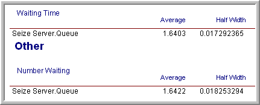

(\#fig:FinalBatchMeansResults)Batch means results for fixed sample size.

Rather than trying to fix the amount of sampling, you might instead try
to use a sequential sampling technique that is based on the half-width
computed during the simulation run. This is easy to do by supplying the
appropriate expression within the Terminating Condition field on the Run
Setup $>$ Replication Parameters dialog.

Figure \@ref(fig:SequentialSamplingInfHorizon) illustrates that you can use a Boolean
expression within the Terminating Condition field. In this case, the
`THALF(Tally ID)` function is used to specify that the simulation should
terminate when the half-width criteria is met. The batching algorithm
computes the value of `THALF(Tally ID)` after sufficient data has been
observed. This expression can be expanded to include other performance
measures in a compound Boolean statement.

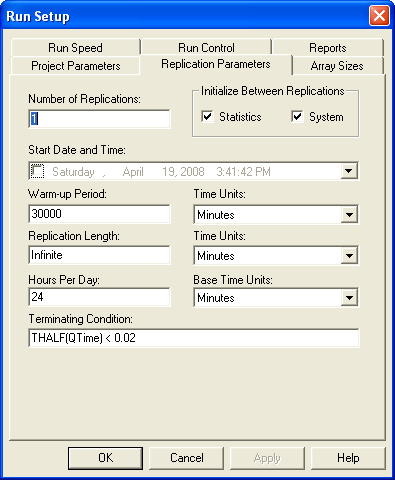

(\#fig:SequentialSamplingInfHorizon)Sequential sampling using terminating condition.

The results of running the simulation based on the sequential method are
given in Figure \@ref(fig:InfHorizonSeqSamplingResults). In this case, the simulation run
ended at approximately time 1,928,385. This is lower than the time
specified for the fixed sampling procedure (but the difference is not
excessive).

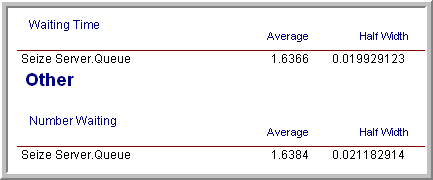

(\#fig:InfHorizonSeqSamplingResults)Results for infinite horizon sequential sampling method.

Once the warm up period has been analyzed, performing infinite horizon
simulations using the batch means method is relatively straight forward.
A disadvantage of this method is that it will be more difficult to use
the statistical methods available within the Process Analyzer or within
OptQuest because they assume a replication-deletion approach. 

If you are faced with an infinite horizon simulation, then you can use either the
replication-deletion approach or the batch means method. In either case, you should investigate if there may be any problems related to initialization bias. If you use the
replication-deletion approach, you should play it safe when specifying
the warm up period. Making the warm up period longer than you think it
should be is better than replicating a poor choice. When performing an
infinite horizon simulation based on one long run, you should make sure
that your run length is long enough. A long run length can help to "wash
out" the effects of initial condition bias.

Ideally, in the situation where you have to make many simulation
experiments using different parameter settings of the same model, you
should perform a warm up analysis for each design configuration. In
practice, this is not readily feasible when there are a large number of
experiments. In this situation, you should use your common sense to pick
the design configurations (and performance measures) that you feel will
most likely suffer from initialization bias. If you can determine long
enough warm up periods for these configurations, the other
configurations should be relatively safe from the problem by using the
longest warm up period found.

There are a number of other techniques that have been developed for the
analysis of infinite horizon simulations including the standardized time
series method, the regenerative method, and spectral methods. An
overview of these methods and others can be found in
[@alexopoulos1998output] and in [@law2007simulation].

When performing an infinite horizon simulation analysis, we are most interested in the estimation of long-run (steady state) performance measures.  In this situation, it can be useful to apply analytical techniques such as queueing theory to assist with determining whether or not the model is producing credible results. Even in the case of a finite horizon simulation, the steady state performance results from analytical models of queueing and inventory systems can be very helpful in understanding if the results produced by the simulation model make sense.  In the next section, we apply the results of analytical queueing models from Appendix \@ref(app:qtAndInvT) to the simulation of a small manufacturing system in order to check the results of a simulation model.  Being able to verify and validate a simulation model is a crucial skill to get your simulation models used in practice.

## Applying Queueing Theory Results to Verify and Validate a Simulation {#ch5:VandV}

In this section, we overview some verification and validation methods to apply when developing and testing a simulation model. 

Verification is about checking if the model meets the desired output. In
other words, does the model work correctly as designed? In verifying a
model, you select a sample of test cases with known results and show
that the model produces the expected output across the test cases. It is
important to select the test cases in an unbiased manner and that the
test cases encompass a large portion of the space that will be relevant
when using the model. The test cases form the standard that the model
must meet and thus are critical in convincing others that the
verification process was of high quality.

Validation is whether or not the model meets it intended purpose. When
validating a model, we are trying to build credibility that the model
can be used as intended. In other words, that the model adequately
represents the system for its intended purpose. Obviously, verification
is a necessary but not sufficient step in validation. Validation is
predicated on how the model is intended to be used and what it is
supposed to represent.

In the following, we will illustrate a basic approach to verifying and
validating the results of a simulation model by using some analytical
approximations based on queueing theory and common sense. Let's start
with an example system to be simulated.

***

\BeginKnitrBlock{example}\iffalse{-91-83-109-97-108-108-32-77-97-110-117-102-97-99-116-117-114-105-110-103-32-83-121-115-116-101-109-93-}\fi{}
<strong>(\#exm:exSmallMfgSys)  \iffalse (Small Manufacturing System) \fi{} </strong>A small manufacturing system produces parts. The parts arrive from an
upstream Poisson process with a rate of arrival of 1 part every 5
minutes. All parts that enter the system must go through a preparation
station where there are 2 preparation workers. A part requires only 1 of
the 2 workers during preparation. The preparation time is exponentially
distributed with means of 8 minutes. If all the workers at the
preparation station are busy, then the part waits for the next available
preparation worker.

After preparation, the parts are processed on two different production
lines. There is a 30% chance that the parts are built on line 1 and a
70% chance that they go to line 2. Line 1 has a build station staffed by
2 workers. Line 2 has a build station staffed by 3 workers. The time to
build a part on line 1 is triangularly distributed with a (min = 2, mode
= 6, max = 8) minutes. The time to build a part on line 2 is
triangularly distributed with a (min = 3, mode = 6, max = 7) minutes.
The build operation on the part only requires 1 of the workers available
at the station. If all the workers at the station are busy, then the
part waits for the next available worker.

After the parts are built, they go to a packaging station. The packaging
station is staffed by 2 workers. Only 1 of the 2 workers is needed
during packaging. If all the workers at the packaging station are busy,
then the part waits for the next available packaging worker. The time to
individually wrap a part is exponential with a mean of 2 minutes. After
each individual part is wrapped, the worker fills a box with packing
peanuts, and places the part into a box for shipping. The time to fill
the box with peanuts and seal the box is uniformly distribution between
1 and 2 minutes. After the packaging, the box is placed on a pallet
building machine. Once 10 boxes accumulate, the pallet machine wraps the
pallet. The wrapping time takes 2 minutes. After the wrapping is
completed, the pallet leaves the system.

The production team believes that a batch run of production over 30
days of operation is the best way to produce these parts. Thus, at the
beginning of a month there are currently no parts in production.
Simulate the system for 100 replications of one month (30 days) of
operation. The base time unit for the simulation should be in minutes.
We want to simulate this system in order to measure the following
performance metrics with some high degree of confidence.

\EndKnitrBlock{example}

  **Performance Measures**
  ---------------------------------------------------------------------------------
  System time for parts regardless of which build line prior to palletizer
  Prob. that the system time before palletizing of a part is less than 60 minutes
  Utilization of preparation workers
  Utilization of packaging workers
  Utilization of line 1 build workers
  Utilization of line 2 build workers
  Utilization of the palletizer
  Total number of parts produced in 30 days
  Total number of pallets completed in 30 days

***

Suppose you build a simulation model for this situation and get the
following results. The building of the model is left as an exercise for
the reader.

  **Performance Measures**                                                          **Average**   **Half-width**
  -------------------------------------------------------------------------------- ------------- ----------------
  System time for parts regardless of which build line prior to palletizer            31.73            0.44
  Prob. that the system time before palletizing of a part is less than 60 minutes      0.89            0.01
  Utilization of preparation workers                                                   0.80            0.00
  Utilization of packaging workers                                                     0.35            0.00
  Utilization of line 1 build workers                                                  0.16            0.00
  Utilization of line 2 build workers                                                  0.25            0.00
  Utilization of the palletizer                                                        0.039           0.00
  Total number of parts produced in 30 days                                         8623.36           17.75
  Total number of pallets completed in 30 days                                       861.85            1.77

How do you know if these results seem reasonable? You can use basic
queueing analysis and some simple math to help verify and validate your
results.

(\#fig:MfgFlowDiagram)Small manufacturing system with flow rates

By examining Figure \@ref(fig:MfgFlowDiagram) and using a little flow analysis, we
can get a pretty good approximation of the results. In the figure, we see each station (preparation, line 1, line 2, packaging, and the palletizer). The flow rate of
the parts to each of the stations has also been noted. In what follows each of the stations
will be analyzed (individually) and then the overall system will be
analyzed using some basic queueing analysis using the results of Appendix \@ref(app:qtAndInvT). 

The approach is based on
determining the rate of flow between the stations and using simple
queueing formulas. Let's start with the preparation station.

### Analyzing the Preparation Station

Let $\lambda_{0}$ be the arrival rate to the preparation station. Let
$\mu_{0}$ be the service rate at the preparation station. This is the
rate at which an individual preparation worker works. Let
$\text{MTBA}_{0}$ be the mean time between arrivals for the preparation
station and let $E\lbrack\text{ST}_{0}\rbrack$ be the mean service time
at the preparation station. Clearly from the problem description, we
have:

$$\lambda_{0} = \frac{1}{\text{MTBA}_{0}} = \frac{1}{5\ \min} \times \frac{60\ \min}{1\ \text{hour}} = 12/\text{hour}$$

$$\mu_{0} = \frac{1}{E\lbrack\text{ST}_{0}\rbrack} = \frac{1}{8\ \min} \times \frac{60\ \min}{1\ \text{hour}} = 7.5/\text{hour}$$

Based on queueing theory, we have that the utilization, $\rho,$ is:

$$\rho = \frac{\lambda}{c*\mu} = \frac{E\lbrack\text{ST}\rbrack}{c*\text{MTBA}}$$

where $c$ is the number of servers at the station. For the preparation
station, we have:

$$\rho_{0} = \frac{\lambda_{0}}{c\mu_{0}} = \frac{12}{2 \times 7.5} = 0.8$$

From the simulation output results, we see that the utilization of the
simulation is exactly that as predicted from the basic flow analysis.
Let's examine the build lines.

### Analyzing the Build Lines

In this case, we need to determine the arrival rate to each of the
lines. First, we assume that the rate of arrivals out of the preparation
station will be the same as the rate of arrivals into the preparation
station. Since there is a probabilistic split of the flow to the lines,
we can split the rate of parts flowing to line 1 and line 2 based on the
probability of selecting the lines. Thus, we have that each line
experiences the input rates as follows.

-   Let $\lambda_{1}$ be the arrival rate to the line 1 station and let
    $\lambda_{2}$ be the arrival rate to the line 2 station.

-   Let $p_{1}$ be the probability that line 1 is selected and let
    $p_{2}$ be the probability that line 2 is selected.

Thus, $\lambda_{1} = p_{1} \times$
$\lambda_{0} = 0.3 \times 12 = 3.6$ per hour and
$\lambda_{2} = p_{2} \times$
$\lambda_{0} = 0.7 \times 12 = 8.4$ per hour. Now, we need to get the
mean service time for the build lines. Because the service time
distribution is triangular, we have that the mean of the triangular
random variable, X, is:

$$E\left\lbrack X \right\rbrack = \frac{(\min{+ \ \text{mode} + \max)}}{3}$$

Therefore, we can compute the service rate for each of the lines, where
$\text{ST}_{1}$ and $\text{ST}_{2}$ represent the service time random
variable for line 1 and 2, respectively, as follows:

$$\mu_{1} = \frac{1}{E\left\lbrack \text{ST}_{1} \right\rbrack} = \frac{(2 + 6 + 8)}{3} = 5.3\overline{3}\ \min \times \frac{60\ \min}{1\ \text{hour}} = 11.25/\text{hour}$$

$$\mu_{2} = \frac{1}{E\left\lbrack \text{ST}_{2} \right\rbrack} = \frac{(3 + 6 + 7)}{3} = 5.3\overline{3}\ \min \times \frac{60\ \min}{1\ \text{hour}} = 11.25/\text{hour}$$

And, then we can compute the utilization for each of the lines.

$$\rho_{1} = \frac{\lambda_{1}}{c\mu_{1}} = \frac{3.6}{2 \times 11.25} = 0.16$$

$$\rho_{2} = \frac{\lambda_{2}}{c\mu_{2}} = \frac{8.4}{3 \times 11.25} = 0.24\overline{8}$$

Again, these results, match very closely the results from the simulation
model. We can also approximate the results for packaging in the same
manner.

### Analyzing the Packaging Station

Again, we need to compute the incoming flow rate to the packaging
station in order to compute the utilization at the station. Let
$\lambda_{3}$ be the arrival rate to the packaging station. If we assume
that everything that arrives to each of the two build lines eventually
gets to packaging, we can see that
$\lambda_{3} = \lambda_{1} + \lambda_{2} = \lambda_{0} = 12$ per hour.

The mean service time at the packaging station is the sum of the mean
wrapping process time and the mean box filling time. The wrapping
process has an exponential distribution with a mean of 2 minutes while
the filling process has a continuous uniform distribution on the range
of 1 to 2 minutes. Thus, using the expected values for these respective
distributions, we have:

$$E\left\lbrack ST_{w} \right\rbrack = 2\ \min$$

$$E\left\lbrack ST_{f} \right\rbrack = 1.5\ \min$$

Let $ST_{3}$ be the service time at the packaging station. Because the
time in service at the packaging station include both processing times,
we have a utilization calculation as follows:

$$E\left\lbrack ST_{3} \right\rbrack = \ E\left\lbrack ST_{w} \right\rbrack + E\left\lbrack ST_{f} \right\rbrack = 3.5\ \min$$

$$\mu_{3} = \frac{1}{E\left\lbrack \text{ST}_{3} \right\rbrack} = \frac{1}{3.5\ \min} \times \frac{60\ \min}{1\ \text{hour}} = 17.1428\ \text{per}\ \text{hour}$$

$$\rho_{3} = \frac{\lambda_{3}}{c\mu_{3}} = \frac{12}{2 \times 17.1428} = 0.35$$

Again, the results match very closely to the simulation results. With
some additional thinking, we can even approximate the utilization of the
palletizer.

### Analyzing the Palletizing Station

Assuming that all parts that arrive to packaging also arrive to the
palletizer, we have a rate of arrivals to the palletizer of 12 per hour.
However, we have to wait until there are 10 parts before they are sent
to the palletizer. The rate of 12 per hour is a mean time between
arrivals of 1 part every 5 minutes. To get 10 parts, it will take on
average 50 minutes. Thus, the mean time between arrivals to the
palletizer is 50 minutes. Let $\lambda_{4}$ be the arrival rate to the
palletizer. Thus, the arrival rate to the palletizer is

$$\lambda_{4} = \frac{1}{\text{MTBA}_{4}} = \frac{1}{50\ \min}$$

Thus, the utilization for the palletizer should be:

$$\rho_{4} = \frac{\lambda_{4}}{c\mu_{4}} = \frac{E\lbrack ST_{4}\rbrack}{c*\text{MTBA}_{4}} = \frac{2}{1 \times 50} = 0.04$$

Again, this matches quite well with the simulation results. In general,
as long as $\lambda < c\mu\ $the approximation of utilization will be
quite accurate.

### Analyzing the Total System Time

We can go even further and approximate the total time spent in the
system. If there is no waiting in any of the queues, the approximation
is quite simple. We just need to total the time spent in service for the
parts. Let $E\lbrack ST\rbrack$ be the total time spent in service. To
compute this value, we can simply add up all of the mean service times
for the stations visited. In the case of line 1 and line 2, we can take
the weighted average based on the probability that the line is selected
as follows:

$$E\left\lbrack \text{ST} \right\rbrack = E\left\lbrack \text{ST}_{0} \right\rbrack + p_{1}E\left\lbrack \text{ST}_{1} \right\rbrack + p_{2}E\left\lbrack \text{ST}_{2} \right\rbrack + E\left\lbrack \text{ST}_{3} \right\rbrack + E\lbrack ST_{4}\rbrack$$

$$E\left\lbrack \text{ST} \right\rbrack = 8 + 0.3 \times 5.3\overline{3} + 0.7 \times 5.3\overline{3} + 3.5 + 2.0 = 18.8\overline{3}\ \text{minutes}$$

This can be easily tested within the simulation model by setting all the
resource capacities to "infinite". If you do this, the results will
indicate that the expected time in the system is $18.8951 \pm 0.06$ with
95% confidence. Clearly, these results are close enough to provide even
more credibility to the simulation results.

By using additional queueing theory, we can approximate total time spent
at each station by approximating the time spent within the queues and
then adding up the total time. This will require additional
approximations. For a random variable, $X$, the squared coefficient of
variation is given by:

$$c_{X}^{2} = \frac{\text{Var}(X)}{{(E\left\lbrack X \right\rbrack)}^{2}}$$

Whitt (1983) suggests the following approximation for the queuing time
in a GI/G/c queue, where GI is some general independent inter-arrival
distribution, G is some general service distribution and c is the number
of servers. The approximation has the following form:

$$W_{q}(\text{GI}/G/c) \cong \left( \frac{c_{a}^{2} + c_{s}^{2}}{2} \right)W_{q}(M/M/c)$$

Where $c_{a}^{2}$ and $c_{s}^{2}$ represent the squared coefficient of
variation of the inter-arrival time distribution and the service time
distribution respectively and $W_{q}(M/M/c)$ is the expected waiting
time in a M/M/c queue.

The main difficulty with applying this approximation is determining the
variance of the inter-arrival time distribution. In what follows, we
will simplify the approach even further and assume that the
inter-arrival process at each station is a Poisson process. Thus, the
inter-arrival distribution will be assumed to be exponential. Since the
variance of an exponential distribution is the square of its mean, the
squared coefficient of variation for all the arrival processes will be
$c_{a}^{2} = 1.$ We will just need to compute the squared coefficient of
variation for each of the service time distributions associated with
each station. To determine the waiting time in queue, we will need the
waiting time in queue equations for the M/M/c queueing model. The
following table summarizes the formulas for the cases of 1, 2, and 3
servers.

::: {#tab:MMCFormulas}
   c = \# servers   $W_{q} =$Expected Waiting time in Queue
   ---------------- --------------------------------------------------------------------------------
   1                $$\frac{\rho^{2}}{\lambda\left( 1 - \rho \right)}$$
   2                $$\frac{{2\rho}^{3}}{\lambda\left( 1 - \rho^{2} \right)}$$
   3                $$\frac{{9\rho}^{4}}{\lambda\left( 2 + 2\rho - \rho^{2} - 3\rho^{3} \right)}$$

   Table: (\#tab:MMCFormulas) Formulas for expected waiting time for M/M/c queue $\rho = \lambda/c \mu$
:::

We can now tabulate the waiting time in the queue for each of the
stations. By using the variance associated with each service time
distribution, as well as the mean, we can compute the squared
coefficient of variation for the service time distribution for each
station. The following table summarizes the results. The calculations
are left to the reader.

::: {#tab:MMCResults}
  Station        c   $$\rho = \frac{\lambda}{\text{c}\mu}$$   $$W_{q}(M/M/c)$$       $$c_{a}^{2}$$   $$c_{s}^{2}$$   $$\frac{\left( c_{a}^{2} + c_{s}^{2} \right)}{2}$$   $$W_{q}(\text{GI}/G/c)$$
  -------------- --- -------------------------------------- ---------------------- --------------- --------------- ---------------------------------------------------- --------------------------
  Preparation    2   $$0.8$$                                $$14.\overline{22}$$   1               1               1                                                    $$14.\overline{22}$$
  Line 1 Build   2   $$0.16$$                               $$0.0420$$             1               0.0547          0.5274                                               0.0221
  Line 2 Build   3   $$0.24\overline{8}$$                   $$0.0722$$             1               0.0254          0.5127                                               0.0370
  Packaging      2   $$0.35$$                               $$0.4886$$             1               0.3333          0.6666                                               0.3259
  Palletizing    1   $$0.04$$                               $$0.0722$$             1               0               0.5                                                  0.0361

  Table: (\#tab:MMCResults) Summary queueing results for each station
:::

\FloatBarrier

From these results, we can tabulate an approximation for the total time
in the system. Let $E\lbrack TW_{q}\rbrack$ be the total expected
waiting time of a part and $E\lbrack T\rbrack$ be the expected total
time spent in the system for a part. Clearly, we have that,
$E\left\lbrack T \right\rbrack = E\lbrack TW_{q}\rbrack$
+$\ E\left\lbrack \text{ST} \right\rbrack$, where $E\lbrack ST\rbrack$
is the total time spent in service for a part. Using the results of the
table and taking a weighted average across the waiting time for the two
build lines, we can see that the total expected waiting time in queue
is:

$$E\left\lbrack TW_{q} \right\rbrack = 14.22 + \left( 0.3 \right)*\left( 0.420 \right) + \left( 0.7 \right)*\left( 0.0722 \right) + 0.4886 + 0.0722 =14.957$$

Thus, the total expected time spent in the system should be
approximately, $E\left\lbrack T \right\rbrack = E\lbrack TW_{q}\rbrack$
+$\ E\left\lbrack \text{ST} \right\rbrack = 18.83 + 14.957 = 33.79$
minutes. We can compare this value to the simulation result
($31.73 \pm 0.44$) with 95% confidence.

Based on this comparison, we can see that the approximation is very
good. Again, this should add a great deal of credibility to the reported
results. You might think that, in general, simulation models will be
"too complex" for such validation methods. Well, sure, I agree that
there can be very complex simulation models, but that does not mean that
parts of the model would not lend themselves to a simple analysis as
demonstrated here. If the individual parts of a simulation model can be
validated. Then, as long as we believe that when putting the parts
together to form the entire model, it is still valid, then why wouldn't
the overall results not be valid? By verifying and validating individual
components of the model, we can build up the credibility in the overall
model.

### Other Issues for Verification and Validation

As previously noted, verification is about checking if the model or algorithm produces its desired output.  Verification is an issue of software quality control.  Since computer simulation relies on representing a system within software, we must ensure that we produce software (code) that is error-free. While it is beyond the scope of this book to fully discuss quality control issues within software development, we will not two major approaches that should be applied to simulation model development: 1) testing and 2) debugging.

The test cases should be designed from simple tests to more complicated
tests. Test cases can be designed to test individual components of the
model. If each component passes its test, then testing all components
together should occur. For a stochastic simulation, testing can be
performed using statistical tests over the set of test cases that
indicate with a high level of confidence that the model produces results
that are not significantly different than the expected output. In
addition, you might show that the model converges to the expected
result. Here, error and relative error, their statistical properties,
etc. are important metrics to use to provide overall confidence in the
verification process.

Testing a simulation model begins by developing the model *in stages*.  You should first identify the key modeling issues and develop pseudo-code to address those issues. Then, you should map out a logical development process by which the components of the model can be constructed as independently of each other as possible.  For example, for the small manufacturing system, the first stage of the model building process would be to simulate the preparation station. We can use DISPOSE modules to dispose of those parts that leave the preparation station and analyze whether or not the preparation station is working correctly. You should identify parts of the system that can be analyzes with very little dependence on the other components.  If we only want to check if the logic of the component is working correctly, we can use a simple CREATE module that causes a simpler deterministic arrival pattern and step through the model logic. For example, create a single entity and send it through the model. Does it do what you intended?  Force the entity to take a particular path through the system by setting appropriate attributes or changing appropriate DECIDE modules.  Does the entity do what it is supposed to do for the test?  As noted in Example \@ref(exm:exSmallMfgSys) another approach is to set the capacity of all resources to infinity and run the model.  Then, you can check if the basic flow time is as expected without any queueing.  A staged development process that starts with pseudo-code and tests each stage is critical to ensuring that the model works as intended.  Start small. Build small. Test small. And, then integrate the components.

The second recommended method of verification is debugging the model. Use the debugging capability of your software and step through the model. Check edge cases and debug the model. Run the model with watches on variables that stop the model if an
invalid condition occurs, trace output through the debugger or by printing out data, watch well designed animation examples that have expected behavior.  Animation can be essential to showing that your model is working as intended. Add animation elements that help you determine if your model logic is working.  Regardless of whether or not your simulation requires a beautiful animation, you should utilize the basic animation capabilities to verify that your model works.  Document what you did for the debugging.  State what you did and what you found. The fact that you performed these verification steps is the essential first step in validating your model.  Validation is whether or not the model meets its intended purpose. Validation cannot be accomplished unless verification steps have occurred.

Validation cannot be done without convincing the user that the key
conceptual elements of the system have been adequately represented in
the model. This includes the modeling of the inputs to the system and
how the conceptual model has been translated to a computerized
representation. This is why documenting the input models and the
conceptual model is so important. The old axiom, garbage in equals
garbage out is pertinent here. The user must believe that the inputs
have been well-modeled. The user must understand what is being modeled.

It is also important that everyone agrees on how the model is intended
to be used. If there is no agreement on the conceptual representation or
on the model's use, then validation will be unsuccessful. Validation is
predicated on the model representing the system. Thus, validation often
involves comparing the output of the model to the output of the real
system. If the user of the model cannot tell the difference between
model output and real system output, then the model's representational
power is quite high. If you have data from the real system, especially system output performance measures (e.g. throughput, system time, etc.), then you can compare the results of the simulation model to the actual results from the system.  You can perform statistical tests to show that the results from the simulation model are not statistically different from the actual system. Again, a staged approach can be used.  Do not feel that you have to validate the whole model against the whole system.  Perhaps you can collect data on some critical sub-component of the system being modeled.  You can then compare the results of your simulation of that critical sub-component to the actual results from that sub-component.  Validating each sub-component goes a long way to validating the overall model.  It may be easier to collect data from the actual system in stages or in these smaller components.  Besides checking if the output matches the actual system output, you should check if the simulation model behaves as expected.  The output of the model should react in the same
manner as that expected for the real system or the conceptual understanding
of how the system works.  If you increase the arrial rate, does congestion go up?  If not, it is likely something may be misrepresented within your model.

In many situations, the real system does not exist yet. Thus, you will
not have real data for validation purposes. This is often the case when
simulation is being used to design a system. In such situations, you may
be able to approximate the expected performance via "hand" calculations.
In this context, you can and should approximation the performance of the
simulation model using analytical methods, such as queuing theory. This
can provide bounds on the expected performance and add to the
credibility of the results.  In addition, even if the whole system may not yet exist, perhaps sub-components of the real system exist. If so, you can test output from the sub-components to the associated sub-components of your model. Do not think like you have validate the whole model!  Think about how you can validate parts of the model, with the validation of each part contributing the validation of the whole.

Carefully documenting your conceptual model and your assumptions is also
an important task for validation. If the user of your model does not
understand it through its careful documentation, then they are less
likely to believe the results from the model. Performing sensitivity
analysis on a set of representative test cases can build credibility in
the usage of the model. Validation is ultimately about believability.
Does the user believe the results of the model?
Validation is whether or not the model/algorithm meets it intended
purpose. Verification is about checking if the model/algorithm meets the
desired output. You must perform these functions when building a simulation model.

## Summary 

Based on the discussion in this chapter and in Chapter \@ref(ch3), we have introduced many of the statistical aspects of simulation modeling and analysis. The first issue that you face is determining whether or not the simulation has a finite or an infinite horizon.  Based on that determination, you must determine how much to sample in terms of the number of replications or in the case of batch means the length of the simulation run. We have discussed using the normal approximation method and the half-width ratio method with Chapter \ref(ch3). In the case of an infinite horizon simulation the same concepts reappear when using the method of replication deletion or when performing a batch means analysis. After determining your statistical environment you can better plan out how you will execute the simulation to make decisions. The same techniques that were discussed in Section \@ref(ch4:StatIssuesTwoSystems) of Chapter \@ref(ch4) can still be used when comparing systems that have an infinite horizon. If you use the method replication-deletion, then there no conceptual difference in comparing of two design alternatives.  If you choose to use the batch means method, then the approach is to utilize the batch means from each of the two design configurations as if they were random samples. Unfortunately, batching complicates the use of common random numbers.  Thus, I recommend utilizing the method of replication-deletion when your infinite horizon simulation scenarios must be compared.

The next chapter will address more advanced modeling techniques for process modeling.  Specifically, non-stationary arrivals, additional concepts in resource modeling, and other miscellaneous modeling techniques. At this point, you should be able to model a wide variety of interesting systems and perform the basic statistical analysis on those models that are required to make valid statistical conclusions.

\clearpage

## Exercises

***

\BeginKnitrBlock{exercise}
<strong>(\#exr:ch5P10) </strong>The batch means method for analyzing 1 long simulation run is needed
because within replication data are often (a)
$\underline{\hspace{3cm}}$ and (b)$\underline{\hspace{3cm}}$.
\EndKnitrBlock{exercise}

***

\BeginKnitrBlock{exercise}
<strong>(\#exr:ch5P20) </strong>The (a)$\underline{\hspace{3cm}}$ conditions of a simulation represent
the state of the system when the simulation is started. If we are
interested in steady state performance, then there may be
(b)$\underline{\hspace{3cm}}$ in our estimates if we don't account for
these conditions. One method to mitigate this problem is to perform a
(c)$\underline{\hspace{3cm}}$ analysis to determine an appropriate
(d)$\underline{\hspace{3cm}}$ period.
\EndKnitrBlock{exercise}

***

\BeginKnitrBlock{exercise}
<strong>(\#exr:ch5P30) </strong>*True* or *False*: The concept of steady state implies that after a long
enough time the system will not change with respect to time.
\EndKnitrBlock{exercise}

***

\BeginKnitrBlock{exercise}
<strong>(\#exr:ch5P40) </strong>Name two key statistical aspects associated with the waiting times
generated from within a replication of a simple queuing situation (e.g.
M/M/1) that make standard confidence interval calculation using the
student-t distribution inappropriate.
\EndKnitrBlock{exercise}

***

\BeginKnitrBlock{exercise}
<strong>(\#exr:ch5P50) </strong>Figure \@ref(fig:QueueCalcExercise) shows the changes in queue length for a single server model over a run
length of 35 time units. The first 5 time units are estimated to
represent the warm-up period. The remaining 30 time units are divided
equally among 5 batches. The mean and variance of queue length is of
interest. For each batch, compute the time average batch mean of the
queue length. Use your results to estimate the mean and variance of
queue length.
\EndKnitrBlock{exercise}

(\#fig:QueueCalcExercise)Queue length sample path

\FloatBarrier

***

\BeginKnitrBlock{exercise}
<strong>(\#exr:ch5P60) </strong>Using the supplied data set, draw the sample path for the state
variable, $N(t)$. Using a batching interval of 5, apply the batch means method to estimate
the average number of customers in the system over the range from 0 to
25. Give a formula for estimating the mean rate of arrivals over the
interval from 0 to 25 and then use the data to estimate the mean arrival
rate. Estimate the average time in the system (waiting and in service)
for the customers indicated in the diagram.

\EndKnitrBlock{exercise}

  -------- --- --- --- ---- ---- ---- ---- ---- ----
    $t$     0   2   4   5    7    10   12   15   20 
   $N(t)$   0   1   0   1    2    3    2    1    0  
  -------- --- --- --- ---- ---- ---- ---- ---- ----

***

\BeginKnitrBlock{exercise}
<strong>(\#exr:ch5P70) </strong>Using the Lindley
equation spreadsheet simulation, perform the following:
\EndKnitrBlock{exercise}

a. Develop a 95\% confidence interval for your estimate of the mean waiting time based on
the data from 1 replication. Discuss why this is inappropriate. How does
your simulation estimate compare to the theoretical value?

b. How does your running average track the theoretical value? What would happen if you
increased the number of customers?

c. Construct a Welch plot using 5 replications of the 1000 customers. Determine a warm up
point for this simulation. Do you think that 1000 customers are enough?

d. Make an autocorrelation plot of your 1000 customer wait times using your
favorite statistical analysis package. What are the assumptions for
forming the confidence interval in part (a). Is this data independent
and identically distributed? What is the implication of your answer for
your confidence interval in part (a)?

e. Use your warm up period from part (c) and generate an addition 1000 customers after the
warm up point. Use the method of batch means to batch the 1000
observations into 40 batches of size 25. Make an autocorrelation plot of
the 40 batch means. Compute a 95\% confidence interval for the mean
waiting time using the 40 batches.

f. Use the method of replication deletion to develop a 95\% confidence interval for the mean
waiting time. Use your warm period from part (c). Compare the result
with that of (a) and (e) and discuss.

***

\BeginKnitrBlock{exercise}
<strong>(\#exr:ch5P80) </strong>YBox video game players arrive at a two-person station for testing. The inspection time
per YBox set is EXPO(10) minutes. On the average 82\% of the sets pass
inspection. The remaining 18\% are routed to an adjustment station with a
single operator. Adjustment time per YBox is UNIF(7,14) minutes. After
adjustments are made, the units are routed back to the inspection
station to be retested. Build an simulation model of this system. Use a
replication length of 30,000 minutes.

\EndKnitrBlock{exercise}
a. Perform a warm up analysis of the total time a set spends in the system and estimate the
system time to within 2 minutes with 95% confidence.

b. Collect statistics to estimate the average number of times a given job is adjusted.

c. Suppose that any one job is not allowed more than two adjustments, after which time the
job must be discarded. Modify your simulation model and estimate the
number of discarded jobs.

***

\BeginKnitrBlock{exercise}
<strong>(\#exr:ch5P90) </strong>Cars arrive every EXPO(18) minutes at a car-wash facility that also offers vacuum
cleaning. It takes EXPO(12) minutes to wash and EXPO(15) minutes to
vacuum clean. When a car arrives, it can go to either wash or vacuum
cleaning, depending on which queue is shorter. After the first activity
(wash or clean), the car must go to the remaining activity (clean or
wash). Assuming infinite queue sizes, determine the average time a car
spends in washing and the average time a car spends in cleaning, as well
as the time it spends in the system using a simulation model built using
. Include a warm up analysis of the system time and estimate the system
time to within 2 minutes with 95\% confidence.
\EndKnitrBlock{exercise}

***

\BeginKnitrBlock{exercise}
<strong>(\#exr:ch5P100) </strong>A small
manufacturing system produces three types of parts. There is a 30\%
chance of getting a Type 1 part, a 50\% chance of getting a Type 2 part
and a 20\% chance of getting a Type 3 part. The parts arrive from an
upstream process such that the time between arrivals is exponentially
distributed with a mean of 3 minutes. All parts that enter the system
must go through a preparation station where there are 2 preparation
workers. The preparation time is exponentially distributed with means 3,
5, and 7 for part types 1, 2, and 3, respectively.

There is only space for 6 parts in the preparation queue. Any parts that
that arrive to the system when there are 6 or more parts in the
preparation queue cannot enter the system. These parts are shunted to a
re-circulating conveyor, which takes 10 minutes to re-circulate the
parts before they can try again to enter the preparation queue. Hint:
Model the re-circulating conveyor as a simple deterministic delay.

After preparation, the parts are processed on two different production
lines. A production line is dedicated to type 1 parts and a production
line is dedicated to type 2 and 3 parts. Part types 2 and 3 are built
one at a time on their line by 1 of 4 operators assigned to the build
station. The time to build a part type 2 or 3 part is triangularly
distributed with a (min = 5, mode = 10, max = 15) minutes. After the
parts are built they leave the system.

Part type 1 has a more complicated process because of some special
tooling that is required during the build process. In addition, the
build process is separated into two different operations. Before
starting operation 1, the part must have 1 of 10 special tooling
fixtures. It takes between 1 and 2 minutes uniformly distributed to
place the part in the tooling fixture. An automated machine places the
part in the tooling so that the operator at operation 1 does not have to
handle the part. There is a single operator at operation 1 which takes 3
minutes on average exponentially distributed. The part remains in the
tooling fixture after the first operation and proceeds to the second
operation. There is 1 operator at the second operation which takes
between 3 and 6 minutes uniformly distributed. After the second
operation is complete, the part must be removed from the tooling
fixture. An automated machine removes the part from the tooling so that
the operator at operation 2 does not have to handle the part. It takes
between 20 and 30 seconds uniformly distributed to remove the part from
the tooling fixture. After the part is built, it leaves the system.

In this problem, the steady state performance of this system is required
in order to identify potential long-term bottlenecks in this process.
For this analysis, collect statistics on the following quantities:
  
\EndKnitrBlock{exercise}
-   Queue statistics for all stations. Utilization statistics for all
    resources.

-   The system time of parts by part type. The system time should not
    include the time spent on the re-circulating conveyor.

-   The average number of parts on the conveyor.

Perform a warm up analysis on the system time of a part regardless of type.

***

\BeginKnitrBlock{exercise}
<strong>(\#exr:ch5P110) </strong>Reconsider
Exercise \@ref(exr:ch5P100). A process change is being recommended for
the build station for part type 2 and 3. In particular, a machine change
will cause the processing time to be log-normally distributed with a
mean of 10 and a standard deviation of 2 minutes. Use the Output
Analyzer to compare the system time of the old configuration and the new
configuration based on 30 replications of length 1000 hours with a warm
up of 200 hours. Which configuration would you recommend?
\EndKnitrBlock{exercise}

***

\BeginKnitrBlock{exercise}
<strong>(\#exr:ch5P120) </strong>A patient arrives at the Emergency Room about every 20 $\pm$ 10 minutes
(stream 1). The notation X $\pm$ Y means uniformly distributed with
minimum $X-Y$ and maximum $X+Y$. They will be treated by either of two
doctors.

Twenty percent of the patients are classified as NIA (need immediate
attention) and the rest as CW (can wait). NIA patients are given the
highest priority, 3, see a doctor as soon as possible for 40 $\pm$ 37
minutes (stream 2), then have their priority reduced to 2 and wait until
a doctor is free again, when they receive further treatment for 30 $\pm$
25 minutes (stream 3) and are discharged.

CW patients initially receive a priority of 1 and are treated (when
their turn comes) for 15 $\pm$ 14 minutes (stream 4); their priority is
then increased to 2, they wait again until a doctor is free, receive 10
$\pm$ 8 minutes (stream 5) of final treatment, and are discharged.

An important aspect of this system is that patients that have already
seen the doctor once compete with newly arriving patients that need a
doctor. As indicated, patients who have already seen the doctor once,
have a priority level of 2 (either increased from 1 to 2 or decreased
from 3 to 2). Thus, there is one shared queue for the first treatment
activity and the final treatment activity. Hint: While there are a
number of ways to address this issue you might want to look up Shared
Queue in the Help files. In addition, we assume that the doctors are
interchangeable. That is, it does not matter which of the 2 doctors
performs the first or final treatment. Assume that the initial treatment
activity has a higher priority over the final treatment for a doctor.

Simulate for 20 days of continuous operation, 24 hours per day. Precede
this by a 2-day initialization period to load the system with patients.

Measure the average queue length of NIA patients from arrival to first
seeing a doctor. What percent have to wait to see the doctor for the
first treatment? Report statistics on the initial waiting time for NIA
patients. What percent wait less than 5 minutes before seeing a doctor
for the first time? Report statistics on the time in system for the
patients. Report statistics on the remaining time in system from after
the first treatment to discharge, for all patients. Discuss what changes
to your model are necessary if the doctors are not interchangeable. That
is, suppose there are two doctors: Dr. House and Dr. Wilson. The patient
must get the same doctor for their final treatment as for their first
treatment. For example, if a patient gets Dr. House for their first
treatment, they must see Dr. House for their final treatment. You do not
have to implement the changes.

\EndKnitrBlock{exercise}

***

\BeginKnitrBlock{exercise}
<strong>(\#exr:ch5P130) </strong>Consider the M/G/1 queue with
the following variation. The server works continuously as long as there
is at least one customer in the system. The customers are processed
FIFO. When the server finishes serving a customer and finds the system
empty, the server goes away for a length of time called a vacation. At
the end of the vacation the server returns and begins to serve the
customers, if any, who have arrived during the vacation. If the server
finds no customers waiting at the end of a vacation, it immediately
takes another vacation, and continues in this manner until it finds at
least one waiting customer upon return from a vacation. Assume that the
time between customer arrivals is exponentially distributed with mean of
3 minutes. The service distribution for each customer is a gamma
distribution with a mean of 4.5 seconds and a variance of 3.375. The
length of a vacation is a random variable uniformly distributed between
8 and 12 minutes. Run the simulation long enough to adequately develop a
95\% confidence interval on the expected wait time in the queue for a
arbitrary customer arriving in steady state. In addition, develop an
empirical distribution for the number of customers waiting upon the
return of the server from vacation. In other words, estimate the
probability that $j = 0, 1, 2$, etc, where $j$ is the number of waiting
customers in the queue upon the return of the server from a vacation.
This queue has many applications, for example, consider how a bus stop
operates.
\EndKnitrBlock{exercise}

***

\BeginKnitrBlock{exercise}
<strong>(\#exr:ch5P140) </strong>An airline ticket office has two ticket agents answering incoming phone calls for flight reservations. In addition, six callers can be put on hold until one of the agents is
available to take the call. If all eight phone lines (both agent lines
and the hold lines) are busy, a potential customer gets a busy signal,
and it is assumed that the call goes to another ticket office and that
the business is lost. The calls and attempted calls occur randomly (i.e.
according to Poisson process) at a mean rate of 15 per hour. The length
of a telephone conversation has an exponential distribution with a mean
of 4 minutes.

In addition, the ticket office has instituted an automated caller identification system that
automatically places First Class Business (FCB) passengers at the head
of the queue, waiting for an agent. Of the original 15 calls per hour,
they estimate that roughly one-third of these come from FCB customers.
They have also noticed that FCB customers take approximately 3 minutes
on average for the phone call, still exponentially distributed. Regular
customers still take on average 4 minutes, exponentially distributed.
Simulate this system with and without the new prioritization scheme and
compare the average waiting time for the two types of customers.
\EndKnitrBlock{exercise}

***

\BeginKnitrBlock{exercise}
<strong>(\#exr:ch5P150) </strong>Consider a system having 6
machines tended by 2 operators. In this system, there are two types of
stoppages. Type 1 stoppage occurs after a fixed constant amount of
machine running time, $1/\lambda_1$ = 30 minutes, and has a constant
value of $1/\mu_1$ = 10 minutes as the service time for the stoppage.
Type 2 stoppages occur after random intervals of time, negatively
exponentially distributed, with a mean of $1/\lambda_2$ = 10 minutes.
Service times for type 2 stoppages are negative exponentially
distributed with a mean of $1/\mu_2$ = 4 minutes. Both of the operators
have the same skills and can handle either type of stoppage. The
machines wait for service from the operators in a first come first
served queue with no priority given to either type of stoppage. Simulate
this system for 10000 minutes to estimate the average number of waiting
machines by type of stoppage, the average utilization of the operator,
the average utilization of the machines, and the average waiting time of
the machines by type of stoppage.
\EndKnitrBlock{exercise}

***

\BeginKnitrBlock{exercise}
<strong>(\#exr:ch5P160) </strong>Suppose a service facility
consists of two stations in series (tandem), each with its own FIFO
queue. Each station consists of a queue and a single server. A customer
completing service at station 1 proceeds to station 2, while a customer
completing service at station 2 leaves the facility. Assume that the
inter-arrival times of customers to station 1 are IID exponential random
variables with a mean of 1 minute. Service times of customers at station
1 are exponential random variables with a mean of 0.7 minute, and at
station 2 are exponential random variables with mean 0.9 minute. Develop
an model for this system using the STATION and ROUTE modules.
\EndKnitrBlock{exercise}
a. Run the simulation for exactly 20000 minutes and estimate for each station the expected average delay in queue for the customer, the expected time-average number of customers in
queue, and the expected utilization. In addition, estimate the average
number of customers in the system and the average time spent in the
system.

b. Use the results of queueing theory to verify and validate your results for
part (a)

c. Suppose now there is a travel time from the exit of station 1 to the arrival to station 2. Assume that this travel time is distributed uniformly between 0 and 2 minutes. Modify your simulation and rerun it under the same conditions as in part (a).

***

\BeginKnitrBlock{exercise}
<strong>(\#exr:ch5P170) </strong>Parts arrive to a machine shop according to an exponential distribution
with a mean of 10 minutes. Before the parts go into the main machining
area they must be prepped. The preparation area has two preparation
machines that are tended by 2 operators. Upon arrival parts are assigned
to either of the two preparation machines with equal probability. Except
for processing times the two preparation machines operate in the same
manner. When a part enters a preparation machine's area, it requires the
attention of an operator to setup the part on the machine. After the
machine is setup, the machine can process without the operator. Upon
completion of the processing, the operator is required to remove the
part from the machine. The same operator does all the setups and part
removals. The operator attends to the parts in a first come, first
served manner. The times for the preparation machines are given in the
table below according to a triangular distribution with the provided
parameters:

\EndKnitrBlock{exercise}

   Prep Machine   Setup Time   Process Time   Removal Time
  -------------- ------------ -------------- --------------
        1         (8,11,16)     (15,20,23)      (7,9,12)
        2          (6,8,14)     (11,15,20)      (4,6,8)

After preparation the parts must visit the machine shop. There are 4
machines in the machine shop. The parts follow a specific sequence of
machines within the shop. This is determined after they have been
prepped. The percentage for each sequence is given in the table below.
The \#,(min, mode, max) provides the machine number, \#, and the
parameters for the processing times for a triangular distribution in
minutes.

   Sequence   \%   \#,(min, mode, max)   \#,(min, mode, max)   \#,(min, mode, max)    \#,(min, mode, max)
  ---------- ---- --------------------- --------------------- ---------------------- ---------------------
      1       12   1,(10.5,11.9,13.2)     2, (7.1,8.5,9.8)         3,(6.7,8,10)         4, (1,8.9,10.3)
      2       14    1,(7.3,8.6,10.1)      3,(5.4,7.2, 11.3)    2,(9.6, 11.4, 15.3)   
      3       31     2,(8.7,9.9,12)       4,(8.6,10.3,12.8)    1,(10.3, 12.4, 14.8)     3,(8.4,9.7,11)
      4       24    3,(7.9,9.3, 10.9)     4,(7.6,8.9,10.3)       3,(6.5,8.3,9.7)        2,(6.7,7.8,9.4)
      5       19     2,(5.6,7.1,8.8)     1,(8.1, 9.4, 11.7)    4,(9.1, 10.7, 12.8)   

The transfer time between the prep area and the first machine in the
sequence, between all machines, and between the last machine and the
system exit follows a triangular distribution with parameters 2, 4, 6
minutes.

a. Run the model for 200,000 minutes. Report average and 95% half-width
statistics on the utilization of the preparation operator, the
utilization of the preparation machines, the utilization of the job shop
machines 1-4, number of parts in the system, and time spent in the
system (in minutes).

b. Recommend a warm up period for the total time spent in the system. Show
your work to justify your recommendation.

c. Where is the bottleneck for this system? What would you recommend to
improve the performance of this system?

***

\BeginKnitrBlock{exercise}
<strong>(\#exr:ch5P180) </strong>Consider the simple three-workstation flow line. Parts entering the system are placed at a
staging area for transfer to the first workstation. The staging area can
be thought as the place where the parts enter the system prior to going
to the first workstation. No processing takes place at the staging area,
other than preparation to be directed to the appropriate stations. After
the parts have completed processing at the first workstation, they are
transferred to a paint station manned by a second worker, and then to a
packaging station where they are packed by a third worker, and then to a
second staging area where they exit the system.

The time between part arrivals at the system is exponentially
distributed with a mean of 28 minutes (stream 1). The processing time at
the first workstation is uniformly distributed between 21 and 25 minutes
(stream 2). The paint time is log-normally distributed with a mean of 22
minutes and a standard deviation of 4 (stream 3). The packing time
follows a triangular distribution with a minimum of 20, mode of 22, and
a maximum of 26 (stream 4). The transfers are unconstrained, in that
they do not require a vehicle or resource, but all transfer times are
exponential with a mean of 2 or 3 minutes (stream 5). Transfer times
from the staging to the workstation and from pack to exit are 3 minutes.
Transfer times from the workstation to paint and from paint to pack are
2 minutes. The performance measures of interest are the utilization and
Work-In-Progress (WIP) at the workstation, paint and packaging
operations. Figure \@ref(fig:SMPaintsExercise) provides an illustration of the system.

\EndKnitrBlock{exercise}

*(This problem is based on an example on page 209 and continues on page 217 of [@pegden1995introduction]. Used with permission)*

(\#fig:SMPaintsExercise)Simple painting flow line

Suppose that statistics on the part flow time, i.e. the total time a
part spends in the system need to be collected. However, before
simulating this process, it is discovered that a new part needs to be
considered. This part will be painted a different color. Because the new
part replaces a portion of the sales of the first part, the arrival
process remains the same, but 30 percent of the arriving parts are
randomly designated as the new type of part (stream 10). The remaining
parts (70% of the total) are produced in the same manner as described
above. However, the new part requires the addition of a different
station with a painting time that is log-normally distributed with a
mean of 49 minutes and a standard deviation of 7 minutes (stream 6).
Assume that an additional worker is available at the new station. The
existing station paints only the old type of part and the new station
paints only the new parts. After the painting operation, the new part is
transferred to the existing packing station and requires a packing time
that follows a triangular distribution with a minimum value of 21, a
mode of 23, and a maximum of 26 (stream 7). Run the model for 600,000
minutes with a 50,000 minute warm up period. If you were to select a
resource to add capacity, which would it be?

***

\BeginKnitrBlock{exercise}
<strong>(\#exr:ch5P190) </strong>Consider the small manufacturing system of Example \@ref(exm:exSmallMfgSys) build a simulation model that produces the results shown in Section \@ref(ch5:VandV).  What happens if the arrival rate of the parts to the system increases by 50\%?
\EndKnitrBlock{exercise}

***
