# Modeling Systems with Entity Movement and Material Handling Constructs {#ch7}

**[LEARNING OBJECTIVES]{.smallcaps}**

-   To be able to model constrained entity transfer with resources

-   To be able to model constrained entity transfer with transporters

-   To be able to model systems involving conveyors

-   To be able to model systems involving automatic guided vehicles

-   To be able to perform basic animation for entity transfer situations


Chapter \@ref(ch4) introduced
the concept of unconnected entity movement through the use of the ROUTE
and STATION modules. The ROUTE module models entity movement between
stations as a simple time delay. The entities can be imagined as "having
little feet" that allow them to move from one station to another. That
is, the entity is able to move itself. If the entity is a person (e.g. a
patient in a clinic), this representation makes sense; however, if the
entity is a part in a manufacturing system, this representation begins
to breakdown. For example, in the test and repair situation of
Chapter \@ref(ch4), the parts
moved between stations with a time delay. But how did they physically
move? One way to think about this is that there were workers always
available to move the parts between the stations. If there is *always* a
worker available, then it is as if there is an infinite supply of
workers. Thus, whenever a part must be moved from one station to another
the part uses one of the workers to make the movement. Since there is an
infinite supply of workers, this is the same as the part moving itself
(i.e. having little feet) and only the time delay for moving between the
stations is relevant.

In many situations, modeling transfers with a delay is perfectly
reasonable, especially if you are not interested in how the entities
moved (only that they moved). However, in many situations, the movement
of entities can become constrained by the lack of availability of the
transfer mechanism. For example, the movement of parts may require that
the parts be placed on a pallet and that a fork lift be used to move the
parts. At any point in time, there may not be enough fork lifts
available and thus the parts may have to wait for a fork lift to become
available. When the potential for waiting for transport is significant,
you might want to model with more detail the "how" behind the entity
transfer. In addition, since movement can be a significant part of an
operation, the design of the material movement system may be the main
focus of the modeling effort.

This chapter explores the various constructs available within to
facilitate the modeling of the physical movement of entities between
stations. The chapter begins by describing how to model transfers using
resources. In this case, the transfer delay is accompanied by the use of
a resource. Then, Section \@ref(ch7:sec:transporters) presents how facilitates resource
constrained movement using the TRANSPORTER module and its accompanying
constructs. A transporter is a special kind of resource in that can
move. Since not all movement is as freely moving through space as people
walking or fork trucks moving, provides constructs for modeling entity
movement when the space between the locations becomes an important
aspect of the modeling.
Section \@ref(ch7:sec:conveyors) indicates how conveyors can be
represented within and how they represent the space between stations.
Then, in Section \@ref(ch7:sec:AGVs), the modeling of transporters will be
revisited to understand how to model the situation where the
transporters may compete for space while moving. This will involve the
modeling of the space between stations as a fixed path (i.e. like a road
network with intersections, etc.) As usual, these concepts will be
illustrated with example models.

## Resource Constrained Transfer {#ch7:sec:RCT}

When an entity requires the use something to complete the movement
between stations, Arena's RESOURCE module can be used to model the
situation. In this situation, the physical (e.g. distance) aspects of
the movement are not of interest, only the time that may be constrained
by the availability of the transport mechanism. To illustrate this
modeling, let's revisit the test and repair shop from Chapter \@ref(ch4).

Recall that in the test and repair shop, parts follow 1 of 4 different
test plans through the shop. Each part first goes to the diagnostic
station where it determines the sequence of stations that it will visit
via an assignment of a test plan. After being diagnosed, it then
proceeds to the first station in its test plan. In the example of
Chapter \@ref(ch4), it was
assumed that a worker (from somewhere) was always available to move the
entity to the next station and that the transfer time took between 2-4
minutes uniformly distributed. The diagnostic station had two diagnostic
machines and each test station had 1 testing machine. Finally, the
repair station had 3 workers that performed the necessary repairs on the
parts after testing. An *implicit* assumption in the model was that
there was a worker staffing each of the two diagnostic machines (1
worker for each machine) and that there was a worker assigned to each
test station. The modeling of the workers was not a key component of the
modeling so that such an implicit assumption was fine.

In this section, the use of the workers to move the entities and to
staff the stations will be explicitly modeled. Assume that there are 2
workers at the diagnostic station, 1 worker per testing station, and 3
workers at the repair station. Thus, there are a total of 8 workers in
the system. For simplicity, assume that any of these 8 workers are
capable of moving parts between the stations. For example, when a part
completes its operation at the diagnostic station, any worker in the
system can carry the part to the next station. In reality, it may be
useful to assign certain workers to certain transfers (e.g. diagnostic
workers move parts to the part's first station); however, for simplicity
these issues will be ignored and any worker will be allowed to do any
transport in this example. This also requires that any worker is capable
of noticing that a part needs movement. For example, perhaps the part is
put in a basket and a light goes on indicating that the part needs
movement. When a part requires movement, it will wait for the next
available idle worker to complete the movement. In this situation, a
worker may be busy tending to a part in process at a station or the
worker may be busy moving a part between stations.
Figure \@ref(fig:ch7fig1) illustrates the new situation for the test
and repair shop involving the use of workers.

<div class="figure" style="text-align: center">

<p class="caption">(\#fig:ch7fig1)Test and repair shop with workers providing the movement</p>
</div>

Since workers are required for the processing of parts at the stations
and they might have to perform the movement of parts between stations,
the workers must be shared between two activities. Thus, when a worker
completes one activity a mechanism is needed to indicate which activity
should proceed next. A simple mechanism is to assign a priority to one
of the tasks. Thus, it seems reasonable to assume that parts waiting for
processing at a station are given priority over parts that require
movement between stations.

Figure \@ref(fig:ch7fig2) illustrates an activity diagram for
the situation where the workers are called for the transport. In the
figure, each worker is indicated individually. For example, DW1 refers
to worker 1 at the diagnostic station. In the figure, the visitation of
each part to a different test station is illustrated with a loop back to
the transfer time after the testing delay. Thus, the figure represents
all three test stations with the test station queue, testing delay, and
test machine combination. Unfortunately, this does not explicitly
indicate that a test worker is assigned to each test station
individually. In particular, the other resources marked TW2 and TW3
should technically have seize and release arrows associated with them
for the testing activity at a particular station.

<div class="figure" style="text-align: center">

<p class="caption">(\#fig:ch7fig2)Activity diagram for revised test and repair situation</p>
</div>

It should be clear from the figure that three sets of resources will be
required in this model. A resource set should be defined for the
diagnostic workers with two members. A resource set should be defined
for the three repair workers. Finally, a resource set should be defined
to hold each of the workers DW1, DW2, TW1, TW2, TW3, RW1, RW2, RW3 that
are available for transporting parts. When a part requires diagnostics,
it will seize one of the workers in the diagnostic workers set. When a
part requires testing, it will seize the appropriate test worker for its
current station. Finally, at the repair station, the part will seize one
of the repair workers. In order to receive transport, the part will
seize from the entire worker set.

### Implementing Resource Constrained Transfer {#ch7s1sb1}

Based on Figure \@ref(fig:ch7fig2), the basic pseudo-code for resource
constrained transfer should be something like that shown in
the following pseudo-code.

```
CREATE part
SEIZE 1 diagnostic machine
SEIZE 1 diagnostic worker from diagnostic worker set
DELAY for diagnostic time
RELEASE diagnostic machine
RELEASE diagnostic worker
ASSIGN test plan sequence
SEIZE 1 worker from worker set
ROUTE for transfer time by sequence to STATION Test

STATION Test
RELEASE worker
SEIZE appropriate test machine
SEIZE appropriate test worker 
DELAY for testing time
RELEASE test machine
RELEASE test worker
SEIZE 1 worker from worker set
DECIDE
	IF not at last station
		ROUTE for transfer time by sequence to STATION Test
	ELSE
		ROUTE for transfer time by sequence to STATION Repair
	ENDIF
END DECIDE

STATION Repair
RELEASE worker
SEIZE repair worker from repair worker set
DELAY for repair time
RELEASE repair worker
RECORD statistics
DISPOSE
```

This logic assumes that each worker has been placed in the appropriate
sets. At the diagnostic station both the machine and a diagnostic worker
are required. When the part completes the processing at the diagnostic
station, the part seizes a worker from the overall set of workers and
routes with a transfer delay to the appropriate testing station.

After arriving at the test station, the part releases the worker that
performed the transport and proceeds with the seizing of the test
machine and worker. Again, prior to the routing to the next station, a
worker from the overall set of workers is seized. Notice also that the
worker is released after the part is transferred to the repair station.

The combination of logic (SEIZE, ROUTE, STATION, RELEASE) is very common
in entity transfer modeling. While this logic can be directly
implemented with the corresponding modules, has provided two additional
modules that enable a wide range of transfer modeling options through
dialog box entries. These modules are the ENTER and LEAVE modules of the
Advanced Transfer panel. The ENTER module represents a number of
different modules based on how its dialog box entries are completed.
Essentially, an ENTER module represents the concepts of a STATION, a
delay for unloading, and the releasing of the transfer method. Within
the LEAVE module, the user can specify a delay for loading, how the
entity will be transferred out (e.g. resource, conveyor, transporter),
and the routing of the entity. Now let's take a look at how to modify
the test and repair model from Chapter \@ref(ch4) to use these new constructs.

Starting with a copy of the *RepairShop.doe* file from
Chapter \@ref(ch4), the first
step is to define 8 individual resources for the diagnostic workers (2),
the test workers (1 for each station), and the repair workers (3). This
is illustrated in Figure \@ref(fig:ch7fig3), where the workers have been added to the
RESOURCE module. Notice that the repair workers have been changed from
having a single resource with capacity 3 to three resources each with
capacity 1. This will enable all eight workers represented as resources
to be placed in an overall worker(resource)set.

<div class="figure" style="text-align: center">

<p class="caption">(\#fig:ch7fig3)Resources for test and repair shop</p>
</div>

Use the SET module on the Basic Process panel to define each of the
three sets required for this problem.
Figure \@ref(fig:ch7fig4) illustrates the Workers set within the
SET module. The *DiagnosticWorkers* and *RepairWorkers* sets are defined
in a similar manner using the appropriate resources. Since there was no
preference given in the use of the resources within the sets just listed
them as shown. Recall that for the preferred resource selection rule,
the order of the resources matters. The cyclical rule is used in this
model.

<div class="figure" style="text-align: center">

<p class="caption">(\#fig:ch7fig4)Resource sets for test and repair shop</p>
</div>

Now that the new resources and their sets have been defined, you need to
update each of the PROCESS modules in order to ensure that the
appropriate resources are seized and released. This is illustrated in
Figure \@ref(fig:ch7fig5). In the Diagnostic Process dialog,
the SEIZE-DELAY-RELEASE option has been used with the *list* of
resources required. In this case, the part needs both 1 unit of the
diagnostic machine and 1 unit of from the *DiagnosticWorkers* set. Each
of the testing stations is done in a similar manner by first seizing the
test machine and then seizing the test worker. The repair station is
done in a similar fashion, except there is only the seizing of 1 unit
from the *RepairWorkers* set. In all cases, the cyclical rule is used
with the level of medium for the seize priority. If you are following
along with the model building process, you should update each of the
PROCESS modules as described. The completed model is found in the file
*RepairShopResourceConstrained.doe* that accompanies this chapter.

<div class="figure" style="text-align: center">

<p class="caption">(\#fig:ch7fig5)Seizing with the diagnostic process</p>
</div>

Now the ENTER and LEAVE modules can be specified. The STATION modules
associated with the 3 testing stations and the repair station will be
replaced with appropriately configured ENTER modules. In addition, the
ROUTE modules will be replaced with LEAVE modules for routing to the
testing stations, between the testing stations, and to the repair
station. Let's start with specifying how to leave the diagnostic
station. Delete the ROUTE module associated with the diagnostic station
and drag a LEAVE module into its place. Then fill out the LEAVE module
as shown in Figure \@ref(fig:ch7fig6).

<div class="figure" style="text-align: center">

<p class="caption">(\#fig:ch7fig6)LEAVE module for test and repair shop</p>
</div>

When you first open the LEAVE module, it will not look as shown in the
figure. As can be seen in the figure, it is divided into three
components: Delay, Logic (Transfer Out), and Connect Type. The Delay
text field allows a time delay to be specified after getting the
transfer out option. This can be used to represent a loading time. In
this case, the loading time will be ignored (it takes negligible time
for the worker to pick up the part). The transfer out logic allows the
specification of the use of a transporter, a conveyor, a resource, or no
constrained transfer (none). In this case, the seize resource option is
required.

After selecting one of the resource constrained transfer options,
additional options will become available. Because the transfer is
constrained, the entity must have a place to wait for the transfer if
the resource is not immediately available. Thus, there is the option to
specify a queue for the entity. You can think of this queue as the
output bin for the station. Just like in the PROCESS module, you can
directly seize a resource or seize a resource from a resource set. In
this case, one worker will be seized from the Workers set. Notice that a
low seize priority has been specified. Since this priority is lower than
that used by the parts when seizing with the PROCESS modules, the
PROCESS modules will have higher priority when parts are waiting for
processing over those waiting for transfer.

Finally, the Connect Type option within the LEAVE module is just like
the corresponding options in the ROUTE module. In this case, the entity
can be routed by sequence with a routing delay of UNIF(2,4) minutes.
Each of the other ROUTE modules in the previous model should be replaced
with LEAVE modules like that shown in
Figure \@ref(fig:ch7fig6). To do this replacement quicker, you can
simply delete the ROUTE modules and copy/paste LEAVE modules as per
Figure \@ref(fig:ch7fig6). You should make sure to change the name
of the modules after the cut/paste operation, since no two modules can
have the same name.

<div class="figure" style="text-align: center">

<p class="caption">(\#fig:ch7fig7)ENTER module for test and repair shop</p>
</div>

Now, the ENTER module can be specified. The ENTER module for test
station 1 is given in Figure \@ref(fig:ch7fig7). Again, the ENTER module allows a
composition of a number of other modules by having a Station Name and
Logic options. Within the Logic options, you can specify a delay and the
transfer in options. The Delay option represents a delay that occurs
prior to the transfer in option. This is commonly used to represent a
delay for unloading the transferring device. In this model, the time to
unload (put down the part) is assumed to be negligible for the worker.

The transfer in option indicates how the entity should react with
respect to the transfer mechanism. There are four options (Free
Transporter, Exit Conveyor, Release Resource, and None). A simple
unconstrained transfer uses the *None* option. In this model, the
release resource option should be used. Since the worker that was seized
for the transfer was part of a set, you can select the set option for
the resource type. The release rule specifies how the resource will be
released. In this case, the last member seized option should be used.
This means that the most recent member of the Workers set that the part
seized will be released.

Similar to what was done in Chapter \@ref(ch4), the model was run for 10 replications of 4160 hours to
examine the effect on the performance measures. As can be seen in
Figure \@ref(fig:ch7fig8), the probability of meeting the
contract specification has been reduced by about 10% (from 82.51% in
Chapter  \@ref(ch4) to 72.04% in this example). This is due to the increase in the average
system time.

<div class="figure" style="text-align: center">

<p class="caption">(\#fig:ch7fig8)Probability of meeting the contract requirements</p>
</div>

As can be seen in
Figure \@ref(fig:ch7fig9), the time spent waiting in the
station's output buffer for pick up ranges from 13-15 minutes. Since
there are 4 queues, this time has added significantly to the system time
of the parts. In Figure \@ref(fig:ch7fig10), the utilization of the resources is
relatively high (near 90% in most cases).

<div class="figure" style="text-align: center">

<p class="caption">(\#fig:ch7fig9)Queue statistics for test and repair shop with resource constrained transfer</p>
</div>

<div class="figure" style="text-align: center">

<p class="caption">(\#fig:ch7fig10)Utilization statistics for test and repair shop with resource constrained transfer</p>
</div>

Because of the increased risk of not meeting the contract specifications
for the system modeled with the more realistic use of workers to
transfer parts, it might be useful to consider alternative ways to
transfer the parts between stations. The next section examines the use
of dedicated workers modeled as transporters to perform this work.
Before proceeding with that modeling, the animation needs to be
enhanced.

### Animating Resource Constrained Transfer {#ch7s1sb2}

If you ran the model of the previous section with the animation turned
on you would notice the queues for the PROCESS modules and for the ROUTE
modules. Unfortunately, you cannot see the entities during the transfer
between stations. In this section, you will augment the basic flow chart
animation with route animation, so that the flow of the entities between
the stations will be visible. The animation of the stations will also be
updated. Unfortunately, to really represent the use of the resources
well within the animation, more effort would need to be expended on the
animation than is useful at this time. For example, workers can be busy
tending a process or walking. To properly represent this, the definition
of additional resource states and their animation would need to be
discussed. As will be covered in the next section, the use of
transporters will greatly assist in that regard. Thus, for simplicity,
the movement of the entities between the stations and will have a rather
crude representation of the resource usage.

Figure \@ref(fig:ch7fig11) shows the final animation for
the model. The completed model is available in the file,
*RepairShopResourceConstrainedTransferWithAnimation.doe.* The key new
animation concept that needs to be introduced is the Animate Transfer
toolbar. Notice that in the figure, the toolbar has been detached. The
two key buttons that will be used are the Station Marker button and the
Route connector button.

<div class="figure" style="text-align: center">

<p class="caption">(\#fig:ch7fig11)Final animation for resource constrained transfer</p>
</div>

An overview of how to create this animation starting from the file
*RepairShopResourceConstrainedTransfer.doe* is as follows:

1.  Use Arena's drawing toolbar to place the dark lines for the outline
    of the repair shop and for the dark rectangles to represent the
    stations. Use the text label button to label each of the station
    areas.

2.  Use the Resource button on the Basic Animate toolbar to place each
    of the resources (Diagnostic machines, test machines, repair
    workers, diagnostic workers, and test workers). In the figure, the
    standard animation for resources was used to represent the
    diagnostic machines, the test machines, and the repair workers. The
    picture library (as described in
    Chapter \@ref(ch2)) was
    used to assign a seated worker to the idle picture and a worker that
    looks to be walking to the busy state of the diagnostic and test
    workers.

3.  Delete the queues from the flow chart area and re-add them using the
    Queue button of the Basic Animate toolbar in the locations indicated
    in the figure. This process is similar to what was described in
    Chapter \@ref(ch2).

4.  Use the Variable button on the Basic Animate toolbar to place the
    variable animation to show the number of diagnostic machines that
    are currently busy.

Now, the animation of the routes taken by the parts as they move from
station to station can be described. Recall that the test plan sequences
are as shown in Table \@ref(tab:DistTesPlans).

::: {#tab:DistTesPlans}
  Test Plan    \% of parts   Sequence
  ----------- ------------- ----------
  1                25%       2,3,2,1
  2               12.5%        3,1
  3                37%        1,3,1
  4                25%         2,3

  Table: (\#tab:DistTesPlans) Distribution of Test Plans
:::

From the test plans, a from/to indicator table can be developed, which
shows whether or not a part will go from a given station to another
station. In Table \@ref(tab:FromToTable), "Yes" means that the station sends a part from
the origin station to the destination station. This table indicates
whether or not a route needs to be placed between the indicated
stations.

::: {#tab:FromToTable}
    Station     Test 1   Test 2   Test 3   Repair
  ------------- -------- -------- -------- --------
   Diagnostics   Yes      Yes      Yes      No
   Test 1        No       No       Yes      Yes
   Test 2        Yes      No       Yes      No
   Test 3        Yes      Yes      No       Yes
  ------------- -------- -------- -------- --------

  Table: (\#tab:FromToTable) From/To Indicator Table
:::

To animate the routes between these stations, you need to place station
markers and connect the appropriate stations using the route connectors.
To place a station marker, click on the station button of the Animate
Transfer toolbar. Your cursor will turn into a cross-hair and you can
place the marker in the model window where appropriate. As indicated in
Figure \@ref(fig:ch7fig12), you can place a station marker for
coming into the station and for exiting the station. This helps in
visualizing the flow through the station. Station markers and
connections will have to be placed for all the connections indicated in
Table \@ref(tab:FromToTable).

<div class="figure" style="text-align: center">

<p class="caption">(\#fig:ch7fig12)Station markers and route connections</p>
</div>

If you miss a connection, you just will not see the part moving between
the associated stations. To connect existing station markers, click on
the Route button. The cursor will turn into a cross-hair and you can
select the appropriate station markers. Notice that the station marker
will become highlighted as you connect. If you do not have existing
station markers, after clicking the Route button your first click will
lay down a station marker and then you move your cursor to the location
for the second station marker. This process takes a little patience and
practice. If you are having trouble selecting stations etc. you should
consider using the View toolbar to zoom in to help with the process. In
addition, if you have to repeat the same step over and over, you can
right-click on the mouse after a step (e.g. placing a station marker)
and choose the Repeat Last Action item from the pop up menu. By using
this, you do not have to repeatedly press the toolbar button.

If you run the model with the animation on, you will see the parts
moving along the route connectors between the stations, the resource
states changing, and the queues increasing and decreasing. If you watch
the animation carefully, you should notice that the repair workers
become busy when either working on a part or transporting the part. As
previously mentioned, it would be nice to separate that out in the
animation. It can be done, but the STATESET module would need to be used
for the resources. You should consult the Users Guide or help system for
more information on the STATESET module.

Having the workers both tend to the processing on the machines and move
the parts between the stations has caused the system time to increase.
The next section examines the use of dedicated workers to transport the
parts between stations using the TRANSPORTER module.

## Constrained Transfer with Transporters {#ch7:sec:transporters}

A *transporter* refers to one or more identical transfer devices that
can be allocated to an entity for the purpose of transferring entities
between stations. Two types of transporters are available:

free path transporter

:   The travel time between stations depends on distance and speed.

guided path transporter

:   The travel time between stations depends on distance and speed, and
    the movement of the transporter is restricted to a pre-defined
    network of intersections and links.

The standard delay option of the ROUTE or LEAVE modules assumes no
resource constrained transfer. As indicated in the last section, the
situation of a general resource being used for the transfer can be
easily modeled. In that situation, the time of the transfer was
specified. In the case of transporters, resource constrained transfer is
still being modeled, but in addition, the physical distance of the
transfer must be modeled. In essence, rather than specifying a time to
transfer, you must specify a velocity and a distance for the transfer.
From the velocity and distance associated with the transfer, the time of
the transfer can be computed. In these situations, the physical device
and its movement (with or without the entity) through the system is of
key interest within the modeling.

To model with transporters, provides the following modules on the
Advanced Transfer Panel:

ALLOCATE

:   Attempts to allocate a unit of the transporter to the entity. This
    is like a seize module when using resources. If the transporter is
    not immediately available for the request, the entity must wait in a
    queue. ALLOCATE only gives a unit of the transporter to the entity.
    It does not move the transporter to the entity's location. It
    changes the status from idle to busy. This is useful when you want
    to perform other activities before or during the time the empty
    transporter is moved to the entity's location.

MOVE

:   Causes an allocated transporter to move to a particular location.
    The controlling entity is not moved during this process.

REQUEST

:   Attempts to allocate a transporter and then move the transporter to
    the location of the requesting entity. REQUEST has the net effect of
    having an ALLOCATE followed by a MOVE module.

TRANSPORT

:   Causes the entity to be transported to its destination. To contrast
    TRANSPORT and MOVE, MOVE is moving unloaded and TRANSPORT is moving
    loaded with the entity. The entity must have possession of the
    transporter unit. Before the transporter can be reallocated to
    another requesting entity the transporter must be de-allocated using
    the FREE module.

FREE

:   Causes the entity to de-allocate the transporter. This is similar to
    releasing a resource.

HALT

:   Causes the transporter to stop moving and become inactive. If the
    transporter is currently busy at the time when an entity enters the
    Halt module, the status of the transporter is considered busy and
    inactive until the entity that controls the transporter frees the
    unit. If the transporter is idle at the time when an entity halts
    the transporter, it is set to inactive immediately. This is useful
    in modeling breakdowns during movement. Once halted, the transporter
    can not be allocated until it has been activated.

ACTIVATE

:   This module causes a halted transporter to become active so that it
    can then continue its use within the model. It increases the
    capacity of a previously halted transporter or a transporter that
    was initially inactive (as defined in the TRANSPORTER module). The
    transporter unit that is activated will reside at the station
    location at which it was halted until it is moved or requested by an
    entity. If an allocation request is pending for the transporter at
    the time the unit is activated, the requesting entity will gain
    control of the transporter immediately.

TRANSPORTER

:   This data module allows the user to define the characteristics of
    the transport device e.g. number of transporter units, default
    velocity, initial location, etc. In addition, the DISTANCE module
    associated with the transporter must be specified.

DISTANCE

:   This data module allows the user to define the distances (in a
    consistent unit of measure, e.g.meters) for all the possible moves
    that the transporter may make. The values for the distances must be
    non-negative integers. Thus, if the distance is given in decimals
    (e.g. 20.2 meters), the distance should either be rounded (e.g. 20
    meters) or scaled to integers (202 decameters). In any case, the
    units of measure for the distances must be consistent. The DISTANCE
    module essentially creates a from/to matrix for the distances
    between stations. These are the traveling distances for the
    *transporters* not the entities and should include both loaded and
    empty moves. For n station locations, you will have to specify at
    most n(n-1) possible distances. The distances in the distance matrix
    do not have to by symmetrical. In addition, you do not need to
    specify a distance if it never occurs (either when the transporter
    is loaded or empty). If a distance is not given it is assumed to be
    zero. If the distance is symmetric, only one pair needs to be
    specified.

Figure \@ref(fig:ch7fig13) illustrates the general case of
using a transporter and how it relates to the modules. Since
transporters are used to move entities between two stations, two
stations have been indicated in the figure. At the first station, the
entity performs the standard SEIZE, DELAY, and RELEASE logic. Then, the
entity attempts to allocate a unit of the transporter via the REQUEST
module. Notice that there is a queue for waiting for the transporter to
arrive. The REQUEST also causes the transporter to move to the entity's
location, as indicated with the travel time to origin activity. Then, a
loading activity can occur. After the loading activity has completed,
the entity experiences the delay for the transport to the desired
location. As can be seen in the figure, the LEAVE module facilitates
this modeling. Once the entity arrives at its destination station, there
can be a delay for unloading the transfer devise and then the
transporter is freed. As shown in the figure, conceptually, the HALT and
ACTIVATE modules affect whether or not the transporter is available to
be requested/allocated.

<div class="figure" style="text-align: center">
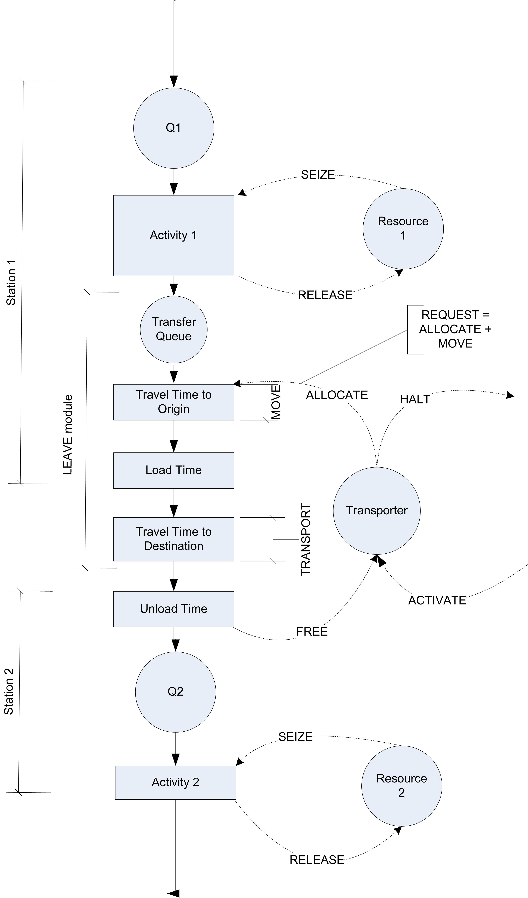
<p class="caption">(\#fig:ch7fig13)Activity diagram for general transporter case</p>
</div>

The activity diagram in Figure \@ref(fig:ch7fig13) represents very well how the test
and repair system will need to operate with transporters. The next
section discusses how to use transporters to model the dedicated
transport workers in the test and repair shop.

### Test and Repair Shop with Workers as Transporters {#ch7:TRTransporters}

The results of the constrained resource analysis indicated that modeling
constrained transfer for the parts in the test and repair system can
have a significant effect on the system's ability to meet the contract
requirements. This may be due to having the workers share the roles of
tending the machines and transporting the parts. The following example
investigates whether or not a set of dedicated workers would make sense
for this system. In particular, the number of workers to dedicate to the
transport task needs to be determined. Since there is a lot of walking
involved, the model needs to be more precise in the physical modeling of
the situation. This could also allow different layout configurations to
be simulated if the relocation of the stations would make a difference
in the efficiency of the system.

To model this situation using transporters, the distance between the
stations and a way to model the velocity of transport are required.
Since the workers have a natural variability in the speed of their
walking, a model for human walking speed is needed. Based on some time
study data, the velocity of a worker walking in the facility has been
determined to be distributed according to a triangular distribution with
a minimum of 22.86, a mode of 45.72, and a maximum of 52.5, all in
meters per minute. Since this distribution will be used in many
locations in the model, an EXPRESSION should be defined, called
`eWalkingTimeCDF`, which will be equal to TRIA(22.86, 45.72, 52.5).

Based on measuring the distance between the stations, the approximate
distance between the stations has been determined as given in
Table \@ref(tab:TRDistances).
Recall that both the loaded and unloaded distances for the transporter
must be specified. For example, even though no parts are routed from
repair to diagnostics, the distance from repair to diagnostics must be
given because the worker (transporter) may be at the repair station when
something needs to be moved from the diagnostic station. Thus, the
worker must walk from the repair station to the diagnostic station
(unloaded) in order to pick up the part. Notice also that the distances
do not have to be symmetric (i.e. the distance from test 1 to test 2
does not have to be the same as the distance from test 2 to test 1).

::: {#tab:TRDistances}
    Station     Diagnostics    Test 1   Test 2   Test 3   Repair
  ------------- ------------- -------- -------- -------- ---------
   Diagnostics     --          40       70       90       100
    Test 1         43          --       10       60       80
    Test 2         70          15       --       65       20
    Test 3         90          80       60       --       25
    Repair         110         85       25       30       --
  ------------- ------------- -------- -------- -------- ---------

  Table: (\#tab:TRDistances) Transporter distances between stations
:::

Starting with the finished model for the resource constrained example
(without the animation) you can make small changes in order to utilize
transporters. The first step is to define the distances.
Figure \@ref(fig:ch7fig14) shows the DISTANCE module from the
Advanced Transfer panel. The spreadsheet view allows an easier
specification for the distances as shown in the figure. Multiple
distance sets can be defined and used within the same model. The
distance set must be given a name so that the name can be referenced by
the TRANSPORTER module. Now, the transporters for the model can be
defined using the TRANSPORTER module.

<div class="figure" style="text-align: center">

<p class="caption">(\#fig:ch7fig14)DISTANCE module for general transporter case</p>
</div>

The TRANSPORTER module, see Figure \@ref(fig:ch7fig15), allows the transporter to be
given a name and various other attributes. The TRANSPORTER module
defines a fleet of identical mobile resources(e.g. vehicles). You can
specify the number of units of the transporter. In this example, there
will be 3 workers (all identical) that can transport the parts. The type
of transporter in this case is Free Path and the Distance Set has been
specified with the name used in the appropriate distance set from the
DISTANCE module. The velocity within the TRANSPORTER module must be a
real number (it cannot be an expression). The default value of the
velocity will be used in the dialog because the velocity will be
specified for each movement of the transporter within the model. The
initial position specifies where the transporter will be located at the
beginning of the replication. In this case, the workers will start
active at the diagnostics station.

<div class="figure" style="text-align: center">
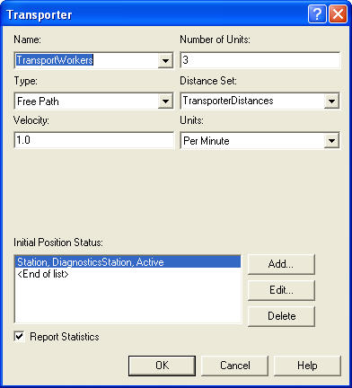
<p class="caption">(\#fig:ch7fig15)TRANSPORTER module for general transporter case</p>
</div>

Now that the data modules are defined, let's take a look at the overall
model. Figure \@ref(fig:ch7fig16) shows the overall test and repair model
after the modifications needed to use transporters. If you have the
model open you should notice the new blue colored modules. These are
from the Advanced Transfer panel and have replaced the LEAVE modules
from the previous model.

<div class="figure" style="text-align: center">
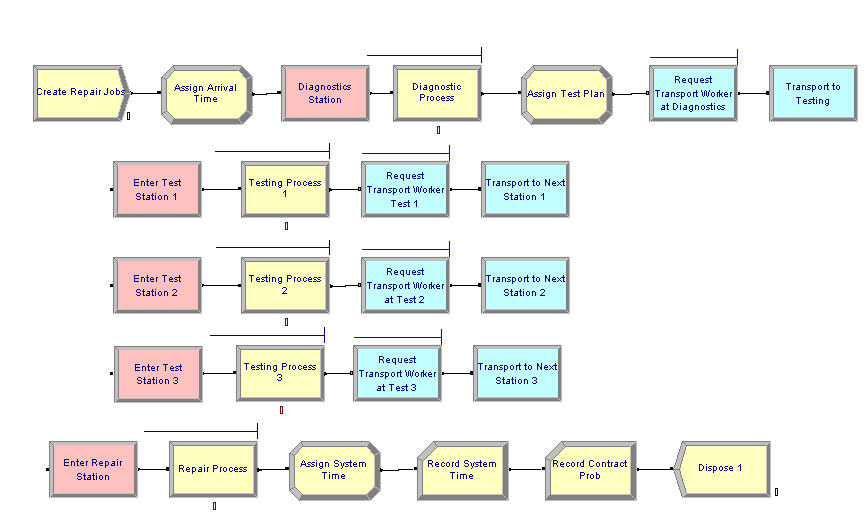
<p class="caption">(\#fig:ch7fig16)Overall test and repair model with transporters</p>
</div>

The other change from the previous model involves the updating of the
ENTER modules. The ENTER module change is very straight forward. You
just need to specify that the type of transfer in option is Free
Transporter and indicate what transporter to free.
Figure \@ref(fig:ch7fig17) illustrates the changes to the ENTER
module for entering test station 1. By default the transporter unit that
the entity currently has is freed.

<div class="figure" style="text-align: center">

<p class="caption">(\#fig:ch7fig17)ENTER module with free transporter option</p>
</div>

The changes to the LEAVE module are not as simple. Because a random
velocity value is needed whenever the worker begins moving, the LEAVE
module cannot be used. The LEAVE module relies on the default velocity
for the transporter as defined in the TRANSPORTER module. Since the
default velocity in the TRANSPORTER module must be a real number (not an
expression), the REQUEST and TRANSPORT modules are used in this example.

<div class="figure" style="text-align: center">
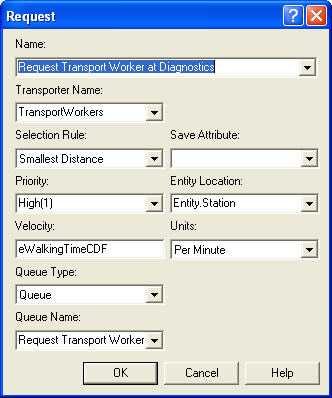
<p class="caption">(\#fig:ch7fig18)REQUEST module</p>
</div>

Figure \@ref(fig:ch7fig18) shows the REQUEST module for the
example. In the REQUEST module, you must specify which transporter to
request and give the selection rule. The selection rules are the similar
in concept to the selection rules for resources. The transporter
selection rules are:

\FloatBarrier

Cyclical

:   cyclic priority selects the first available transporter beginning
    with the successor of the last transporter allocated (cycles through
    the transporters)

Largest Distance

:   select the available transporter farthest from the requesting
    station

Preferred Order

:   select the available transporter unit which has the lowest unit
    number

Random

:   select randomly from the available transporter units

Smallest Distance

:   select the nearest available transporter

Specific Member

:   a specific unit of the transporter

ER(Index)

:   select based on rule number Index defined in experiment frame

UR(Index)

:   select transporter index UR, where UR is computed in a user coded
    function UR(LENT,NUR)

\FloatBarrier

The selection rule is only used if one or more units of the transporter
are available to be allocated. An entity arrives at the REQUEST module,
requests the transporter according to the specified selection rule. If a
unit of the transporter is available (active and idle), the transporter
is allocated to the entity; thereby, making the transporter busy (and
allocated). The selected transporter can be saved in the save attribute.
The travel time is calculated from the transporter's present station to
the station of the requesting entity and imposes a time delay
representing the travel time using the velocity argument. If a
transporter is not available the entity waits in queue. This module gets
the transporter to the entity. Now you have to use the transporter to
transport the entity using the TRANSPORT module.

<div class="figure" style="text-align: center">

<p class="caption">(\#fig:ch7fig19)TRANSPORT module</p>
</div>

Figure \@ref(fig:ch7fig19) shows the TRANSPORT module for the
test and repair example. The TRANSPORT module is very similar to the
ROUTE module, except the user specifies the transporter to use by name
(and/or unit number). In most cases, this will be the same transporter
as allocated in the REQUEST module. Then, the user can specify the type
of destination (By Sequence, attribute, station, or expression). In this
case, the By Sequence option should be used. In addition, the velocity
of the transport can be specified. The Guided Tran Destination Type
field allows the user to send the transporter to a location different
than that specified by the entity's destination. This is useful in
guided path transporters to send the transporter through specific
intersections on its way to the final destination. This option will not
be used in this text.

After making these changes, you can run the model with the default
animation and find out how the system operates with the transporters.
Recall that in Figure \@ref(fig:ch7fig15) that there was a little check box
to indicate whether or not to collect statistics on the transporter. If
this is checked, and the Transporters check-box is checked on the
Project Parameters tab on the Run Setup dialog, then the number busy and
utilization of the transporters will be reported automatically.

<div class="figure" style="text-align: center">
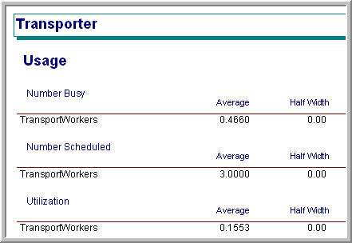
<p class="caption">(\#fig:ch7fig20)Transporter statistics</p>
</div>

As can be seen in Figure \@ref(fig:ch7fig20), the utilization of the three
transporters is very low. Less than three workers a probably need for
the transport task. The reader is asked to explore this issue an
exercise.

\FloatBarrier

### Animating Transporters {#ch7s2sb2}

A significant advantage of using transporters in this situation rather
than resource constrained transfer is the animation that is available
with transporters. This section converts the previous animation so that
it uses transporters. The basic steps in converting the model are as
follows:

1.  Cut and paste the animation from the file,
    *RepairShopResourceConstrainedTransferWithAnimation.doe*, to the
    file *RepairShopWithTransportersNoAnimation.doe* and rename it.

2.  Select and delete each route connector and station marker from the
    previous animation.

3.  Delete each animation queue from the flow chart modules. Redefine
    each animation queue with the appropriate name within the copied
    animation.

4.  Use the Add Distance button on the Animate Transfer toolbar to place
    station markers and distance connectors for every from/to
    combination within the distance set as shown in
    Figure \@ref(fig:ch7fig21). For every station marker,
    make sure that the "Parking\" check-box is checked. This will
    indicate that the transporter will be shown at that station when it
    is idle (parked).

5.  Add a variable animation to show the current number of busy
    transporters. This can be easily done using the expression builder
    to find the transporter variables (`NT(TransportWorkers)`). To learn
    more about the variables associated with transporters look up
    "Transporter Variables\" within Arena's help system.

6.  Use the transporter button in the Animate Transfer toolbar to define
    a transporter picture. The process is essentially the same as that
    for defining a resource animation picture as shown in
    Figure \@ref(fig:ch7fig22).

<div class="figure" style="text-align: center">
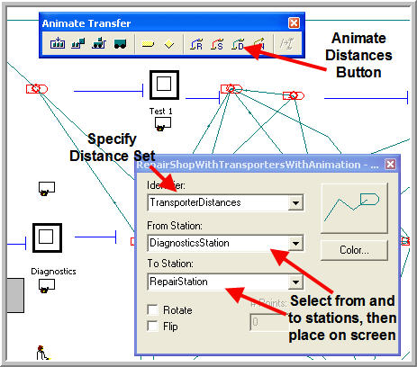
<p class="caption">(\#fig:ch7fig21)Placing the distance animation elements</p>
</div>

<div class="figure" style="text-align: center">

<p class="caption">(\#fig:ch7fig22)Defining the transporter picture</p>
</div>

Now the animation involving the transporters is complete. If you run the
model with animation turned on, you will see that there is only about 1
unit of the transporter busy at any time. Also, you will see that the
idle transporters become parked after their transport when no other
transport requests are pending. They will remain at the station where
they last dropped off a part until a new transport request comes in. In
the animation, a picture was used that showed a person sitting for idle
and walking/carrying something to show busy. Another way to show that
the transporter is carrying something is to enable the *ride point* for
the transporter. To place a ride point in the busy transporter picture,
select the Ride Point option from the Object menu after double-clicking
on the busy picture in the transporter animation dialog. If no ride
point is defined, the entity picture will not appear.

In this model, the worker stays at the location where they drop off the
part if no part requires transport. Instead, the worker could go to a
common staging area (e.g. in the middle of the shop) to wait for the
next transport request. The trick to accomplishing this is to not use
the ENTER module. The basic idea would be implemented as follows:

```
STATION
DECIDE
	IF requests are waiting
		FREE the transporter
		continue normal station processing
	ELSE
		SEPARATE 1 duplicate into station
		MOVE to staging area
		FREE the transporter
	ENDIF
END DECIDE
```

Notice that in the case of no waiting requests, a duplicate of the
entity is used to continue the control of the transporter to move it to
the staging area. The reader is asked to implement this idea as an
extension to this problem in the exercises. The notion of having an
entity control or "drive\" the transporter around is very useful in
modeling systems that have complicated transporter allocation rules or
systems that naturally have a driver, e.g. bus systems.

A distance module allows the physical transport aspects of systems to be
modeled. An important aspect of this type of modeling is the movement of
entities through space. The conveyor constructs allow for a finer
representation of the usage of space between stations. That topic is
taken up in the next section.

## Modeling Systems with Conveyors {#ch7:sec:conveyors}

A conveyor is a track, belt, or some other device that provides movement
over a fixed path. Typically, conveyors are used to transport items that
have high volumes over short to medium range distances. The speeds of
conveyance typically range from 20-80 feet per minute to as fast as 500
feet per minute. Conveyors can be gravity based or powered. The modeling
of conveyors can be roughly classified as follows:

Accumulating

:   Items on the conveyor continue to move forward when there is a
    blockage on the conveyor.

Non-accumulating

:   Items on the conveyor stop when the conveyor stops

Fixed spacing

:   Items on the conveyor have a fixed space between them or the items
    ride in a bucket or bin.

Random spacing

:   Items are placed on the conveyor in no particular position and take
    up space on the conveyor.

You have experienced conveyors in some form. For example, the belt
conveyor at a grocery store is like an accumulating conveyor. An
escalator is like a fixed spaced non-accumulating conveyor (the steps
are like a bucket for the person to ride in. People movers in airports
are like non-accumulating, random spacing conveyors. When designing
systems with conveyors there are a number of performance measures to
consider:

Throughput capacity

:   The number of loads processed per time

Delivery time

:   The time taken to move the item from origin to destination

Queue lengths

:   The queues to get on the conveyor and for blockages when the
    conveyor accumulates

Number of carriers used or the space utilized

:   The number of spaces on the conveyor used

The modeling of conveyors does not necessarily require specialized
simulation constructs. For example, gravity based conveyors can be
modeled as a PROCESS or a DELAY with a deterministic delay. The delay is
set to model the time that it takes the entity to fall or slide from one
location to another. One simple way to model multiple items moving on a
conveyor is to use a resource to model the front of the conveyor with a
small delay to load the entity on the conveyor. This allows for spacing
between the items on the conveyor. Once on the conveyor the entity
releases the front of the conveyor and delays for its move time to the
end of the conveyor. At the end of the conveyor, there could be another
resource and a delay to unload the conveyor. As long as the delays are
deterministic, the entities will not pass each other on the conveyor. If
you are not interested in modeling the space taken by the conveyor, then
this type of modeling is very reasonable. [@henriksen1986simplified]
discuss a number of ways to approach the simulation modeling of
conveyors. When space becomes an important element of the modeling, then
the simulation language constructs for conveyors become useful. For
example, if there actually is a conveyor between two stations and the
space allocated for the length of the conveyor is important to the
system operation, you might want to use conveyor related modules.

In , a conveyor is a material-handling device for transferring or moving
entities along a pre-determined path having fixed pre-defined loading
and discharge points. Each entity to be conveyed must wait for
sufficient space on the conveyor before it can gain entry and begin its
transfer. In essence, simulation modeling constructs for conveyors model
the travel path via a mapping of space/distance to resources. Space
along the path is divided up into units of resources called cells. The
conveyor is then essentially a set of moving cells of equal length.
Whenever an entity reaches a conveyor entry point it must wait for a
predefined amount of unoccupied and available consecutive cells in order
to get on the conveyor.

Figure \@ref(fig:ch7fig23) illustrates the idea of modeling a conveyor
as a set of contiguous cells representing the space on the conveyor. One
way to think of this is like an escalator with each cell being a step.

<div class="figure" style="text-align: center">
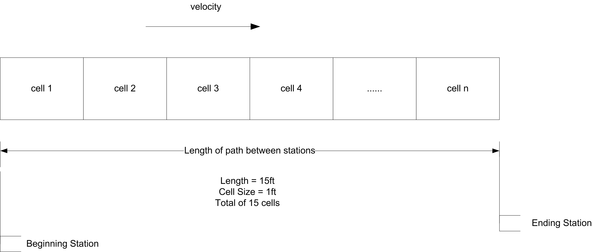
<p class="caption">(\#fig:ch7fig23)A conveyor conceptualized as a set of contiguous cells</p>
</div>

In the figure, if each cell represents 1 foot and the total length of
the conveyor is 15 feet, then there will be 15 cells. The cell size of
the conveyor is the smallest portion of a conveyor that an entity can
occupy. In modeling with conveyors, the size of the entity also matters.
For example, think of people riding an escalator. Some people have a
suitcase and take up two steps and others do not have a suitcase an only
take up one step. An entity must acquire enough contiguous cells to hold
their physical size in order to be conveyed.

The key modules for modeling the use of conveyors are:

ACCESS

:   When an entity enters an ACCESS module, it will wait until the
    appropriate amount of contiguous cells are available at the access
    point. Once the entity has control of the cells, it can then be
    conveyed from its current station to a station associated with the
    conveyor. This is similar in concept to the ALLOCATE module for
    transporters.

CONVEY

:   The CONVEY module causes the entity to move from its origin station
    to its next station. The time to move is based on the velocity of
    the conveyor and the distance between the stations. This similar in
    concept to the MOVE module for transporters.

EXIT

:   The EXIT module causes the entity to release the cells that it holds
    on the conveyor. If another entity is waiting in queue for the
    conveyor at the same station where the cells are released, the
    waiting entity will then access the conveyor. This is like releasing
    a resource or freeing a transporter.

START

:   The START module changes the status of the conveyor to active.
    Entities may reside on the conveyor while it is stopped. These
    entities will maintain their respective positions on the conveyor
    once it is started. The entity using the START module does not have
    to be on the conveyor.

STOP

:   The STOP module changes the status of the conveyor to inactive. The
    conveyor will stop immediately, regardless of the number of entities
    on the conveyors. This is useful for modeling conveyor failures or
    blockages on the conveyor. The entity using the STOP module does not
    have to be on the conveyor.

CONVEYOR

:   This data module defines whether or not the conveyor is an
    accumulating or non-accumulating conveyor, the cell size (in
    physical units e.g. feet), and the velocity. A conveyor consists of
    a sequence of segments as defined by the SEGMENT module. The sum of
    the distances among the stations on the conveyor (specified by
    SEGMENT module) must be divisible by the cell size. If not, an error
    will occur when the model is checked.

SEGMENT

:   This data module defines the segment network that makes up a
    conveyor. Each segment is a directed link between two stations
    forming a network. The conveyor path is defined by a beginning
    station and a set of next station-distance pairs. The beginning
    station of the segment is the beginning station number or name, and
    the next station defines the next station name that is a length of
    distance units from the previously defined station. The length of
    the segment must be specified in integer distance units (feet,
    meters, etc.). No station should be repeated within the segment
    network unless the conveyor is a loop conveyor. In that case, the
    last ending station should be the same as the beginning station for
    the segment network.

As was the case for transporters, the ENTER and LEAVE modules of the
advanced transfer template will also provide some conveyor
functionality. LEAVE provides for ACCESS and CONVEY. ENTER provides for
EXIT. The modules work slightly differently for accumulating and
non-accumulating conveyors.

Non-accumulating conveyors travel in a single direction, and the spacing
remains the same between the entities. When an entity is placed on the
conveyor, the entire conveyor is actually disengaged or stopped until
instructions are given to transfer the entity to its destination. When
the entity reaches its destination, the entire conveyor is again
disengaged until instructions are given to remove the entity from the
conveyor, at which time it is engaged or started.

As previously mentioned, the conveyor is divided into a number of cells.
To get on the conveyor and begin moving, the entity must have its
required number of contiguous cells. For example, in
Figure \@ref(fig:ch7fig24), the circle needed 1 cell to get on
the conveyor. Suppose the hexagon was trying to get on the conveyor. As
cell 2 became available, the hexagon would seize it. Then it would wait
for the next cell (cell 1) to become available and seize it. After
having both required cells, it is "on\" the conveyor. But moving on a
conveyor is a bit more continuous than this. Conceptually, you can think
of the hexagon, starting to move on the conveyor when it gets cell 2.
When one cell moves, all cells must move, in lock step. Since entities
are mapped on to the cells by their size, when a cell moves the entity
moves. Reversing this analogy becomes useful. Suppose the cells are
fixed, but the entities can move. In order for an entity to "take a
step" it needs the next cell. As it crosses over to the next cell it
releases the previous cell that it occupied. It is as if the entity's
"step size" is 1 cell at a time.

<div class="figure" style="text-align: center">

<p class="caption">(\#fig:ch7fig24)Different entity sizes on a conveyor</p>
</div>

Figure \@ref(fig:ch7fig25) illustrates an approximate
activity flow diagram for an entity using a non-accumulating conveyor.
Suppose the entity size is 2 feet and each cell is 1 foot on the
conveyor. There is a queue for the entities waiting to access the
conveyor. The cells of the conveyor act as resources modeling the space
on the conveyor. The movements of the entity through the space of each
cell are activities. For the 2 foot entity, it first seizes the first
cell and then moves through the distance of the cell. After the movement
it seizes the next cell and moves through its length. Because it is 2
feet (cells) long it seizes the 3rd cell and then releases the first
cell before delaying for the move time for the 3rd cell. As cells become
released other entities can seize them and continue their movement. The
repeated pattern of overlapping SEIZE and RELEASE modules that underlie
conveyor modeling clearly depends upon the number of cells and the size
of the entity. Thus, the activity diagram would actually vary by the
size of the entity (number of cells required).

<div class="figure" style="text-align: center">

<p class="caption">(\#fig:ch7fig25)Activity diagram for non-accumulating conveyor</p>
</div>

The larger the number of cells to model a segment of a conveyor the more
slowly the model will execute; however, a larger number of cells allows
for a more "continuous\" representation of how entities actually exit
and leave the conveyor. Larger cell sizes force entities to delay longer
to move and thus waiting entities must delay for available space longer.
A smaller mapping of cells to distance allows then entity to "creep\"
onto the conveyor in a more continuous fashion. For example, suppose the
conveyor was 6 feet long and space was modeled in inches. That is, the
length of the conveyor is 72 inches. Now suppose the entity required 1
foot of space while on the conveyor. If the conveyor is modeled with 72
cells, the entity starts to get on the conveyor after only 1 inch (cell)
and requires 12 cells (inches) when riding on the conveyor. If the
mapping of distance was 1 cell equals 1 foot, the entity would have to
wait until it got a whole cell of 1 foot before it moved onto the
conveyor.

Now you are ready to put these concepts into action.

### Test and Repair Shop with Conveyors {#ch7s3sb1}

For simplicity, the test and repair shop will be used for illustrating
the use of conveyors. Figure \@ref(fig:ch7fig26) shows the test and repair shop with
the conveyors and the distance between the stations. From the figure,
the distances from each station going in clockwise order are as follows:

-   Diagnostic station to test station 1, 20 feet

-   Test station 1 to test station 2, 20 feet

-   Test station 2 to repair, 15 feet

-   Repair to test station 3, 45 feet

-   Test station 3 to diagnostics, 30 feet

<div class="figure" style="text-align: center">

<p class="caption">(\#fig:ch7fig26)Test and repair shop with conveyors</p>
</div>

Assume that the conveyor's velocity is 10 feet per minute. These figures
have been provided in this example; however, in modeling a real system,
you will have to tabulate this information. To illustrate the use of
entity sizes, assume the following concerning the parts following the
four test plans:

-   Test plan 1 and 2 parts require 1 foot of space while riding on the
    conveyor

-   Test plan 3 and 4 parts require 2 feet of space while riding on the
    conveyor

The conveyor logic will first be implemented without animation. Then,
the animation for the conveyors will be added. To convert the previous
model so that it uses conveyors, the model,
*RepairShopWithTransportersNoAnimation.doe*, should be changed as
follows:

1.  Delete the TRANSPORTER and DISTANCE modules defined for using the
    transporter

2.  Delete the REQUEST and TRANSPORT modules for leaving the stations
    and replace them with LEAVE modules. The LEAVE modules will be
    filled out in a moment.

3.  Add a variable array called `vSizes()` of dimension 4 to hold the
    sizes of the parts following each of the test plans as shown in
    Figure \@ref(fig:ch7fig27).

4.  Save your file. The completed model can be found in the file
    *RepairShopWithConveyorsWithNoAnimation.doe*.

<div class="figure" style="text-align: center">

<p class="caption">(\#fig:ch7fig27)Array for part sizes</p>
</div>

Now, you are ready to define the conveyor and its segments. You will
first define the segments for the conveyor, then the conveyor itself.
Figure \@ref(fig:ch7fig28) shows the segments to be used on the
conveyor. First, give the segment a name and then specify the station
that represents the *beginning* station. The beginning station is the
station associated with the first segment of the conveyor. Since this is
a loop conveyor, the beginning station is arbitrary. The diagnostic
station is used here since this is where the parts enter the system.

<div class="figure" style="text-align: center">

<p class="caption">(\#fig:ch7fig28)SEGMENT module for test and repair conveyor</p>
</div>

Then, the next station and the distance to the next station are given
for each part of the conveyor. Notice that the distances have been added
as shown in Figure \@ref(fig:ch7fig26). The lengths specified in
Figure \@ref(fig:ch7fig28) are in the actual physical distances
(e.g. feet). The mapping to cells occurs in the CONVEYOR module.

Figure \@ref(fig:ch7fig29) shows the CONVEYOR module. To
associated the conveyor with a segment use the Segment Name drop down
box. The next decision is the type of conveyor. In this case, a
non-accumulating conveyor should be used.

<div class="figure" style="text-align: center">
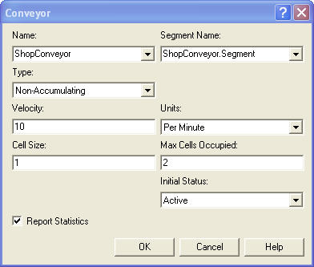
<p class="caption">(\#fig:ch7fig29)CONVEYOR module for test and repair example</p>
</div>

The velocity of the conveyor is 10 feet per minute. Now, the cell size
and the maximum cells occupied text-boxes must be completed. The cell
size is the most important decision. Thinking back to
Figure \@ref(fig:ch7fig25), it should be clear that
space must be represented by discrete cells of a specified integral
length. Thus, the total length of the conveyor must be integer valued
and the cell size must result in an integer number of cells for each
segment. The lengths of each distance specified in the SEGMENT module
for the example are all divisible by 5. Thus, you could choose a cell
size of 5. This would mean that each cell would be 5 feet in length.
Since entities access the conveyor by grabbing cells, this hardly seems
appropriate if the parts are 1 and 2 feet in length, respectively. In
the case of a 5 foot cells size, the parts would have a lot of space
between each other as they ride on the conveyor. Instead, the cell size
will be specified as 1 foot. This will always work, since every number
is divisible by 1. It also works well in this case, since the smallest
part is 1 foot and the distances in the SEGMENT module are based on the
units of feet. Now, the maximum number of cells text field is easy. This
represents the size of the biggest entity in terms of cells. This should
be 2 in this case since parts that follow test plans 3 and 4 are 2 feet
in length.

With the CONVEYOR and SEGMENT modules defined, it is an easy matter to
change the ENTER and LEAVE modules to use the conveyors. The first item
to address is to make sure that each created part knows its size so that
the size can be used in the LEAVE module. You can do this with the
"Assign Test Plan\" ASSIGN module as shown in
Figure \@ref(fig:ch7fig30).

<div class="figure" style="text-align: center">
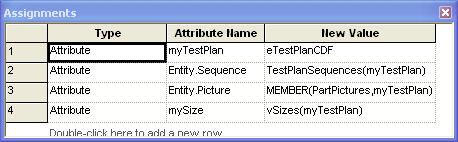
<p class="caption">(\#fig:ch7fig30)Assigning the size of the parts</p>
</div>

The LEAVE modules must be updated to use the conveyor to transfer out
and to indicate the number of cells required by the entity. This is done
in Figure \@ref(fig:ch7fig31) using the entity's `mySize` attribute.
Each of the other LEAVE modules for the other stations should be updated
in a similar fashion. Now, you must update the ENTER module so that the
entity can exit the conveyor after arriving to the desired station.

<div class="figure" style="text-align: center">
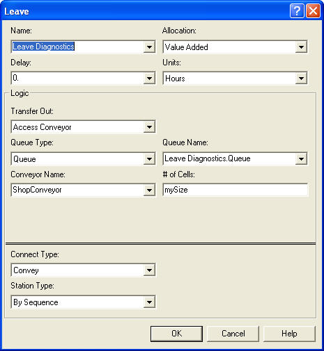
<p class="caption">(\#fig:ch7fig31)LEAVE module for test and repair example</p>
</div>

In Figure \@ref(fig:ch7fig32), the Exit Conveyor option is used when
transferring into the Test 1 Station. In both of the ENTER and LEAVE
modules, the option of delaying the entity is available. This can be
used to represent a loading or an unloading time for the conveyor.

<div class="figure" style="text-align: center">
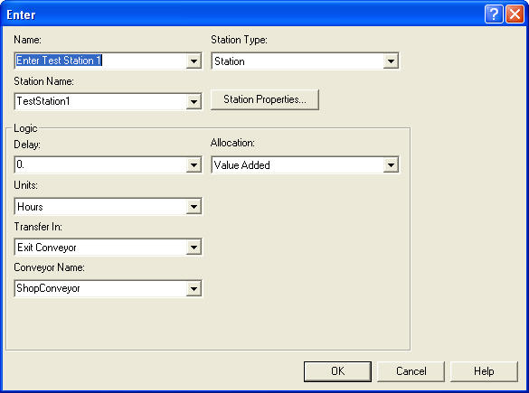
<p class="caption">(\#fig:ch7fig32)ENTER module for test station 1</p>
</div>

With the conveyor statistics check-box clicked, the conveyor statistics
will appear on the summary reports. See Figure \@ref(fig:ch7fig33). The utilization is calculated for
the conveyor, regardless of conveyor type. This utilization represents
the length of entities on the conveyor in comparison to the length of
the entire conveyor over the simulation run. Thus, conveyor utilization
is in terms of the space utilized. In addition, there is very little
queuing for getting on the conveyor. The statistics for the conveyor in
this problem indicate that the conveyor is not highly utilized; however,
the chance of meeting the contract limit is up to 80%. The volumes in
this example may make it difficult to justify the use of conveyors for
the test and repair shop. Ultimately, the decision would come down to a
cost/benefit analysis.

<div class="figure" style="text-align: center">

<p class="caption">(\#fig:ch7fig33)Statistics for test and repair shop with conveyors</p>
</div>

\FloatBarrier

### Animating Conveyors {#ch7s3sb2}

To augment the model with animation, the Animate Transfer toolbar can be
used. To visibly discern the plan that an entity is following within the
animation, you can define a picture set, with appropriately drawn
pictures for each type of plan. This is illustrated in
Figure \@ref(fig:ch7fig34) and Figure \@ref(fig:ch7fig35). The assignment to the Entity.Picture
attribute is shown in Figure \@ref(fig:ch7fig39).

<div class="figure" style="text-align: center">

<p class="caption">(\#fig:ch7fig34)Enity pictures for test plans</p>
</div>

<div class="figure" style="text-align: center">

<p class="caption">(\#fig:ch7fig35)Picture set for test plans</p>
</div>

To update the previous transporter animation, perform the following
steps.

1.  Copy and paste the animation elements from the file,
    *RepairShopWithTransportersWithAnimation.doe* to your own model
    file. The completed model is called,
    *RepairShopWithConveyorsWithAnimation.doe*.

2.  Delete the transporter picture, station markers, and distance
    connectors.

3.  Using the Animate Transfer toolbar's Segment button make station
    markers and segment connectors to represent the conveyors as shown
    in Figure \@ref(fig:ch7fig26). The segment animation dialog is
    shown in Figure \@ref(fig:ch7fig36). It works very much like the
    route and distance animation dialog.

<div class="figure" style="text-align: center">
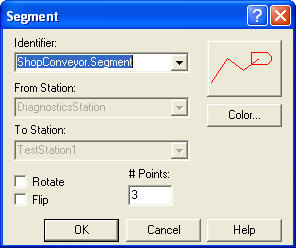
<p class="caption">(\#fig:ch7fig36)Segment animation dialog</p>
</div>

After the segments have been laid down, you might want to place some
lines to represent the conveyors. This was done in
Figure \@ref(fig:ch7fig36) where the roller pattern from the
line patterns button on the drawing toolbar was also used. That's it!
Animating conveyors is very easy. If you run the model with the
animation on you will see that the entities move along the conveyor
segments, getting on and off at the appropriate stations. You will also
clearly see that for the majority of time the conveyor does not have
very many parts. This section concentrated on non-accumulating
conveyors. The next section describes how accumulating conveyors operate
and discusses a number of other conveyor modeling issues.

### Miscellaneous Issues in Conveyor Modeling {#ch7s3sb3}

This section discusses accumulating conveyors, how to model merging
conveyors, diverging conveyors, how to allow processing to occur on the
entity while it is still on the conveyor, and re-circulation conveyors.

#### Accumulating Conveyors {#ch7s3sb3sub1}

An accumulating conveyor can be thought of as always running. When an
entity stops moving on the conveyor (e.g. to unload), other entities are
still allowed on the conveyor since the conveyor continues moving. When
entities on the conveyor meet up with the stopped entity, they stop, and
a queue accumulates behind the stopped entity until the original stopped
entity is removed or transferred to its destination.

As an analogy, imagine wearing a pair of roller blades and being on a
people mover in an airport. Don't ask how you got your roller blades
through security! While on the people mover you aren't skating (you are
standing still, resting, but still moving with the people mover). Up
ahead of you, some seriously deranged simulation book author places a
bar across the people mover. When you reach the bar, you grab on. Since
you are on roller blades, you remain stationary at the bar, while your
roller blades are going like mad underneath you.

Now imagine all the people on the mover having roller blades. The people
following you will continue approaching the bar until they bump into
you. Everyone will pile up behind the bar until the bar is removed. You
are on an accumulating conveyor! Notice that while you were on the
conveyor and there was no blockage, the spacing between the people
remained the same, but that when the blockage occurred the spacing
between the entities decreased until they bump up against each other. To
summarize:

-   Accumulating conveyors are always moving.

-   If an entity stops to exit or receives processing on the conveyor,
    other entities behind it are blocked and begin to queue up on the
    conveyor.

-   Entities in front of the blockage continue moving.

-   When a blockage ends, blocked entities, may continue, but must first
    wait for the entities immediately in front of them to move forward.

In modeling accumulating conveyors, the main differences occur in the
actions of the ACCESS and CONVEY modules. Instead of disengaging the
conveyor as with non-accumulating conveyors the conveyor continues to
run. ACCESS allocates the required number of cells to any waiting
entities as space becomes available. Any entities that are being
conveyed continue until they reach a blockage. If the blocking entity is
removed or conveyed, the accumulated entities only start to move when
the required number of cells becomes available.

In the ACCESS module the number of cells still refers to the number of
cells required by the entity while moving on the conveyor; however, you
must indicate what the space requirements will be when the entities
experience a blockage. In the CONVEYOR module, if the accumulating
conveyor option is selected, the user must decide on how to fill in the
Accumulation Length text field. The accumulation length specifies the
amount of space required by the entities when accumulating. It does not
need to be the same as the amount of space implied by the number of
cells required when the entity is being conveyed. Also, it doesn't have
to be divisible into an even number of cells. In addition, as can be
seen in Figure \@ref(fig:ch7fig37), the accumulation length can
also be an entity (user defined) attribute. Thus, the accumulation size
can vary by entity. Typically, the space implied by the number of cells
required while moving will be larger than that required when
accumulating. This will allow spacing between the entities when moving
and allow them to get closer to each other when accumulating.

<div class="figure" style="text-align: center">
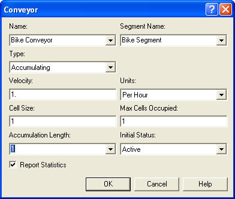
<p class="caption">(\#fig:ch7fig37)Accumulating conveyor dialog</p>
</div>

The test and repair example barely required non-accumulating conveyors.
Thus, to illustrate accumulating conveyors, a SMART file,
*(Smarts101.doe)*, will be used. See Figure \@ref(fig:ch7fig38). The SMART files can be found within the
folder within your Arena installation.

<div class="figure" style="text-align: center">

<p class="caption">(\#fig:ch7fig38)Arena Smarts101.doe model for accumulating conveyors</p>
</div>

In this example, there is 1 segment for the conveyor of length 10, which
(while not specified in the model) can be assumed to be in meters. The
velocity is only 1 meter per hour, the conveyor cell size is 1, and the
maximum size of an entity is 1. The entities, which are bicycles, enter
at the arrival station and access the conveyor, where they are conveyed
to the finishing area. You can think of the bicycles as being assembled
as they move along the conveyor. This type of system often occurs in
assembly lines. Once the bicycles reach the finishing area, they
experience an unload delay prior to exiting the conveyor. Because the
unload delay occurs prior to exiting the conveyor, the entity's movement
is blocked and an accumulation queue will occur behind the entity on the
conveyor. You should run the model and convince yourself that the
bicycles are accumulating.

When modeling with accumulating conveyors, additional statistics are
collected on the average number of accumulating entities if the
conveyors check-box is checked on the Project Parameters tab of the Run
Setup dialog box. You can check out the help system to see all the
statistics.

#### Merging and Diverging Conveyors {#ch7s3sb3sub2}

In conveyor modeling a common situation involves one or more conveyors
feeding another conveyor. For example in a distribution center, there
may be conveyors associated with each unloading dock, which are then
attached to a main conveyor that takes the products to a storage area.
To model this situation within , the feeding conveyors and the main
conveyor can be modeled with different CONVEYOR modules and separate
SEGMENT definitions. In this distribution center example, an item
accesses the unloading dock's conveyor rides the length of the conveyor
and then attempts to get on the main conveyor. After it has accessed the
main conveyor, the entity exits its current unloading dock conveyor.

<div class="figure" style="text-align: center">

<p class="caption">(\#fig:ch7fig39)Transferring between conveyors</p>
</div>

Arena has two SMART files that illustrate these concepts. Let's first take a
look at *Smarts107.doe*. Figure \@ref(fig:ch7fig39) illustrates the overall model.
There are two conveyor lines for area 1 and area 2, respectively. When
the entities arrive to their area, an attribute called `LineNum` is
assigned to indicate where it came from. The entities access the
appropriate conveyor and then are conveyed to the sorting area. The
sorting area in this example is the station where the main conveyor
begins. Once the parts arrive at the sorting station, they first access
the conveyor to the processing area. Then, the entity exits its current
conveyor. The DECIDE module is used to select the correct conveyor to
exit based on the `LineNum` attribute. By first accessing the next
conveyor, the entity may have to wait on its current conveyor. Because
of this, it is very natural to model this situation with accumulating
conveyors. The feeder conveyors will back up as entities try to get on
the main conveyor.

<div class="figure" style="text-align: center">

<p class="caption">(\#fig:ch7fig40)One conveyor merging into another</p>
</div>

A similar example, Figure \@ref(fig:ch7fig40), involves the merging of one conveyor onto anther
conveyor as in SMART file, *Smarts110.doe*. In this example, there are
two conveyors. The main conveyor has two segment lengths associated with
it. For example, the main conveyor goes from Entry A Station to the
Midpoint Station to the EndPoint station, with lengths 5 feet
respectively. The second conveyor is a single conveyor from the Entry B
station to the MidPoint Station with a length of 10 feet. Notice that
the MidPoint station is associated with segments related to the two
conveyors. In other words, they share a common station. The entities
arrive at both the Entry A and Entry B stations. Entities that arrive at
the Entry A station first convey to the MidPoint station and then
immediately convey to the EndPoint station. They do not exit the
conveyor at the MidPoint station. Entities from the Entry B station are
conveyed to the MidPoint station. Once at the MidPoint station they
first ACCESS the main conveyor and then EXIT their conveyor. This causes
entities coming from Entry B to potentially wait for space on the main
conveyor. This basic idea can be expanded to any number of feeder
conveyors along a longer main conveyor.

<div class="figure" style="text-align: center">

<p class="caption">(\#fig:ch7fig41)Simple alternating conveyor</p>
</div>

Diverging conveyors are often used in system that sort items. The items
come in on one main conveyor and are transferred to any number of other
conveyors based on their attributes (e.g. destination). Arena's
*Smarts108.doe* file illustrates the basic concepts behind diverging
conveyors. In this example, as shown in
Figure \@ref(fig:ch7fig41), the parts arrive to the arrival
area and access a conveyor to the sorting area. Once an entity reaches
the sorting station, the entity first exits the incoming conveyor and
then there is a small delay for the sorting. The module labeled "Parts
Enter Sorting Area" is an ENTER module with the transfer in option used
to exit the conveyor. Then the entity is shunted down one of the lines
based on a DECIDE module. In this model, a variable is used to keep
track of the last line that an entity was sent to so that the other line
will be used in the DECIDE for the next entity. This implements a simple
alternating logic. After being shunted down one of the conveyors, the
entity uses the standard ACCESS, CONVEY, STATION, EXIT logic before
being disposed.

With a little imagination a more sophisticated sorting station can be
implemented. For example, number of conveyors that handle the parts by
destination might be used in the system. When the parts are created they
are given an attribute indicating their destination station. When they
get to the sorting station, a DECIDE module can be used to pick the
correct conveyor handling their destination.

#### Processing while on the Conveyor {#ch7s3sb3sub3}

In the bicycle example from *Smarts101.doe*, the workers can be
conceptualized as moving along with the conveyor as they assemble the
bicycles. In many systems it is common for a machine to be positioned to
use the surface of the conveyor as its work area. For example, in
circuit board manufacturing, the circuit boards ride on a conveyor
through chip placement machines. While in the machine, the conveyor
stops to do the insertion. These types of situations can be easily
modeled in by not exiting the conveyor while undergoing a PROCESS
module.

<div class="figure" style="text-align: center">

<p class="caption">(\#fig:ch7fig42)Processing while on a conveyor</p>
</div>

Arena's SMART file, *Smarts103.doe*, contains an example of this type of
modeling. In this example, as shown in
Figure \@ref(fig:ch7fig42), packages are created for the
packing area, where they access and convey on a conveyor to the pack and
label station. The conveyor consists of two segments attached at the
pack and label station. Once at the Labeling Area station the entity
enters a PROCESS module, which requires a delay and the labeling
machine. Notice that the entity did not exit the conveyor. The "Loading
Area\" module is a simple STATION module. After completing the
processing, the entity proceeds to be conveyed to the shipping area,
where it exits the conveyor. In this example, the conveyor is a
non-accumulating conveyor. If you run the model, you will see that the
whole conveyor stops when the entity is being processed. If an
accumulating conveyor is used, the packages would queue up behind the
labeling machine.

#### Recirculating Conveyors {#ch7s3sb3sub4}

A recirculating conveyor is a loop conveyor in which the entities may
ride on the conveyor until there is adequate space at their desired
location. In essence the conveyor is used as space to hold the entities
that cannot get off due to inadequate space at the necessary station.
For example, suppose that in the test and repair shop there was only
space for one waiting part at test station two. Thus, the size of test
station two's queue can be at most 1.

The previous model can be easily modified to handle this situation by
not using an ENTER module at test station 2.
Figure \@ref(fig:ch7fig43) shows the changes to the logic
for test station 2 to handle this situation. As can be seen in the
figure, the ENTER module has been replaced with a combination of
STATION, DECIDE, EXIT, and CONVEY. The DECIDE module checks the queue at
the Testing Process 2 module. If a part is not in the queue, then the
arriving part can exit the station and try to seize the testing
resources. If there is a part waiting, then the arriving part is sent to
the CONVEY module to be conveyed back around to test station 2. As long
as there is a path back to the station, this is perfectly fine (as in
this case). The modified model is available with the files for this
chapter in the file called
*RepairShopWithRecirculatingConveyorsWithAnimation.doe*. If you run the
model and watch the animation, you will see much more parts on the
conveyor because of the re-circulation.

<div class="figure" style="text-align: center">

<p class="caption">(\#fig:ch7fig43)Test and repair shop with recirculating conveyor</p>
</div>

There are still a number of issues related to conveyor modeling that
have not discussed, especially the use of the specialized variables
defined for conveyors. You should refer to the Arena's Variables Guide
or to Arena's help system under conveyor variables for more information
on this topic. also has a number of other SMART files that illustrate
the use of conveyors. For example, you might want to explore SMART file,
*Smarts105.doe*, to better understand entity size and how it relates to
cells on the conveyor. Conveyors allow the modeling of space through the
used of cells. The next section examines how Arena models space when it is
relevant for transporter modeling.

## Modeling Guided Path Transporters {#ch7:sec:AGVs}

This section presents Arena's modeling constructs for automated guided
vehicle (AGV) systems. An AGV is an autonomous battery powered vehicle
that can be programmed to move between locations along paths. A complete
discussion of AGV systems is beyond the scope of this text. The
interested reader should refer to standard texts on material handling or
manufacturing systems design for a more complete introduction to the
technology. For example, the texts by [@askin1993modeling] and
[@singh1996systems] have complete chapters dedicated to the modeling of
AGV systems. For the purposes of this section, the discussion will be
limited to AGV systems that follow a prescribed path (e.g. tape,
embedded wires, etc) to make things simpler. There are newer AGVs that
do not rely on following a path, but rather are capable of navigating
via sensors within buildings, see for example
[@rossetti2001multiobjective].

When modeling with guided transporters, the most important issue to
understand is that the transporters can now compete with each other for
the space along their paths. The space along the path must be explicitly
modeled (like it was for conveyors) and the size of the transporter
matters. Conceptually, a guided transporter is a mobile resource that
moves along a fixed path and competes with other mobile resources for
space along the path. When using a guided transporter, the travel path
is divided into a network of links and intersections. This is called the
vehicle's path network.  Figure \@ref(fig:ch7fig44) illustrates the major concepts in
guided vehicle modeling: networks, links, intersections, and stations.

<div class="figure" style="text-align: center">

<p class="caption">(\#fig:ch7fig44)Relational diagram for guided vehicle networks</p>
</div>

A link is a connection between two points in a network. Every link has a
beginning intersection and an ending intersection. The link represents
the space between two intersections. The space on the link is divided
into an integer number of zones. Each zone has a given length as
specified in a consistent unit of measure. All zones have the same
length. The link can also be of a certain type (bidirectional, spur,
unidirectional). A bidirectional link implies that the transporter is
allows to traverse in both directions along the link. A spur is used to
model "dead ends", and unidirectional links restrict traffic to one
direction. A velocity change factor can also be associated with a link
to indicate a change in the basic velocity of the vehicle while
traversing the link. For example, for a link going through an area with
many people present, you may want the velocity of the transporter to
automatically be reduced. Figure \@ref(fig:ch7fig45) illustrates a simple three link
network.

<div class="figure" style="text-align: center">

<p class="caption">(\#fig:ch7fig45)Example three link network</p>
</div>

In the figure, Link 1 is bidirectional with a beginning intersection
label I1 and an ending intersection labeled `I2`. Link 1 consists of 4
zones. There can also be a direction of travel specified. The beginning
direction and the ending direction of the link can be used to define the
direction of the link (in degrees) as it leaves the beginning
intersection and as it enters the ending intersection. The direction
entering the ending intersection defaults to the direction leaving the
link's beginning intersection. Thus, the beginning direction for Link 1
in the figure is 60 degrees. Zero and 360 both represent to the east or
right. The beginning direction for Link 2 is 300 degrees. Think of it
this way, the vehicle has to turn to go onto Link 2. It would have to
turn 60 to get back to zero and then another 60 to head down Link 2.
Since the degrees are specified from the right, this means that the link
2 is 300 degrees relative to an axis going horizontally through
intersection `I2`. The direction of travel is only relevant if the
acceleration or deceleration of the vehicles as they make turns is
important to the modeling.

In general, an intersection is simply a point in the network; however,
the representation of intersections can be more detailed. An
intersection also models space: the space between two or more links.
Thus, as indicated in Figure \@ref(fig:ch7fig44), an intersection may have a length,
a velocity change factor, and link selection rule. For more information
on the detailed modeling of intersections, you should refer to the
INTERSECTIONS element from Arena's Elements template. Also, the books by
@banks1995introduction and [@pegden1995introduction] cover the SIMAN
blocks and elements that underlie guided path transporter modeling
within . Clearly, a fixed path network consists of a set of links and
the associated intersections. Also from
Figure \@ref(fig:ch7fig44), a station may be associated with an
intersection within the network and an intersection may be associated
with many stations. Transporters within a guided path network can be
sent to specific stations, intersections, or zones. Only the use of
stations will be illustrated here.

<div class="figure" style="text-align: center">

<p class="caption">(\#fig:ch7fig46)NETWORK module for guided path modeling</p>
</div>

The new constructs that are to be discussed include the NETWORK and
NETWORK LINK modules on the Advanced Transfer template. The NETWORK
module allows the user to specify a set of links for a path network.
Figure \@ref(fig:ch7fig46) shows the NETWORK module. To add links,
the user presses the add button or uses the spreadsheet dialog box
entry. The links added to the NETWORK module either must already exist
or must be edited via the NETWORK LINK module. The NETWORK LINK module
permits the definition of the intersections on the links, the
directional characteristics of the links, number of zones, zone length,
and velocity change factor.
Figure \@ref(fig:ch7fig47) illustrates the NETWORK LINK module.
Notice that the spreadsheet view of the module makes editing multiple
links relatively easy.

<div class="figure" style="text-align: center">

<p class="caption">(\#fig:ch7fig47)NETWORK LINK module</p>
</div>

Now, let's take a look at a simple example. In this example, parts
arrive to an entry station every 25 minutes, where they wait for one of
two available AGVs. Once loaded onto the AGV (taking 20 minutes) they
are transported to the exit station. At the exit station, the item is
unloaded, again this takes 20 minutes. The basic layout of the system is
shown in Figure \@ref(fig:ch7fig48). There are seven intersections and seven
links in this example. The distances between the intersections are shown
in the figure.

<div class="figure" style="text-align: center">

<p class="caption">(\#fig:ch7fig48)Layout for simple AGV example</p>
</div>

In modeling this situation, you need to make a number of decisions
regarding transporter characteristics, the division of space along the
links, the directions of the links, and the zone control of the links.
Let's assume that the item being transported is rather large and heavy.
That's why it takes so long to load and unload. Because of this, the
transporter is a cart that is 6 feet in length and only travels 10 feet
per minute. There are two carts available for transport.
Figure \@ref(fig:ch7fig49) shows the TRANSPORTER module for using
guided path transporters. When the "Guided" type is selected, additional
options become available.

<div class="figure" style="text-align: center">

<p class="caption">(\#fig:ch7fig49)TRANSPORTER module for simple AGV example</p>
</div>

Because transporters take space on the path, the choice of initial
position can be important. A transporter can be placed at a station that
has been associated with an intersection, at an intersection, or on a
particular zone on a link. The default option will place the transporter
at the first network link specified in the NETWORK module associated
with the transporter. As long as you place the transporters so that
deadlock (to be discussed shortly) does not happen, everything will be
fine. In many real systems, the initial location of the vehicles will be
obvious. For example, since AGV's are battery powered they typically
have a charging station. Because of this, most systems will be designed
with a set of spurs to act as a "home base\" for the vehicles. For this
simple system, intersections I6 and I7 will be used as the initial
position of the transporters. All that is left is to indicate that the
transporter is active and specify a length for the transporter of 6
(feet). To be consistent, the velocity is specified as 10 feet per
minute. Before discussing the "Zone Control Rule", how to specify the
zones for the links needs to be discussed.

Guided path transporters move from zone to zone on the links. The size
of the zone, the zone control, and the size of the transporter govern
how close the transporters can get to each other while moving. Zones are
similar to the cell concept for conveyors. The selection of the size of
the zones is really governed by the physical characteristics of the
actual system. In this example, assume that the carts should not get too
close to each other during movement (perhaps because the big part
overhangs the cart). In this example, let's choose a zone size of 12
feet. Thus, while the cart is in a zone it essentially takes up half of
the zone. If you think of the cart as sitting at the midpoint of the
zone, then the closest the carts can be is 6 feet (3 feet to the front
and 3 feet to the rear).

In Figure \@ref(fig:ch7fig47), Link 1 consists of 4 zones of 12 feet
in length. Remember the length is whatever unit of measure you want, as
long as you are consistent in your specification. With these values, the
maximum number of vehicles that could be on Link 1 is four. The rest of
the zone specifications are also given in
Figure \@ref(fig:ch7fig47). Now, you need to decide on the
direction of travel permitted on the links. In this system, let's assume
that the AGVs will travel clockwise around the figure.
Figure \@ref(fig:ch7fig47) indicates that the direction of travel
from I1 along Link 1 is zero degrees (to the east). Then, Link 2 has a
direction of 270, Link 3 has a direction of 180, and Link 4 has a
direction of 90. The spur link to the exit station has a direction of
270 (to the south). Thus, a clockwise turning of the vehicle around the
network is achieved. In general, unless you specify the
acceleration/deceleration and turning factor for the vehicle, the
specification of these directions does not really matter. It has been
illustrated here just to indicate what the modeling entails. When
working with a real AGV system, these factors can be discerned from the
specification of the vehicle and the physical requirements of the
system.

<div class="figure" style="text-align: center">

<p class="caption">(\#fig:ch7fig50)Illustrating zone control</p>
</div>

To understand why the direction of travel and spurs are important, you
need to understand how the transporters move from zone to zone and the
concept of deadlock. Zone control governs how the transporter moves from
zone to zone. There are three types of control provided by : Start (of
next zone), End (of next zone), or distance units k (into next zone).
The START rule specifies that the transporter will release its backward
most zone when it starts into its next zone. This allows following
vehicles to immediately begin to move into the released zone.
Figure \@ref(fig:ch7fig50) illustrates this concept. In this case,
the vehicle is contained in only one zone. In general, a vehicle could
cover many zones. The END rule specifies that the transporter will
release its backward most zone after it has moved into the next zone (or
reached the end of the next zone). This prevents a following vehicle
from moving into the transporter's current zone until it is fully out of
the zone. This decision is not critical to most system operations,
especially if the vehicle size is specified in terms of zones. The
release at end form of control allows for more separation between the
vehicles when they are moving. In the distance units k (into next zone)
rule, the transporter releases its backward-most zone after traveling
the k distance units through the next zone. Since, in general,
intersections can be modeled with a traversal distance. These rules also
apply to how the vehicles move through intersections and onto links. For
more details about the operation of these rules, you should refer to
@pegden1995introduction for a discussion of the underlying SIMAN
constructs.

As indicated in the zone control discussion, guide path transporters
move by seizing and releasing zones. Now consider the possibility of a
bidirectional link with two transporters moving in opposite directions.
What will happen when the transporters meet? They will crash! No, not
really, but they will cause the system to get in a state of deadlock.
Deadlock occurs when one vehicle requires a zone currently under the
control of a second vehicle, and the second vehicle requires the zone
held by the first vehicle. In some cases, can detect when this occurs
during the simulation run. If it is detected, then will stop with a run
time error. In some cases, cannot detect deadlock. For example, suppose
a station was attached to `I4` and a transporter (`T1`) was sent directly to
that station for some processing. Also, suppose that the part stays on
transporter (`T1`) during the processing so that transporter (`T1`) is not
released at the station. Now, suppose that transporter (`T2`) has just
dropped off something at the exit point, I5, and that a new part has
just come in at `I1.` Transporter (`T2`) will want to go through I4 on its
way to I1 to pick up the new part. Transporter (`T2`) will wait until
transporter (`T1`) finishes its processing at `I4` and if transporter (`T1`)
*eventually* moves there will be no problem. However, suppose
transporter (`T1`) is released at I4 and no other parts arrive for
processing. Transporter (`T1`) will become idle at the station attached to
I4 and will continue to occupy the space associated with I4. Since, no
arriving parts will ever cause transporter (`T1`) to move, transporter
(`T2`) will be stuck. There will be the one part waiting for transporter
(`T2`), but transporter (`T2`) will never get there to pick it up.

Obviously, this situation has been concocted to illustrate a possible
undetected deadlock situation. The point is: care must be taken when
designing guided path networks so that deadlock is prevented by design
or that special control logic is added to detect and react to various
deadlock situations. For novice modelers, deadlock can seem troublesome,
especially if you don't think about where to place the vehicles and if
you have bidirectional links. In most real systems, you should not have
to worry about deadlock because you should design the system not to have
it in the first place! In the simple example, all unidirectional links
were used along with spurs. This prevents many possible deadlock
situations. To illustrate what is meant by design, consider the
concocted undetectable deadlock situation. A simple solution to prevent
it would be to provide a spur for transporter (`T1`) to receive the
processing that was occurring at the station associated with I4, and
instead associate the processing station with the intersection at the
end of the new spur. Thus, during the processing the vehicle will be out
of the way. If you were designing a real system, wouldn't you do this
common sense thing anyway? Another simple solution would be to always
send idle vehicles to a staging area or home base that gets them out of
the way of the main path network.

To finish up this discussion, let's briefly discuss the operation of
spurs and bidirectional links. This discussion is based in part on
[@pegden1995introduction] page 394. Notice that the link from `I4` to `I5`
is a spur in the previous example. A spur is a special type of link
designed to help prevent some deadlock situations. A spur models a "dead
end" and is bidirectional. If a vehicle is sent to the intersection at
the end of the spur (or to a station attached to the end intersection),
then the vehicle will need to maintain control of the intersection
associated with the entrance to the spur, so that it can get back out.
If the vehicle is too long to fit on the entire spur, then the vehicle
will naturally control the entering intersection. It will block any
vehicles from moving through the intersection. If the spur link is long
enough to accommodate the size of the vehicle, the entering intersection
will be released when the vehicle moves down the spur; however, any
other vehicles that are sent to the end of the spur will not be
permitted to gain access to the entering intersection until all zones in
the spur link are available. This logic only applies to vehicles that
are sent to the end of the spur. Any vehicles sent to or through the
entering intersection of the spur are still permitted to gain access to
the spur's entering intersection. This allows traffic to continue on the
main path while vehicles are down the spur. Unfortunately, if a vehicle
stops at the entering intersection and then never moves, the situation
described in the concocted example occurs.

Bidirectional links work similarly to unidirectional links, but a
vehicle moving on a bidirectional link must have control of both the
entering zone on the link and the direction of travel. If another
vehicle tries to move on the bidirectional link it must be moving in the
same direction as any vehicles currently on the link; otherwise, it will
wait. Unfortunately, if a vehicle (wanting to go down a bidirectional
link) gains control of the intersection that a vehicle traveling on the
bidirectional link needs to exit the link, deadlock may be possible.
Because it is so easy to get in deadlock situations with bidirectional
links, you should think carefully about their use when using them within
your models.

<div class="figure" style="text-align: center">

<p class="caption">(\#fig:ch7fig51)Animating guided path transporters</p>
</div>

The animation of guided path transporters is very similar to regular
transporters. On the Animation Transfer toolbar the Network Link button
is used to lay down intersections and the links between the
intersections as shown in
Figure \@ref(fig:ch7fig51). will automatically recognize
and fill the pull down text-boxes with the intersections and links that
have been defined in the NETWORK LINK module. Although the diagram is
not to scale, the rule or scale button comes in very handy when laying
out the network links to try to get a good mapping to the physical
distances in the problem. Once the network links have been placed, the
animation works just like you are used to for transporters. The file,
*SimpleAGVExample.doe*, is available for this problem. In the model, the
parts are created and sent to the entry station, where they request a
transporter, delay for the loading, and then transport to the exit
station. At the exit station, there is a delay for the unloading before
the transporter is freed. The REQUEST, TRANSPORT, and FREE modules all
work just like for free path transporters.

You should try running the model. You will see that the two transporters
start at the specified intersections and you will clearly see the
operation of the spur to the exit point as it prevents deadlock. The
second transporter will wait for the transporter already on the spur to
exit the spur before heading down to the exit point. One useful
technique is to use the View $>$ Layers menu to view the transfer layers
during the animation. This will allow the intersections and links to
remain visible during the model run.

This section has provided a basic introduction to using guided path
transporters in models. There are many more issues related to the use of
these constructs that have not been covered:

1.  The construction and use of the shortest path matrix for the guided
    path network. Since there may be multiple paths through the network,
    uses standard algorithms to find the shortest path between all
    intersections in the network. This is used when dispatching the
    vehicles.

2.  Specialized variables that are used in guided path networks. These
    variables assist with indicating where the vehicle is within the
    network, accessing information about the network within the
    simulation, (e.g. distances, beginning intersection for a link,
    etc.), status of links, intersections, etc. Arena's help system
    under "Transporter Variables" discusses these variables and a
    discussion of their use can also be found in
    @pegden1995introduction.

3.  Changing of vehicle speeds, handling failures, changing vehicle
    size, redirecting vehicles through portions of the network, and link
    selection rules.

More details on these topics can be found in @banks1995introduction and
@pegden1995introduction. Advanced examples are also given in both of
those texts, including within @pegden1995introduction the possible use
of guided path constructs for modeling automated storage and retrieval
systems (AS/RS) and overhead cranes.

## Summary {#ch7:Summary}

This chapter provided an introduction to the modeling of entity
transfer. In particular, the use of resource constrained transfer,
transporters, and conveyors from an modeling perspective were all
discussed. Many of these concepts are especially useful in modeling
manufacturing and distribution systems. The animation of entity transfer
was also discussed through a number of embellishments to the test and
repair model. While still somewhat crude, the animation concepts
presented in this chapter are very effective for validating and selling
an model to decision makers. With more time, effort, patience, and
artistic skill you can easily create compelling animations for your
simulations.

A large portion of the modeling concepts within Arena have now been covered.
Thus, in the next chapter, we will apply a full range of modeling constructs to a realistic problem situation.

\clearpage

## Exercises

***

\BeginKnitrBlock{exercise}<div class="exercise"><span class="exercise" id="exr:ch7P1"><strong>(\#exr:ch7P1) </strong></span>Suppose a service facility
consists of two stations in series (tandem), each with its own FIFO
queue. Each station consists of a queue and a single server. A customer
completing service at station 1 proceeds to station 2, while a customer
completing service at station 2 leaves the facility. Assume that the
inter-arrival times of customers to station 1 are IID exponential random
variables with a mean of 1 minute. Service times of customers at station
1 are exponential random variables with a mean of 0.7 minute, and at
station 2 are exponential random variables with mean 0.9 minute. Assume that the travel time between the two stations must be modeled. The travel time is distributed according to
a triangular distribution with parameters (1, 2, 4) minutes.
</div>\EndKnitrBlock{exercise}
a. Model the system assuming that the worker from the first station moves the parts to the second station. The movement of the part should be given priority if there is another part
waiting to be processed at the first station.

b. Model the system with a new worker (resource) to move the parts between the stations.

From your models, estimate the total system time for the parts, the utilization of the workers, and the average number of parts waiting for the workers. Run the simulation for
exactly 20000 minutes with a warm up period of 5000 minutes.

***

\BeginKnitrBlock{exercise}<div class="exercise"><span class="exercise" id="exr:ch7P2"><strong>(\#exr:ch7P2) </strong></span>Reconsider part (b) of Exercise \@ref(exr:ch7P1).
Instead of immediately moving the part, the transport worker waits until
a batch of 5 parts has been produced at the first station. When this
occurs, the worker moves the batch of parts to the second station. The
parts are still processed individually at the second station. From your
model, estimate the total system time for the parts, the utilization of
the workers, and the average number of parts waiting for the workers.
Run the simulation for exactly 20000 minutes with a warm up period of
5000 minutes.</div>\EndKnitrBlock{exercise}

***

\BeginKnitrBlock{exercise}<div class="exercise"><span class="exercise" id="exr:ch7P3"><strong>(\#exr:ch7P3) </strong></span>Redo Exercise \@ref(exr:ch4P250) using resource constrained transfer. Assume that there
are 2 workers at the diagnostic station, 1 worker per testing station,
and 3 workers at the repair station. Thus, there are a total of 8
workers in the system. Furthermore, assume that any of these 8 workers
are capable of moving parts between the stations. For example, when a
part completes its operation at the diagnostic station, any worker in
the system can carry the part to the next station. When a part requires
movement, it will wait for the next available idle worker to complete
the movement. Assume that parts waiting for processing at a station will
be given priority over parts that require movement between stations.
Build a simulation model that can assist the company in assessing the
risks associated with the new contract under this resource constrained
situation.</div>\EndKnitrBlock{exercise}

***

\BeginKnitrBlock{exercise}<div class="exercise"><span class="exercise" id="exr:ch7P4"><strong>(\#exr:ch7P4) </strong></span>Redo Exercise \@ref(exr:ch4P260) assuming that there is a pool of 3 workers that
perform the transport between the stations. Assume that the transport
time is triangularly distributed with parameters (2, 4, 6) all in
minutes. Make an assessment for the company for the appropriate number
of workers to have in the transport worker pool.</div>\EndKnitrBlock{exercise}

***

\BeginKnitrBlock{exercise}<div class="exercise"><span class="exercise" id="exr:ch7P5"><strong>(\#exr:ch7P5) </strong></span>Redo Exercise \@ref(exr:ch5P170) assuming that there is a pool of 3 workers that
perform the transport between the stations. Assume that the transport
time is triangularly distributed with parameters (2, 4, 6) all in
minutes. Make an assessment for the company for the appropriate number
of workers to have in the transport worker pool.</div>\EndKnitrBlock{exercise}

***

\BeginKnitrBlock{exercise}<div class="exercise"><span class="exercise" id="exr:ch7P6"><strong>(\#exr:ch7P6) </strong></span>In Section \@ref(ch7:TRTransporters) the test and repair system was analyzed with 3
transporters. Re-analyzed this situation and recommend an appropriate
number of transport workers.</div>\EndKnitrBlock{exercise}

***

\BeginKnitrBlock{exercise}<div class="exercise"><span class="exercise" id="exr:ch7P7"><strong>(\#exr:ch7P7) </strong></span>Reconsider part (b) of Exercise \@ref(exr:ch7P1)
Instead of modeling the problem with a resource, the problem should be
modeled with a transporter. Assume that there is 1 transporter (fork
truck) that must move the parts between the two stations. The distance
between the two stations is 100 meters and the fork truck's velocity
between the stations is triangularly distributed with parameters (25,
50, 60) in meters per minute.</div>\EndKnitrBlock{exercise}
a.  Model the system and estimate the total
system time for the parts, the utilization of the workers, and the
average number of parts waiting for the fork truck. Run the simulation
for exactly 20000 minutes with a warm up period of 5000 minutes.

b. Instead of immediately moving the part,
the fork truck waits until a batch of 5 parts has been produced at the
first station. When this occurs, the fork truck is called to move the
batch of parts to the second station. The parts are still processed
individually at the second station. Redo the analysis of part (a) for
this situation.

***

\BeginKnitrBlock{exercise}<div class="exercise"><span class="exercise" id="exr:ch7P8"><strong>(\#exr:ch7P8) </strong></span>Reconsider Exercise \@ref(exr:ch7P4). The distances between the four stations (in feet)
are given in the following table. After the parts finish the processing
at the last station of their sequence they are transported to an exit
station, where they begin their shipping process.
</div>\EndKnitrBlock{exercise}

  -- --------- ----- ---- ---- ---- ------
      Station    A    B    C    D    Exit
         A      --    50   60   80    90
         B      55    --   25   55    75
         C      60    20   --   70    30
         D      80    60   65   --    35
       Exit     100   80   35   40    --
  -- --------- ----- ---- ---- ---- ------

There are 2 fork trucks in the system. The velocity of the fork trucks
varies within the facility due to various random congestion effects.
Assume that the fork truck's velocity between the stations is
triangularly distributed with parameters (3, 4, 5) miles per hour.
Simulate the system for 30000 minutes and discuss the potential
bottlenecks in the system.

***

\BeginKnitrBlock{exercise}<div class="exercise"><span class="exercise" id="exr:ch7P9"><strong>(\#exr:ch7P9) </strong></span>Reconsider the Test and Repair
example from Section \@ref(ch7:TRTransporters) In this problem, the workers have a home base that
they return to whenever there are no more waiting requests rather than
idling at their last drop off point. The home base is located at the
center of the shop. The distances from each station to the home base are
given in as follows.
</div>\EndKnitrBlock{exercise}

  -- ------------- ------------- -------- -------- -------- -------- -----------
        Station     Diagnostics   Test 1   Test 2   Test 3   Repair   Home base
      Diagnostics       --          40       70       90      100        20
        Test 1          43          --       10       60       80        20
        Test 2          70          15       --       65       20        15
        Test 3          90          80       60       --       25        15
        Repair          110         85       25       30       --        25
       Home base        20          20       15       15       25        --
  -- ------------- ------------- -------- -------- -------- -------- -----------

Update the animation so that the total number of waiting requests for
movement is animated by making it visible at the home base of the
workers. Rerun the model using the same run parameters as the chapter
example and report the average number of requests waiting for transport.
Give an assessment of the risk associated with meeting the contract
specifications based on this new design.

***

\BeginKnitrBlock{exercise}<div class="exercise"><span class="exercise" id="exr:ch7P10"><strong>(\#exr:ch7P10) </strong></span>Reconsider Exercise \@ref(exr:kanban) with transporters to move the parts between the
stations. The stations are arranged sequentially in a flow line with 25
meters between each station, with the distances provided as follows:
</div>\EndKnitrBlock{exercise}

  -- --------- ---- ---- ---- ------
      Station   1    2    3    Exit
         1      --   25   50    75
         2      25   --   25    50
         3      50   25   --    25
       Exit     75   50   25    --
  -- --------- ---- ---- ---- ------

Assume that there are two transporters available to move the parts
between the stations. Whenever a part is required at a down stream
station and a part is available for transport the transporter is
requested. If no part is available, no request is made. If a part
becomes available, and a part is need, then the transporter is
requested. The velocity of the transporter is considered to be
TRIA(22.86, 45.72, 52.5)in meters per minute. By using the run
parameters of Exercise \@ref(exr:kanban), estimate the effect of the transporters on the
throughput of the system.

***

\BeginKnitrBlock{exercise}<div class="exercise"><span class="exercise" id="exr:ch7P11"><strong>(\#exr:ch7P11) </strong></span>Three independent conveyors
deliver 1 foot parts to a warehouse. Once inside the warehouse, the
conveyors merge onto one main conveyor to take the parts to shipping.
Parts arriving on conveyor 1 follow a Poisson process with a rate of 6
parts per minute. Parts arriving on conveyor 2 follow a Poisson process
with a rate of 10 parts per minute. Finally, parts arriving on conveyor
3 have an inter-arrival time uniformly distributed between (0.1 and 0.2)
minutes. Conveyors 1 and 2 are accumulating conveyors and are 15 and 20
feet long respectively. They both run at a velocity of 12 feet per
minute. Conveyor 3 is an accumulating conveyor and is 10 feet long. It
runs at a velocity of 20 feet per minute. The main conveyor is 25 feet
long and is an accumulating conveyor operating at a speed of 25 feet per
minute. Consider the parts as being disposed after they reach the end of
the main conveyor. Simulate this system for 480 minutes and estimate the
accessing times and the average number of parts waiting for the
conveyors.</div>\EndKnitrBlock{exercise}

***

\BeginKnitrBlock{exercise}<div class="exercise"><span class="exercise" id="exr:ch7P12"><strong>(\#exr:ch7P12) </strong></span> Reconsider Exercise \@ref(exr:kanban) with conveyors to move the parts between the
stations. Suppose that a single non-accumulating conveyor of length 75
meters, with 25 meter segments between each of the stations is used in
the system. When a part is needed by a downstream station, it is loaded
onto the conveyor if available. The load time takes between 15 and 45
seconds, uniformly distributed. The speed of the conveyor is 5 meters
per minute. If a part is produced and the downstream station requires
the part, it is loaded onto the conveyor. By using the run parameters of
Exercise \@ref(exr:kanban), estimate the effect of the conveyors on the
throughput of the system.</div>\EndKnitrBlock{exercise}

***

\BeginKnitrBlock{exercise}<div class="exercise"><span class="exercise" id="exr:ch7P13"><strong>(\#exr:ch7P13) </strong></span>This problem considers the use
of AGVs for the Test and Repair System of this chapter. The layout of
the proposed system is given in Figure \@ref(fig:ch7fig52) with all measurements in meters.</div>\EndKnitrBlock{exercise}

<div class="figure" style="text-align: center">
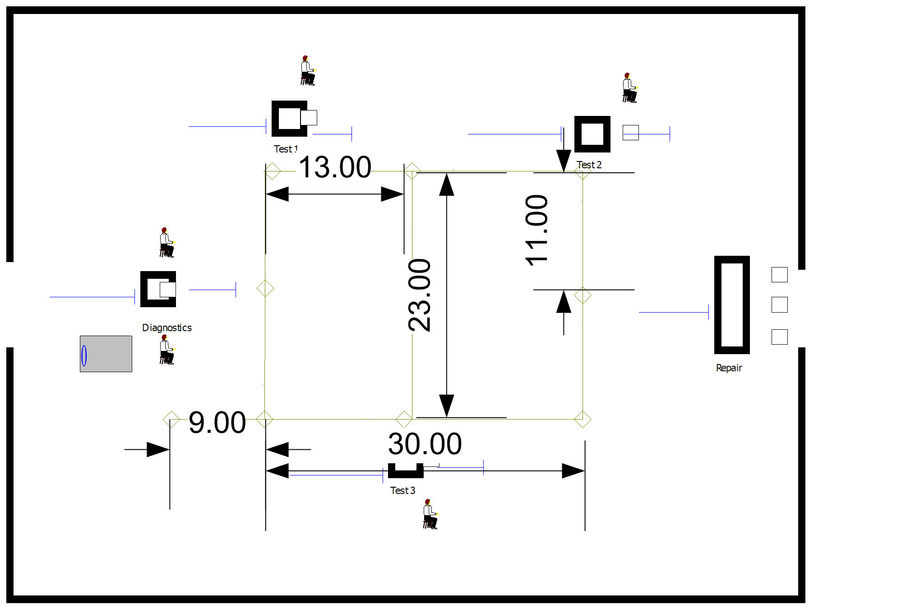
<p class="caption">(\#fig:ch7fig52)Proposed system layout</p>
</div>

There is only 1 AGV in this system. It is 1 meter in length and moves at
a velocity of 30 meters per minute. Its home base is at the dead end of
the 9 meter spur. Since there will be only one AGV all links are
bidirectional. The design associates the stations with the nearest
intersection on the path network.

a. Simulate the system for 10
replications of 4160 hours. Estimate the chance that the contract
specifications are met and the average system time of the jobs. In
addition, assess the queuing for and the utilization of the AGV.

b.  Consider the possibility of having a 2
AGV system. What changes to your design do you recommend? Be specific
enough that you could simulate your design.

***

\BeginKnitrBlock{exercise}<div class="exercise"><span class="exercise" id="exr:ch7P14"><strong>(\#exr:ch7P14) </strong></span>*(This problem is based on an example on page 223 of [@pegden1995introduction]. Used with permission)*
Reconsider Excercise \@ref(exr:ch5P180) with the use of transporters. Assume that all parts are
transferred by using two fork trucks that travel at an average speed of
150 feet per minute. The distances (in feet) between the stations are
provided in the table below.</div>\EndKnitrBlock{exercise}

                 Enter   Workstation   Paint   New Paint   Pack   Exit
  ------------- ------- ------------- ------- ----------- ------ ------
  Enter           --         325        445       445      565    815
  Workstation                --         120       130      240    490
  Paint                                 --        250      120    370
  New Paint                                       --       130    380
  Pack                                                      --    250
  Exit                                                             --

The distances are symmetric. Both the drop-off and pickup points at a
station are at the same physical location. Once the truck reaches the
pickup/drop-off station, it requires a load/unload time of two minutes.

Analyze this system to determine any potential bottleneck operations.
Report on the average flow times of the parts as a whole and
individually. Also obtain statistics representing the average number of
parts waiting for allocation of a transporter and the number of busy
transporters. Run the model for 600,000 minutes with a 50,000 minute
warm up period. Develop an animation for this system that illustrates
the transport and queuing within the system.

***

\BeginKnitrBlock{exercise}<div class="exercise"><span class="exercise" id="exr:ch7P15"><strong>(\#exr:ch7P15) </strong></span>*(This problem is based on an example on page 381 of [@pegden1995introduction]. Used with permission)*.
Reconsider Exercise \@ref(exr:ch7P14) with the use of AGVs. There are now 3 AGVs
that travel at a speed of 100 feet per minute to transport the parts
within the system.

To avoid deadlock situations the guided path network has been designed
for one way travel. In addition, to prevent an idle vehicle from
blocking vehicles performing transports, a staging area (Intersection
12)has been placed on the guided path network. Whenever a vehicle
completes a transport, a check should be made of the number of requests
pending for the transporters. If there are no requests pending, the AGV
should be sent to the staging area. If there are multiple vehicles idle,
they should wait on Link 11. Link 15 is a spur from intersection 6 to
intersection 11. The stations for the operation on the parts should be
assigned to the intersections as shown in the figure. The links should
all be divided into zones of 10 feet each. The initial position of the
vehicles should be along Link 11. Each vehicle is 10 feet in length or 1
zone. The release at start form of zone control should be used.

The guided path network for the AGVs is given in Figure \@ref(fig:ch7fig53):
</div>\EndKnitrBlock{exercise}

<div class="figure" style="text-align: center">

<p class="caption">(\#fig:ch7fig53)AGV system layout</p>
</div>

Analyze this system to determine any potential bottleneck operations.
Report on the average flow times of the parts as a whole and
individually. Also obtain statistics representing the average number of
parts waiting for allocation of a transporter and the number of busy
transporters. Run the model for 600,000 minutes with a 50,000 minute
warm up period. Develop an animation for this system that illustrates
the transport and queuing within the system.

***

\BeginKnitrBlock{exercise}<div class="exercise"><span class="exercise" id="exr:ch7P16"><strong>(\#exr:ch7P16) </strong></span>A single automatic guided
vehicle (AGV) is used to pick up finished parts from three machines and
drop them off at a store room. The AGV is designed to carry 5 totes.
Each tote can hold up to 10 parts. The machines produce individual parts
according to a Poisson process with the rates indicated in the table
below. The machines are designed to directly drop the parts into a tote.
When a tote is full, it is released down a gravity conveyor to the AGV
loading area. It takes 2 seconds for the tote to move along the conveyor
to the machine's loading area.</div>\EndKnitrBlock{exercise}

  Station      Production Rate    Tote Loading Time     Travel distance to next station
  ----------- ----------------- ---------------------- ---------------------------------
  Machine 1     2 per minute     uniform(3,5) seconds              40 meters
  Machine 2     1 per minute     uniform(2,5) seconds              28 meters
  Machine 3     3 per minute     uniform(4,6) seconds              55 meters

The AGV moves from station to station in the sequence (Machine 1,
Machine 2, Machine 3, store room). If there are totes waiting at the
machine's loading area, the AGV loads the totes up to its capacity.
After the loading is completed, the AGV moves to the next station. If
there are no totes waiting at the station, the AGV delays for 5 seconds,
if any totes arrive during the delay they are loaded; otherwise, the AGV
proceeds to the next station. After visiting the third machine's
station, the AGV proceeds to the store room. At the storeroom any totes
that the AGV is carrying are dropped off. The AGV is designed to release
all totes at once, which takes between 8 and 12 seconds uniformly
distributed. After completing its visit to the store room, it proceeds
to the first machine. The distance from the storeroom to the first
station is 30 meters. The AGV travels at a velocity of 30 meters per
minute. Simulate the performance of this system over a period of 10,000
minutes.

\newpage

a.  Estimate the average system time for a
part. What is the average number of totes carried by the AGV? What is
the average route time? That is, what is the average time that it takes
for the AGV to complete one circuit of its route?

b.  Suppose the sizing of the loading area
for the totes is of interest. What is the required size of the loading
area (in terms of the number of totes) such that the probability that
all totes can wait is virtually 100\%.

***
